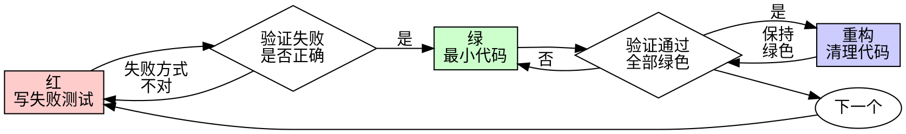

# Agent 需要做的事:  计划,执行,学习

**以对抗上下文熵增为中心的 ai coding 控制框架**

## 摘要

当前大语言模型（LLM）驱动的 Agent 虽已具备工具调用与循环推理能力，但随着任务复杂度提升，单一 Agent Loop 架构正面临上下文熵增、目标漂移与能力无法复用等结构性瓶颈。本文以 Rick v2 的工程实践为载体，提出 Agent 核心架构需从单纯的\&\#34;执行\&\#34;转向**计划、执行、学习**三层的正交分工。通过分离价值对齐（计划层）、事实完成（执行层）与经验沉淀（学习层，含 Learning/Dream 双尺度循环），构建自我强化的进化系统，从而对抗人机系统的熵增，实现 Agent 能力的螺旋上升。 **rick** 的核心升级包括：新增 `dream` 模块（跨 job 全局进化）、程序性 JSONL 解析生成 `act\-path\.md`（行为轨迹）、`learning` 结构化六步 SOP、`plan` 多层 subagent 评审，以及基于错误次数与工具调用轮次的量化熵度量体系。

## 一、引言：Agent Loop 的隐喻与上限

过去两年里，让 LLM 调用工具、循环推理、自主完成任务，无疑是工程领域的重大突破。然而，当面对复杂任务时，第一个遭殃的往往不是模型本身的智力，而是上下文空间。以典型的 Agent Loop 为例（如 Claude Code 的源码逻辑），50 次工具调用即可产生约 50 万 Token 的历史负担，每一轮输出都在不可逆地吞噬下一轮的推理空间。

这就像一个\&\#34;得了阿尔兹海默症的教授\&\#34;：智商（模型参数）可能在线，但记忆（上下文）混乱，导致行为失序。

Rick v1  证明了三模块架构（plan/doing/learning）的可行性。然而,随项目规模增长，Rick v1 的结构性局限开始显现

- `\.rick/SPEC\.md` 随时间积累，信噪比持续下降

- `debug\.md` 仅记录失败重试，无法还原完整行为路径

- `learning` 阶段人工主导，知识沉淀依赖个人经验

- 跨 job 没有全局重构机制，优质 skills 无法系统化演进

现代 Agent 不应只满足于\&\#34;执行\&\#34;，必须确立\*\*计划（Plan）、执行（Execute）、学习（Learn）\*\*三件事的正交分工。这正是 GEPA（Reflective Prompt Evolution）等前沿研究指向的方向——通过反思机制超越传统强化学习范式，让 Agent 具备真正的进化能力。

## 二、Agent Loop 的系统性边界：单体的结构性缺陷

单 Agent 系统暴露出的瓶颈，往往不是仅靠调参能解决的，而是深层的架构问题；上下文熵增造成的agent能力下降，而 rick 的开发就是为了解决这一问题，在无限次的持续迭代中，治理上下文的复杂性，以做到真正意义上的持续改进。

### 2\.1 上下文熵增：信息易腐性

上下文并非越长越好，它是一种有限且易腐的资源。斯坦福的研究\&\#34;Lost in the Middle\&\#34;指出，上下文中间位置的信息回忆率比头尾低 20–30%，信息处理并非平等。Chroma 2025 发布的\&\#34;Context Rot\&\#34;进一步证实，18 个顶尖模型在输入长度增加时，性能无一例外下降。加之 KV Cache 输入输出比约 100:1 的工程现实，一旦 Cache Miss，成本呈二次方增长。在 Rick 的实践中，熵增的路径更具体：**错误次数上升 → 更多调试 → 调试产生噪声进入上下文 → 加速熵增**，形成恶性正反馈闭环。

### 2\.2 目标漂移：执行偏离意图

在长任务链中，模型极易被中途的工具输出\&\#34;带偏\&\#34;，局部信息淹没全局目标。Anthropic 的多 Agent 对比评估显示，多 Agent 比单 Agent 成功率高 90\.2%，但 Token 消耗高达 15 倍。更关键的是，AgentErrorTaxonomy 研究发现，62% 的 Agent 错误集中在\&\#34;记忆和反思\&\#34;阶段，而非工具调用失败——本质是\&\#34;忘了自己在做什么\&\#34;。执行层的失败，根源常在于上下文管理层的缺失。

### 2\.3 能力无法复用：从零开始的诅咒

传统 Agent 往往丢弃每一次任务的成功经验，下一次重新试错。Voyager（2305\.16291）在 Minecraft 中通过代码技能库存储可复用行为（Skills），大幅提升了探索效率。Reflexion（NeurIPS 2023）亦证明，执行与学习分离的 Agent 在 HumanEval 上超越 GPT\-4 约 11%。**没有记忆的执行是消耗，有记忆的执行才是积累。**

### 2\.4 act\-path 质量决定负反馈有效性

这是 Rick v2 提出的核心洞察：**act\-path 质量决定负反馈有效性，有效性才是使整个系统熵减的主要矛盾。** 当 act\-path 本身质量低时，learning 无法提取有效信号，负反馈失灵，整个进化循环断裂。因此，act\-path 的生成必须是程序性的、可靠的，而非依赖 LLM 自觉记录。 **关于 act\-path 将在后文详细讲述。**

## 三、为什么需要三层正交分工

计划、执行、学习不应只是顺序步骤，而应视为三个正交维度。混在一起会互相污染，分离才能各自进化。

### 3\.1 正交分工的内涵

\&\#34;正交\&\#34;意味着职责边界清晰（类似软件工程的关注点分离 SoC），变更互不传染：

- **计划层**：价值对齐，确保\&\#34;做正确的事\&\#34;，将模糊的人类意图转化为带优先级、终止条件的结构化任务图。

- **执行层**：事实完成，确保\&\#34;正确地做事\&\#34;，在干净边界内高效完成单任务。

- **学习层**：经验沉淀，确保\&\#34;下次做得更好\&\#34;，从轨迹中提取可复用知识，含 Learning（局部修复）与 Dream（全局进化）两个尺度。

MetaGPT（2308\.00352）通过 SOP 编码与多角色分工证明了正交分工能降低协作冗余，为单层 Agent 的内部分离提供了先例。

相反的，如果不进行正交而是将三个任务混合在一个上下文中进行: 

- **计划 \+ 执行混合:**   就会出现 \&\#39;执行中途重规划导致目标漂移\&\#39; 的问题。

- **执行 \+ 学习混合**： 就会出现 \&\#39;反思负担膨胀上下文，拖慢执行速度\&\#39;的问题。

- **计划 \+ 学习混合**： 就会出现 \&\#39;历史偏见固化，削弱泛化能力\&\#39; 的问题。

**三层分工的本质，是给不同生命周期的信息分配合适的容器。**

### 3\.3 Rick v2 的四个模块

|模块|所属层|职责|v1 → v2 变化|
|---|---|---|---|
|`plan`|计划层|价值翻译 → 结构化任务图|新增 6 subagent 多层评审|
|`doing`|执行层|TDD 事实完成|新增 JSONL 解析 → act\-path\.md|
|`learning`|学习层（局部）|单 job 反思|升级为结构化六步 SOP|
|`dream`|学习层（全局）|跨 job 进化|全新模块|

## 四、系统架构

### 4\.1 双层正交架构

Rick v2 采用**工作层 \+ 反思层**的双层正交架构：

```Plain Text
工作层（Task Execution）
  plan → doing（产出 act-path.md）

反思层（Meta Learning）
  learning（单 job 局部优化）→ dream（跨 job 全局重构）
```

### 4\.2 上下文分层

```Plain Text
.rick/
├── OKR.md               # 战略目标
├── SPEC.md              # 技术规范 + skills 列表
├── wiki/                # 项目知识库（决策缘由）
├── tools/               # 可调用 py 工具
├── RFC/                 # 重要决策文档
├── dream/               # 全局上下文整理归档目录
│   ├── readme.md        # 全局优化索引：每轮处理的 job + 优化摘要
│   └── run_log_{n}.md   # 第 n 次执行日志：skills 进化情况、质量度量信息
└── jobs/                # 局部上下文
    └── job_{n}/
        ├── plan/
        │   └── tasks/
        │       ├── task{n}.md
        │       └── tasks.json
        ├── doing/
        │   ├── act-path.md  # ⭐ 新增：程序性解析的行为轨迹
        │   └── debug.md     # job 内 agent 间共享的局部上下文
        └── learning/
            └── ...
```

`\.rick/` 同时服务于计划层（wiki 记录决策缘由，skills 记录能力边界）和反思层（dream 记录全局进化历史）。好的计划不是静态文档，而是与执行持续校准的\&\#34;活文档\&\#34;。

### 4\.3 信息流图

```mermaid
flowchart LR
    Human["👤 人类(需求输入)"] --> Plan["plan cmd(计划层：价值翻译)"]
    Plan --> Tasks["tasks/*.md,tasks.json"]
    Tasks --> Doing["doing cmd,(执行层：TDD 完成)"]
    Doing --> ActPath
    ActPath --> Learning["learning cmd(学习层-局部：单 job 反思)"]
    ActPath --> Dream["dream cmd(学习层-全局：跨 job 重构)"]
    Learning --> RickCtx[".rick/ 全局上下文(SPEC / wiki / skills)"]
    Dream --> RickCtx
    RickCtx --> Plan
    RickCtx --> Doing```

### 4\.4 反馈回路

**恶性正反馈（需要打破）,这就是上下文持续熵增，不断变得复杂导致 agent 能力随着项目规模增长而下滑的原因**

```Plain Text
规模增长 → 熵增 → 错误↑ → 调试噪声↑ → 上下文质量↓ → 熵增（自我强化）
```

**调节负反馈（核心设计）**：

```Plain Text
JSONL 解析 → 高质量 act-path
  → learning/dream 有效反思
  → .rick/ 质量↑（SPEC 精简 / skills 进化 / wiki 整理）
  → 下次 doing 错误↓ → 熵增趋缓
```

**关键保障**：调节回路的可靠性由**程序性 JSONL 解析**保证，不依赖 LLM 自觉，这是整个进化系统的基础前提。

## 五、计划层：价值翻译与意图对齐

计划层是人与 AI 之间的\&\#34;价值翻译器\&\#34;，其核心不是单纯分解任务，而是对齐意图。输入是模糊的人类自然语言（充满隐含假设），输出必须是可局部修正的结构化任务图，且包含明确的终止条件，防止 Agent 不知\&\#34;何时能停\&\#34;。

### 5\.1 plan cmd SOP

```Plain Text
a. 意图理解
   输入：plan_main_prompt.md + 用户需求描述（一段话描述，或 human-loop 子命令产出的 RFC 文档）
   上下文加载：若 .rick/SPEC.md 存在则加载（含 skills 列表）；OKR.md 同理
   首次运行（新项目）无需加载 SPEC

b. 模式识别
   确认是新项目（首次建立 .rick/ 体系）还是旧项目迭代（基于已有 SPEC/wiki）

c. 价值澄清
   通过询问彻底清晰用户的需求描述，消除隐含假设
   输出：明确的期望状态描述

d. 事实调查
   进行事实调研，理解当前现状（代码库结构、已有模块、技术约束）
   输出：现状描述

e. 差距推断
   基于期望与现状，描述当前差距
   输出：差距分析

f. 方案设计
   基于 SENSE 方法分析，想到具体的解决方案
   当出现决策分歧时以 OKR 目标为指导原则进行决策
   输出：解决方案文档

g. DAG 任务分解
   将解决方案拆解为 DAG 工作流，每个节点由 task{n}.md 描述
   调用 task.md 任务模板（目标 + 关键结果 + 测试方法）

h. 多层评审（6 个 subagent，每项务必独立启动）：
   subagent_1：若用户提供了 RFC，逐条检查 RFC 与 task{n}.md 的一致性
   subagent_2：检查当前 plan 是否严格遵循 SPEC 每条规范，禁止行为不能存在
   subagent_3：检查当前 plan 是否合理利用了所有 skills 解决问题
   subagent_4：基于代码事实模拟 plan 实现过程，提前识别导致失败的风险点
   subagent_5：所有 task 的测试方法是否涵盖所有边界 case？
              一个 test case = 前置条件 + 输入参数 + 操作序列 + 预期输出
              test case 生成须遵循 testing-rules.md 中的规则
   subagent_6：端到端测试流程验证（DAG 最后节点可验收全链路）

i. 程序化格式检查
   调用 rick check_plan 子命令（自动验证 task.md 格式、tasks.json 合法性）

j. act-path 记录
   rick 程序解析 JSONL，生成 plan/act-path.md
```

### 5\.2 多层评审并行架构

```mermaid
graph TD
    PlanMain["plan main agent(a→g 意图理解到任务分解)"] --> Sub1["subagent_1\nRFC 一致性"]
    PlanMain --> Sub2["subagent_2(SPEC 合规)"]
    PlanMain --> Sub3["subagent_3(skills 利用)"]
    PlanMain --> Sub4["subagent_4(代码事实模拟)"]
    PlanMain --> Sub5["subagent_5(测试用例)"]
    PlanMain --> Sub6["subagent_6(端到端验收)"]
    Sub1 & Sub2 & Sub3 & Sub4 & Sub5 & Sub6 --> Review["评审汇总\n→ 修改 tasks 或通过"]
    Review --> CheckPlan["rick check_plan(程序化格式检查)"]```

**对应 prompt 文件**：

- `internal/prompt/templates/plan/plan\_main\_prompt\.md`

- `internal/prompt/templates/plan/plan\_sub\{1\-6\}\_prompt\.md`

## 六、执行层：行为轨迹与可信工作空间

执行层的重点不是让 Agent 更\&\#34;聪明\&\#34;，而是提供稳定、干净、可信的上下文。只处理当前任务强相关数据，不背跨任务历史包袱。执行层调用\&\#34;预编译\&\#34;的 Skills（可复用行为单元），当遭遇未知情况时向计划层发信号而非自行越权。

**对应 prompt 文件**：

- `internal/prompt/templates/doing/testing\_prompt\.md`

- `internal/prompt/templates/doing/coding\_prompt\.md`

### 6\.1 doing cmd SOP（红绿 TDD）

```Plain Text
a. testing agent（红阶段）
   默认加载：OKR.md + SPEC.md（含 skills 列表），理解全局目标与开发规范
   加载 debug.md（job 内 agent 间共享的局部上下文，记录有价值的信息）
   根据 task.md 的"测试方法"章节生成 py 测试脚本
   确保测试脚本在未实现时能有效失败（红）

b. coding agent（绿阶段）
   默认加载：OKR.md + SPEC.md（含 skills 列表），理解全局目标与开发规范
   加载 debug.md（job 内 agent 间共享的局部上下文，记录有价值的信息）
   TDD [红 → 绿 → 重构]
   使用 debug skill 进行高效 debug
   使用 systematic-debugging 4 阶段法处理复杂问题

c. 退出时必须记录行动路径
   rick 程序自动解析本次会话 JSONL
   生成 job_{n}/doing/act-path.md
```

### 6\.2 act\-path 技术方案

Act\-path 是执行层的关键产出，也是学习层的核心输入。**生成方式必须是程序性的**——rick 程序直接解析 Claude Code 写入的 JSONL 会话文件，而非依赖 LLM 自我记录。这是保证 act\-path 质量、保证负反馈有效性的根本前提。

**数据来源**：`\~/\.claude/projects/\&lt;project\&gt;/\&lt;session\&gt;\.jsonl`

**字段筛选规则**：

|字段|来源|说明|
|---|---|---|
|`name`|tool\_use 事件|工具名称|
|`input`|tool\_use 事件|工具输入参数|
|`content`|tool\_result 事件|输出摘要（截断）|
|`timestamp`|所有事件|时间戳|
|`stop\_reason` \+ `error`|结束事件|是否报错标记|

**JSONL 解析流程**：

```mermaid
sequenceDiagram
    participant Doing as doing cmd
    participant Claude as claude 进程
    participant JSONL as JSONL 文件
    participant Parser as rick 解析器（Go）
    participant ActPath as act-path.md

    Doing->>Claude: 启动 (claude -p --output-format json)
    Claude-->>Doing: session_id
    Claude->>JSONL: 写入事件流
    Doing->>Parser: 任务完成后触发解析
    Parser->>JSONL: 读取 session 事件
    Parser->>Parser: 筛选字段 (name/input/content/timestamp/error)
    Parser->>ActPath: 生成结构化 act-path```

**act\-path\.md 格式**：

```Markdown
# Act Path: job_{n} / task{m}

## 执行摘要
- 总工具调用次数: N
- 报错次数: M
- 执行时长: Xs

## 行为轨迹

### [T+0.0s] Bash
**输入**: `go build ./...`
**输出摘要**: 编译成功，无报错
**状态**: ✅ 正常

### [T+2.3s] Edit
**输入**: `internal/cmd/plan.go` 第 45 行
**输出摘要**: 修改函数签名
**状态**: ✅ 正常

### [T+8.7s] Bash
**输入**: `go test ./...`
**输出摘要**: FAIL: TestXxx 断言失败
**状态**: ❌ 报错
...
```

### 6\.3 Skills 系统

执行层调用的 Skills 需具备（借鉴 Voyager）：

- **原子性**：一件明确事

- **幂等性**：同输入同输出，无副作用

- **可测性**：沙盒验证

Skills 存储于\.rick的 spec\+wiki\+tools 中，其 `description` 字段严格遵循 **CSO 规则**（Claude Search Optimization）：只写触发条件，不写工作流摘要，确保 LLM 能精准匹配触发场景。

**Cialdini 说服原则集成**进所有 agent prompt 模板，以提升 skill 合规率：

|原则|使用场景|示例|
|---|---|---|
|权威（Authority）|规范性要求|`YOU MUST follow TDD\. No exceptions\.`|
|承诺（Commitment）|工作前宣告|`Before coding, declare: \&\#34;I will use skill:systematic\-debugging\&\#34;`|
|稀缺（Scarcity）|关键检查点|`Before proceeding to next task, verify: all tests pass`|

### 6\.4 Skills 的三层结构

在 rick 中 skills 系统被作为模块化,单元化上下文的一种方法而存在，它是内聚的一段可复用的上下文。

- SPEC\.md:  这是整个项目的上下文入口文件，自然也作为skills 的入口存在，他描述了每个 skill的入口触发条件。

- wiki:  这个 wiki 目录是优先给 AI 阅读的 wiki，其中包含该系统的**运行原理**与**控制方法，**运行原理是用来指导 ai 创造性的解决问题，而控制方法则是 ai 用来影响系统的手段，他们通常是一段 SOP；基本是指导 ai 完成某些复杂任务的流程与步骤。

- Tools: 当 wiki 中的 SOP 落实到一个具体的步骤上时，这个步骤是可以被程序确定性表达的时候，那么为了增强确定性也为了降低 token 消耗，应该把这个步骤转化为一个具体的 py 脚本或者某一个程序，可以是 cli 也可以是 mcp 等等，只要具有确定性即可。 这些工具也是给 ai 使用的工具，而非人类。

## 七、学习层：双尺度进化（Learning \&amp; Dream）

学习不是单一阶段，而是应对两种尺度的反馈：Learning 处理局部熵增，Dream 处理全局进化。类比人类的\&\#34;实时纠错\&\#34;与\&\#34;睡眠记忆整合\&\#34;。

### 7\.1 skills 治理：双层机制

```Plain Text
先验（LLM 判断）
  ↓
  learning agent 评估：此 act-path 是否值得沉淀为 skill？
  → 若值得：生成 skill 并写入 SPEC.md

后验（全局统计）
  ↓
  dream agent 统计：
  - skills 触发频次（被加载次数）
  - skills 出错次数（加载后仍出错）
  → 低频 + 高错误率 → 淘汰或重写
  → 高频 + 低错误率 → 保留并优化
```

**skill 提议格式**：

```Markdown
# Skill 提议: [skill-name]

**触发场景**: 描述何时应触发此 skill（遵循 CSO 规则）
**预期效果**: 使用后 act-path 应缩短的步骤数
**核心内容**: ...
```

### 7\.2 Learning：单 job 的工作经验沉淀

**触发**：每次 doing 完成后，由人类手动触发，在与 ai 交互的过程中这一步也将完成ai 与 human 的价值校准。

很有可能 rick 在 doing 的执行过程中，存在某些并不符合人类预期的地方，此时就在 learing 中对话的方式 fix 掉。

**SOP（结构化六步）**：

```Plain Text
Step 0: 加载上下文（若存在）
        加载 OKR.md + SPEC.md，理解全局目标与开发规范（含 skills 列表）
        加载 debug.md，作为本次 job 执行过程的参考依据

Step 1: 读取 act-path.md
        完整加载：工具调用记录 + 错误排查过程与结果

Step 2: 评估更合理的 act-path
        标准：能否用更短的 act-path 解决相同问题？
        产出：优化建议文档

Step 3: 沉淀 skills
        未来遇到类似问题时，如何用更短 act-path 解决？
        格式：skill 提议（写入 SPEC.md）

Step 4: 识别 tools 候选
        哪些 skills 适合沉淀为通用 py 工具？
        标准：可复用 + 纯函数 + 有清晰输入输出

Step 5: tools 组合使用方法
        基于 gen-skills 生成技能描述，更新 SPEC.md 技能列表

Step 6: 更新度量记录
        将本次 job 的错误次数 + 工具调用轮次写入 .rick/dream/run_log_{n}.md
```

Reflexion 框架证明，执行层失败轨迹通过反思转化改进，可显著提升 Pass@1 准确率。

### 7\.3 Dream：全局重构

**定位**：跨 job 全局反思与重构。**仅操作 ****`\.rick/`**** 目录，不修改业务代码。**

**触发机制**：human 手动触发一次 dream的执行,它是一个后台任务；rick 程序循环执行，每轮最多处理 5 个 job，直至所有新 job 处理完毕。

**SOP（每轮）**：

```Plain Text
a. 读取 .rick/dream/readme.md
   确认已处理 job 列表，取下一批最多 5 个未处理 job

b. 逐一读取每个 job 的 act-path.md
   理解当前 OKR，启动 subagent 完成反思：

   反思维度 1: 未来最可能导致低效的原因
   反思维度 2: 未来最可能导致失败的风险
   反思维度 3: 未来最可能加速进度的方法
   反思维度 4: 哪些 skills 应被触发但没有，或执行低效

c. SENSE 方法逐一思考，变更约束为：
   - wiki 变更（新增/修改知识条目）
   - tools 变更（新增/修改 py 工具）
   - SPEC.md 变更（规范升级）

d. 整理 wiki 目录
   确保可读性，删除过时内容，补充缺失条目

e. 精简 SPEC.md
   延迟加载内容沉淀到 wiki
   保持 SPEC.md 聚焦于核心约束，不超过 500 行

f. 对 SPEC.md 中的 skills 进行进化升级
   调用 evolve-skills 技能
   基于后验数据（触发频次 + 出错次数）淘汰低质量 skills

g. 对业务项目的一致性检查
   tools/test/wiki 三者对齐检查

h. 更新 dream/readme.md
   追加本轮处理的 job 列表 + 主要优化摘要（全局优化信息索引）

→ 若仍有未处理 job，继续下一轮（最多 5 个）
```

**dream 目录结构**：

```Plain Text
.rick/dream/
├── readme.md        # 全局优化索引：每轮处理的 job + 优化摘要
└── run_log_{n}.md   # 第 n 次执行日志：skills 进化情况、质量度量信息
```

Dream 的机制类似于 ProTeGi（微软 EMNLP 2023，基于 Beam Search 保留多候选 Prompt）和 OPRO（Google DeepMind ICLR 2024，LLM 读历史轨迹生成新 Prompt），在自然语言空间运行进化算法，目标是最大化\&\#34;一次性成功率\&\#34;（First\-pass success rate）。

**对应 prompt 文件**：`internal/prompt/templates/dream/dream\_prompt\.md`

---

## 八、整体进化循环与度量体系

### 8\.1 进化飞轮

三层分工构成了自我强化的飞轮：

**正反馈（能力积累）**：

```Plain Text
Skills 积累 → 执行成功率↑ → 更多高质量 act-path
  → Dream 优化更准 → 进一步积累 Skills（复利效应）
```

**负反馈（对齐稳定器）**：

```Plain Text
人介入频率↑（信号：未对齐）→ 触发 Learning/Dream
  → 对齐↑ → 人介入↓
```

人的介入不是失败，而是关键的反馈信号，应转化为学习材料。

系统的核心张力：**人机系统的熵增**（对话漂移、技能失效、理解偏差）vs\. **有序化控制**（Learning 局部控制，Dream 全局进化）。优化的终极目标不是孤立的 AI 性能，而是人与 AI 整个系统的有序程度（对齐度）。

### 8\.2 熵度量体系

```mermaid
graph LR
    A[doing 执行] --> B[JSONL 解析]
    B --> C[act-path.md]
    C --> D{度量提取}
    D --> E["错误次数\n(优先指标)"]
    D --> F["工具调用轮次\n(次要指标)"]
    E --> G[跨 job 对比]
    F --> G
    G --> H["趋势记录\n.rick/dream/run_log_{n}.md"]```

**优先指标**：错误次数（Error Count）

**次要指标**：工具调用轮次（Tool Call Rounds）

度量方式：相同 LLM 模型下，不同版本横向对比。多 job 积累后，在概率分布层面形成稳定规律，弥补单次评估不可靠性。单次评估不可靠，但可通过多频次在概率分布上发展出规律而稳定下来。

**度量记录格式**：

```Markdown
| Job | 模型 | 错误次数 | 工具调用轮次 | 备注 |
|-----|------|---------|------------|------|
| job_1 | claude-opus-4-7 | 0 | 147 | Wiki 文档创建 |
| job_2 | claude-opus-4-7 | 3 | 89 | - |
```

## 九、运行时组件

### 9\.1 promptBuilder（Go 组件）

提示词模板通过 `//go:embed` 内嵌于 rick Go 二进制，编译进程序：

```Plain Text
internal/prompt/
├── manager.go           # 提示词管理器
├── builder.go           # 提示词构建器（内嵌文件系统）
└── templates/           # 提示词模板目录
    ├── plan/
    │   ├── plan_main_prompt.md
    │   ├── plan_sub1_prompt.md   # RFC 一致性检查
    │   ├── plan_sub2_prompt.md   # SPEC 合规检查
    │   ├── plan_sub3_prompt.md   # skills 利用检查
    │   ├── plan_sub4_prompt.md   # 代码事实模拟
    │   ├── plan_sub5_prompt.md   # 测试用例检查
    │   └── plan_sub6_prompt.md   # 端到端验收
    ├── doing/
    │   ├── testing_prompt.md     # testing agent
    │   └── coding_prompt.md      # coding agent
    ├── learning/
    │   └── learning_prompt.md
    └── dream/
        └── dream_prompt.md
```

### 9\.2 core\-skills 目录结构

**core\-skills 内嵌于 rick Go 二进制文件**，通过 `//go:embed` 编译进程序，不存在于业务项目的 `\.rick/` 目录：

```Plain Text
internal/prompt/templates/skills/   # rick 源码内部目录
├── sense/
│   └── sense.md              # SENSE 思考框架
├── tc/
│   └── test-case.md          # 测试用例编写规则
├── tdd/
│   ├── skill.md              # TDD 红绿重构方法
│   └── testing-anti-patterns.md
├── testing/
│   └── skill.md              # 测试执行规范
├── debug/
│   └── skill.md              # systematic-debugging 4 阶段法
├── gen-skill/
│   └── skill.md              # 从 act-path 生成 skill 提议
└── evolve-skills/
    └── skill.md              # skill 进化升级（dream 阶段调用）
```

### 9\.3 Executer（已实现，无需重构）

DAG 状态机 \+ caller agent 机制保持不变：

- 串行拓扑排序执行（Kahn 算法）

- 每个 task 最多重试 `MaxRetries` 次（默认 5）

- 失败记录到 `debug\.md`，下轮加载为上下文

## 十、实现优先级

### 本次迭代（v2\.0）

|优先级|项目|说明|
|---|---|---|
|P0|JSONL 解析器|rick 程序性解析，生成 act\-path\.md|
|P0|learning 六步 SOP|升级 learning\_prompt\.md|
|P1|dream cmd 基础实现|readme\.md 读取 \+ 反思 subagent \+ 5 job 循环|
|P1|plan 多层评审|6 subagent 并行评审框架 \+ 新 SOP（a\-j 步）|
|P1|core\-skills 目录|gen\-skill / evolve\-skills|
|P2|度量体系|run\_log 记录 \+ 趋势追踪|
|P2|CSO 规则集成|更新所有 prompt 模板|

### 延后迭代（v2\.1\+）

|项目|说明|延后原因|
|---|---|---|
|Skills TDD 创作法|RED\- GREEN\-REFACTOR for skill docs|需要足够 job 积累才有意义|
|doing agent 4 状态|DONE/DONE\_WITH\_CONCERNS/NEEDS\_CONTEXT/BLOCKED|增加复杂度，当前串行足够|
|control cmd|定期监控与健康检查|基础功能优先|

## 十一、关键假设与风险

### 11\.1 核心假设清单

1. act\-path 由 rick 程序性解析 JSONL 生成（非 LLM 自记录），可靠性有保障

实现后验证解析准确率

2. skills 采用 LLM 先验估计 \+ 触发频次/出错次数后验淘汰双层机制

    积累 5\+ jobs 后评估

3. 度量：错误次数（优先）\+ 工具调用轮次（次要），相同模型下横向对比

建立 run\_log 基线

4. 多频次积累在概率分布层面形成稳定规律，弥补单次评估不可靠性

统计 10\+ jobs 趋势

5. CSO 规则 \+ Cialdini 说服原则集成进所有 agent prompt 后有效提升合规率

A/B 对比（有/无原则）

6. Skills TDD 创作法延后迭代，不影响当前 skill 沉淀质量

观察 skill 沉淀速度

7. doing 保持串行 DAG，不引入 4 状态并行机制，复杂度可控

监控重试率

### 11\.2 主要风险

**风险 1：JSONL 格式变更**

- 描述：claude CLI 升级后 JSONL 格式可能变化，导致解析失败

- 概率：中

- 应对：解析器加版本检测 \+ 容错处理，失败时降级到空 act\-path

**风险 2：act\-path 数据质量**

- 描述：输出摘要截断策略影响 learning/dream 反思质量

- 概率：中

- 应对：保留关键字段完整（tool name \+ 报错信息），摘要截断仅对成功输出

**风险 3：dream 阶段 \.rick/ 破坏性变更**

- 描述：dream 全局重构可能误删重要 skills 或 wiki 内容

- 概率：低

- 应对：dream 执行前自动 git commit 快照，所有变更可回滚

**风险 4：plan 多层评审延长耗时**

- 描述：6 subagent 并行评审可能显著增加 plan 阶段耗时

- 概率：高

- 应对：评审结果仅供参考，人类可选择跳过；设置最大等待时间

**风险 5：度量指标噪声**

- 描述：单个 job 的错误次数受任务难度影响，横向对比不公平

- 概率：高

- 应对：按任务类型分类统计；度量趋势而非绝对值

### 11\.3 不变约束

- **串行执行**：doing 保持串行 DAG，不引入并行复杂度

- **人类控制权**：plan → doing → learning 循环由人类控制

- **dream 只改 \.rick/**：dream 模块不修改业务代码

- **无 init 命令**：自动初始化原则保持不变

## 十二、结语：螺旋上升的承诺

计划、执行、学习的三层分工不是终点，而是起点。每一次执行产出 act\-path，让 Learning 更精准、Skills 更可靠；每一次人介入提供对齐信号，让 Dream 优化全局上下文，减少未来干预。这个螺旋的驱动力是人与 AI 对齐度的持续提升。

我们不应单纯等待\&\#34;更好的模型\&\#34;（人类想象力会迅速消耗新算力），也不能仅靠\&\#34;增加人工审核\&\#34;（把熵增转移给人，系统无法扩展）。

**我们构建的不是更强大的工具，而是会成长的系统。计划赋予方向，执行落实行动，学习开创未来。**

## 附录 A：关键概念速查

|概念|说明|
|---|---|
|**计划层**|意图转任务图，价值对齐（plan cmd）|
|**执行层**|边界内高效完成任务，事实完成（doing cmd）|
|**学习层**|经验提取，含 Learning（局部修复）与 Dream（全局进化）|
|**act\-path**|rick 程序性解析 JSONL 生成的结构化行为轨迹，学习层核心输入|
|**Skills**|原子化、幂等、可测的可复用行为单元，内嵌 rick 二进制|
|**\.rick/**|全局上下文载体（OKR/SPEC/wiki/tools/dream/jobs），计划层底座|
|**debug\.md**|job 内 agent 间共享的局部上下文，执行层内信息传递机制|
|**上下文熵增**|系统核心约束：上下文质量随规模增长趋于下降|
|**对齐度**|系统优化目标：人与 AI 整个系统的有序程度|

## 附录 B：实证支撑矩阵

|研究|核心结论|Rick v2 对应设计|
|---|---|---|
|Lost in the Middle（斯坦福）|上下文中间信息回忆率低 20–30%|SPEC\.md ≤200 行，wiki 分层存储|
|Context Rot（Chroma 2025）|18 个模型输入越长性能越差|dream 精简 SPEC，learning 抑制噪声写入|
|Voyager（2305\.16291）|Skills 库大幅提升探索效率|core\-skills \+ 双层治理机制|
|Reflexion（NeurIPS 2023）|执行与学习分离超越 GPT\-4 约 11%|learning/dream 双尺度分离|
|MetaGPT（2308\.00352）|SOP 编码降低协作冗余|plan 多层 subagent SOP|
|GEPA report|反思式 prompt 进化替代权重更新|dream 全局 prompt 进化|
|Superpowers v5\.1\.0|CSO 规则 \+ Cialdini 说服原则|所有 agent prompt 模板集成|
|AgentErrorTaxonomy|62% 错误在记忆和反思阶段|act\-path 程序性解析保障数据质量|

## 附录 C: 系统调试提示词

这个提示词 fork 于 superpower，对齐使用 sense 进行了改造,融入《调试九法》的工程经验。

```Markdown
---
name: systematic-debugging
description: 遇到任何 bug、测试失败或异常行为时，在提出修复方案之前使用
---

# 系统性调试

## 铁律

```
没有根因调查，不得提出任何修复方案
```

症状修复是失败。随机修复浪费时间并制造新 bug。

## 四个阶段（必须按顺序完成）

### Phase 1 — 根因调查

在尝试任何修复之前：

1. **完整读取错误信息** — 不要跳过报错和警告，读完整个堆栈
2. **稳定复现** — 能稳定触发吗？不能复现就继续收集数据，不要猜
3. **检查最近变更** — git diff、最近提交、新依赖、配置变更
4. **多组件系统：先加埋点收集证据**
   ```
   对每个组件边界：记录入参、记录出参、验证状态传递
   先跑一次收集证据 → 定位哪个层失败 → 再调查那个层
   ```
5. **逆向追踪数据流** — 坏值从哪里来？谁传入了坏值？一路向上追，直到找到源头

### Phase 2 — 模式分析

1. 在同一代码库中找到**可用的类似代码**
2. **完整阅读**参考实现，一行不跳
3. 列出可用代码与出错代码之间的**所有差异**，不管多小

### Phase 3 — 假设与验证

1. 明确说出假设：**"我认为 X 是根因，因为 Y"**
2. 做**最小改动**验证假设 — 一次只改一个变量
3. 验证结果：有效 → Phase 4；无效 → 形成**新假设**，不要叠加修复

### Phase 4 — 实现

1. **先写失败测试**（用 TDD skill），再写修复
2. 实现**单一修复** — 只解决已识别的根因，不顺手重构
3. 验证：测试通过？其他测试未破坏？
4. **修复无效？**
   - 不足 3 次：回到 Phase 1，用新信息重新分析
   - **≥ 3 次：停止，质疑架构**（见下方）

## 3 次修复失败 → 停下来，找人类协作者讨论

触发信号：
- 每次修复都在不同地方暴露新问题
- 修复需要"大规模重构"才能落地
- 修复在别处制造新症状

**此时的正确行为：停止一切修复尝试。** 不要尝试第 4 次修复，不要自行重构架构。

向人类协作者提出以下问题，由人类决策：
- 这个模式本身是否合理？
- 我们是否在靠惯性硬撑一个错误的架构？
- 下一步是继续修复症状，还是重构架构？

这不是假设失败，这是架构选错了。修复权不在 agent，在人类。

## 三个支撑技术

**逆向追踪（root-cause-tracing）**
从症状出发，沿调用链向上追踪，直到找到坏值的起源。在测试中用 `console.error()` 打印堆栈，用 `new Error().stack` 捕获完整调用链。

**多层防御（defense-in-depth）**
找到根因后，在数据流经过的每一层都加验证：
- Layer 1 入口点：拒绝无效输入
- Layer 2 业务逻辑：确保数据对当前操作有意义
- Layer 3 环境守卫：防止危险操作在特定上下文执行（如测试环境）
- Layer 4 调试埋点：记录目录、环境变量、调用栈，供事后分析

**条件等待替代 sleep**
```typescript
// ❌ 猜时间 → flaky test
await new Promise(r => setTimeout(r, 300));

// ✅ 等条件
await waitFor(() => getResult() !== undefined, 'result to appear');
```
实现：每 10ms 轮询，超时抛出含描述的错误。

## 红旗 — 停下来，重回 Phase 1

- 先猜后查："试试改 X 看有没有用"
- 叠加修复：第一个没用，直接加第二个
- 跳过测试："手动验证一下就行"
- 看到症状就动手："我看出问题了，修它"
- 理解不完整就开始："大概是这个，试试"
- **"再试一次"（已经失败 2 次以上）**
- 每次修复在不同地方暴露新问题

## 常见借口

| 借口 | 现实 |
|------|------|
| "问题很简单，不需要走流程" | 简单 bug 也有根因，流程对简单 bug 反而更快 |
| "紧急情况，没时间调查" | 系统性调试比猜测循环更快，紧急时更需要流程 |
| "先试一下，再调查" | 第一次就设定了模式，从一开始就做对 |
| "多个修复一起提交省时间" | 无法隔离哪个有效，会引入新 bug |
| "参考太长，我来改编" | 部分理解必然带来 bug，完整读完再动手 |
| "再试一次"（已失败 2 次以上） | 3 次失败 = 架构问题，不要继续修 |

## 真实数据

- 系统性方法：15–30 分钟解决
- 随机猜测方法：2–3 小时反复折腾
- 首次修复成功率：95% vs 40%
- 引入新 bug 概率：接近零 vs 常见
```

## 附录D: CSO规则与 AI 心理学

```YAML
# Claude 搜索优化（CSO）规则

> 摘自 superpowers/skills/writing-skills/SKILL.md

## 核心目的

**关键：** 未来的 Claude 需要能「找到」你的 skill。

---

## 规则 1：description 字段的铁律

**description = 触发条件，绝不是工作流摘要**

### 为什么这至关重要

测试发现：当 description 包含工作流摘要时，Claude 会跟着摘要走，跳过正文细节。

**真实案例：** description 写了"两次 review"，但 Claude 只做了一次。把 description 改为纯触发条件后，Claude 才正确读取流程图，完成两次 review。

**陷阱机制：** 工作流摘要在 description 里 = 给 Claude 提供了捷径 = 正文变成从不阅读的文档。

### 写法规范

```yaml
# ❌ 错：包含工作流摘要（Claude 会跟着走，跳过正文）
description: Use when executing plans - dispatches subagent per task with code review between tasks

# ❌ 错：过多流程细节
description: Use for TDD - write test first, watch it fail, write minimal code, refactor

# ✅ 对：只有触发条件，没有工作流摘要
description: Use when executing implementation plans with independent tasks in the current session

# ✅ 对：只有触发条件
description: Use when implementing any feature or bugfix, before writing implementation code
```

### description 写作标准

- 以 "Use when..." 开头，聚焦触发条件
- 描述**问题**（race conditions、不一致行为），而非语言特定症状
- 触发条件保持技术无关，除非 skill 本身是特定技术的
- 用第三人称写（会被注入到系统提示中）
- **永远不要** 概括 skill 的流程或工作流

```yaml
# ❌ 错：太抽象，缺乏触发场景
description: For async testing

# ❌ 错：第一人称
description: I can help you with async tests when they're flaky

# ❌ 错：提到了技术，但 skill 并非特定于该技术
description: Use when tests use setTimeout/sleep and are flaky

# ✅ 对：以 "Use when" 开头，描述问题，无工作流
description: Use when tests have race conditions, timing dependencies, or pass/fail inconsistently

# ✅ 对：特定技术 skill，触发场景明确
description: Use when using React Router and handling authentication redirects
```

---

## 规则 2：关键词覆盖

在正文中使用 Claude 会搜索的词：

- **错误信息：** "Hook timed out"、"ENOTEMPTY"、"race condition"
- **症状词：** "flaky"、"hanging"、"zombie"、"pollution"
- **同义词：** "timeout/hang/freeze"、"cleanup/teardown/afterEach"
- **工具名：** 实际命令、库名、文件类型

---

## 规则 3：命名规范

**主动语态，动词开头：**

- ✅ `creating-skills`，不用 `skill-creation`
- ✅ `condition-based-waiting`，不用 `async-test-helpers`
- ✅ `root-cause-tracing`，不用 `debugging-techniques`

**动名词（-ing）适合描述过程：**
- `creating-skills`、`testing-skills`、`debugging-with-logs`

---

## 规则 4：Token 效率（关键）

**问题：** 频繁加载的 skill 会在**每次对话**中消耗 token。

**目标字数：**
- getting-started 工作流：每个 < 150 词
- 频繁加载的 skill：< 200 词
- 其他 skill：< 500 词

**节省 token 的方法：**

```markdown
# ❌ 错：在 SKILL.md 中列出所有参数
search-conversations 支持 --text、--both、--after DATE、--before DATE、--limit N

# ✅ 对：引用 --help
search-conversations 支持多种模式和过滤器。详见 --help。
```

```markdown
# ❌ 错：重复工作流细节（20 行重复说明）

# ✅ 对：引用其他 skill
始终使用 subagent（节省 50-100 倍上下文）。必须使用 [other-skill-name]。
```

**精简示例：**
```markdown
# ❌ 冗长（42 词）
your human partner: "How did we handle authentication errors in React Router before?"
You: I'll search past conversations for React Router authentication patterns.
[Dispatch subagent with search query: "React Router authentication error handling 401"]

# ✅ 精简（20 词）
Partner: "How did we handle auth errors in React Router?"
You: Searching...
[Dispatch subagent → synthesis]
```

**消除冗余：**
- 不要重复被引用 skill 中已有的内容
- 不要解释命令中显而易见的事情
- 不要为同一模式提供多个示例

---

## 规则 5：交叉引用其他 skill

```markdown
# ✅ 对：只用 skill 名称，带明确的必要性标记
**REQUIRED SUB-SKILL:** Use superpowers:test-driven-development
**REQUIRED BACKGROUND:** You MUST understand superpowers:systematic-debugging

# ❌ 错：路径格式，不清楚是否必须
See skills/testing/test-driven-development

# ❌ 错：@ 语法会立即强制加载，消耗大量上下文
@skills/testing/test-driven-development/SKILL.md
```

**为什么不用 @ 链接：** `@` 会立即强制加载文件，在需要之前就消耗 200k+ 上下文。

---

## 核心记忆

```
description = 触发条件（When to Use）
           ≠ skill 的工作流摘要
```

工作流摘要放在 description 里 → Claude 跟着走 → 正文被跳过 → skill 失效。
```

```YAML
# Skill 设计中的说服原则

> 翻译自 superpowers/skills/writing-skills/persuasion-principles.md

## 概述

LLM 对说服原则的响应方式与人类相同。理解这些心理学规律，有助于设计更有效的 skill——不是为了操控，而是确保关键实践在压力下也能被遵守。

**研究基础：** Meincke et al.（2025）用 28,000 次 AI 对话测试了 7 个说服原则。说服技术将合规率提升了一倍以上（**33% → 72%，p < .001**）。

---

## 七个原则

### 1. 权威（Authority）

**是什么：** 对专业知识、资质或官方来源的服从。

**在 skill 中的运用：**
- 命令式语言："YOU MUST"、"Never"、"Always"
- 不可协商的框架："No exceptions"
- 消除决策疲劳和合理化空间

**适用场景：**
- 强制纪律的 skill（TDD、验证要求）
- 安全关键实践
- 已建立的最佳实践

**示例：**
```markdown
✅ Write code before test? Delete it. Start over. No exceptions.
❌ Consider writing tests first when feasible.
```

---

### 2. 承诺（Commitment）

**是什么：** 与先前行动、陈述或公开声明保持一致。

**在 skill 中的运用：**
- 要求宣告："宣告正在使用 skill"
- 强制明确选择："选择 A、B 或 C"
- 使用追踪：TodoWrite 管理 checklist

**适用场景：**
- 确保 skill 真正被执行
- 多步骤流程
- 问责机制

**示例：**
```markdown
✅ When you find a skill, you MUST announce: "I'm using [Skill Name]"
❌ Consider letting your partner know which skill you're using.
```

---

### 3. 稀缺性（Scarcity）

**是什么：** 来自时间限制或有限可用性的紧迫感。

**在 skill 中的运用：**
- 时间绑定要求："Before proceeding"
- 顺序依赖："Immediately after X"
- 防止拖延

**适用场景：**
- 即时验证要求
- 时间敏感工作流
- 防止"稍后再做"

**示例：**
```markdown
✅ After completing a task, IMMEDIATELY request code review before proceeding.
❌ You can review code when convenient.
```

---

### 4. 社会认同（Social Proof）

**是什么：** 遵从他人的行为或被认为正常的事物。

**在 skill 中的运用：**
- 普遍模式："Every time"、"Always"
- 失败模式："X without Y = failure"
- 建立规范

**适用场景：**
- 记录普遍实践
- 警告常见失败
- 强化标准

**示例：**
```markdown
✅ Checklists without TodoWrite tracking = steps get skipped. Every time.
❌ Some people find TodoWrite helpful for checklists.
```

---

### 5. 统一感（Unity）

**是什么：** 共同身份、"我们感"、群体归属。

**在 skill 中的运用：**
- 协作语言："our codebase"、"we're colleagues"
- 共同目标："we both want quality"

**适用场景：**
- 协作工作流
- 建立团队文化
- 非等级制实践

**示例：**
```markdown
✅ We're colleagues working together. I need your honest technical judgment.
❌ You should probably tell me if I'm wrong.
```

---

### 6. 互惠（Reciprocity）

**是什么：** 回报所受好处的义务感。

**在 skill 中的使用：**
- 谨慎使用——容易显得具有操控性
- skill 中很少需要

**何时避免：** 几乎总是（其他原则更有效）

---

### 7. 喜爱（Liking）

**是什么：** 偏向与我们喜欢的人合作。

**在 skill 中的使用：**
- **不要用于合规目的**
- 与诚实反馈文化相冲突
- 会制造讨好行为（sycophancy）

**何时避免：** 强制纪律时始终避免

---

## 按 Skill 类型组合原则

| Skill 类型 | 使用 | 避免 |
|------------|------|------|
| 强制纪律型 | 权威 + 承诺 + 社会认同 | 喜爱、互惠 |
| 指导/技术型 | 适度权威 + 统一感 | 强权威 |
| 协作型 | 统一感 + 承诺 | 权威、喜爱 |
| 参考文档型 | 只要清晰 | 所有说服原则 |

---

## 为什么这有效：心理学机制

**明确规则减少合理化：**
- "YOU MUST" 消除决策疲劳
- 绝对语言去掉"这是例外吗？"的疑问
- 显式的反合理化反驳封堵具体漏洞

**执行意图创造自动行为：**
- 清晰的触发条件 + 必要行动 = 自动执行
- "When X, do Y" 比 "generally do Y" 更有效
- 降低合规的认知负荷

**LLM 是副人类（parahuman）：**
- 在包含这些模式的人类文本上训练
- 训练数据中权威语言之后通常跟随合规行为
- 承诺序列（声明 → 行动）被频繁建模
- 社会认同模式（大家都做 X）建立规范

---

## 伦理使用

**合理使用：**
- 确保关键实践被遵守
- 创建有效文档
- 防止可预测的失败

**不合理使用：**
- 为个人利益操控
- 制造虚假紧迫感
- 基于内疚的合规

**检验标准：** 如果用户完全理解这个技术，这个技术是否还能服务于他们的真实利益？

---

## 研究来源

**Cialdini, R. B. (2021).** *Influence: The Psychology of Persuasion (New and Expanded).* Harper Business.
- 七个说服原则
- 影响力研究的实证基础

**Meincke, L., Shapiro, D., Duckworth, A. L., Mollick, E., Mollick, L., & Cialdini, R. (2025).** *Call Me A Jerk: Persuading AI to Comply with Objectionable Requests.* University of Pennsylvania.
- 用 N=28,000 次 LLM 对话测试 7 个说服原则
- 说服技术使合规率从 33% 提升至 72%
- 权威、承诺、稀缺性效果最佳
- 验证了 LLM 的副人类行为模型

---

## 快速参考

设计 skill 时问自己：

1. **这是什么类型？**（强制纪律 / 指导 / 参考文档）
2. **我想改变什么行为？**
3. **哪些原则适用？**（纪律型通常用权威 + 承诺）
4. **我是否组合了太多？**（不要同时用七个）
5. **这是否合乎伦理？**（是否服务于用户的真实利益？）
```

## 附录 E: TDD方法

```Markdown
: test-driven-development
description: 在编写任何功能或修复 bug 的实现代码之前使用
---

# 测试驱动开发（TDD）

## 概述

先写测试。看它失败。写最小代码让它通过。

**核心原则：** 如果你没有亲眼看到测试失败，你就不知道它是否在测试正确的东西。

**违反规则的字面意义，就是违反规则的精神。**

## 何时使用

**始终使用：**
- 新功能
- Bug 修复
- 重构
- 行为变更

**例外情况（需询问你的人类协作者）：**
- 一次性原型
- 生成代码
- 配置文件

脑子里冒出"这次先跳过 TDD"？停下。那是在为自己找借口。

## 铁律

```
没有失败的测试，不得编写任何生产代码
```

先写代码再写测试？删掉。重来。

**无例外：**
- 不要留着当"参考"
- 不要在写测试时"改造"它
- 不要看它
- 删除就是删除

从测试出发重新实现。就这样。

## 红-绿-重构



### 红 — 写失败测试

写一个最小测试，描述应该发生什么。

<Good>
```typescript
test('重试失败操作 3 次', async () => {
  let attempts = 0;
  const operation = () => {
    attempts++;
    if (attempts < 3) throw new Error('失败');
    return 'success';
  };

  const result = await retryOperation(operation);

  expect(result).toBe('success');
  expect(attempts).toBe(3);
});
```
名称清晰，测试真实行为，只测一件事
</Good>

<Bad>
```typescript
test('retry 有效', async () => {
  const mock = jest.fn()
    .mockRejectedValueOnce(new Error())
    .mockRejectedValueOnce(new Error())
    .mockResolvedValueOnce('success');
  await retryOperation(mock);
  expect(mock).toHaveBeenCalledTimes(3);
});
```
名称模糊，测试的是 mock 而非代码
</Bad>

**要求：**
- 一个行为
- 清晰的名称
- 真实代码（除非不可避免，否则不用 mock）

### 验证红 — 亲眼看它失败

**强制步骤。绝不跳过。**

```bash
npm test path/to/test.test.ts
```

确认：
- 测试失败（不是报错）
- 失败信息符合预期
- 因功能缺失而失败（不是因为拼写错误）

**测试通过了？** 你在测试已有行为。修复测试。

**测试报错了？** 修复错误，重跑，直到它正确失败。

### 绿 — 最小代码

写最简单的代码让测试通过。

<Good>
```typescript
async function retryOperation<T>(fn: () => Promise<T>): Promise<T> {
  for (let i = 0; i < 3; i++) {
    try {
      return await fn();
    } catch (e) {
      if (i === 2) throw e;
    }
  }
  throw new Error('unreachable');
}
```
刚好够通过
</Good>

<Bad>
```typescript
async function retryOperation<T>(
  fn: () => Promise<T>,
  options?: {
    maxRetries?: number;
    backoff?: 'linear' | 'exponential';
    onRetry?: (attempt: number) => void;
  }
): Promise<T> {
  // YAGNI（你不会需要它的）
}
```
过度设计
</Bad>

不要添加功能、重构其他代码，或做任何超出测试要求的"改进"。

### 验证绿 — 亲眼看它通过

**强制步骤。**

```bash
npm test path/to/test.test.ts
```

确认：
- 测试通过
- 其他测试仍然通过
- 输出干净（无错误、无警告）

**测试失败？** 修复代码，不要修改测试。

**其他测试失败？** 立即修复。

### 重构 — 清理代码

仅在绿色之后：
- 消除重复
- 改善命名
- 提取辅助函数

保持测试绿色。不要新增行为。

### 循环

为下一个功能写下一个失败测试。

## 好测试的标准

| 质量 | 好 | 差 |
|------|----|----|
| **最小** | 只测一件事。名称里有"和"？拆开。 | `test('验证邮箱和域名和空白符')` |
| **清晰** | 名称描述行为 | `test('test1')` |
| **表达意图** | 展示期望的 API | 掩盖代码应该做什么 |

## 顺序为何重要

**"我会在之后写测试来验证它能运行"**

先写代码再写测试，测试会立即通过。立即通过什么都证明不了：
- 可能测试了错误的东西
- 可能测试的是实现而非行为
- 可能遗漏了你忘记的边界情况
- 你从未看到它捕获到 bug

先写测试迫使你看到测试失败，证明它确实在测试某些东西。

**"我已经手动测试了所有边界情况"**

手动测试是临时性的。你以为测全了，但是：
- 没有测试了什么的记录
- 代码变更时无法重跑
- 在压力下容易忘记用例
- "我试过能运行"≠ 全面覆盖

自动化测试是系统性的。每次以同样的方式运行。

**"删掉 X 小时的工作是浪费"**

这是沉没成本谬误。时间已经过去了。你现在的选择是：
- 删掉并用 TDD 重写（再花 X 小时，高置信度）
- 保留并事后补测试（30 分钟，低置信度，可能有 bug）

真正的"浪费"是保留你无法信任的代码。没有真实测试的可运行代码就是技术债。

**"TDD 是教条主义，务实意味着灵活变通"**

TDD 本身就是务实的：
- 在提交前发现 bug（比事后调试更快）
- 防止回归（测试立即捕获破坏）
- 记录行为（测试展示如何使用代码）
- 支持重构（随意修改，测试捕获破坏）

"务实的"捷径 = 在生产环境调试 = 更慢。

**"事后写测试达到相同目标——重要的是精神而非仪式"**

不对。事后写测试回答的是"这是做什么的？"。先写测试回答的是"这应该做什么？"

事后写测试受你的实现影响。你测试的是你构建的东西，而不是需求要求的东西。你验证的是你记住的边界情况，而不是发现的边界情况。

先写测试迫使你在实现之前发现边界情况。事后写测试只验证你是否记住了一切（你没有）。

实现后补 30 分钟的测试 ≠ TDD。你得到了覆盖率，却失去了"测试确实有效"的证明。

## 常见借口

| 借口 | 现实 |
|------|------|
| "太简单了不需要测试" | 简单代码也会出错。写测试只要 30 秒。 |
| "我之后再测试" | 立即通过的测试什么都证明不了。 |
| "事后测试达到相同目标" | 事后测试 = "这是做什么的？" 先写测试 = "这应该做什么？" |
| "已经手动测试过了" | 临时性 ≠ 系统性。没有记录，无法重跑。 |
| "删掉 X 小时是浪费" | 沉没成本谬误。保留未验证的代码才是技术债。 |
| "保留作参考，先写测试" | 你会改造它。那就是事后测试。删除就是删除。 |
| "需要先探索一下" | 没问题。丢弃探索代码，从 TDD 开始。 |
| "测试太难写 = 设计不清晰" | 听测试的话。难以测试 = 难以使用。 |
| "TDD 会让我变慢" | TDD 比调试更快。务实 = 先写测试。 |
| "手动测试更快" | 手动测试无法证明边界情况。每次变更都要重测。 |
| "现有代码没有测试" | 你在改进它。为现有代码补测试。 |

## 红旗——停下来重新开始

- 先写代码再写测试
- 实现后才写测试
- 测试立即通过
- 无法解释测试为什么失败
- 测试"稍后"补上
- 理由是"就这一次"
- "我已经手动测试过了"
- "事后测试达到相同目的"
- "重要的是精神而非仪式"
- "保留作参考"或"改造现有代码"
- "已经花了 X 小时，删掉太浪费"
- "TDD 是教条主义，我在务实"
- "这种情况不一样，因为……"

**以上所有情况都意味着：删掉代码。用 TDD 重新开始。**

## 示例：Bug 修复

**Bug：** 空邮箱被接受

**红**
```typescript
test('拒绝空邮箱', async () => {
  const result = await submitForm({ email: '' });
  expect(result.error).toBe('邮箱必填');
});
```

**验证红**
```bash
$ npm test
FAIL: 期望 '邮箱必填'，得到 undefined
```

**绿**
```typescript
function submitForm(data: FormData) {
  if (!data.email?.trim()) {
    return { error: '邮箱必填' };
  }
  // ...
}
```

**验证绿**
```bash
$ npm test
PASS
```

**重构**
如需要，提取验证逻辑以处理多个字段。

## 验证清单

标记工作完成前：

- [ ] 每个新函数/方法都有测试
- [ ] 实现前亲眼看到每个测试失败
- [ ] 每个测试因预期原因失败（功能缺失，而非拼写错误）
- [ ] 写了让每个测试通过的最小代码
- [ ] 所有测试通过
- [ ] 输出干净（无错误、无警告）
- [ ] 测试使用真实代码（mock 仅在不可避免时使用）
- [ ] 边界情况和错误场景已覆盖

无法勾选所有项？你跳过了 TDD。重新开始。

## 卡住时

| 问题 | 解决方案 |
|------|----------|
| 不知道如何测试 | 写出理想中的 API。先写断言。询问你的人类协作者。 |
| 测试太复杂 | 设计太复杂。简化接口。 |
| 必须 mock 所有东西 | 代码耦合度太高。使用依赖注入。 |
| 测试初始化太庞大 | 提取辅助函数。还是复杂？简化设计。 |

## 调试集成

发现 Bug？写一个能重现它的失败测试。遵循 TDD 循环。测试证明修复有效并防止回归。

永远不要在没有测试的情况下修复 bug。

## 测试反模式

在添加 mock 或测试工具时，阅读 @testing-anti-patterns.md 以避免常见陷阱：
- 测试 mock 行为而非真实行为
- 在生产类中添加仅用于测试的方法
- 不理解依赖就进行 mock

## 最终规则

```
生产代码 → 测试先存在且已失败
否则 → 不是 TDD
```

未经人类协作者许可，无例外。
```

```Java
档的时机：** 编写或修改测试时、添加 mock 时，或者想在生产代码中添加仅用于测试的方法时。

## 概述

测试必须验证真实行为，而非 mock 行为。Mock 是隔离的手段，不是被测试的对象。

**核心原则：** 测试代码做了什么，而不是 mock 做了什么。

**严格遵循 TDD 能防止这些反模式。**

## 铁律

```
1. 永远不要测试 mock 行为
2. 永远不要在生产类中添加仅用于测试的方法
3. 永远不要在不理解依赖的情况下进行 mock
```

## 反模式 1：测试 Mock 行为

**违规示例：**
```typescript
// ❌ 错误：测试 mock 是否存在
test('渲染侧边栏', () => {
  render(<Page />);
  expect(screen.getByTestId('sidebar-mock')).toBeInTheDocument();
});
```

**为什么这是错的：**
- 你在验证 mock 是否有效，而不是组件是否有效
- mock 存在时测试通过，不存在时失败
- 对真实行为什么都没说明

**人类协作者的纠正：** "我们是在测试 mock 的行为吗？"

**修复方案：**
```typescript
// ✅ 正确：测试真实组件，或不 mock 它
test('渲染侧边栏', () => {
  render(<Page />);  // 不 mock 侧边栏
  expect(screen.getByRole('navigation')).toBeInTheDocument();
});

// 或者如果必须 mock 侧边栏以隔离：
// 不要断言 mock 本身——测试侧边栏存在时 Page 的行为
```

### 决策门

```
在对任何 mock 元素进行断言之前：
  问："我在测试真实组件行为，还是仅仅 mock 的存在？"

  如果是在测试 mock 的存在：
    停止——删除该断言或取消 mock 该组件

  改为测试真实行为
```

## 反模式 2：在生产代码中添加仅用于测试的方法

**违规示例：**
```typescript
// ❌ 错误：destroy() 仅在测试中使用
class Session {
  async destroy() {  // 看起来像生产 API！
    await this._workspaceManager?.destroyWorkspace(this.id);
    // ... 清理
  }
}

// 在测试中
afterEach(() => session.destroy());
```

**为什么这是错的：**
- 生产类被测试专用代码污染
- 如果在生产环境意外调用会很危险
- 违反 YAGNI 原则和关注点分离
- 将对象生命周期与实体生命周期混淆

**修复方案：**
```typescript
// ✅ 正确：测试工具负责测试清理
// Session 在生产环境中没有 destroy() ——它是无状态的

// 在 test-utils/ 中
export async function cleanupSession(session: Session) {
  const workspace = session.getWorkspaceInfo();
  if (workspace) {
    await workspaceManager.destroyWorkspace(workspace.id);
  }
}

// 在测试中
afterEach(() => cleanupSession(session));
```

### 决策门

```
在向生产类添加任何方法之前：
  问："这个方法只有测试会用吗？"

  如果是：
    停止——不要添加它
    把它放到测试工具里

  问："这个类是否拥有该资源的生命周期？"

  如果不是：
    停止——这个方法放错类了
```

## 反模式 3：不理解依赖就进行 Mock

**违规示例：**
```typescript
// ❌ 错误：Mock 破坏了测试逻辑
test('检测重复服务器', () => {
  // Mock 阻止了测试依赖的配置写入！
  vi.mock('ToolCatalog', () => ({
    discoverAndCacheTools: vi.fn().mockResolvedValue(undefined)
  }));

  await addServer(config);
  await addServer(config);  // 应该抛出异常——但不会！
});
```

**为什么这是错的：**
- 被 mock 的方法有测试依赖的副作用（写入配置）
- 为了"安全"而过度 mock 破坏了实际行为
- 测试因错误原因通过，或莫名其妙失败

**修复方案：**
```typescript
// ✅ 正确：在正确的层级 mock
test('检测重复服务器', () => {
  // Mock 慢的部分，保留测试需要的行为
  vi.mock('MCPServerManager'); // 只 mock 慢的服务器启动

  await addServer(config);  // 配置已写入
  await addServer(config);  // 重复被检测到 ✓
});
```

### 决策门

```
在 mock 任何方法之前：
  停止——先不要 mock

  1. 问："这个真实方法有哪些副作用？"
  2. 问："这个测试依赖其中任何副作用吗？"
  3. 问："我是否完全理解这个测试需要什么？"

  如果依赖副作用：
    在更低层级 mock（实际的慢速/外部操作）
    或使用保留必要行为的测试替身
    不要 mock 测试依赖的高层方法

  如果不确定测试依赖什么：
    先用真实实现运行测试
    观察实际需要发生什么
    然后在正确层级添加最小化 mock

  红旗信号：
    - "我 mock 这个以防万一"
    - "这个可能很慢，最好 mock 掉"
    - 不理解依赖链就进行 mock
```

## 反模式 4：不完整的 Mock

**违规示例：**
```typescript
// ❌ 错误：部分 mock——只包含你认为需要的字段
const mockResponse = {
  status: 'success',
  data: { userId: '123', name: 'Alice' }
  // 缺少：下游代码使用的 metadata
};

// 后来：当代码访问 response.metadata.requestId 时出现问题
```

**为什么这是错的：**
- **部分 mock 隐藏结构假设** ——你只 mock 了你知道的字段
- **下游代码可能依赖你未包含的字段** ——无声失败
- **测试通过但集成失败** ——mock 不完整，真实 API 完整
- **虚假的信心** ——测试对真实行为什么都没证明

**铁律：** Mock 完整的数据结构，就像它在现实中存在的那样，而不仅仅是你当前测试使用的字段。

**修复方案：**
```typescript
// ✅ 正确：镜像真实 API 的完整性
const mockResponse = {
  status: 'success',
  data: { userId: '123', name: 'Alice' },
  metadata: { requestId: 'req-789', timestamp: 1234567890 }
  // 真实 API 返回的所有字段
};
```

### 决策门

```
在创建 mock 响应之前：
  检查："真实 API 响应包含哪些字段？"

  操作：
    1. 查看文档/示例中的实际 API 响应
    2. 包含系统下游可能消费的所有字段
    3. 验证 mock 与真实响应的 schema 完全匹配

  关键：
    如果你在创建 mock，你必须理解完整结构
    当代码依赖被省略的字段时，部分 mock 会无声失败

  如果不确定：包含所有已记录的字段
```

## 反模式 5：集成测试作为事后补充

**违规示例：**
```
✅ 实现完成
❌ 未写测试
"准备好测试了"
```

**为什么这是错的：**
- 测试是实现的一部分，而非可选的后续步骤
- TDD 本可以捕获这个问题
- 没有测试就不能声称完成

**修复方案：**
```
TDD 循环：
1. 写失败测试
2. 实现使其通过
3. 重构
4. 然后才声称完成
```

## 当 Mock 变得过于复杂

**警告信号：**
- Mock 初始化比测试逻辑还长
- mock 所有东西才能让测试通过
- Mock 缺少真实组件拥有的方法
- mock 变更时测试就挂掉

**人类协作者的问题：** "我们真的需要在这里使用 mock 吗？"

**考虑：** 使用真实组件的集成测试往往比复杂的 mock 更简单

## TDD 如何防止这些反模式

**为什么 TDD 有帮助：**
1. **先写测试** → 迫使你思考你实际在测试什么
2. **看它失败** → 确认测试是在测试真实行为而非 mock
3. **最小实现** → 仅用于测试的方法不会悄悄混入
4. **真实依赖** → 在 mock 之前你就看到了测试实际需要什么

**如果你在测试 mock 行为，你违反了 TDD** ——你在没有先看到测试对真实代码失败的情况下就添加了 mock。

## 快速参考

| 反模式 | 修复方案 |
|--------|----------|
| 断言 mock 元素 | 测试真实组件或取消 mock |
| 生产代码中的仅测试方法 | 移到测试工具中 |
| 不理解就 mock | 先理解依赖，最小化 mock |
| 不完整的 mock | 完整镜像真实 API |
| 测试作为事后补充 | TDD——先写测试 |
| 过于复杂的 mock | 考虑集成测试 |

## 红旗

- 断言检查 `*-mock` 测试 ID
- 方法只在测试文件中被调用
- Mock 初始化占测试的 50% 以上
- 删除 mock 后测试失败
- 无法解释为什么需要 mock
- "为了安全"而 mock

## 结论

**Mock 是隔离的工具，不是被测试的对象。**

如果 TDD 揭示你在测试 mock 行为，你已经走错了。

修复：测试真实行为，或者质疑为什么要 mock。
```


