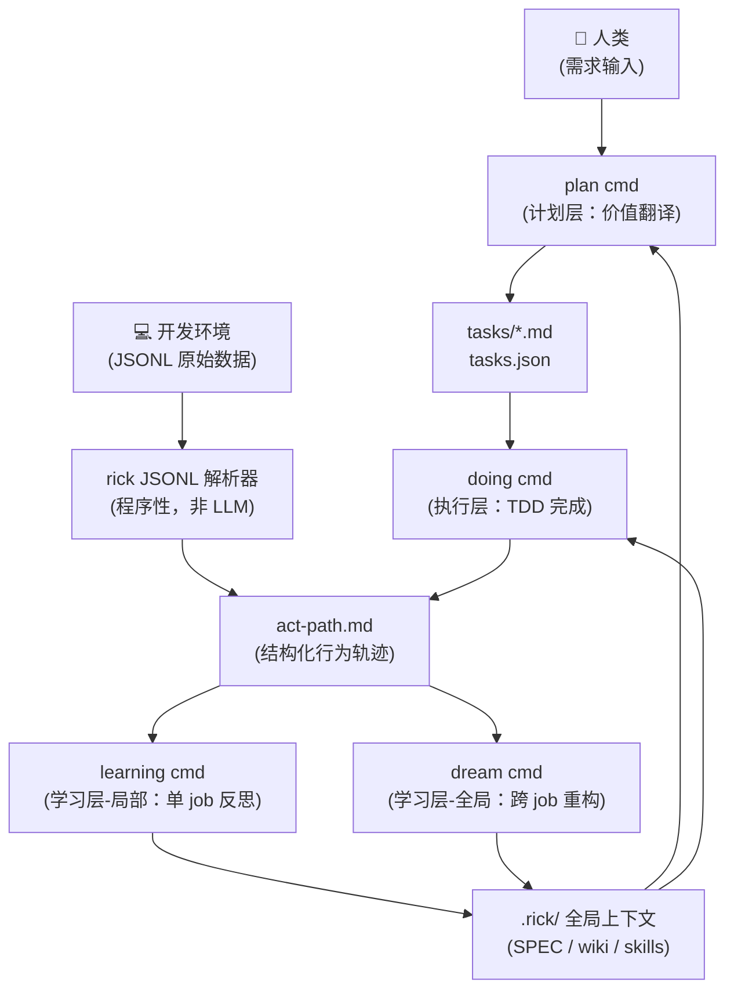
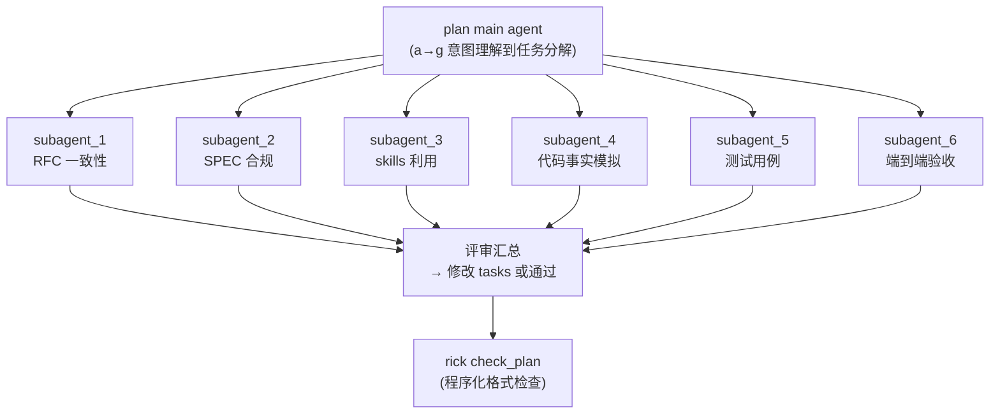
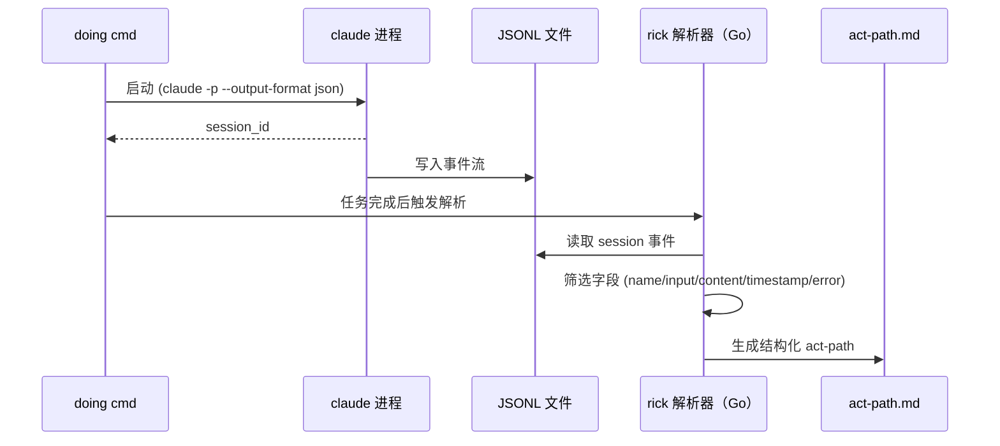
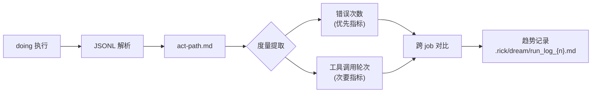

# 突破单 Agent 架构的系统边界：Rick v2 三层正交 AI Coding 控制框架

**文档类型**: 设计论文（Design Paper）
**状态**: 草案（Draft）
**日期**: 2026-05-29
**关联文档**: GEPA report, agent-plan-execute-learn-outline.md, superpowers-research.md, superpowers-sense.md

---

## 摘要

当前大语言模型（LLM）驱动的 Agent 虽已具备工具调用与循环推理能力，但随着任务复杂度提升，单一 Agent Loop 架构正面临上下文熵增、目标漂移与能力无法复用等结构性瓶颈。本文以 Rick v2 的工程实践为载体，提出 Agent 核心架构需从单纯的"执行"转向**计划、执行、学习**三层的正交分工。通过分离价值对齐（计划层）、事实完成（执行层）与经验沉淀（学习层，含 Learning/Dream 双尺度循环），构建自我强化的进化系统，从而对抗人机系统的熵增，实现 Agent 能力的螺旋上升。

Rick v2 的核心升级包括：新增 `dream` 模块（跨 job 全局进化）、程序性 JSONL 解析生成 `act-path.md`（行为轨迹）、`learning` 结构化六步 SOP、`plan` 多层 subagent 评审，以及基于错误次数与工具调用轮次的量化熵度量体系。

---

## 一、引言：Agent Loop 的隐喻与上限

过去两年里，让 LLM 调用工具、循环推理、自主完成任务，无疑是工程领域的重大突破。然而，当面对复杂任务时，第一个遭殃的往往不是模型本身的智力，而是上下文空间。以典型的 Agent Loop 为例（如 Claude Code 的源码逻辑），50 次工具调用即可产生约 50 万 Token 的历史负担，每一轮输出都在不可逆地吞噬下一轮的推理空间。

这就像一个"得了阿尔兹海默症的教授"：智商（模型参数）可能在线，但记忆（上下文）混乱，导致行为失序。

Rick v1 已在 Job 1（Wiki 文档创建）中取得了 9/9 零重试的成绩，证明了三模块架构（plan/doing/learning）的可行性。然而，随项目规模增长，Rick v1 的结构性局限开始显现：

- `.rick/SPEC.md` 随时间积累，信噪比持续下降
- `debug.md` 仅记录失败重试，无法还原完整行为路径
- `learning` 阶段人工主导，知识沉淀依赖个人经验
- 跨 job 没有全局重构机制，优质 skills 无法系统化演进

因此，现代 Agent 不应只满足于"执行"，必须确立**计划（Plan）、执行（Execute）、学习（Learn）**三件事的正交分工。这正是 GEPA（Reflective Prompt Evolution）等前沿研究指向的方向——通过反思机制超越传统强化学习范式，让 Agent 具备真正的进化能力。

---

## 二、Agent Loop 的系统性边界：单体的结构性缺陷

单 Agent 系统暴露出的瓶颈，往往不是仅靠调参能解决的，而是深层的架构问题。

### 2.1 上下文熵增：信息易腐性

上下文并非越长越好，它是一种有限且易腐的资源。斯坦福的研究"Lost in the Middle"指出，上下文中间位置的信息回忆率比头尾低 20–30%，信息处理并非平等。Chroma 2025 发布的"Context Rot"进一步证实，18 个顶尖模型在输入长度增加时，性能无一例外下降。加之 KV Cache 输入输出比约 100:1 的工程现实，一旦 Cache Miss，成本呈二次方增长。

在 Rick 的实践中，熵增的路径更具体：**错误次数上升 → 更多调试 → 调试产生噪声进入上下文 → 加速熵增**，形成恶性正反馈闭环。

### 2.2 目标漂移：执行偏离意图

在长任务链中，模型极易被中途的工具输出"带偏"，局部信息淹没全局目标。Anthropic 的多 Agent 对比评估显示，多 Agent 比单 Agent 成功率高 90.2%，但 Token 消耗高达 15 倍。更关键的是，AgentErrorTaxonomy 研究发现，62% 的 Agent 错误集中在"记忆和反思"阶段，而非工具调用失败——本质是"忘了自己在做什么"。执行层的失败，根源常在于上下文管理层的缺失。

### 2.3 能力无法复用：从零开始的诅咒

传统 Agent 往往丢弃每一次任务的成功经验，下一次重新试错。Voyager（2305.16291）在 Minecraft 中通过代码技能库存储可复用行为（Skills），大幅提升了探索效率。Reflexion（NeurIPS 2023）亦证明，执行与学习分离的 Agent 在 HumanEval 上超越 GPT-4 约 11%。**没有记忆的执行是消耗，有记忆的执行才是积累。**

### 2.4 Act-Path 质量决定负反馈有效性

这是 Rick v2 提出的核心洞察：**act-path 质量决定负反馈有效性，有效性才是使整个系统熵减的主要矛盾。** 当 act-path 本身质量低时，learning 无法提取有效信号，负反馈失灵，整个进化循环断裂。因此，act-path 的生成必须是程序性的、可靠的，而非依赖 LLM 自觉记录。

---

## 三、为什么需要三层正交分工

计划、执行、学习不应只是顺序步骤，而应视为三个正交维度。混在一起会互相污染，分离才能各自进化。

### 3.1 正交分工的内涵

"正交"意味着职责边界清晰（类似软件工程的关注点分离 SoC），变更互不传染：

- **计划层**：价值对齐，确保"做正确的事"，将模糊的人类意图转化为带优先级、终止条件的结构化任务图。
- **执行层**：事实完成，确保"正确地做事"，在干净边界内高效完成单任务。
- **学习层**：经验沉淀，确保"下次做得更好"，从轨迹中提取可复用知识，含 Learning（局部修复）与 Dream（全局进化）两个尺度。

MetaGPT（2308.00352）通过 SOP 编码与多角色分工证明了正交分工能降低协作冗余，为单层 Agent 的内部分离提供了先例。

### 3.2 混层的代价

| 混层方式 | 代价 |
|---------|------|
| 计划 + 执行混合 | 执行中途重规划导致目标漂移 |
| 执行 + 学习混合 | 反思负担膨胀上下文，拖慢执行速度 |
| 计划 + 学习混合 | 历史偏见固化，削弱泛化能力 |

三层分工的本质，是给不同生命周期的信息分配合适的容器。

### 3.3 Rick v2 的四模块映射

| 模块 | 所属层 | 职责 | v1 → v2 变化 |
|------|--------|------|-------------|
| `plan` | 计划层 | 价值翻译 → 结构化任务图 | 新增 6 subagent 多层评审 |
| `doing` | 执行层 | TDD 事实完成 | 新增 JSONL 解析 → act-path.md |
| `learning` | 学习层（局部） | 单 job 反思 | 升级为结构化六步 SOP |
| `dream` | 学习层（全局） | 跨 job 进化 | 全新模块 |

---

## 四、系统架构

### 4.1 双层正交架构

Rick v2 采用**工作层 + 反思层**的双层正交架构：

```
工作层（Task Execution）
  plan → doing（产出 act-path.md）

反思层（Meta Learning）
  learning（单 job 局部优化）→ dream（跨 job 全局重构）
```

### 4.2 上下文分层

```
.rick/
├── OKR.md               # 战略目标
├── SPEC.md              # 技术规范 + skills 列表
├── wiki/                # 项目知识库（决策缘由）
├── tools/               # 可调用 py 工具
├── RFC/                 # 重要决策文档
├── dream/               # 全局上下文整理归档目录
│   ├── readme.md        # 全局优化索引：每轮处理的 job + 优化摘要
│   └── run_log_{n}.md   # 第 n 次执行日志：skills 进化情况、质量度量信息
└── jobs/                # 局部上下文
    └── job_{n}/
        ├── plan/
        │   └── tasks/
        │       ├── task{n}.md
        │       └── tasks.json
        ├── doing/
        │   ├── act-path.md  # ⭐ 新增：程序性解析的行为轨迹
        │   └── debug.md     # job 内 agent 间共享的局部上下文
        └── learning/
            └── ...
```

`.rick/` 同时服务于计划层（wiki 记录决策缘由，skills 记录能力边界）和反思层（dream 记录全局进化历史）。好的计划不是静态文档，而是与执行持续校准的"活文档"。

### 4.3 信息流图



### 4.4 反馈回路

**恶性正反馈（需要打破）**：
```
规模增长 → 熵增 → 错误↑ → 调试噪声↑ → 上下文质量↓ → 熵增（自我强化）
```

**调节负反馈（核心设计）**：
```
JSONL 解析 → 高质量 act-path
  → learning/dream 有效反思
  → .rick/ 质量↑（SPEC 精简 / skills 进化 / wiki 整理）
  → 下次 doing 错误↓ → 熵增趋缓
```

**关键保障**：调节回路的可靠性由**程序性 JSONL 解析**保证，不依赖 LLM 自觉，这是整个进化系统的基础前提。

---

## 五、计划层：价值翻译与意图对齐

计划层是人与 AI 之间的"价值翻译器"，其核心不是单纯分解任务，而是对齐意图。输入是模糊的人类自然语言（充满隐含假设），输出必须是可局部修正的结构化任务图，且包含明确的终止条件，防止 Agent 不知"何时够停"。

### 5.1 plan cmd SOP

```
a. 意图理解
   输入：plan_main_prompt.md + 用户需求描述（一段话描述，或 human-loop 子命令产出的 RFC 文档）
   上下文加载：若 .rick/SPEC.md 存在则加载（含 skills 列表）；OKR.md 同理
   首次运行（新项目）无需加载 SPEC

b. 模式识别
   确认是新项目（首次建立 .rick/ 体系）还是旧项目迭代（基于已有 SPEC/wiki）

c. 价值澄清
   通过询问彻底清晰用户的需求描述，消除隐含假设
   输出：明确的期望状态描述

d. 事实调查
   进行事实调研，理解当前现状（代码库结构、已有模块、技术约束）
   输出：现状描述

e. 差距推断
   基于期望与现状，描述当前差距
   输出：差距分析

f. 方案设计
   基于 SENSE 方法分析，想到具体的解决方案
   当出现决策分歧时以 OKR 目标为指导原则进行决策
   输出：解决方案文档

g. DAG 任务分解
   将解决方案拆解为 DAG 工作流，每个节点由 task{n}.md 描述
   调用 task.md 任务模板（目标 + 关键结果 + 测试方法）

h. 多层评审（6 个 subagent，每项务必独立启动）：
   subagent_1：若用户提供了 RFC，逐条检查 RFC 与 task{n}.md 的一致性
   subagent_2：检查当前 plan 是否严格遵循 SPEC 每条规范，禁止行为不能存在
   subagent_3：检查当前 plan 是否合理利用了所有 skills 解决问题
   subagent_4：基于代码事实模拟 plan 实现过程，提前识别导致失败的风险点
   subagent_5：所有 task 的测试方法是否涵盖所有边界 case？
              一个 test case = 前置条件 + 输入参数 + 操作序列 + 预期输出
              test case 生成须遵循 testing-rules.md 中的规则
   subagent_6：端到端测试流程验证（DAG 最后节点可验收全链路）

i. 程序化格式检查
   调用 rick check_plan 子命令（自动验证 task.md 格式、tasks.json 合法性）

j. act-path 记录
   rick 程序解析 JSONL，生成 plan/act-path.md
```

### 5.2 多层评审并行架构



**对应 prompt 文件**：
- `internal/prompt/templates/plan/plan_main_prompt.md`
- `internal/prompt/templates/plan/plan_sub{1-6}_prompt.md`

---

## 六、执行层：行为轨迹与可信工作空间

执行层的重点不是让 Agent 更"聪明"，而是提供稳定、干净、可信的上下文。只处理当前任务强相关数据，不背跨任务历史包袱。执行层调用"预编译"的 Skills（可复用行为单元），当遭遇未知情况时向计划层发信号而非自行越权。

### 6.1 doing cmd SOP（红绿 TDD）

```
a. testing agent（红阶段）
   默认加载：OKR.md + SPEC.md（含 skills 列表），理解全局目标与开发规范
   加载 debug.md（job 内 agent 间共享的局部上下文，记录有价值的信息）
   根据 task.md 的"测试方法"章节生成 py 测试脚本
   确保测试脚本在未实现时能有效失败（红）

b. coding agent（绿阶段）
   默认加载：OKR.md + SPEC.md（含 skills 列表），理解全局目标与开发规范
   加载 debug.md（job 内 agent 间共享的局部上下文，记录有价值的信息）
   TDD [红 → 绿 → 重构]
   使用 debug skill 进行高效 debug
   使用 systematic-debugging 4 阶段法处理复杂问题

c. 退出时必须记录行动路径
   rick 程序自动解析本次会话 JSONL
   生成 job_{n}/doing/act-path.md
```

### 6.2 act-path 技术方案

Act-path 是执行层的关键产出，也是学习层的核心输入。**生成方式必须是程序性的**——rick 程序直接解析 Claude Code 写入的 JSONL 会话文件，而非依赖 LLM 自我记录。这是保证 act-path 质量、保证负反馈有效性的根本前提。

**数据来源**：`~/.claude/projects/<project>/<session>.jsonl`

**字段筛选规则**：

| 字段 | 来源 | 说明 |
|------|------|------|
| `name` | tool_use 事件 | 工具名称 |
| `input` | tool_use 事件 | 工具输入参数 |
| `content` | tool_result 事件 | 输出摘要（截断） |
| `timestamp` | 所有事件 | 时间戳 |
| `stop_reason` + `error` | 结束事件 | 是否报错标记 |

**JSONL 解析流程**：



**act-path.md 格式**：
```markdown
# Act Path: job_{n} / task{m}

## 执行摘要
- 总工具调用次数: N
- 报错次数: M
- 执行时长: Xs

## 行为轨迹

### [T+0.0s] Bash
**输入**: `go build ./...`
**输出摘要**: 编译成功，无报错
**状态**: ✅ 正常

### [T+2.3s] Edit
**输入**: `internal/cmd/plan.go` 第 45 行
**输出摘要**: 修改函数签名
**状态**: ✅ 正常

### [T+8.7s] Bash
**输入**: `go test ./...`
**输出摘要**: FAIL: TestXxx 断言失败
**状态**: ❌ 报错
...
```

### 6.3 Skills 系统

执行层调用的 Skills 需具备（借鉴 Voyager）：
- **原子性**：一件明确事
- **幂等性**：同输入同输出，无副作用
- **可测性**：沙盒验证

Skills 存储于 core-skills（内嵌 rick 二进制，见第九章），其 `description` 字段严格遵循 **CSO 规则**（Claude Search Optimization）：只写触发条件，不写工作流摘要，确保 LLM 能精准匹配触发场景。

**Cialdini 说服原则集成**进所有 agent prompt 模板，以提升 skill 合规率：

| 原则 | 使用场景 | 示例 |
|------|---------|------|
| 权威（Authority） | 规范性要求 | `YOU MUST follow TDD. No exceptions.` |
| 承诺（Commitment） | 工作前宣告 | `Before coding, declare: "I will use skill: systematic-debugging"` |
| 稀缺（Scarcity） | 关键检查点 | `Before proceeding to next task, verify: all tests pass` |

**对应 prompt 文件**：
- `internal/prompt/templates/doing/testing_prompt.md`
- `internal/prompt/templates/doing/coding_prompt.md`

---

## 七、学习层：双尺度进化（Learning & Dream）

学习不是单一阶段，而是应对两种尺度的反馈：Learning 处理局部熵增，Dream 处理全局进化。类比人类的"实时纠错"与"睡眠记忆整合"。

### 7.1 skills 治理：双层机制

```
先验（LLM 判断）
  ↓
  learning agent 评估：此 act-path 是否值得沉淀为 skill？
  → 若值得：生成 skill 并写入 SPEC.md

后验（全局统计）
  ↓
  dream agent 统计：
  - skills 触发频次（被加载次数）
  - skills 出错次数（加载后仍出错）
  → 低频 + 高错误率 → 淘汰或重写
  → 高频 + 低错误率 → 保留并优化
```

**skill 提议格式**：
```markdown
# Skill 提议: [skill-name]

**触发场景**: 描述何时应触发此 skill（遵循 CSO 规则）
**预期效果**: 使用后 act-path 应缩短的步骤数
**核心内容**: ...
```

### 7.2 Learning：局部补丁

**触发**：每次 doing 完成后，由人类手动触发。

**SOP（结构化六步）**：

```
Step 0: 加载上下文（若存在）
        加载 OKR.md + SPEC.md，理解全局目标与开发规范（含 skills 列表）
        加载 debug.md，作为本次 job 执行过程的参考依据

Step 1: 读取 act-path.md
        完整加载：工具调用记录 + 错误排查过程与结果

Step 2: 评估更合理的 act-path
        标准：能否用更短的 act-path 解决相同问题？
        产出：优化建议文档

Step 3: 沉淀 skills
        未来遇到类似问题时，如何用更短 act-path 解决？
        格式：skill 提议（写入 SPEC.md）

Step 4: 识别 tools 候选
        哪些 skills 适合沉淀为通用 py 工具？
        标准：可复用 + 纯函数 + 有清晰输入输出

Step 5: tools 组合使用方法
        基于 gen-skills 生成技能描述，更新 SPEC.md 技能列表

Step 6: 更新度量记录
        将本次 job 的错误次数 + 工具调用轮次写入 .rick/dream/run_log_{n}.md
```

Reflexion 框架证明，执行层失败轨迹通过反思转化改进，可显著提升 Pass@1 准确率。

### 7.3 Dream：全局重构

**定位**：跨 job 全局反思与重构。**仅操作 `.rick/` 目录，不修改业务代码。**

**触发机制**：每累计 5 个新 job 自动触发一次 dream；rick 程序循环执行，每轮最多处理 5 个 job，直至所有新 job 处理完毕。

**SOP（每轮）**：

```
a. 读取 .rick/dream/readme.md
   确认已处理 job 列表，取下一批最多 5 个未处理 job

b. 逐一读取每个 job 的 act-path.md
   理解当前 OKR，启动 subagent 完成反思：

   反思维度 1: 未来最可能导致低效的原因
   反思维度 2: 未来最可能导致失败的风险
   反思维度 3: 未来最可能加速进度的方法
   反思维度 4: 哪些 skills 应被触发但没有，或执行低效

c. SENSE 方法逐一思考，变更约束为：
   - wiki 变更（新增/修改知识条目）
   - tools 变更（新增/修改 py 工具）
   - SPEC.md 变更（规范升级）

d. 整理 wiki 目录
   确保可读性，删除过时内容，补充缺失条目

e. 精简 SPEC.md
   延迟加载内容沉淀到 wiki
   保持 SPEC.md 聚焦于核心约束，不超过 200 行

f. 对 SPEC.md 中的 skills 进行进化升级
   调用 evolve-skills 技能
   基于后验数据（触发频次 + 出错次数）淘汰低质量 skills

g. 对业务项目的一致性检查
   tools/test/wiki 三者对齐检查

h. 更新 dream/readme.md
   追加本轮处理的 job 列表 + 主要优化摘要（全局优化信息索引）

→ 若仍有未处理 job，继续下一轮（最多 5 个）
```

**dream 目录结构**：
```
.rick/dream/
├── readme.md        # 全局优化索引：每轮处理的 job + 优化摘要
└── run_log_{n}.md   # 第 n 次执行日志：skills 进化情况、质量度量信息
```

Dream 的机制类似于 ProTeGi（微软 EMNLP 2023，基于 Beam Search 保留多候选 Prompt）和 OPRO（Google DeepMind ICLR 2024，LLM 读历史轨迹生成新 Prompt），在自然语言空间运行进化算法，目标是最大化"一次性成功率"（First-pass success rate）。

**对应 prompt 文件**：`internal/prompt/templates/dream/dream_prompt.md`

---

## 八、整体进化循环与度量体系

### 8.1 进化飞轮

三层分工构成了自我强化的飞轮：

**正反馈（能力积累）**：
```
Skills 积累 → 执行成功率↑ → 更多高质量 act-path
  → Dream 优化更准 → 进一步积累 Skills（复利效应）
```

**负反馈（对齐稳定器）**：
```
人介入频率↑（信号：未对齐）→ 触发 Learning/Dream
  → 对齐↑ → 人介入↓
```

人的介入不是失败，而是关键的反馈信号，应转化为学习材料。

系统的核心张力：**人机系统的熵增**（对话漂移、技能失效、理解偏差）vs. **有序化控制**（Learning 局部控制，Dream 全局进化）。优化的终极目标不是孤立的 AI 性能，而是人与 AI 整个系统的有序程度（对齐度）。

### 8.2 熵度量体系



**优先指标**：错误次数（Error Count）
**次要指标**：工具调用轮次（Tool Call Rounds）

度量方式：相同 LLM 模型下，不同版本横向对比。多 job 积累后，在概率分布层面形成稳定规律，弥补单次评估不可靠性。单次评估不可靠，但可通过多频次在概率分布上发展出规律而稳定下来。

**度量记录格式**：
```markdown
| Job | 模型 | 错误次数 | 工具调用轮次 | 备注 |
|-----|------|---------|------------|------|
| job_1 | claude-opus-4-7 | 0 | 147 | Wiki 文档创建 |
| job_2 | claude-opus-4-7 | 3 | 89 | - |
```

---

## 九、运行时组件

### 9.1 promptBuilder（Go 组件）

提示词模板通过 `//go:embed` 内嵌于 rick Go 二进制，编译进程序：

```
internal/prompt/
├── manager.go           # 提示词管理器
├── builder.go           # 提示词构建器（内嵌文件系统）
└── templates/           # 提示词模板目录
    ├── plan/
    │   ├── plan_main_prompt.md
    │   ├── plan_sub1_prompt.md   # RFC 一致性检查
    │   ├── plan_sub2_prompt.md   # SPEC 合规检查
    │   ├── plan_sub3_prompt.md   # skills 利用检查
    │   ├── plan_sub4_prompt.md   # 代码事实模拟
    │   ├── plan_sub5_prompt.md   # 测试用例检查
    │   └── plan_sub6_prompt.md   # 端到端验收
    ├── doing/
    │   ├── testing_prompt.md     # testing agent
    │   └── coding_prompt.md      # coding agent
    ├── learning/
    │   └── learning_prompt.md
    └── dream/
        └── dream_prompt.md
```

### 9.2 core-skills 目录结构

**core-skills 内嵌于 rick Go 二进制文件**，通过 `//go:embed` 编译进程序，不存在于业务项目的 `.rick/` 目录：

```
internal/prompt/templates/skills/   # rick 源码内部目录
├── sense/
│   └── sense.md              # SENSE 思考框架
├── tc/
│   └── test-case.md          # 测试用例编写规则
├── tdd/
│   ├── skill.md              # TDD 红绿重构方法
│   └── testing-anti-patterns.md
├── testing/
│   └── skill.md              # 测试执行规范
├── debug/
│   └── skill.md              # systematic-debugging 4 阶段法
├── gen-skill/
│   └── skill.md              # 从 act-path 生成 skill 提议
└── evolve-skills/
    └── skill.md              # skill 进化升级（dream 阶段调用）
```

### 9.3 Executer（已实现，无需重构）

DAG 状态机 + caller agent 机制保持不变：

- 串行拓扑排序执行（Kahn 算法）
- 每个 task 最多重试 `MaxRetries` 次（默认 5）
- 失败记录到 `debug.md`，下轮加载为上下文

---

## 十、实现优先级

### 本次迭代（v2.0）

| 优先级 | 项目 | 说明 |
|--------|------|------|
| P0 | JSONL 解析器 | rick 程序性解析，生成 act-path.md |
| P0 | learning 六步 SOP | 升级 learning_prompt.md |
| P1 | dream cmd 基础实现 | readme.md 读取 + 反思 subagent + 5 job 循环 |
| P1 | plan 多层评审 | 6 subagent 并行评审框架 + 新 SOP（a-j 步） |
| P1 | core-skills 目录 | gen-skill / evolve-skills |
| P2 | 度量体系 | run_log 记录 + 趋势追踪 |
| P2 | CSO 规则集成 | 更新所有 prompt 模板 |

### 延后迭代（v2.1+）

| 项目 | 说明 | 延后原因 |
|------|------|---------|
| Skills TDD 创作法 | RED-GREEN-REFACTOR for skill docs | 需要足够 job 积累才有意义 |
| doing agent 4 状态 | DONE/DONE_WITH_CONCERNS/NEEDS_CONTEXT/BLOCKED | 增加复杂度，当前串行足够 |
| control cmd | 定期监控与健康检查 | 基础功能优先 |

---

## 十一、关键假设与风险

### 11.1 核心假设清单

| 编号 | 假设 | 验证方式 |
|------|------|---------|
| ① | act-path 由 rick 程序性解析 JSONL 生成（非 LLM 自记录），可靠性有保障 | 实现后验证解析准确率 |
| ② | skills 采用 LLM 先验估计 + 触发频次/出错次数后验淘汰双层机制 | 积累 5+ jobs 后评估 |
| ③ | 度量：错误次数（优先）+ 工具调用轮次（次要），相同模型下横向对比 | 建立 run_log 基线 |
| ④ | 多频次积累在概率分布层面形成稳定规律，弥补单次评估不可靠性 | 统计 10+ jobs 趋势 |
| ⑤ | CSO 规则 + Cialdini 说服原则集成进所有 agent prompt 后有效提升合规率 | A/B 对比（有/无原则） |
| ⑥ | Skills TDD 创作法延后迭代，不影响当前 skill 沉淀质量 | 观察 skill 沉淀速度 |
| ⑦ | doing 保持串行 DAG，不引入 4 状态并行机制，复杂度可控 | 监控重试率 |

### 11.2 主要风险

**风险 1：JSONL 格式变更**
- 描述：claude CLI 升级后 JSONL 格式可能变化，导致解析失败
- 概率：中
- 应对：解析器加版本检测 + 容错处理，失败时降级到空 act-path

**风险 2：act-path 数据质量**
- 描述：输出摘要截断策略影响 learning/dream 反思质量
- 概率：中
- 应对：保留关键字段完整（tool name + 报错信息），摘要截断仅对成功输出

**风险 3：dream 阶段 .rick/ 破坏性变更**
- 描述：dream 全局重构可能误删重要 skills 或 wiki 内容
- 概率：低
- 应对：dream 执行前自动 git commit 快照，所有变更可回滚

**风险 4：plan 多层评审延长耗时**
- 描述：6 subagent 并行评审可能显著增加 plan 阶段耗时
- 概率：高
- 应对：评审结果仅供参考，人类可选择跳过；设置最大等待时间

**风险 5：度量指标噪声**
- 描述：单个 job 的错误次数受任务难度影响，横向对比不公平
- 概率：高
- 应对：按任务类型分类统计；度量趋势而非绝对值

### 11.3 不变约束

- **串行执行**：doing 保持串行 DAG，不引入并行复杂度
- **人类控制权**：plan → doing → learning 循环由人类控制
- **dream 只改 .rick/**：dream 模块不修改业务代码
- **无 init 命令**：自动初始化原则保持不变

---

## 十二、结语：螺旋上升的承诺

计划、执行、学习的三层分工不是终点，而是起点。每一次执行产出 act-path，让 Learning 更精准、Skills 更可靠；每一次人介入提供对齐信号，让 Dream 优化全局上下文，减少未来干预。这个螺旋的驱动力是人与 AI 对齐度的持续提升。

我们不应单纯等待"更好的模型"（人类想象力会迅速消耗新算力），也不能仅靠"增加人工审核"（把熵增转移给人，系统无法扩展）。

对工程师意味着：设计 Agent 需关注学习架构。对产品意味着：Agent 的价值在第 100 次执行而非第 1 次。对行业意味着：单 Agent Demo 时代已过，多层协作的生产时代才刚刚开始。

**我们构建的不是更强大的工具，而是会成长的系统。计划赋予方向，执行落实行动，学习开创未来。**

---

## 附录 A：关键概念速查

| 概念 | 说明 |
|------|------|
| **计划层** | 意图转任务图，价值对齐（plan cmd） |
| **执行层** | 边界内高效完成任务，事实完成（doing cmd） |
| **学习层** | 经验提取，含 Learning（局部修复）与 Dream（全局进化）|
| **act-path** | rick 程序性解析 JSONL 生成的结构化行为轨迹，学习层核心输入 |
| **Skills** | 原子化、幂等、可测的可复用行为单元，内嵌 rick 二进制 |
| **.rick/** | 全局上下文载体（OKR/SPEC/wiki/tools/dream/jobs），计划层底座 |
| **debug.md** | job 内 agent 间共享的局部上下文，执行层内信息传递机制 |
| **上下文熵增** | 系统核心约束：上下文质量随规模增长趋于下降 |
| **对齐度** | 系统优化目标：人与 AI 整个系统的有序程度 |

---

## 附录 B：实证支撑矩阵

| 研究 | 核心结论 | Rick v2 对应设计 |
|------|---------|----------------|
| Lost in the Middle（斯坦福） | 上下文中间信息回忆率低 20–30% | SPEC.md ≤200 行，wiki 分层存储 |
| Context Rot（Chroma 2025） | 18 个模型输入越长性能越差 | dream 精简 SPEC，learning 抑制噪声写入 |
| Voyager（2305.16291） | Skills 库大幅提升探索效率 | core-skills + 双层治理机制 |
| Reflexion（NeurIPS 2023） | 执行与学习分离超越 GPT-4 约 11% | learning/dream 双尺度分离 |
| MetaGPT（2308.00352） | SOP 编码降低协作冗余 | plan 多层 subagent SOP |
| GEPA report | 反思式 prompt 进化替代权重更新 | dream 全局 prompt 进化 |
| Superpowers v5.1.0 | CSO 规则 + Cialdini 说服原则 | 所有 agent prompt 模板集成 |
| AgentErrorTaxonomy | 62% 错误在记忆和反思阶段 | act-path 程序性解析保障数据质量 |
