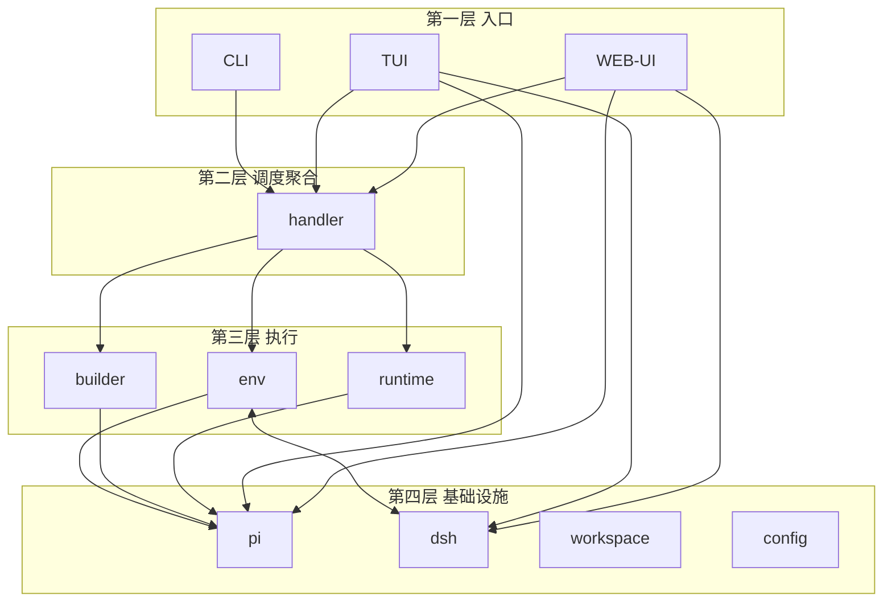

# rick-spec — rick 工程实现契约（四层架构 + 5 模块 + env 四职责）

> 本文档是 rick 项目的第一份 spec 实例，按 `.rick/domain/spec.md` 定义的四要素模板（模块边界 / 职责 / 接口契约 / 验收标准）逐节填写，作为 task3~task11 重构的「契约」，也是 rick 的信息内核。
>
> 依据：`.rick/draft/rfc/rfc-rick-三层架构重构与spec信息内核-2026-08-14.md` §4（目标架构）、§6 O1 KR1.2。
>
> 核心立场：rick = 方法（自然语言描述），pi（当前 runtime）= 实现（编程语言描述）；方法描述经模型可转化为功能等价的开发计划。只要本 spec 无歧义地描述验收标准，丢弃一切源码即可 AI coding 出功能等价的 rick。

## 1. 模块边界

### 1.1 四层架构图（调用逐级往下）



文本图（等价呈现）：

```
第一层 入口        CLI / TUI / WEB-UI        （路由命令、解析参数、交互呈现）
        │ 逐级往下
第二层 调度聚合    handler                    （编排 env/runtime/builder 完成功能）
        │ 逐级往下
第三层 执行        env / runtime / builder    （检查/安装/配置/维护 + 调用封装 + 拼提示词产物）
        │ 逐级往下
第四层 基础设施    pi / dsh / workspace / config（当前 runtime=pi；dsh 为预留 runtime）
```

### 1.2 分层定义

- **第一层 入口（CLI / TUI / WEB-UI）**：路由命令、解析参数、交互呈现。CLI 为命令行入口（Cobra 命令 + flag 解析），TUI / WEB-UI 为交互式呈现入口。
- **第二层 调度聚合（handler）**：接受入口路由与解析后的参数，编排 env / runtime / builder 三个模块完成 rick cmd 功能实现。
- **第三层 执行（env / runtime / builder）**：
  - **env**：对 rick 在当前机器的环境配置、关键依赖（pi/dsh 及扩展）做检查/下载/安装/配置/维护。
  - **runtime**：对 pi 或 dsh 等 agent runtime 调用逻辑的封装（参数解析 + 调用，当前只支持 pi runtime）。
  - **builder**：按不同入口功能拼接提示词，在 cmd 触发时创建一组符合 runtime（pi/dsh 等）要求规范的产物。
- **第四层 基础设施（pi / dsh / workspace / config）**：
  - **pi**：当前 runtime（唯一实现）。
  - **dsh**：预留 runtime（deepseek harness，当前不写代码）。
  - **workspace**：路径解析。
  - **config**：`~/.rick/config.json` 加载。

### 1.3 边界规则（逐级往下 + 四个例外）

**主规则**：上层调下层（逐级往下），下层不回调上层。

**例外一（env ↔ dsh 相互调用）**：dsh 生态交互关系，非纯单向；**不单列 dshRuntime/dshBuilder 节点**，链接直接连到具体组件 env 与 dsh。

**例外二（TUI / WEB-UI 跨层直连 pi/dsh）**：交互界面直接驱动 runtime，绕过 handler/env/runtime/builder。

**例外三（组合根 DIP 越级豁免）**：`cmd` 的 `RunE` 懒加载实例化 `piRuntime`/`piEnv`/`pibuilder` 注入 handler，是 DIP 组合根模式，越级豁免。

**例外四（workspace/config 跨层叶子基础设施）**：路径解析与配置加载可被任意层直接使用，不参与功能调用链的「逐级往下」约束。

**L3 内部约定**：`internal/prompt` = builder 三件中 templates 的承载包（L3）；L3 内部（env/runtime/builder）可复用共享路径工具（AgentDir/RuntimeDir/RuntimeBin/AgentEnv 等），不视为越级回调。

### 1.4 删除清单（重构后不再保留的模块）

| 旧模块 | 去处 |
|--------|------|
| executor | 调度 → 下沉 pi |
| parser | 读/校验 → 下沉 pi |
| actpath | 轨迹 → 收口到 runtime |
| logging | 死代码，删除 |
| git | → 下沉 pi 脚本 |
| agent 接口 | 失去消费者（单一 runtime pi 后不再需要抽象消费者），删除 |

## 2. 职责

### 2.1 cli（第一层入口）

- 一句话职责：路由命令、解析参数、交互呈现。
- 分条职责：
  - 路由命令到 handler（plan / doing / easy / learning / dream / ctrl / human-loop 等）。
  - 解析参数与 flag（含 `--dry-run`、`--job` 等），把「入口 + 参数」交给 handler。
  - 交互呈现（TUI / WEB-UI 直接呈现，并可按例外二直连 pi/dsh）。
- 不做：不直接拼提示词、不直接拉 pi、不维护 dag 调度与门禁。

### 2.2 handler（第二层调度聚合）

- 一句话职责：编排 env → builder → runtime 完成功能 + 持久化 sessionID 到 job 目录。
- 分条职责：
  - 接受入口参数，编排 env（保证 pi 就绪）→ builder（拼提示词）→ runtime（拉 pi）。
  - 把 runtime 返回的 sessionID 持久化到 job 目录。
- 不做：不做具体安装、不做具体 pi 调用、不做具体提示词拼接。

### 2.3 env（第三层执行）— 四职责

- 一句话职责：保证 rick 在当前机器的运行环境（pi 及扩展、rick 定制）就绪。
- **env 四职责**：
  1. 安装/更新 pi agent。
  2. 安装/更新 pi 生态扩展/插件/skill。
  3. 安装/更新 rick 自有 hook/skill/agent 定制。
  4. 提供 pi 功能点就绪 check 函数（不含 session）。
- 不做：不管理 session（session 归 runtime）、不做 dag 调度与门禁。

### 2.4 builder（第三层执行）— 三件

- 一句话职责：按入口功能拼接提示词产物。
- **builder 三件契约**：
  - **templates** = go embed 内嵌提示词（方法层源码 md）。
  - **pibuilder** = pi 统一入口组合子 builder（内部组合 plan / doing / easy / human-loop 等子 builder）。
  - **xxxxbuilder** = 扩展位（未来新增 runtime 只扩展这一 builder，其他组件不改动）。
- 不做：不直接调用 pi、不管理环境依赖。

### 2.5 runtime（第三层执行）

- 一句话职责：拉起 pi + 内部校验 session 就绪 + 采集行为轨迹 + 返回 `(sessionID, trace)`。
- 分条职责：
  - 参数解析 + 调用 pi（合并 provider/model/api-key 等 flags）。
  - 内部校验 session 就绪。
  - 采集行为轨迹（trace）。
  - 返回 `(sessionID, trace)`。
- 不做：不安装 pi、不拼提示词、不维护 dag 调度与门禁。

## 3. 接口契约

### 3.1 注入模型（方法/技能/实例 三层分离）

prompt 注入按三层分离，各走各的通道：

| 层 | 内容 | 注入通道 |
|----|------|----------|
| 方法 | system prompt（rick 方法描述） | 走 `--append-system-prompt`（保留 pi 默认骨架） |
| 技能 | skills | 走 pi skills 机制 |
| 实例 | user prompt（本次任务实例） | 走 prompt 文件 |

### 3.2 runtime 契约

```
runtime.Run(...) → (sessionID, trace)
```

- 拉起 pi（参数解析 + 调用）。
- 内部校验 session 就绪。
- 采集行为轨迹（trace）。
- 返回 `(sessionID, trace)`。

### 3.3 builder 契约

- `templates`：go embed 内嵌提示词（方法层源码 md），按 cmd 功能拼接成某任务真正需要执行的提示词。
- `pibuilder`：为 pi 这一 runtime build 具体提示词文件目录的统一入口。
- `xxxxbuilder`：扩展位，与新增 runtime 更好适配的信息封装在此层。

### 3.4 handler 编排契约

```
handler 编排顺序 = env（保证 pi 就绪）→ builder（拼提示词）→ runtime（拉 pi）
handler 持久化 = sessionID 写入 job 目录
```

### 3.5 扩展 seam（单一 runtime pi + dsh 预留）

当前 **pi 是唯一 runtime 实现**，为将来 deepseek harness(dsh) 预留三扩展 seam + 一个 config 字段：

- **`RuntimeBuilder`**：builder/xxxxbuilder 转义层。
- **`Runtime`**：runtime 抽象，接口方法 `Name` / `Run`。
- **`RuntimeEnv`**：env 抽象，接口方法 `Ensure` / `DeployCustomizations` / `CheckReady`。
- **config `runtime` 字段**：默认 `pi`。

**切换规则**：新增 dsh 只新增 dshBuilder/dshRuntime/dshEnv 三个实现并注册，cli/handler/方法层 templates 不改。当前不写 dsh 代码（dsh 代码是将来预留，不在本次重构范围）。

## 4. 验收标准

### 4.1 功能等价判据

- **功能等价 = 通过所有功能验收**：近似测试通过了所有的功能验收，就算是一致的；只要功能等价，就认为是效果等价。
- **rick 做薄**：dag 调度与门禁下沉 pi，rick 收敛为引导程序（env 保证 pi 就绪 → builder 拼提示词 → runtime 拉 pi）。

### 4.2 下沉策略判据

- **dag 调度** → 下沉 pi workflowScript 编排（await 顺序）。
- **门禁** → 下沉 pi hook（rick-gates 扩展）+ 确定性脚本。
- **think/research/exporter** → 下沉 pi agent（经 env 职责 3 落盘）。

### 4.3 单一 runtime 判据

- 当前 pi 是唯一实现，不写 dsh 代码。
- 预留三扩展 seam（`RuntimeBuilder` / `Runtime` / `RuntimeEnv`）+ config `runtime` 字段（默认 `pi`）。
- 新增 dsh 只新增 dshBuilder/dshRuntime/dshEnv 三个实现并注册，cli/handler/方法层 templates 不改。

### 4.4 可操作判据（spec → 开发计划 → 功能等价实现）

重构出的 rick 与原 rick 功能等价的命令级判据：

| 判据 | 命令 | 通过标准 |
|------|------|----------|
| 单元测试 | `go test ./...` | 全部 `ok`，exit code 0 |
| 集成测试 | `bash tests/tools_integration_test.sh` | 全绿（CLI 命令 + mock_agent 全链路） |
| 构建 | `./scripts/build.sh` | 成功产出 `./bin/rick` |
| dry-run | `./bin/rick <cmd> --dry-run` | 输出完整 prompt，且无未替换模板变量残留 |
| check | `./bin/rick tools plan_check/doing_check/learning_check/dream_check <job_id>` | 均 `✅ PASS`，exit code 0 |
| 功能验收 | 按本 spec 四要素逐条断言 | 全部命中 |

判据约定：任何一条判据失败，即判定「功能不等价」，重构未完成。
