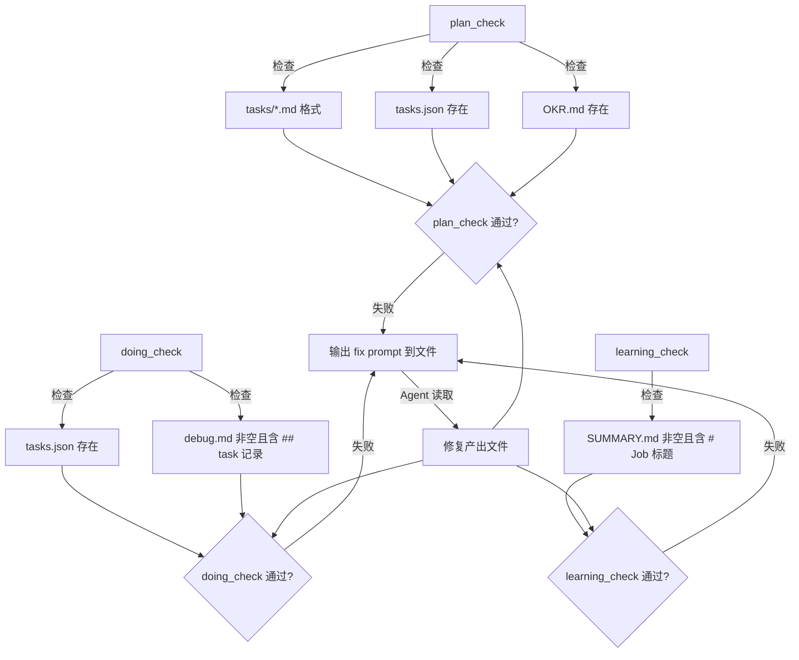

# Check 机制工作原理与强制集成

## 概述

Rick 的 Check 机制是一组验证工具（`plan_check`、`doing_check`、`learning_check`），用于验证各阶段 Agent 产出文件是否符合规范格式。从 job_11 起，这些工具被强制集成到各阶段的 Agent 提示词模板中，形成"产出 → 自验证 → 修复 → 再验证"的闭环。

## 工作原理

### Check 工具架构



### 强制集成机制

从 job_11 起，check 命令被注入到各阶段 Agent 提示词模板：

| 阶段 | 模板文件 | 集成位置 | 强制程度 |
|------|---------|---------|---------|
| plan | `plan.md` | 九.2 强制验证步骤 | 必须通过才能结束 |
| doing | `doing.md` | 行为约束第7条 | git commit 后必须运行 |
| learning | `learning.md` | Step 3 | 必须通过才能进入 Step 4 |

### 模板变量替换

Check 命令在模板中使用占位符：

```
{{rick_bin_path}} tools plan_check {{job_id}}
```

这两个变量在 `GeneratePlanPrompt` 和 `GenerateDoingPrompt` 函数中注入：

- `rick_bin_path`：优先使用 `./bin/rick`（本地构建版），不存在则 fallback 到 `rick`（系统安装版）
- `job_id`：从 jobPlanDir 路径中提取（格式 `.rick/jobs/job_N/plan` → `job_N`）

## 如何控制/使用

### 手动运行 Check

```bash
# 检查 plan 阶段产出
rick tools plan_check job_N

# 检查 doing 阶段产出
rick tools doing_check job_N

# 检查 learning 阶段产出
rick tools learning_check job_N
```

### Check 失败时的 Fix Prompt

当 check 失败时，工具会将修复指导写入临时文件并输出路径，Agent 可读取该文件了解需要修复的内容。

### 扩展 Check 规则

在对应的 `tools_*_check.go` 文件的 `run*Check()` 函数末尾追加新检查项：

```go
// 示例：新增检查 SPEC.md 存在性
specPath := filepath.Join(planDir, "SPEC.md")
if _, err := os.Stat(specPath); os.IsNotExist(err) {
    errors = append(errors, fmt.Sprintf("SPEC.md not found in plan directory: %s", specPath))
}
```

同时更新对应的 `write*CheckFixPrompt` 函数，在 Instructions 中加入新检查项的修复说明。

## 示例

### plan_check 通过的目录结构

```
.rick/jobs/job_N/plan/
├── OKR.md          ✅ 必须存在
├── tasks.json      ✅ 必须存在
└── tasks/
    ├── task1.md    ✅ 格式正确
    └── task2.md    ✅ 格式正确
```

### doing_check 通过的 debug.md 内容

```markdown
## task1: 任务名称

**分析过程 (Analysis)**:
...

**实现步骤 (Implementation)**:
...

**验证结果 (Verification)**:
...
```

关键点：文件非空，且至少包含一个 `## task` 开头的记录。

### learning_check 通过的 SUMMARY.md 内容

```markdown
# Job job_N 执行总结

## 执行概述
...
```

关键点：文件非空，且包含 `# Job` 标题行。
