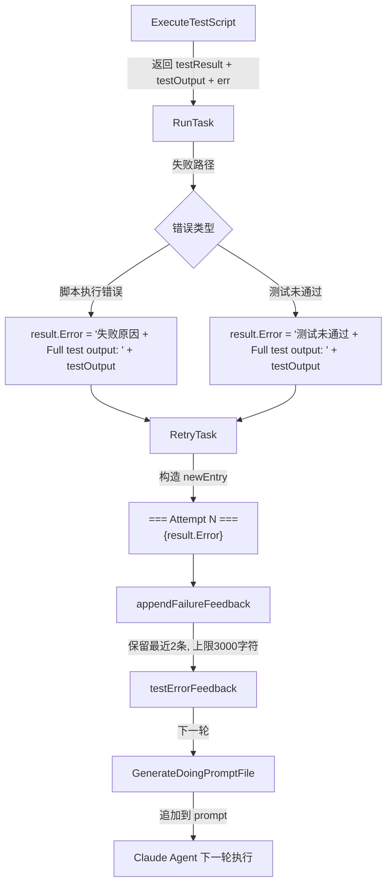

# Doing 重试循环的失败信息传递机制

## 概述

当 doing 阶段的 Agent 执行任务失败时，Rick 会将失败信息（测试输出、错误详情）传递给下一轮 Agent，帮助其快速定位和修复问题。从 job_11 起，失败信息传递机制经过优化：移除了 500 字符硬截断，改为智能截断策略，并确保传递完整的测试输出（含 stderr/traceback）。

## 工作原理

### 失败信息流转路径



### appendFailureFeedback 算法

```go
func appendFailureFeedback(existing, newEntry string, maxEntries int, maxBytes int) string {
    // 1. 按 "=== Attempt " 分割现有条目
    // 2. 追加新条目
    // 3. 只保留最近 maxEntries 条（默认2条）
    // 4. 合并后超过 maxBytes（默认3000字符）时，从尾部截断并对齐到行边界
}
```

**设计要点**：
- 保留最近 2 次而非全部历史，防止 prompt 随重试次数线性膨胀
- 从尾部截断（保留最新内容），而非从头部截断
- 对齐到行边界，避免传递半截的错误信息

### 完整 testOutput 的重要性

在 job_11 之前，`result.Error` 只包含：
```
test did not pass: assertion failed; key not found
```

job_11 之后，包含完整输出：
```
test did not pass: assertion failed; key not found

Full test output:
STDERR:
Traceback (most recent call last):
  File "test_task1.py", line 42, in test_okr_exists
    assert os.path.exists(okr_path), f"OKR.md not found at {okr_path}"
AssertionError: OKR.md not found at .rick/jobs/job_1/plan/OKR.md
{"pass": false, "errors": ["assertion failed"]}
```

完整输出让 Agent 能直接看到具体的文件路径、行号和断言内容，大幅提升修复效率。

## 如何控制/使用

### 调整保留条数

在 `retry.go` 中修改 `appendFailureFeedback` 的 `maxEntries` 参数（当前默认 2）：

```go
testErrorFeedback = appendFailureFeedback(testErrorFeedback, newEntry, 2, 3000)
// 改为保留最近3条：
testErrorFeedback = appendFailureFeedback(testErrorFeedback, newEntry, 3, 3000)
```

### 调整总长度上限

修改 `maxBytes` 参数（当前默认 3000）：

```go
testErrorFeedback = appendFailureFeedback(testErrorFeedback, newEntry, 2, 5000)
```

注意：增大上限会增加 prompt 长度，影响 Claude 响应速度和 token 消耗。

### 查看传递给 Agent 的完整 prompt

doing prompt 文件在执行后被删除（`defer os.Remove`），如需调试，可临时注释掉删除逻辑：

```go
// defer os.Remove(doingPromptFile) // 注释此行以保留 prompt 文件
```

## 示例

### 第1次失败后的 testErrorFeedback

```
=== Attempt 1 ===
test did not pass: OKR.md not found

Full test output:
AssertionError: OKR.md not found at .rick/jobs/job_1/plan/OKR.md
{"pass": false, "errors": ["OKR.md not found"]}
```

### 第2次失败后的 testErrorFeedback（保留最近2条）

```
=== Attempt 1 ===
test did not pass: OKR.md not found
...

=== Attempt 2 ===
test did not pass: OKR.md exists but tasks.json missing

Full test output:
AssertionError: tasks.json not found
{"pass": false, "errors": ["tasks.json missing"]}
```

### Agent 在 doing prompt 中看到的上下文

```markdown
## Test Execution Feedback

**Previous test execution encountered errors. You may need to fix the test script.**

Test error details:
```
=== Attempt 1 ===
...
=== Attempt 2 ===
...
```

**Action Required**:
1. Review the test script for potential issues
...
```
