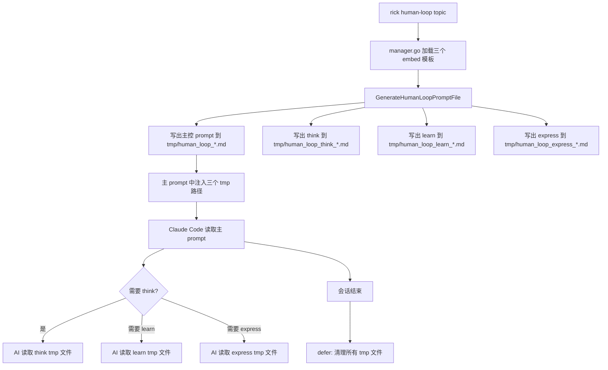

# Human-Loop Sub Agent 路径注入模式

## 概述

human-loop 命令通过"路径注入"方式将三个 sub agent 模板文件的路径写入主控 prompt，AI 在执行时按需读取对应文件内容。这是"渐进式加载"设计——主控 prompt 保持精简，sub agent 规则只在需要时才加载到上下文。

## 工作原理



**关键流程**：
1. `manager.go` 通过 Go `//go:embed` 将三个模板文件编译进二进制
2. 运行时 `GenerateHumanLoopPromptFile` 将模板内容写出到系统 tmp 目录
3. 主控 prompt 的 `{{think_agent_path}}`、`{{learn_agent_path}}`、`{{express_agent_path}}` 被替换为真实 tmp 路径
4. Claude 读取主控 prompt 后，知道三个 sub agent 的位置，按需用 `Read` 工具加载
5. `defer` 清理所有 tmp 文件，包括主 prompt 和三个 sub agent

## 如何控制/使用

### 添加新的 sub agent

1. 在 `internal/prompt/templates/` 下新建 `.md` 文件（内容不含 Go 模板占位符）
2. 在 `manager.go` 新增 embed 变量声明并在 `getEmbeddedTemplate` 注册
3. 在 `human_loop_prompt.go` 的 `GenerateHumanLoopPromptFile` 中写出到 tmp 文件并返回路径
4. 在 `human_loop.md` 主控模板中新增路径占位符 `{{new_agent_path}}`
5. `human_loop.go` 的 defer 清理逻辑中加入新 tmp 文件

### 修改 sub agent 内容

直接编辑 `internal/prompt/templates/human_loop_think.md`（或 learn/express），重新构建即可。无需修改 Go 代码。

### 验证 sub agent 路径正确注入

```bash
# dry-run 验证占位关键词
./bin/rick human-loop --dry-run '测试主题' | grep -E "human_loop_think|human_loop_learn|human_loop_express"

# 使用统一验证工具
python3 tools/check_prompt_variables.py --phase human-loop --topic '测试主题' --keywords human_loop_think
```

## 示例

**主控 prompt 中的 sub agent 路径块**：

```markdown
## Sub Agent 路径

- **think sub agent**（追问者）：`/tmp/human_loop_think_123456789.md`
- **learn sub agent**（调研者）：`/tmp/human_loop_learn_123456789.md`
- **express sub agent**（表达者）：`/tmp/human_loop_express_123456789.md`

**加载规则：**
- **think**：启动时立即读取，将规则加载到上下文
- **learn**：触发条件满足时才读取，按需加载
- **express**：触发条件满足时才读取，按需加载
```

**Dry-run 模式下的占位路径**（不写真实文件）：

```
- **think sub agent**（追问者）：`<tmp>/human_loop_think_*.md`
```

## 与 Skills 机制的对比

| 维度 | 旧 Skills 机制 | 新路径注入机制 |
|------|--------------|--------------|
| 分发方式 | 安装时复制 `.md` 到 `~/.claude/skills/` | 运行时写出到系统 tmp |
| 触发方式 | 斜杠命令 `/sense-human-loop` | AI 自行读取文件路径 |
| 更新方式 | 重新安装 | 重新构建二进制 |
| 依赖 | Claude Code Skills 机制 | 标准文件 I/O |
| 清理 | 无自动清理 | defer 自动清理 tmp |
