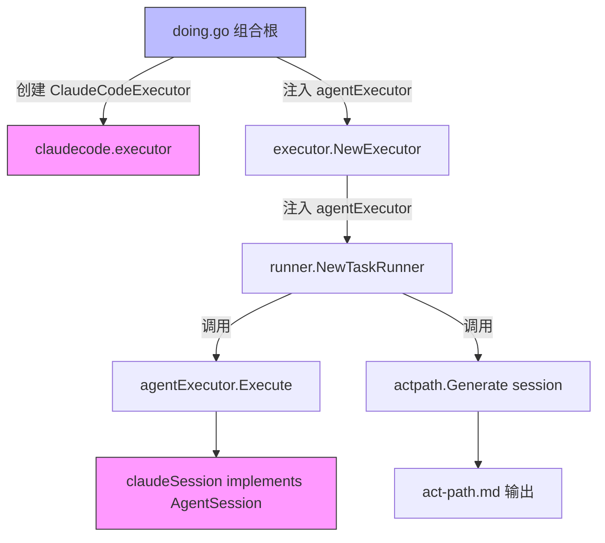

# act-path 生成机制与 DIP 全链路

## 概述

`act-path` 是 Rick v2.0 的核心负反馈机制：`rick doing` 执行任务时，程序性解析 Claude Code 的 NDJSON 流式输出，自动生成包含工具调用轨迹、报错次数、执行时长的 `act-path-{taskID}.md` 文件，供 `rick learning` 和 `rick dream` 提取优化信号。

## 工作原理

### 架构分层（DIP 全链路）



`doing.go` 是唯一知道 `claudecode` 包的地方（**组合根**）。`runner`、`executor`、`actpath` 仅依赖 `internal/agent` 接口，不 import 任何具体实现。

### NDJSON 解析流程

Claude Code 以 `--output-format stream-json --verbose` 模式输出 NDJSON：

```
{"type":"system","session_id":"xxx",...}
{"type":"assistant","message":{"content":[{"type":"tool_use","id":"t1","name":"Bash","input":{...}}]},...}
{"type":"user","message":{"content":[{"type":"tool_result","tool_use_id":"t1","content":"ok","is_error":false}]},...}
{"type":"assistant","message":{"content":[{"type":"text","text":"done."}]},...}
{"type":"result","is_error":false,"duration_ms":10864,...}
```

关键点：
- `tool_use` **嵌套在 `message.content[]` 内**，不在顶层
- 每行先写入 `raw_session.log`（追加），再解析（非 JSON 行 skip+warn，不 panic）
- `type=user` 的 `tool_result` 更新最后一个 ToolCall 的 Output 和 IsError

### act-path.md 格式

```markdown
## 执行摘要
- Session ID: xxx
- 耗时: 10s
- 工具调用次数: 5
- 报错次数: 1
- 完整日志: [raw_session.log](绝对路径)

## Agent 最终输出
> done.
> ([完整内容 raw_session.log:42](绝对路径))

## 行为轨迹
| 行号 | 工具 | 输入摘要 | 输出摘要 | 是否报错 |
|------|------|----------|----------|----------|
| [L5](raw_session.log) | Bash | echo hello | hello world | ✅ |
```

## 如何控制/使用

1. **查看 act-path**: 任务执行后在 `doing/tasks/{taskID}/act-path.md` 查看工具调用轨迹
2. **分析优化机会**: act-path 中报错次数高/工具调用次数多，说明该任务可能需要更好的 task.md 描述或 skill
3. **learning 阶段引用**: `rick learning` 自动收集所有 `doing/tasks/*/act-path.md`，注入 `{{act_path_content}}` 供 Claude 分析
4. **dream 阶段进化**: `rick dream` 读取 act-path + run_log，使用 `evolve-skills` skill 决策保留/升级/淘汰 skills

## 示例

```bash
# 执行任务后查看 act-path
cat .rick/jobs/job_14/doing/tasks/task1/act-path.md

# 查看原始 NDJSON 日志
cat .rick/jobs/job_14/doing/tasks/task1/raw_session.log

# learning 阶段自动注入
rick learning job_14  # act-path 内容自动注入 {{act_path_content}}
```
