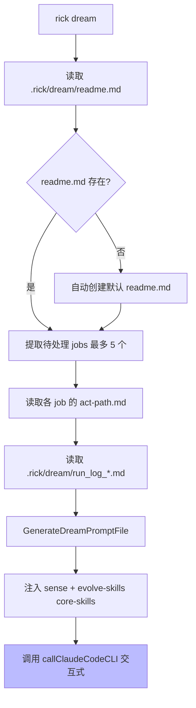

# dream 命令工作原理

## 概述

`rick dream` 是 Rick 三层控制架构中的**进化层**，在 learning 阶段积累足够 act-path 和 run_log 后，由人触发 dream 会话，让 AI 对已处理 job 进行反思、整理 wiki、精简 SPEC、进化 skills。

## 工作原理



### dream SOP（a-h 步）

| 步骤 | 内容 | skill |
|------|------|-------|
| a-b | 读取 OKR/act-path/run_log 上下文 | - |
| c | SENSE 反思：分析各 job 的执行质量和模式 | **skill:sense** |
| d | 识别 anti-pattern 和 best-practice | - |
| e | 整理 wiki：更新已过时内容 | - |
| f | 精简 SPEC.md（≤500 行），进化 skills | **skill:evolve-skills** |
| g | 生成 dream report | - |
| h | 更新 readme.md（待处理→已处理） | - |

### readme.md 格式

```markdown
## 已处理 Jobs
- job_13: 2026-06-01

## 待处理 Jobs
- job_14
- job_15
```

### evolve-skills 决策逻辑

| 决策 | 条件 |
|------|------|
| **保留** | run_log 触发频次 ≥ 3 且出错次数 < 1/3 触发次数 |
| **升级** | 有效但描述不清晰，需要重写 |
| **淘汰** | 触发频次 = 0 或出错次数 ≥ 1/2 触发次数 |

## 如何控制/使用

1. **触发时机**: 累积 3-5 个 job 的 learning 产出后，human 触发 `rick dream`
2. **待处理 jobs**: 在 `~/.rick/dream/readme.md` 的"待处理 Jobs"区块维护列表
3. **dry-run 预览**: `rick dream --dry-run` 输出完整提示词，验证 skill 注入正确性
4. **约束**: dream 只允许修改 `wiki/`、`tools/`、`SPEC.md`，**严禁修改业务代码**

## 示例

```bash
# 预览 dream 提示词
rick dream --dry-run

# 执行 dream 会话（交互式）
rick dream

# 查看 run_log 历史
ls .rick/dream/run_log_*.md
```
