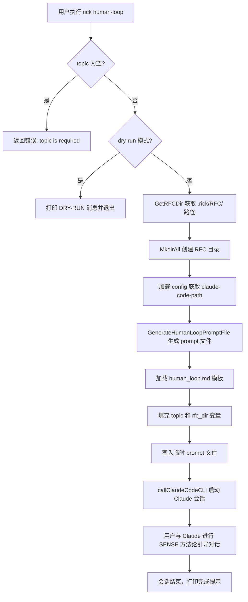

# human-loop 命令工作原理与使用指南

## 概述

`rick human-loop <topic>` 是一个基于 SENSE 方法论的深度思考辅助命令。它为指定主题生成结构化的引导提示词，并启动 Claude Code CLI 会话，帮助用户对复杂问题进行系统化分析和决策。

RFC（Request for Comments）目录（`.rick/RFC/`）用于存储 human-loop 会话产出的分析文档，供后续任务参考。

## 工作原理



### 核心组件

| 组件 | 文件 | 职责 |
|------|------|------|
| CLI 命令 | `internal/cmd/human_loop.go` | 参数解析、流程编排 |
| Prompt 生成 | `internal/prompt/human_loop_prompt.go` | 调用模板引擎生成 prompt 文件 |
| Prompt 模板 | `internal/prompt/templates/human_loop.md` | SENSE 方法论引导模板，含 `{{topic}}` 和 `{{rfc_dir}}` 占位符 |
| 路径管理 | `internal/workspace/paths.go` | `GetRFCDir()` 返回 `.rick/RFC/` 绝对路径 |
| Claude 集成 | `internal/cmd/plan.go` | `callClaudeCodeCLI()` 复用（同包内共享） |

### SENSE 方法论模板结构

`human_loop.md` 模板引导 Claude 按五个步骤进行分析：

- **S**ituation（情境）：理解问题背景和约束
- **E**xploration（探索）：发散思维，列出所有可能方案
- **N**arrowing（聚焦）：评估方案，筛选最优候选
- **S**olution（方案）：深化最优方案，明确实施路径
- **E**xecution（执行）：制定可操作的行动计划

## 如何控制/使用

### 基本用法

```bash
# 启动 human-loop 会话
rick human-loop "如何重构认证模块"

# dry-run 模式（不启动 Claude，仅验证配置）
rick human-loop --dry-run "如何重构认证模块"
```

### RFC 目录

会话产出的文档建议保存到 `.rick/RFC/` 目录，命名格式：`<topic>-<date>.md`

```
.rick/RFC/
├── 认证模块重构-2026-04-01.md
└── 数据库迁移方案-2026-03-28.md
```

### 与 doing 阶段集成

RFC 文档可在 plan 阶段引用，将 human-loop 的分析结论作为任务背景注入 doing 提示词：

```markdown
# 任务背景
参见 .rick/RFC/认证模块重构-2026-04-01.md
```

### 控制 Claude 路径

通过 `.rick/config.yaml` 的 `claude-code-path` 字段控制使用哪个 Claude Code CLI：

```yaml
claude-code-path: /usr/local/bin/claude
```

## 示例

```bash
# 对架构决策进行 SENSE 分析
$ rick human-loop "微服务还是单体架构"
[INFO] RFC directory: /home/user/project/.rick/RFC
[INFO] Starting human-loop session for topic: 微服务还是单体架构
# Claude 会话启动，按 SENSE 方法论引导分析...
[INFO] Human-loop session completed. Check .rick/RFC/ for any saved outputs.
```
