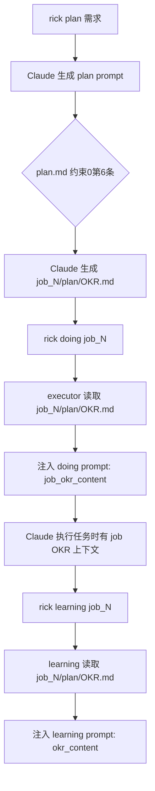

# Job 级 OKR 设计

## 概述

Rick 将 OKR 从全局级（`.rick/OKR.md`）改为 job 级（`job_N/plan/OKR.md`）。每个 job 有独立的 OKR，由 plan 阶段的 Claude 根据用户需求自动生成，doing/learning 阶段读取并注入提示词。

全局 OKR 仍然存在（`.rick/OKR.md`），作为项目长期愿景，但不再注入到每个 job 的提示词中。

## 工作原理

### OKR 生命周期



### 关键代码路径

**plan 阶段**（生成 job OKR）：
- `internal/cmd/plan.go`：删除全局 OKR 加载
- `internal/prompt/templates/plan.md`：约束0第6条要求 Claude 生成 `{{job_plan_dir}}/OKR.md`

**doing 阶段**（读取 job OKR）：
- `internal/executor/runner.go`：从 `job_N/plan/OKR.md` 加载 OKR
- `internal/prompt/doing_prompt.go`：注入 `job_okr_content` 变量
- `internal/prompt/templates/doing.md`：`### Job OKR` + `{{job_okr_content}}`

**learning 阶段**（读取 job OKR）：
- `internal/cmd/learning.go`：`collectExecutionData()` 读取 `plan/OKR.md`
- 注入 `okr_content` 变量到 learning prompt

### 为什么从全局改为 job 级

| 维度 | 全局 OKR | Job 级 OKR |
|------|---------|-----------|
| 精准度 | 所有 job 共享同一 OKR，噪声大 | 每个 job 有针对性的 OKR |
| 维护成本 | 需要手动维护全局文件 | 由 Claude 自动生成，与需求对齐 |
| 上下文相关性 | 可能包含与当前任务无关的目标 | 直接来自当前 job 的用户需求 |
| 灵活性 | 修改影响所有 job | 每个 job 独立，互不影响 |

## 如何控制/使用

### 1. 验证 job OKR 是否生成

```bash
# plan 执行后检查
cat .rick/jobs/job_N/plan/OKR.md

# 使用 dry-run 验证 plan prompt 包含 OKR 生成指令
rick plan "需求描述" --dry-run | grep -A5 "OKR.md"
```

### 2. 手动覆盖 job OKR

如果 Claude 生成的 OKR 不符合预期，可以直接编辑：

```bash
# 编辑 job OKR
vim .rick/jobs/job_N/plan/OKR.md

# 重新执行 doing（会读取更新后的 OKR）
rick doing job_N
```

### 3. 验证 doing prompt 包含 job OKR

```bash
rick doing job_N --dry-run | grep -A10 "Job OKR"
```

### 4. 全局 OKR 的使用场景

全局 OKR（`.rick/OKR.md`）仍然有价值：
- 作为项目长期愿景的参考
- 在 learning 阶段更新全局 OKR（通过 `learning/OKR.md` merge）
- 供人类查阅项目整体方向

## 示例

### plan.md 约束0中的 OKR 生成指令

```markdown
## 约束0：执行前必须完成的准备工作

...

6. 在 `{{job_plan_dir}}/OKR.md` 生成本次 job 的 OKR，内容应反映用户需求的核心目标和可量化关键结果
```

### doing.md 中的 Job OKR 章节

```markdown
## 项目背景

### Job OKR

{{job_okr_content}}
```
