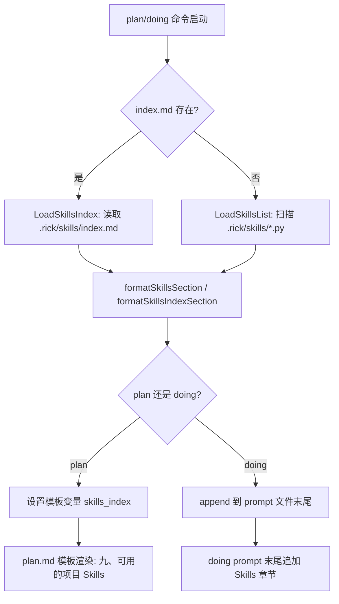
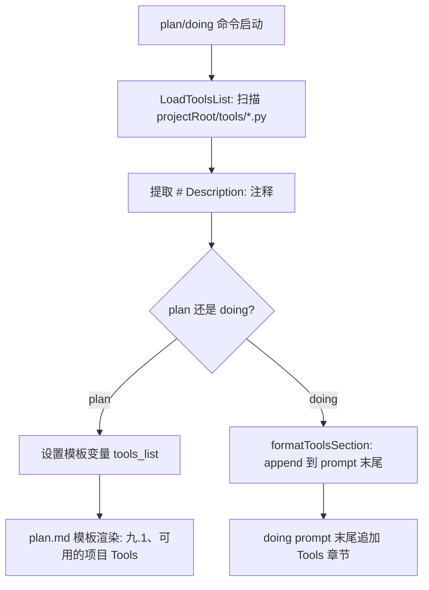

# Skills 与 Tools 注入机制

## 概述

Rick 在 plan 和 doing 阶段会自动将项目中可用的 Python 工具脚本注入到提示词中，让 AI agent 在规划和执行任务时能感知并复用现有能力，避免重复造轮子。

Skills（`.rick/skills/*.py`）是跨项目复用的通用工具；Tools（`<projectRoot>/tools/*.py`）是项目特定的工具。两者采用相同的注入模式，但来源和作用域不同。

## 工作原理

### Skills 注入流程



### Tools 注入流程



### index.md 格式

Skills 使用 `index.md` 作为主索引文件，格式如下：

```markdown
# Skills Index

本目录包含可在 doing 阶段调用的 Python 脚本工具。

## 可用 Skills

| 文件 | 描述 | 触发场景 |
|------|------|----------|
| check_go_build.py | 检查 Go 项目编译 | 任何 Go 代码变更后 |
| mock_agent_testing.py | Mock AI agent | 需要测试 claude 集成时 |

## 调用方式

\`\`\`bash
python3 .rick/skills/<filename>.py
\`\`\`
```

**触发场景列**是 index.md 相比 README.md 的关键增强——它告诉 AI agent 在什么情况下应该使用这个 skill，而不只是描述功能。

## 如何控制/使用

### 1. 管理 Skills

```bash
# 手动创建/更新 index.md（推荐方式）
# 编辑 .rick/skills/index.md，为每个 skill 填写触发场景

# 自动生成 index.md（从 .py 文件扫描，触发场景列为空）
# 调用 workspace.GenerateSkillsIndex(rickDir)
```

### 2. 添加 Tools

在项目根目录创建 `tools/` 目录，添加 Python 脚本：

```python
# Description: 这里写工具描述（单行注释，必须在文件第一行）

def main():
    # 工具逻辑
    pass
```

### 3. 验证注入效果

```bash
# 使用 dry-run 查看 plan prompt 中的 skills/tools 内容
rick plan "测试需求" --dry-run

# 使用 dry-run 查看 doing prompt 中的 skills/tools 内容
rick doing job_1 --dry-run
```

### 4. 更新 Skills index.md

当新增 skill 后，在 `learning/skills/` 下创建新的 `.py` 文件，并更新 `learning/` 下的 `skills/index.md`（覆盖版本）。merge 后自动生效。

## 示例

### Skills 注入到 plan prompt

```
## 九、可用的项目 Skills

# Skills Index

| 文件 | 描述 | 触发场景 |
|------|------|----------|
| check_go_build.py | 检查 Go 项目编译 | 任何 Go 代码变更后，验证项目能否编译通过 |

> 如果上方有 skills 内容，请在规划任务时优先考虑利用现有 skills 解决问题，避免重复造轮子。
```

### Tools 注入到 doing prompt（append 模式）

```
[prompt 主体内容...]

## 可用的项目 Tools

| 文件 | 描述 |
|------|------|
| generate_report.py | 生成项目报告 |

调用方式: python3 tools/<filename>.py
```
