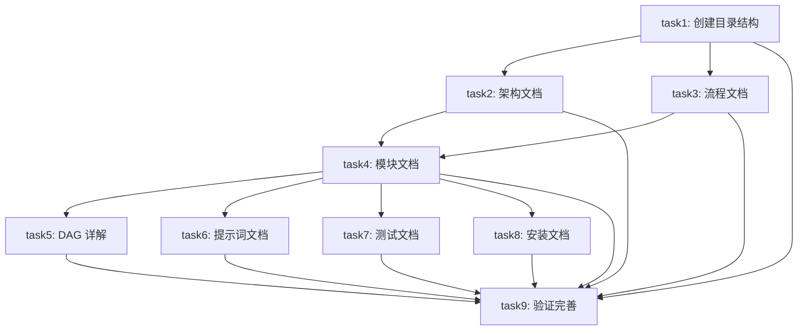
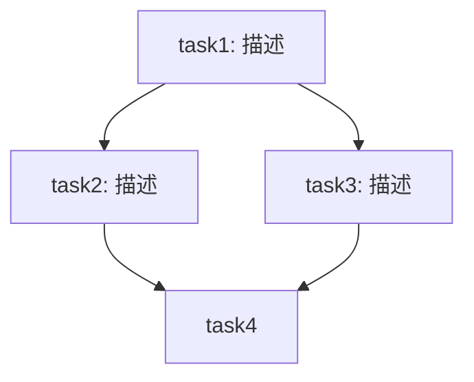

# Skill: DAG Task Decomposition (DAG 任务分解法)

**技能类型**: 任务分解 / 项目管理
**适用场景**: 复杂任务的分解和调度，特别是有依赖关系的任务
**成功率**: ⭐⭐⭐⭐⭐ (Job 1 验证：9 个任务，依赖关系清晰，执行顺序正确)

---

## 概述

DAG 任务分解法是一种基于有向无环图（Directed Acyclic Graph）的任务分解和调度方法，通过**识别依赖关系、构建 DAG、拓扑排序**，确保任务按正确的顺序执行，同时最大化并行执行的机会。

### 核心理念
```
识别依赖 → 构建 DAG → 拓扑排序 → 并行执行
```

### 价值主张
- ✅ **正确性保证**: 依赖关系明确，确保任务按正确顺序执行
- ✅ **并行优化**: 识别可并行任务，提高执行效率
- ✅ **可视化**: DAG 图清晰展示任务间的依赖关系
- ✅ **易于扩展**: 添加新任务时，只需定义依赖关系

---

## 五步分解法

### Step 1: 识别基础任务（无依赖）

**定义**: 基础任务是没有任何前置依赖的任务，可以直接执行。

#### 如何识别基础任务？
```markdown
# 问题：哪些任务不需要任何前置条件？

# 示例 1: 创建目录结构
task1: 创建 wiki/ 目录结构
- 依赖: 无
- 原因: 这是所有后续任务的基础

# 示例 2: 初始化配置
task_init: 初始化项目配置
- 依赖: 无
- 原因: 配置文件是独立的

# 示例 3: 安装依赖
task_deps: 安装项目依赖
- 依赖: 无
- 原因: 依赖安装不需要其他任务完成
```

#### 实战案例：Job 1 的基础任务
```markdown
# task1: 创建 Wiki 目录结构和索引文件
- 依赖: 无
- 输出: wiki/README.md, wiki/modules/, wiki/tutorials/
- 后续任务: task2, task3, task4, ... (所有文档创建任务)
```

#### 设计原则
- ✅ 基础任务应该尽可能少（通常 1-3 个）
- ✅ 基础任务应该快速完成（< 5 分钟）
- ✅ 基础任务应该为后续任务提供必要的基础设施

---

### Step 2: 识别并行任务（可同时执行）

**定义**: 并行任务是依赖相同的前置任务，但彼此之间没有依赖关系的任务，可以同时执行。

#### 如何识别并行任务？
```markdown
# 问题：哪些任务可以同时执行？

# 条件 1: 依赖相同的前置任务
task2: 编写架构文档 (依赖 task1)
task3: 编写流程文档 (依赖 task1)
→ task2 和 task3 可以并行执行

# 条件 2: 彼此之间没有依赖关系
task2 不依赖 task3 ✅
task3 不依赖 task2 ✅
→ 可以并行执行

# 条件 3: 不共享可变资源
task2 创建 architecture.md
task3 创建 runtime-flow.md
→ 不同的文件，可以并行执行
```

#### 实战案例：Job 1 的并行任务

##### Level 1: 并行创建架构文档
```markdown
task2: 编写架构概览文档 (依赖 task1)
task3: 编写运行时流程文档 (依赖 task1)

# 为什么可以并行？
- 都依赖 task1（目录结构已创建）
- 彼此之间没有依赖关系
- 创建不同的文件（architecture.md vs runtime-flow.md）
```

##### Level 3: 并行创建专题文档
```markdown
task5: 编写 DAG 执行引擎详解 (依赖 task4)
task6: 编写提示词管理系统文档 (依赖 task4)
task7: 编写测试与验证文档 (依赖 task4)
task8: 编写安装与部署文档 (依赖 task4)

# 为什么可以并行？
- 都依赖 task4（模块文档已完成，提供了上下文）
- 彼此之间没有依赖关系
- 创建不同的专题文档
```

#### 并行执行的优势
```markdown
# 串行执行
task2 (10 min) → task3 (10 min) = 20 min

# 并行执行
task2 (10 min) ┐
               ├─ = 10 min (节省 50% 时间)
task3 (10 min) ┘
```

---

### Step 3: 识别串行任务（有依赖关系）

**定义**: 串行任务是依赖前置任务的输出或上下文，必须等待前置任务完成后才能执行。

#### 如何识别串行任务？
```markdown
# 问题：哪些任务必须等待前置任务完成？

# 条件 1: 需要前置任务的输出
task4: 编写模块文档 (依赖 task2, task3)
→ 需要 task2 的架构上下文
→ 需要 task3 的流程上下文

# 条件 2: 需要前置任务的知识
task_advanced: 编写高级教程 (依赖 task_basic)
→ 需要基础教程提供的概念和术语

# 条件 3: 修改前置任务的输出
task_refactor: 重构代码 (依赖 task_implement)
→ 必须等待实现完成后才能重构
```

#### 实战案例：Job 1 的串行任务
```markdown
# task4: 编写核心模块文档
- 依赖: task2 (架构文档), task3 (流程文档)
- 原因:
  - 需要 task2 提供的架构上下文（模块如何组织）
  - 需要 task3 提供的流程上下文（模块如何交互）
  - 模块文档是对架构和流程的细化

# 为什么不能并行？
task2 → task4 ✅ (task4 需要 task2 的输出)
task3 → task4 ✅ (task4 需要 task3 的输出)
task2 ‖ task4 ❌ (task4 必须等待 task2 完成)
```

#### 串行依赖的设计原则
- ✅ 只有真正需要前置输出时才设置依赖
- ✅ 避免过度依赖（不必要的串行化）
- ✅ 明确依赖的原因（为什么需要前置任务？）

---

### Step 4: 识别汇聚任务（依赖所有前置任务）

**定义**: 汇聚任务是依赖多个（或所有）前置任务的任务，通常用于质量保证、集成或总结。

#### 如何识别汇聚任务？
```markdown
# 问题：哪些任务需要等待所有前置任务完成？

# 场景 1: 质量保证
task_validate: 验证所有文档
- 依赖: task1, task2, task3, task4, task5, ...
- 原因: 需要检查所有文档的一致性和完整性

# 场景 2: 集成测试
task_integration: 运行集成测试
- 依赖: task_impl1, task_impl2, task_impl3
- 原因: 需要所有模块实现完成后才能测试集成

# 场景 3: 发布
task_release: 发布新版本
- 依赖: task_test, task_doc, task_build
- 原因: 需要测试、文档、构建都完成后才能发布
```

#### 实战案例：Job 1 的汇聚任务
```markdown
# task9: 验证和完善 Wiki 文档
- 依赖: task1, task2, task3, task4, task5, task6, task7, task8
- 原因:
  - 需要所有文档创建完成
  - 检查文档的一致性（结构、格式、链接）
  - 生成验证报告
  - 创建贡献指南

# 输出
- validate_wiki.sh (验证脚本)
- VALIDATION_REPORT.md (验证报告)
- CONTRIBUTING.md (贡献指南)
```

#### 汇聚任务的设计原则
- ✅ 汇聚任务通常是最后一个任务
- ✅ 汇聚任务作为质量门禁（Quality Gate）
- ✅ 汇聚任务应该快速完成（< 10 分钟）

---

### Step 5: 构建 DAG 并拓扑排序

**定义**: 将任务和依赖关系构建为有向无环图（DAG），并使用拓扑排序确定执行顺序。

#### 5.1 构建 DAG

##### 任务表示
```json
{
  "task_id": "task1",
  "task_name": "创建 Wiki 目录结构和索引文件",
  "dep": [],  // 依赖的任务 ID 列表
  "state_info": {
    "status": "pending"  // pending, in_progress, success, failed
  }
}
```

##### 依赖关系表示
```
task1 → task2  // task2 依赖 task1
task1 → task3  // task3 依赖 task1
task2 → task4  // task4 依赖 task2
task3 → task4  // task4 依赖 task3
```

##### DAG 可视化
```
task1 (Level 0)
├─→ task2 (Level 1)
│   └─→ task4 (Level 2)
│       ├─→ task5 (Level 3)
│       ├─→ task6 (Level 3)
│       ├─→ task7 (Level 3)
│       └─→ task8 (Level 3)
│           └─→ task9 (Level 4)
└─→ task3 (Level 1)
    └─→ task4 (Level 2)
```

#### 5.2 拓扑排序（Kahn 算法）

##### 算法步骤
```go
func TopologicalSort(tasks []Task) ([]Task, error) {
    // 1. 计算每个任务的入度（被依赖的次数）
    inDegree := make(map[string]int)
    for _, task := range tasks {
        inDegree[task.TaskID] = 0
    }
    for _, task := range tasks {
        for _, dep := range task.Dep {
            inDegree[dep]++
        }
    }

    // 2. 将入度为 0 的任务加入队列
    queue := []Task{}
    for _, task := range tasks {
        if inDegree[task.TaskID] == 0 {
            queue = append(queue, task)
        }
    }

    // 3. 依次处理队列中的任务
    result := []Task{}
    for len(queue) > 0 {
        // 取出队首任务
        current := queue[0]
        queue = queue[1:]
        result = append(result, current)

        // 将依赖当前任务的任务的入度减 1
        for _, task := range tasks {
            for _, dep := range task.Dep {
                if dep == current.TaskID {
                    inDegree[task.TaskID]--
                    if inDegree[task.TaskID] == 0 {
                        queue = append(queue, task)
                    }
                }
            }
        }
    }

    // 4. 检查是否有环
    if len(result) != len(tasks) {
        return nil, errors.New("cycle detected in task dependencies")
    }

    return result, nil
}
```

##### 执行顺序
```
Level 0: task1
Level 1: task2, task3 (并行)
Level 2: task4
Level 3: task5, task6, task7, task8 (并行)
Level 4: task9
```

#### 5.3 执行策略

##### 串行执行（当前实现）
```go
func ExecuteSerial(tasks []Task) error {
    for _, task := range tasks {
        if err := ExecuteTask(task); err != nil {
            return err
        }
    }
    return nil
}
```

##### 并行执行（未来优化）
```go
func ExecuteParallel(tasks []Task) error {
    // 按 Level 分组
    levels := GroupByLevel(tasks)

    // 逐层执行
    for _, level := range levels {
        // 同一层的任务并行执行
        var wg sync.WaitGroup
        errChan := make(chan error, len(level))

        for _, task := range level {
            wg.Add(1)
            go func(t Task) {
                defer wg.Done()
                if err := ExecuteTask(t); err != nil {
                    errChan <- err
                }
            }(task)
        }

        wg.Wait()
        close(errChan)

        // 检查错误
        for err := range errChan {
            if err != nil {
                return err
            }
        }
    }

    return nil
}
```

---

## 实战案例：Job 1 DAG 分解

### 任务依赖关系
```json
[
  {
    "task_id": "task1",
    "task_name": "创建 Wiki 目录结构和索引文件",
    "dep": []
  },
  {
    "task_id": "task2",
    "task_name": "编写架构概览文档",
    "dep": ["task1"]
  },
  {
    "task_id": "task3",
    "task_name": "编写运行时流程文档",
    "dep": ["task1"]
  },
  {
    "task_id": "task4",
    "task_name": "编写核心模块文档",
    "dep": ["task2", "task3"]
  },
  {
    "task_id": "task5",
    "task_name": "编写 DAG 执行引擎详解",
    "dep": ["task4"]
  },
  {
    "task_id": "task6",
    "task_name": "编写提示词管理系统文档",
    "dep": ["task4"]
  },
  {
    "task_id": "task7",
    "task_name": "编写测试与验证文档",
    "dep": ["task4"]
  },
  {
    "task_id": "task8",
    "task_name": "编写安装与部署文档",
    "dep": ["task4"]
  },
  {
    "task_id": "task9",
    "task_name": "验证和完善 Wiki 文档",
    "dep": ["task1", "task2", "task3", "task4", "task5", "task6", "task7", "task8"]
  }
]
```

### DAG 可视化


### 执行顺序
```
Level 0: task1
  └─ 创建 wiki/ 目录结构和 README.md

Level 1: task2, task3 (并行)
  ├─ task2: 编写架构概览文档
  └─ task3: 编写运行时流程文档

Level 2: task4
  └─ 编写 7 个核心模块文档

Level 3: task5, task6, task7, task8 (并行)
  ├─ task5: 编写 DAG 执行引擎详解
  ├─ task6: 编写提示词管理系统文档
  ├─ task7: 编写测试与验证文档
  └─ task8: 编写安装与部署文档

Level 4: task9
  └─ 验证和完善 Wiki 文档
```

### 性能分析
```markdown
# 串行执行（当前实现）
task1 (5 min)
+ task2 (10 min)
+ task3 (12 min)
+ task4 (40 min)
+ task5 (15 min)
+ task6 (18 min)
+ task7 (17 min)
+ task8 (15 min)
+ task9 (10 min)
= 142 min

# 并行执行（理论最优）
Level 0: task1 (5 min)
Level 1: max(task2, task3) = max(10, 12) = 12 min
Level 2: task4 (40 min)
Level 3: max(task5, task6, task7, task8) = max(15, 18, 17, 15) = 18 min
Level 4: task9 (10 min)
= 5 + 12 + 40 + 18 + 10 = 85 min

# 性能提升
(142 - 85) / 142 = 40% 时间节省
```

---

## 最佳实践

### ✅ Dos

1. **明确依赖关系**
   - 只有真正需要前置输出时才设置依赖
   - 避免过度依赖（不必要的串行化）
   - 文档化依赖的原因

2. **最大化并行**
   - 识别可并行任务
   - 减少不必要的依赖
   - 按 Level 分组执行

3. **检测环**
   - 使用拓扑排序检测环
   - 环会导致死锁，必须避免

4. **可视化 DAG**
   - 使用 Mermaid 或 Graphviz 绘制 DAG
   - 帮助理解任务间的依赖关系

### ❌ Don'ts

1. **不要创建环**
   ```
   task1 → task2 → task3 → task1  ❌ 环！
   ```

2. **不要过度依赖**
   ```
   task1 → task2 → task3 → task4  ❌ 不必要的串行
   task1 → task2, task3, task4   ✅ 并行优化
   ```

3. **不要忽视依赖**
   ```
   task2 需要 task1 的输出，但没有设置依赖  ❌
   ```

4. **不要依赖未来任务**
   ```
   task1 → task2 (依赖未来任务)  ❌ 违反因果关系
   ```

---

## 工具和模板

### tasks.json 模板
```json
[
  {
    "task_id": "task1",
    "task_name": "任务名称",
    "dep": [],
    "state_info": {
      "status": "pending",
      "commit_hash": "",
      "retry_count": 0
    }
  }
]
```

### DAG 可视化（Mermaid）


### 拓扑排序实现
```go
// 参考 internal/executor/dag.go
func TopologicalSort(tasks []Task) ([]Task, error) {
    // Kahn 算法实现
    // ...
}
```

---

## 总结

DAG 任务分解法通过五步分解法，确保任务按正确的顺序执行，同时最大化并行执行的机会：

1. **识别基础任务**: 无依赖，可直接执行
2. **识别并行任务**: 可同时执行，提高效率
3. **识别串行任务**: 有依赖关系，确保上下文传递
4. **识别汇聚任务**: 质量门禁，依赖所有前置任务
5. **构建 DAG 并拓扑排序**: 确定执行顺序，检测环

**成功率**: ⭐⭐⭐⭐⭐ (Job 1 验证：9 个任务，依赖关系清晰，执行顺序正确)

**关键优势**:
- ✅ 正确性保证：依赖关系明确
- ✅ 并行优化：识别可并行任务
- ✅ 可视化：DAG 图清晰展示依赖
- ✅ 易于扩展：添加新任务只需定义依赖

**适用场景**: 所有有依赖关系的复杂任务，特别是软件开发、文档创建、数据处理等场景。
