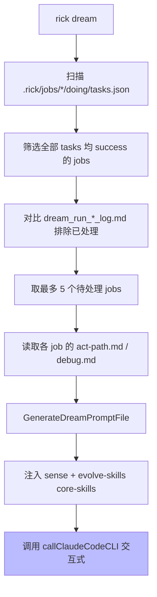

# dream 命令工作原理

## 概述

`rick dream` 是 Rick 三层控制架构中的**进化层**，在 learning 阶段积累足够 act-path 和 run_log 后，由人触发 dream 会话，让 AI 对已处理 job 进行反思、整理 wiki、精简 SPEC、进化 skills。

## 工作原理



### 自动发现机制

`rick dream` **不**依赖手工维护的 readme.md 列表，而是程序自动发现：

1. 扫描 `.rick/jobs/*/doing/tasks.json`，找到所有 tasks 均为 `"success"` 的 jobs（已完成）
2. 对比 `.rick/dream/dream_run_*_log.md` 排除已处理 jobs
3. 按 job ID 顺序取最多 5 个（可通过 `--job_num` 调整）

### dream SOP（10 步）

| 步骤 | 内容 | skill |
|------|------|-------|
| 1 | 初始化：确认待处理 job 列表 | - |
| 2 | 加载行为轨迹（debug.md / tasks.json / act-path.md） | - |
| 3 | SENSE 反思：提取优化信号 | **skill:sense** |
| 4 | 分析 debug 记录，识别跨 job 共性问题 | - |
| 5 | 整理 wiki：更新过时文档 | - |
| 6 | Skills 进化 + SPEC.md 精简（≤500 行） | **skill:evolve-skills** |
| 7 | 六维质量验证（规范一致性/无效上下文/运行仿真/路径推演/源码一致性/重构RFC） | - |
| 8 | 运行 dream_check 验证 | - |
| 9 | 写入每个 job 的 dream_run log | - |
| 10 | 输出汇总报告 | - |

### evolve-skills 决策逻辑

| 决策 | 条件 |
|------|------|
| **保留** | run_log 触发频次 ≥ 3 且出错次数 < 1/3 触发次数 |
| **升级** | 有效但描述不清晰，需要重写 |
| **淘汰** | 触发频次 = 0 或出错次数 ≥ 1/2 触发次数；新技能前 3 次豁免 |

## 如何控制/使用

1. **触发时机**: 累积 3-5 个 job 的 learning 产出后，human 触发 `rick dream`
2. **dry-run 预览**: `rick dream --dry-run` 输出完整提示词，验证 skill 注入正确性
3. **约束**: dream 只允许修改 `wiki/`、`tools/`、`SPEC.md`，**严禁修改业务代码**
4. **dream log**: 每个处理的 job 都必须生成 `.rick/dream/dream_run_{job_id}_log.md`

## 示例

```bash
# 预览 dream 提示词（验证自动发现的 pending jobs）
rick dream --dry-run

# 执行 dream 会话（交互式）
rick dream

# 自定义处理 job 数量
rick dream --job_num 3
```
