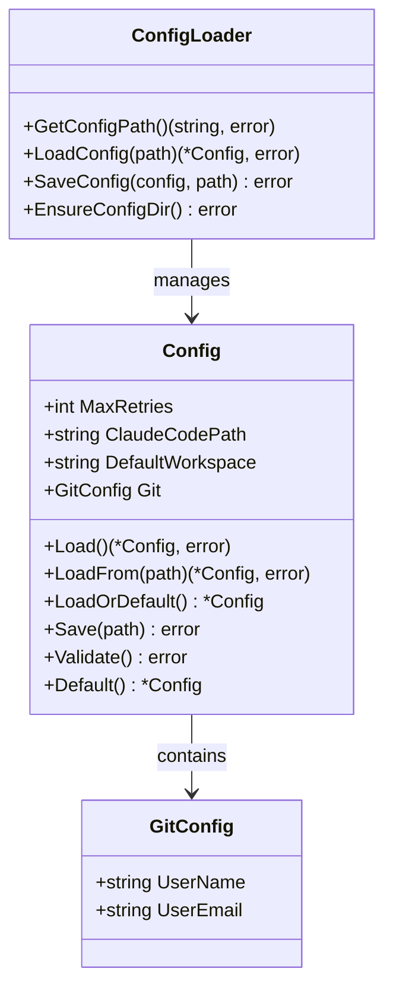

# config - 配置管理模块

## 模块职责

`config` 模块负责管理 Rick CLI 的全局配置，包括配置文件的加载、验证、默认值设置和配置项的访问。该模块提供了简单而强大的配置管理机制，支持 JSON 格式的配置文件，确保 Rick 能够根据用户的环境和偏好进行定制化运行。

**核心职责**：
- 定义配置结构和默认值
- 加载和解析配置文件（~/.rick/config.json）
- 验证配置项的有效性
- 提供配置访问接口
- 支持配置的保存和更新

## 核心类型

### Config
全局配置结构体。

```go
type Config struct {
    MaxRetries       int        `json:"max_retries"`        // 最大重试次数
    ClaudeCodePath   string     `json:"claude_code_path"`   // Claude Code CLI 路径
    DefaultWorkspace string     `json:"default_workspace"`  // 默认工作空间
    Git              GitConfig  `json:"git"`                // Git 配置
}
```

### GitConfig
Git 相关配置。

```go
type GitConfig struct {
    UserName  string `json:"user_name"`   // Git 用户名
    UserEmail string `json:"user_email"`  // Git 邮箱
}
```

## 关键函数

### Load() (*Config, error)
从默认位置加载配置文件。

**配置文件路径**：`~/.rick/config.json`

**返回**：
- `*Config`: 配置对象
- `error`: 加载失败时的错误信息

**示例**：
```go
config, err := config.Load()
if err != nil {
    log.Fatal("Failed to load config:", err)
}

fmt.Printf("Max retries: %d\n", config.MaxRetries)
```

### LoadFrom(path string) (*Config, error)
从指定路径加载配置文件。

**参数**：
- `path`: 配置文件路径

**示例**：
```go
config, err := config.LoadFrom("/custom/path/config.json")
if err != nil {
    log.Fatal(err)
}
```

### LoadOrDefault() *Config
加载配置，如果失败则返回默认配置。

**不会返回错误，保证总能获取可用配置**。

**示例**：
```go
config := config.LoadOrDefault()
// 总是返回有效配置
```

### Default() *Config
返回默认配置。

**默认值**：
```go
Config{
    MaxRetries:       5,
    ClaudeCodePath:   "claude",
    DefaultWorkspace: ".rick",
    Git: GitConfig{
        UserName:  "",
        UserEmail: "",
    },
}
```

**示例**：
```go
config := config.Default()
```

### Save(path string) error
保存配置到指定路径。

**参数**：
- `path`: 配置文件保存路径

**示例**：
```go
config := &config.Config{
    MaxRetries:     10,
    ClaudeCodePath: "/usr/local/bin/claude",
}

err := config.Save("~/.rick/config.json")
if err != nil {
    log.Fatal(err)
}
```

### Validate() error
验证配置的有效性。

**验证规则**：
- MaxRetries > 0
- ClaudeCodePath 不为空
- Git 邮箱格式正确（如果设置）

**示例**：
```go
config := &config.Config{
    MaxRetries: 0,  // 无效值
}

err := config.Validate()
if err != nil {
    fmt.Println("Invalid config:", err)
}
```

### GetConfigPath() (string, error)
获取默认配置文件路径。

**返回**：`~/.rick/config.json` 的绝对路径

**示例**：
```go
path, err := config.GetConfigPath()
if err != nil {
    log.Fatal(err)
}
fmt.Println("Config path:", path)
```

## 类图



## 使用示例

### 示例 1: 加载配置
```go
package main

import (
    "fmt"
    "log"
    "github.com/sunquan/rick/internal/config"
)

func main() {
    // 加载配置（如果不存在则使用默认值）
    cfg := config.LoadOrDefault()

    fmt.Printf("Configuration:\n")
    fmt.Printf("  Max Retries: %d\n", cfg.MaxRetries)
    fmt.Printf("  Claude Code: %s\n", cfg.ClaudeCodePath)
    fmt.Printf("  Workspace: %s\n", cfg.DefaultWorkspace)

    if cfg.Git.UserName != "" {
        fmt.Printf("  Git User: %s <%s>\n",
            cfg.Git.UserName,
            cfg.Git.UserEmail)
    }
}
```

### 示例 2: 创建和保存配置
```go
func initializeConfig() error {
    // 创建配置
    cfg := &config.Config{
        MaxRetries:       10,
        ClaudeCodePath:   "/usr/local/bin/claude",
        DefaultWorkspace: ".rick",
        Git: config.GitConfig{
            UserName:  "Rick User",
            UserEmail: "rick@example.com",
        },
    }

    // 验证配置
    if err := cfg.Validate(); err != nil {
        return fmt.Errorf("invalid config: %w", err)
    }

    // 获取配置路径
    configPath, err := config.GetConfigPath()
    if err != nil {
        return err
    }

    // 保存配置
    if err := cfg.Save(configPath); err != nil {
        return fmt.Errorf("failed to save config: %w", err)
    }

    fmt.Println("✓ Configuration saved to:", configPath)
    return nil
}
```

### 示例 3: 配置验证和错误处理
```go
func loadAndValidateConfig() (*config.Config, error) {
    // 尝试加载配置
    cfg, err := config.Load()
    if err != nil {
        // 如果加载失败，使用默认配置
        fmt.Println("Warning: Failed to load config, using defaults")
        cfg = config.Default()
    }

    // 验证配置
    if err := cfg.Validate(); err != nil {
        return nil, fmt.Errorf("invalid configuration: %w", err)
    }

    return cfg, nil
}
```

### 示例 4: 动态更新配置
```go
func updateMaxRetries(newValue int) error {
    // 加载当前配置
    cfg, err := config.Load()
    if err != nil {
        return err
    }

    // 更新值
    cfg.MaxRetries = newValue

    // 验证
    if err := cfg.Validate(); err != nil {
        return err
    }

    // 保存
    configPath, _ := config.GetConfigPath()
    return cfg.Save(configPath)
}
```

## 配置文件格式

### config.json 示例
```json
{
  "max_retries": 5,
  "claude_code_path": "claude",
  "default_workspace": ".rick",
  "git": {
    "user_name": "Rick User",
    "user_email": "rick@example.com"
  }
}
```

### 完整配置示例
```json
{
  "max_retries": 10,
  "claude_code_path": "/usr/local/bin/claude",
  "default_workspace": ".rick",
  "git": {
    "user_name": "John Doe",
    "user_email": "john@example.com"
  }
}
```

### 最小配置（使用默认值）
```json
{
  "max_retries": 5,
  "claude_code_path": "claude",
  "default_workspace": ".rick",
  "git": {}
}
```

## 配置项说明

### MaxRetries
任务失败时的最大重试次数。

**默认值**：5
**取值范围**：1-100
**用途**：控制任务执行的容错能力

### ClaudeCodePath
Claude Code CLI 的可执行文件路径。

**默认值**：`"claude"`（从 PATH 查找）
**示例**：
- `"claude"` - 从 PATH 查找
- `"/usr/local/bin/claude"` - 绝对路径
- `"~/bin/claude"` - 用户目录路径

### DefaultWorkspace
默认工作空间目录名。

**默认值**：`".rick"`
**用途**：定义项目工作空间的目录名

### Git.UserName
Git 提交时使用的用户名。

**默认值**：空（使用系统 Git 配置）
**用途**：覆盖系统 Git 用户名

### Git.UserEmail
Git 提交时使用的邮箱。

**默认值**：空（使用系统 Git 配置）
**用途**：覆盖系统 Git 邮箱

## 错误处理

### 常见错误及解决方案

1. **配置文件不存在**
   ```
   Error: config file not found
   Solution: 使用 LoadOrDefault() 或创建默认配置
   ```

2. **配置格式错误**
   ```
   Error: invalid JSON format
   Solution: 检查 JSON 语法，确保格式正确
   ```

3. **无效的配置值**
   ```
   Error: max_retries must be positive
   Solution: 设置有效的配置值（> 0）
   ```

4. **无法保存配置**
   ```
   Error: permission denied
   Solution: 检查 ~/.rick 目录的写权限
   ```

## 设计原则

1. **默认优先**：提供合理的默认值，开箱即用
2. **容错性**：配置加载失败时自动降级到默认配置
3. **验证严格**：保存前验证配置的有效性
4. **简单明了**：使用 JSON 格式，易于人工编辑
5. **向后兼容**：新增配置项不影响旧版本

## 测试覆盖

### config_test.go
```go
func TestDefault(t *testing.T)
func TestLoad(t *testing.T)
func TestLoadOrDefault(t *testing.T)
func TestSave(t *testing.T)
func TestValidate(t *testing.T)
```

### loader_test.go
```go
func TestGetConfigPath(t *testing.T)
func TestLoadConfig(t *testing.T)
func TestSaveConfig(t *testing.T)
func TestEnsureConfigDir(t *testing.T)
```

### 测试场景
- 默认配置生成
- 配置文件加载
- 无效配置验证
- 配置保存和重新加载
- 错误处理

## 扩展点

### 添加新的配置项
```go
type Config struct {
    // ... 现有字段
    LogLevel      string        `json:"log_level"`
    Timeout       time.Duration `json:"timeout"`
    EnableMetrics bool          `json:"enable_metrics"`
}

// 更新默认值
func Default() *Config {
    return &Config{
        MaxRetries:     5,
        LogLevel:       "info",
        Timeout:        time.Minute * 30,
        EnableMetrics:  false,
    }
}

// 更新验证逻辑
func (c *Config) Validate() error {
    // ... 现有验证
    validLevels := []string{"debug", "info", "warn", "error"}
    if !contains(validLevels, c.LogLevel) {
        return fmt.Errorf("invalid log level: %s", c.LogLevel)
    }
    return nil
}
```

### 支持环境变量
```go
func LoadWithEnv() (*Config, error) {
    cfg := Default()

    // 从环境变量覆盖
    if maxRetries := os.Getenv("RICK_MAX_RETRIES"); maxRetries != "" {
        if n, err := strconv.Atoi(maxRetries); err == nil {
            cfg.MaxRetries = n
        }
    }

    if claudePath := os.Getenv("RICK_CLAUDE_PATH"); claudePath != "" {
        cfg.ClaudeCodePath = claudePath
    }

    return cfg, nil
}
```

### 配置迁移
```go
type ConfigV2 struct {
    Version int    `json:"version"`
    Config  Config `json:"config"`
}

func Migrate(oldPath, newPath string) error {
    // 读取旧配置
    oldCfg, err := LoadFrom(oldPath)
    if err != nil {
        return err
    }

    // 转换为新格式
    newCfg := &ConfigV2{
        Version: 2,
        Config:  *oldCfg,
    }

    // 保存新配置
    return saveV2(newCfg, newPath)
}
```

## 与其他模块的交互

### cmd 模块
```go
// cmd 加载配置用于命令执行
cfg := config.LoadOrDefault()
executor := executor.NewExecutor(tasks, &executor.ExecutionConfig{
    MaxRetries:     cfg.MaxRetries,
    ClaudeCodePath: cfg.ClaudeCodePath,
})
```

### executor 模块
```go
// executor 使用配置中的重试次数
cfg := config.LoadOrDefault()
retryManager := executor.NewTaskRetryManager(
    runner,
    &executor.ExecutionConfig{
        MaxRetries: cfg.MaxRetries,
    },
    debugFile,
)
```

### git 模块
```go
// 使用配置中的 Git 用户信息
cfg := config.LoadOrDefault()
if cfg.Git.UserName != "" {
    // 设置 Git 用户信息
    exec.Command("git", "config", "user.name", cfg.Git.UserName).Run()
    exec.Command("git", "config", "user.email", cfg.Git.UserEmail).Run()
}
```

## 最佳实践

### 1. 初始化配置
```bash
# 创建配置文件
cat > ~/.rick/config.json <<EOF
{
  "max_retries": 5,
  "claude_code_path": "claude",
  "default_workspace": ".rick",
  "git": {
    "user_name": "Your Name",
    "user_email": "your.email@example.com"
  }
}
EOF
```

### 2. 验证配置
```bash
# 使用 Rick 验证配置
rick config validate
```

### 3. 查看当前配置
```bash
# 显示当前配置
rick config show
```

### 4. 更新配置
```bash
# 更新特定配置项
rick config set max_retries 10
```

## 配置优先级

Rick 的配置加载遵循以下优先级（从高到低）：

1. **命令行参数**：`--max-retries 10`
2. **环境变量**：`RICK_MAX_RETRIES=10`
3. **配置文件**：`~/.rick/config.json`
4. **默认值**：内置默认配置

## 安全考虑

### 敏感信息
- 不在配置文件中存储密码或 API 密钥
- 使用环境变量或密钥管理工具
- 配置文件权限设置为 0600

### 验证
- 所有配置项都经过验证
- 路径注入防护
- 值范围检查
