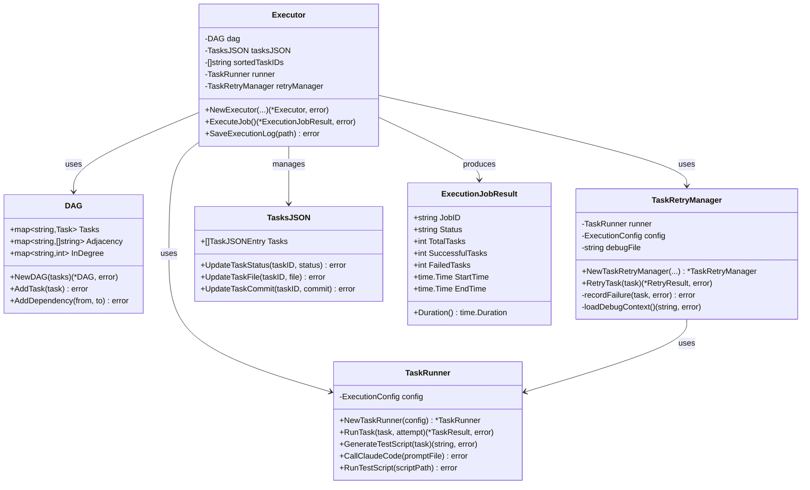
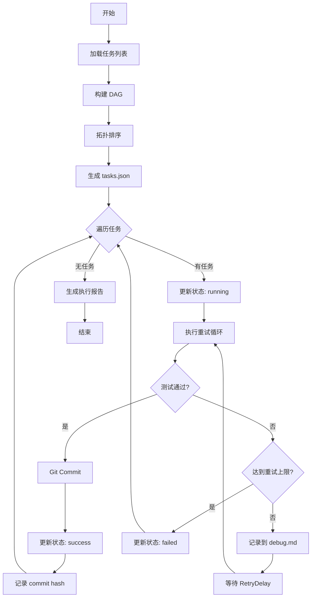

# executor - 任务执行引擎模块

## 模块职责

`executor` 模块是 Rick CLI 的核心执行引擎，负责任务的调度、执行、重试和状态管理。该模块实现了基于 DAG（有向无环图）的任务依赖管理和拓扑排序，确保任务按照正确的顺序执行，并提供了完善的失败重试机制。

**核心职责**：
- 构建任务依赖 DAG 并进行拓扑排序
- 串行执行任务，保证依赖顺序
- 实现失败重试机制（默认最多 5 次）
- 管理任务状态（pending/running/success/failed）
- 生成和维护 tasks.json 文件
- 记录执行日志和错误信息

## 核心类型

### Executor
任务执行器，管理整个 Job 的执行流程。

```go
type Executor struct {
    dag              *DAG
    tasksJSON        *TasksJSON
    sortedTaskIDs    []string
    runner           *TaskRunner
    retryManager     *TaskRetryManager
    config           *ExecutionConfig
    executionLog     []string
    jobID            string
    workspaceDir     string
    tasksJSONPath    string
}
```

### ExecutionConfig
执行配置，定义执行参数。

```go
type ExecutionConfig struct {
    MaxRetries       int           // 最大重试次数
    RetryDelay       time.Duration // 重试延迟
    ClaudeCodePath   string        // Claude Code CLI 路径
    Timeout          time.Duration // 单个任务超时时间
    EnableGitCommit  bool          // 是否自动 Git 提交
}
```

### ExecutionJobResult
Job 执行结果，包含详细的统计信息。

```go
type ExecutionJobResult struct {
    JobID              string
    Status             string // completed, failed, partial
    TotalTasks         int
    SuccessfulTasks    int
    FailedTasks        int
    StartTime          time.Time
    EndTime            time.Time
    TaskResults        []*RetryResult
    ExecutionLog       string
    ErrorSummary       string
}
```

### DAG
有向无环图，表示任务依赖关系。

```go
type DAG struct {
    Tasks       map[string]*parser.Task // taskID -> Task
    Adjacency   map[string][]string     // taskID -> []dependentTaskID
    InDegree    map[string]int          // taskID -> 入度
}
```

### TasksJSON
tasks.json 文件的内存表示。

```go
type TasksJSON struct {
    Tasks []TaskJSONEntry `json:"tasks"`
}

type TaskJSONEntry struct {
    TaskID    string                 `json:"task_id"`
    TaskName  string                 `json:"task_name"`
    Dep       []string               `json:"dep"`
    StateInfo map[string]interface{} `json:"state_info"`
}
```

## 关键函数

### NewExecutor(tasks []*parser.Task, config *ExecutionConfig, workspaceDir string, jobID string) (*Executor, error)
创建新的 Executor 实例。

**流程**：
1. 构建 DAG
2. 执行拓扑排序
3. 生成 tasks.json
4. 初始化 TaskRunner 和 RetryManager

**参数**：
- `tasks`: 任务列表
- `config`: 执行配置
- `workspaceDir`: 工作目录（.rick/jobs/job_N/doing/）
- `jobID`: Job 标识符

**示例**：
```go
tasks := []*parser.Task{...}
config := &executor.ExecutionConfig{
    MaxRetries:      5,
    RetryDelay:      time.Second * 2,
    EnableGitCommit: true,
}

exec, err := executor.NewExecutor(tasks, config, doingDir, "job_1")
if err != nil {
    log.Fatal(err)
}
```

### ExecuteJob() (*ExecutionJobResult, error)
执行整个 Job 的所有任务。

**执行流程**：
1. 保存初始 tasks.json
2. 按拓扑排序顺序执行每个任务
3. 对每个任务执行重试循环
4. 更新任务状态和 tasks.json
5. 记录 Git commit hash
6. 生成执行报告

**返回**：
- `*ExecutionJobResult`: 执行结果统计
- `error`: 致命错误（如无法保存 tasks.json）

**示例**：
```go
result, err := exec.ExecuteJob()
if err != nil {
    log.Fatal(err)
}

fmt.Printf("Status: %s\n", result.Status)
fmt.Printf("Success: %d/%d\n", result.SuccessfulTasks, result.TotalTasks)
fmt.Printf("Duration: %s\n", result.Duration())
```

### NewDAG(tasks []*parser.Task) (*DAG, error)
从任务列表构建 DAG。

**验证**：
- 检测循环依赖
- 验证依赖的任务存在

**示例**：
```go
dag, err := executor.NewDAG(tasks)
if err != nil {
    log.Fatal("Invalid task dependencies:", err)
}
```

### TopologicalSort(dag *DAG) ([]string, error)
对 DAG 进行拓扑排序，返回任务执行顺序。

**算法**：Kahn 算法
- 时间复杂度：O(V + E)
- 空间复杂度：O(V)

**示例**：
```go
sortedIDs, err := executor.TopologicalSort(dag)
if err != nil {
    log.Fatal("Cyclic dependency detected:", err)
}

fmt.Println("Execution order:", sortedIDs)
```

### GenerateTasksJSON(dag *DAG, sortedTaskIDs []string) (*TasksJSON, error)
生成 tasks.json 文件内容。

**格式**：
```json
{
  "tasks": [
    {
      "task_id": "task1",
      "task_name": "任务名称",
      "dep": [],
      "state_info": {
        "status": "pending",
        "task_file": "",
        "commit": ""
      }
    }
  ]
}
```

### SaveTasksJSON(path string, tasksJSON *TasksJSON) error
保存 tasks.json 到文件。

**示例**：
```go
err := executor.SaveTasksJSON("tasks.json", tasksJSON)
```

## 重试机制

### TaskRetryManager
管理任务的重试逻辑。

```go
type TaskRetryManager struct {
    runner      *TaskRunner
    config      *ExecutionConfig
    debugFile   string
}
```

### RetryTask(task *parser.Task) (*RetryResult, error)
执行任务并处理重试。

**重试策略**：
1. 最多重试 `MaxRetries` 次
2. 每次重试前等待 `RetryDelay`
3. 每次失败记录到 debug.md
4. 下次执行时加载 debug.md 作为上下文

**状态**：
- `success`: 任务成功
- `max_retries_exceeded`: 超过最大重试次数
- `failed`: 执行失败

**示例**：
```go
retryManager := executor.NewTaskRetryManager(runner, config, "debug.md")
result, err := retryManager.RetryTask(task)

fmt.Printf("Status: %s\n", result.Status)
fmt.Printf("Attempts: %d\n", result.TotalAttempts)
```

## 类图



## 使用示例

### 示例 1: 完整的任务执行流程
```go
package main

import (
    "fmt"
    "log"
    "time"
    "github.com/sunquan/rick/internal/executor"
    "github.com/sunquan/rick/internal/parser"
)

func main() {
    // 1. 加载任务
    tasks, err := loadTasks("plan/")
    if err != nil {
        log.Fatal(err)
    }

    // 2. 创建执行配置
    config := &executor.ExecutionConfig{
        MaxRetries:       5,
        RetryDelay:       time.Second * 2,
        ClaudeCodePath:   "/usr/local/bin/claude",
        Timeout:          time.Minute * 30,
        EnableGitCommit:  true,
    }

    // 3. 创建 Executor
    exec, err := executor.NewExecutor(
        tasks,
        config,
        "doing/",
        "job_1",
    )
    if err != nil {
        log.Fatal("Failed to create executor:", err)
    }

    // 4. 执行任务
    result, err := exec.ExecuteJob()
    if err != nil {
        log.Fatal("Execution failed:", err)
    }

    // 5. 输出结果
    fmt.Printf("Job Status: %s\n", result.Status)
    fmt.Printf("Tasks: %d/%d succeeded\n",
        result.SuccessfulTasks, result.TotalTasks)
    fmt.Printf("Duration: %s\n", result.Duration())

    // 6. 保存执行日志
    exec.SaveExecutionLog("doing/execution.log")
}
```

### 示例 2: DAG 构建和拓扑排序
```go
func buildAndSortTasks(tasks []*parser.Task) ([]string, error) {
    // 构建 DAG
    dag, err := executor.NewDAG(tasks)
    if err != nil {
        return nil, fmt.Errorf("failed to build DAG: %w", err)
    }

    // 拓扑排序
    sortedIDs, err := executor.TopologicalSort(dag)
    if err != nil {
        return nil, fmt.Errorf("cyclic dependency: %w", err)
    }

    fmt.Println("Execution order:", sortedIDs)
    return sortedIDs, nil
}
```

### 示例 3: 自定义重试策略
```go
func executeWithCustomRetry(task *parser.Task) error {
    config := &executor.ExecutionConfig{
        MaxRetries:  10,           // 增加重试次数
        RetryDelay:  time.Second * 5, // 增加重试延迟
    }

    runner := executor.NewTaskRunner(config)
    retryManager := executor.NewTaskRetryManager(
        runner,
        config,
        "debug.md",
    )

    result, err := retryManager.RetryTask(task)
    if err != nil {
        return err
    }

    if result.Status != "success" {
        return fmt.Errorf("task failed after %d attempts",
            result.TotalAttempts)
    }

    return nil
}
```

## 执行流程图



## 错误处理

### 常见错误及解决方案

1. **循环依赖**
   ```
   Error: cyclic dependency detected
   Solution: 检查 task.md 的依赖关系，移除循环
   ```

2. **依赖的任务不存在**
   ```
   Error: dependency 'task99' not found
   Solution: 确保所有依赖的任务都已定义
   ```

3. **超过最大重试次数**
   ```
   Error: max retries exceeded
   Solution: 检查 debug.md，修复问题后重新执行
   ```

4. **Claude Code 调用失败**
   ```
   Error: failed to call claude code
   Solution: 检查 ClaudeCodePath 配置是否正确
   ```

## 设计原则

1. **串行执行**：简化实现，避免并发问题
2. **失败隔离**：单个任务失败不影响其他任务
3. **可恢复性**：通过 tasks.json 记录状态，支持断点续传
4. **可观测性**：详细的日志和执行报告
5. **人工介入**：超过重试限制后需要人工修复

## 测试覆盖

### executor_test.go
```go
func TestNewExecutor(t *testing.T)
func TestExecuteJob(t *testing.T)
func TestDAGConstruction(t *testing.T)
func TestTopologicalSort(t *testing.T)
func TestCyclicDependency(t *testing.T)
```

### retry_test.go
```go
func TestRetryTask(t *testing.T)
func TestMaxRetriesExceeded(t *testing.T)
func TestDebugRecording(t *testing.T)
```

## 性能优化

### 当前实现
- 串行执行：简单可靠
- 适用场景：任务数量 < 100

### 未来优化方向
1. **并行执行**：同一层级的任务可以并行
2. **增量执行**：只执行失败的任务
3. **任务缓存**：缓存成功任务的结果

## 扩展点

### 添加并行执行
```go
func (e *Executor) ExecuteJobParallel() (*ExecutionJobResult, error) {
    // 按层级分组
    levels := e.dag.GetLevels()

    for _, level := range levels {
        // 并行执行同一层级的任务
        var wg sync.WaitGroup
        for _, taskID := range level {
            wg.Add(1)
            go func(id string) {
                defer wg.Done()
                e.executeTask(id)
            }(taskID)
        }
        wg.Wait()
    }

    return result, nil
}
```

### 自定义任务执行器
```go
type CustomRunner struct {
    // 自定义字段
}

func (cr *CustomRunner) RunTask(task *parser.Task) error {
    // 自定义执行逻辑
    return nil
}
```
