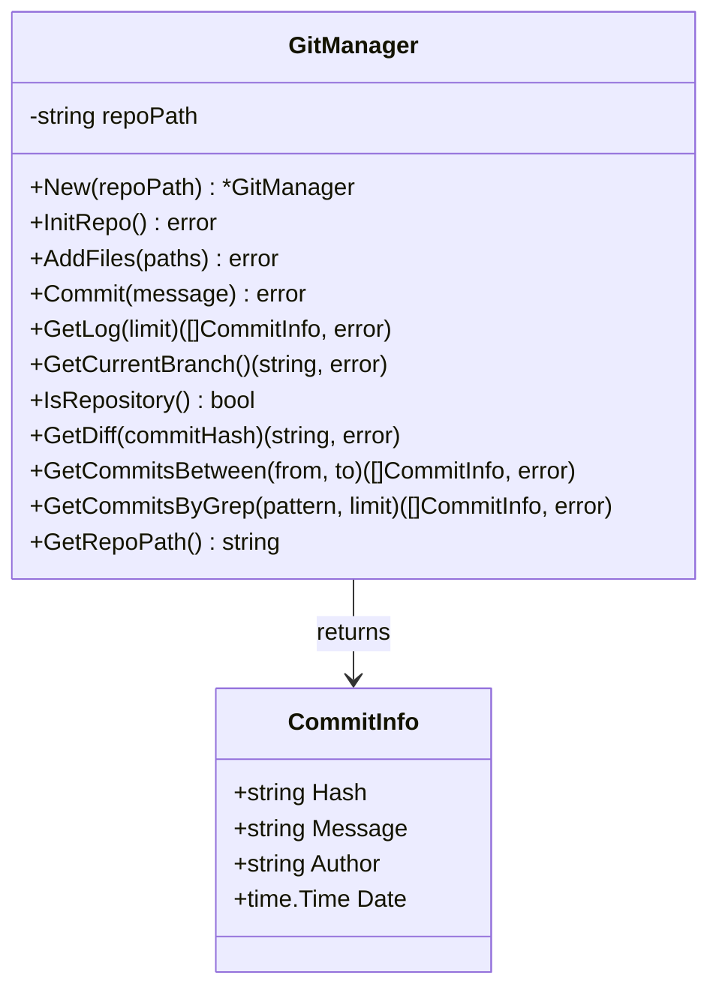

# git - Git 操作模块

## 模块职责

`git` 模块封装了 Rick CLI 所需的所有 Git 操作，提供了简洁的 API 用于仓库初始化、文件提交、历史查询等功能。该模块通过执行 Git 命令行工具来实现版本控制，确保每个成功的任务都被自动提交，形成清晰的开发历史。

**核心职责**：
- 初始化 Git 仓库
- 添加文件到暂存区
- 提交代码变更
- 查询提交历史
- 获取分支信息
- 查看差异和日志

## 核心类型

### GitManager
Git 管理器，封装所有 Git 操作。

```go
type GitManager struct {
    repoPath string  // Git 仓库路径
}
```

### CommitInfo
提交信息结构体。

```go
type CommitInfo struct {
    Hash    string    // 提交哈希
    Message string    // 提交消息
    Author  string    // 作者
    Date    time.Time // 提交时间
}
```

## 关键函数

### New(repoPath string) *GitManager
创建 GitManager 实例。

**参数**：
- `repoPath`: Git 仓库的根目录路径

**示例**：
```go
gm := git.New("/path/to/repo")
```

### InitRepo() error
初始化 Git 仓库。

**功能**：
- 创建 .git 目录
- 初始化 Git 配置
- 如果目录不存在，会自动创建

**示例**：
```go
gm := git.New("/path/to/repo")
err := gm.InitRepo()
if err != nil {
    log.Fatal("Failed to init repo:", err)
}
```

### AddFiles(paths []string) error
添加文件到 Git 暂存区。

**参数**：
- `paths`: 要添加的文件路径列表

**示例**：
```go
err := gm.AddFiles([]string{
    "internal/cmd/plan.go",
    "internal/cmd/doing.go",
})
if err != nil {
    log.Fatal("Failed to add files:", err)
}
```

### Commit(message string) error
提交暂存区的更改。

**参数**：
- `message`: 提交消息

**示例**：
```go
err := gm.Commit("feat(cmd): implement plan command")
if err != nil {
    log.Fatal("Failed to commit:", err)
}
```

### GetLog(limit int) ([]CommitInfo, error)
获取提交历史。

**参数**：
- `limit`: 返回的提交数量（≤ 0 时默认为 10）

**返回**：
- `[]CommitInfo`: 提交信息列表
- `error`: 错误信息

**示例**：
```go
commits, err := gm.GetLog(5)
if err != nil {
    log.Fatal("Failed to get log:", err)
}

for _, commit := range commits {
    fmt.Printf("%s - %s (%s)\n",
        commit.Hash[:7],
        commit.Message,
        commit.Author)
}
```

### GetCurrentBranch() (string, error)
获取当前分支名称。

**示例**：
```go
branch, err := gm.GetCurrentBranch()
if err != nil {
    log.Fatal("Failed to get branch:", err)
}
fmt.Println("Current branch:", branch)
```

### IsRepository() bool
检查路径是否是 Git 仓库。

**示例**：
```go
if gm.IsRepository() {
    fmt.Println("This is a git repository")
} else {
    fmt.Println("Not a git repository, initializing...")
    gm.InitRepo()
}
```

### GetDiff(commitHash string) (string, error)
获取指定提交的差异。

**参数**：
- `commitHash`: 提交哈希

**返回**：
- `string`: 差异内容（git show 输出）
- `error`: 错误信息

**示例**：
```go
diff, err := gm.GetDiff("abc123")
if err != nil {
    log.Fatal(err)
}
fmt.Println(diff)
```

### GetCommitsBetween(from, to string) ([]CommitInfo, error)
获取两个引用之间的提交。

**参数**：
- `from`: 起始引用（commit hash, branch, tag）
- `to`: 结束引用

**示例**：
```go
commits, err := gm.GetCommitsBetween("v1.0.0", "v1.1.0")
if err != nil {
    log.Fatal(err)
}

fmt.Printf("Commits between v1.0.0 and v1.1.0: %d\n", len(commits))
```

### GetCommitsByGrep(pattern string, limit int) ([]CommitInfo, error)
搜索提交消息中包含指定模式的提交。

**参数**：
- `pattern`: 搜索模式（支持正则表达式）
- `limit`: 最大返回数量（≤ 0 时默认为 100）

**示例**：
```go
commits, err := gm.GetCommitsByGrep("feat:", 10)
if err != nil {
    log.Fatal(err)
}

fmt.Println("Feature commits:")
for _, commit := range commits {
    fmt.Printf("- %s\n", commit.Message)
}
```

### GetRepoPath() string
获取仓库路径。

**示例**：
```go
path := gm.GetRepoPath()
fmt.Println("Repository path:", path)
```

## 类图



## 使用示例

### 示例 1: 初始化并提交
```go
package main

import (
    "fmt"
    "log"
    "github.com/sunquan/rick/internal/git"
)

func main() {
    // 创建 GitManager
    gm := git.New(".")

    // 检查是否已是 Git 仓库
    if !gm.IsRepository() {
        fmt.Println("Initializing Git repository...")
        if err := gm.InitRepo(); err != nil {
            log.Fatal(err)
        }
    }

    // 添加文件
    err := gm.AddFiles([]string{
        "README.md",
        "main.go",
    })
    if err != nil {
        log.Fatal("Failed to add files:", err)
    }

    // 提交
    err = gm.Commit("Initial commit")
    if err != nil {
        log.Fatal("Failed to commit:", err)
    }

    fmt.Println("✓ Changes committed successfully")
}
```

### 示例 2: 查看提交历史
```go
func printRecentCommits(repoPath string, count int) error {
    gm := git.New(repoPath)

    commits, err := gm.GetLog(count)
    if err != nil {
        return err
    }

    fmt.Printf("Recent %d commits:\n", len(commits))
    for i, commit := range commits {
        fmt.Printf("%d. [%s] %s\n",
            i+1,
            commit.Hash[:7],
            commit.Message)
        fmt.Printf("   Author: %s\n", commit.Author)
        fmt.Printf("   Date: %s\n\n", commit.Date.Format("2006-01-02 15:04:05"))
    }

    return nil
}
```

### 示例 3: 自动提交任务
```go
func commitTask(taskID, taskName string) error {
    gm := git.New(".")

    // 添加所有修改的文件
    err := gm.AddFiles([]string{"."})
    if err != nil {
        return fmt.Errorf("failed to add files: %w", err)
    }

    // 生成提交消息
    message := fmt.Sprintf("feat(%s): %s\n\nCo-Authored-By: Claude Code",
        taskID, taskName)

    // 提交
    err = gm.Commit(message)
    if err != nil {
        return fmt.Errorf("failed to commit: %w", err)
    }

    fmt.Printf("✓ Task %s committed\n", taskID)
    return nil
}
```

### 示例 4: 搜索特定类型的提交
```go
func findFeatureCommits(repoPath string) ([]git.CommitInfo, error) {
    gm := git.New(repoPath)

    // 搜索所有 feat: 开头的提交
    commits, err := gm.GetCommitsByGrep("^feat:", 50)
    if err != nil {
        return nil, err
    }

    fmt.Printf("Found %d feature commits\n", len(commits))
    return commits, nil
}
```

## 提交消息规范

Rick 采用 [Conventional Commits](https://www.conventionalcommits.org/) 规范：

### 格式
```
<type>(<scope>): <subject>

<body>

<footer>
```

### 类型（type）
- `feat`: 新功能
- `fix`: 修复 bug
- `docs`: 文档更新
- `refactor`: 重构
- `test`: 测试相关
- `chore`: 构建/工具相关

### 示例
```bash
feat(cmd): implement plan command

Add plan command to generate task breakdown using Claude Code.

Co-Authored-By: Claude Code
```

## 错误处理

### 常见错误及解决方案

1. **未初始化 Git 仓库**
   ```
   Error: not a git repository
   Solution: 调用 InitRepo() 初始化
   ```

2. **无文件可提交**
   ```
   Error: nothing to commit
   Solution: 确保有文件被添加到暂存区
   ```

3. **提交消息为空**
   ```
   Error: commit message cannot be empty
   Solution: 提供有效的提交消息
   ```

4. **Git 命令不可用**
   ```
   Error: git command not found
   Solution: 安装 Git 或确保 Git 在 PATH 中
   ```

## 设计原则

1. **封装性**：隐藏 Git 命令行细节，提供简洁 API
2. **错误处理**：所有操作都返回明确的错误信息
3. **类型安全**：使用 Go 类型系统确保数据正确性
4. **最小依赖**：仅依赖系统的 Git 命令
5. **可测试性**：所有函数都易于单元测试

## 测试覆盖

### git_test.go
```go
func TestNew(t *testing.T)
func TestInitRepo(t *testing.T)
func TestAddFiles(t *testing.T)
func TestCommit(t *testing.T)
func TestGetLog(t *testing.T)
func TestGetCurrentBranch(t *testing.T)
func TestIsRepository(t *testing.T)
func TestGetDiff(t *testing.T)
func TestGetCommitsBetween(t *testing.T)
func TestGetCommitsByGrep(t *testing.T)
```

### 测试策略
- 使用临时目录进行测试
- 测试后清理临时仓库
- 模拟各种错误场景
- 验证 Git 命令输出解析

## 扩展点

### 添加更多 Git 操作
```go
// 创建分支
func (gm *GitManager) CreateBranch(name string) error {
    cmd := exec.Command("git", "branch", name)
    cmd.Dir = gm.repoPath
    return cmd.Run()
}

// 切换分支
func (gm *GitManager) CheckoutBranch(name string) error {
    cmd := exec.Command("git", "checkout", name)
    cmd.Dir = gm.repoPath
    return cmd.Run()
}

// 推送到远程
func (gm *GitManager) Push(remote, branch string) error {
    cmd := exec.Command("git", "push", remote, branch)
    cmd.Dir = gm.repoPath
    return cmd.Run()
}
```

### 自定义提交格式
```go
type CommitOptions struct {
    Type       string   // feat, fix, docs, etc.
    Scope      string   // module name
    Subject    string   // short description
    Body       string   // detailed description
    CoAuthors  []string // co-authors
}

func (gm *GitManager) CommitWithOptions(opts CommitOptions) error {
    message := fmt.Sprintf("%s(%s): %s", opts.Type, opts.Scope, opts.Subject)
    if opts.Body != "" {
        message += "\n\n" + opts.Body
    }
    for _, author := range opts.CoAuthors {
        message += fmt.Sprintf("\n\nCo-Authored-By: %s", author)
    }
    return gm.Commit(message)
}
```

## 与其他模块的交互

### executor 模块
```go
// executor 在任务成功后自动提交
gm := git.New(".")
gm.AddFiles([]string{"."})
gm.Commit(fmt.Sprintf("feat(%s): %s", taskID, taskName))
```

### cmd 模块
```go
// cmd 在 doing 阶段初始化 Git
gm := git.New(".")
if !gm.IsRepository() {
    gm.InitRepo()
}
```

### learning 模块
```go
// learning 分析 Git 历史
gm := git.New(".")
commits, _ := gm.GetCommitsBetween(startCommit, endCommit)
// 分析提交记录，生成学习报告
```

## Git 工作流

### Rick 的 Git 使用模式

```
1. 首次 doing 时自动初始化 Git
   ↓
2. 每个任务成功后自动提交
   ↓
3. 提交消息包含任务信息
   ↓
4. Learning 阶段分析提交历史
   ↓
5. 形成清晰的开发历史
```

### 提交历史示例
```bash
$ git log --oneline
abc1234 feat(task7): 创建完整的 Wiki 知识库
def5678 feat(task6): 生成验证脚本并执行验证
ghi9012 feat(task5): 提取可复用技能到 Skills 库
jkl3456 feat(task4): 编写核心模块文档
mno7890 feat(task3): 创建项目架构文档
pqr1234 feat(task2): 创建 Wiki 目录结构
stu5678 feat(task1): 编写完整的 OKR 和 SPEC 文档
```

## 性能考虑

### 当前实现
- 每次操作都执行独立的 Git 命令
- 适用于中小型项目
- 简单可靠，易于调试

### 优化方向
1. **批量操作**：合并多个 Git 命令
2. **缓存**：缓存分支名称等不常变化的信息
3. **异步提交**：后台执行 Git 操作

## 安全性

### 最佳实践
1. **验证路径**：确保 repoPath 是有效的目录
2. **错误处理**：所有 Git 操作都检查错误
3. **消息清理**：提交消息中的特殊字符需要转义
4. **权限检查**：确保有写权限

### 避免的操作
- 不执行 `git reset --hard`（数据丢失风险）
- 不执行 `git push --force`（覆盖远程历史）
- 不自动删除分支或标签
