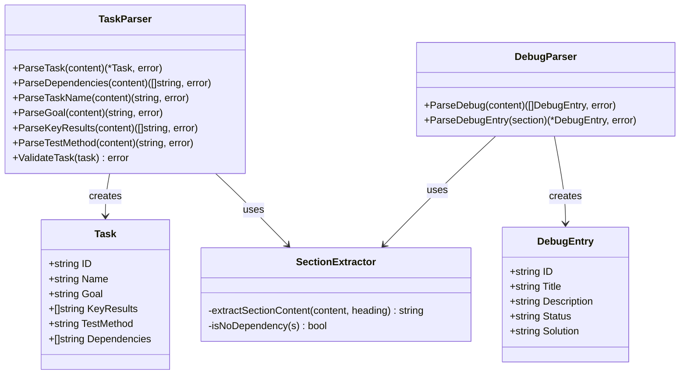

# parser - 内容解析模块

## 模块职责

`parser` 模块负责解析 Rick 工作流中的各种 Markdown 文档，包括任务定义（task.md）、调试信息（debug.md）、OKR 文档和 SPEC 文档。该模块提供了结构化的数据提取能力，将文本内容转换为 Go 结构体，供其他模块使用。

**核心职责**：
- 解析 task.md 文件，提取任务信息
- 解析 debug.md 文件，提取调试记录
- 解析 OKR 和 SPEC 文档
- 验证解析结果的完整性和正确性
- 提供统一的解析接口和错误处理

## 核心类型

### Task
表示一个任务的完整信息。

```go
type Task struct {
    ID           string   // 任务 ID（如 task1, task2）
    Name         string   // 任务名称
    Goal         string   // 任务目标
    KeyResults   []string // 关键结果列表
    TestMethod   string   // 测试方法
    Dependencies []string // 依赖的任务 ID 列表
}
```

### DebugEntry
表示一条调试记录。

```go
type DebugEntry struct {
    ID          string // debug1, debug2, ...
    Title       string // 问题标题
    Description string // 问题描述
    Status      string // 已解决/未解决
    Solution    string // 解决方法
}
```

## 关键函数

### ParseTask(content string) (*Task, error)
解析完整的 task.md 内容，返回 Task 结构体。

**参数**：
- `content`: task.md 的完整文本内容

**返回**：
- `*Task`: 解析后的任务对象
- `error`: 解析失败时的错误信息

**示例**：
```go
content, _ := os.ReadFile("task1.md")
task, err := parser.ParseTask(string(content))
if err != nil {
    log.Fatal(err)
}

fmt.Printf("Task: %s\n", task.Name)
fmt.Printf("Dependencies: %v\n", task.Dependencies)
```

### ParseDependencies(content string) ([]string, error)
从 "# 依赖关系" 章节提取依赖列表。

**支持的格式**：
- `task1, task2, task3` - 逗号分隔
- `无` / `none` / `null` / `-` - 无依赖
- 空章节 - 返回空数组

**示例**：
```go
content := `
# 依赖关系
task1, task2

# 任务名称
...
`
deps, _ := parser.ParseDependencies(content)
// deps = ["task1", "task2"]
```

### ParseTaskName(content string) (string, error)
从 "# 任务名称" 章节提取任务名称。

**示例**：
```go
name, err := parser.ParseTaskName(content)
if err != nil {
    log.Fatal("Missing task name")
}
```

### ParseGoal(content string) (string, error)
从 "# 任务目标" 章节提取任务目标描述。

**示例**：
```go
goal, _ := parser.ParseGoal(content)
fmt.Println("Goal:", goal)
```

### ParseKeyResults(content string) ([]string, error)
从 "# 关键结果" 章节提取关键结果列表。

**支持的列表格式**：
- `- 结果1` - 破折号列表
- `* 结果1` - 星号列表
- `1. 结果1` - 数字列表

**示例**：
```go
content := `
# 关键结果
1. 完成模块设计
2. 实现核心功能
3. 编写单元测试
`
results, _ := parser.ParseKeyResults(content)
// results = ["完成模块设计", "实现核心功能", "编写单元测试"]
```

### ParseTestMethod(content string) (string, error)
从 "# 测试方法" 章节提取测试方法。

**示例**：
```go
testMethod, _ := parser.ParseTestMethod(content)
fmt.Println("Test method:", testMethod)
```

### ValidateTask(task *Task) error
验证 Task 对象是否包含所有必需字段。

**验证规则**：
- Name 不能为空
- Goal 不能为空
- TestMethod 不能为空

**示例**：
```go
task := &parser.Task{
    Name: "实现功能",
    Goal: "完成核心逻辑",
    TestMethod: "运行单元测试",
}
err := parser.ValidateTask(task)
if err != nil {
    log.Fatal("Invalid task:", err)
}
```

## 类图



## 使用示例

### 示例 1: 解析任务文件
```go
package main

import (
    "fmt"
    "os"
    "github.com/sunquan/rick/internal/parser"
)

func main() {
    // 读取任务文件
    content, err := os.ReadFile(".rick/jobs/job_1/plan/task1.md")
    if err != nil {
        panic(err)
    }

    // 解析任务
    task, err := parser.ParseTask(string(content))
    if err != nil {
        panic(err)
    }

    // 验证任务
    if err := parser.ValidateTask(task); err != nil {
        panic(err)
    }

    // 输出任务信息
    fmt.Printf("Task Name: %s\n", task.Name)
    fmt.Printf("Goal: %s\n", task.Goal)
    fmt.Printf("Dependencies: %v\n", task.Dependencies)
    fmt.Printf("Key Results:\n")
    for i, kr := range task.KeyResults {
        fmt.Printf("  %d. %s\n", i+1, kr)
    }
}
```

### 示例 2: 批量解析任务
```go
func loadAllTasks(planDir string) ([]*parser.Task, error) {
    files, err := filepath.Glob(filepath.Join(planDir, "task*.md"))
    if err != nil {
        return nil, err
    }

    var tasks []*parser.Task
    for _, file := range files {
        content, err := os.ReadFile(file)
        if err != nil {
            return nil, err
        }

        task, err := parser.ParseTask(string(content))
        if err != nil {
            return nil, fmt.Errorf("failed to parse %s: %w", file, err)
        }

        // 从文件名提取 task ID
        taskID := strings.TrimSuffix(filepath.Base(file), ".md")
        task.ID = taskID

        tasks = append(tasks, task)
    }

    return tasks, nil
}
```

### 示例 3: 解析调试信息
```go
func loadDebugEntries(debugFile string) ([]parser.DebugEntry, error) {
    content, err := os.ReadFile(debugFile)
    if err != nil {
        if os.IsNotExist(err) {
            return []parser.DebugEntry{}, nil
        }
        return nil, err
    }

    entries, err := parser.ParseDebug(string(content))
    if err != nil {
        return nil, fmt.Errorf("failed to parse debug.md: %w", err)
    }

    return entries, nil
}
```

## task.md 文件格式

### 标准格式
```markdown
# 依赖关系
task1, task2

# 任务名称
实现用户认证模块

# 任务目标
设计并实现完整的用户认证系统，包括注册、登录、登出和会话管理功能。

# 关键结果
1. 完成用户模型设计（User struct）
2. 实现密码哈希和验证逻辑
3. 实现 JWT token 生成和验证
4. 编写单元测试，覆盖率 > 80%
5. 编写集成测试验证完整流程

# 测试方法
1. 运行单元测试：`go test ./internal/auth/...`
2. 运行集成测试：`go test -tags=integration ./tests/auth/...`
3. 验证 API 端点：`curl -X POST http://localhost:8080/api/auth/login`
4. 检查代码覆盖率：`go test -cover ./internal/auth/...`
```

### 无依赖的任务
```markdown
# 依赖关系
无

# 任务名称
...
```

## 错误处理

### 常见错误及解决方案

1. **缺少必需章节**
   ```
   Error: missing '# 任务名称' section
   Solution: 确保 task.md 包含所有必需章节
   ```

2. **依赖格式错误**
   ```
   Error: failed to parse dependencies
   Solution: 使用逗号分隔依赖，如 "task1, task2"
   ```

3. **验证失败**
   ```
   Error: task name is required
   Solution: 填写完整的任务信息
   ```

## 设计原则

1. **容错性**：对格式的轻微偏差具有容错能力
2. **明确性**：解析错误时提供清晰的错误信息
3. **可扩展性**：易于添加新的解析规则和字段
4. **独立性**：不依赖外部 Markdown 解析库
5. **性能**：使用简单的字符串操作，避免正则表达式

## 测试覆盖

### task_test.go
```go
func TestParseTask(t *testing.T)
func TestParseDependencies(t *testing.T)
func TestParseTaskName(t *testing.T)
func TestParseGoal(t *testing.T)
func TestParseKeyResults(t *testing.T)
func TestParseTestMethod(t *testing.T)
func TestValidateTask(t *testing.T)
```

### 测试场景
- 标准格式解析
- 无依赖任务
- 不同列表格式（-, *, 数字）
- 缺少章节的错误处理
- 空内容处理
- 多行内容解析

## 扩展点

### 添加新的任务字段
```go
type Task struct {
    // ... 现有字段
    Priority    string   // 优先级
    Assignee    string   // 负责人
    Deadline    string   // 截止日期
}

func ParsePriority(content string) (string, error) {
    return extractSectionContent(content, "# 优先级"), nil
}
```

### 支持自定义章节
```go
func ParseCustomSection(content, sectionName string) (string, error) {
    heading := fmt.Sprintf("# %s", sectionName)
    result := extractSectionContent(content, heading)
    if result == "" {
        return "", fmt.Errorf("section '%s' not found", sectionName)
    }
    return result, nil
}
```

## 与其他模块的交互

### executor 模块
```go
// executor 使用 parser 加载任务
tasks, err := loadAllTasks(planDir)
for _, task := range tasks {
    if err := parser.ValidateTask(task); err != nil {
        return err
    }
}
```

### cmd 模块
```go
// cmd 使用 parser 验证任务格式
content, _ := os.ReadFile(taskFile)
task, err := parser.ParseTask(string(content))
if err != nil {
    return fmt.Errorf("invalid task file: %w", err)
}
```

### prompt 模块
```go
// prompt 使用 parser 提取任务信息用于生成提示词
task, _ := parser.ParseTask(content)
builder.SetVariable("task_name", task.Name)
builder.SetVariable("task_goal", task.Goal)
```
