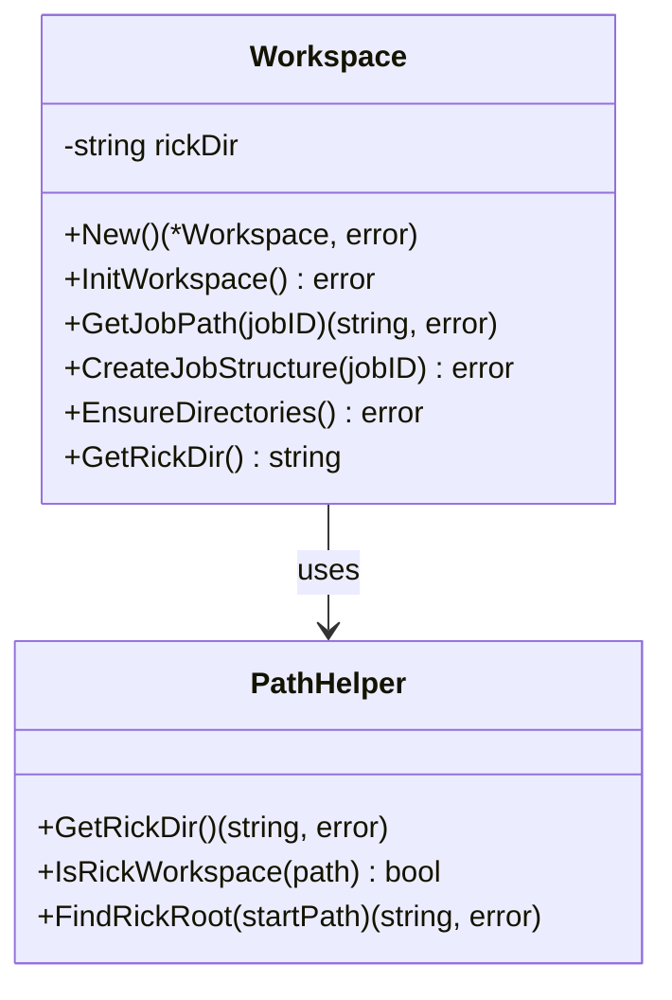

# workspace - 工作空间管理模块

## 模块职责

`workspace` 模块负责管理 Rick CLI 的工作空间目录结构，包括 `.rick` 目录的创建、Job 目录的组织、以及各种路径的计算和验证。该模块是 Rick 文件系统操作的核心，确保所有文件和目录都按照规范的结构组织。

**核心职责**：
- 创建和管理 `.rick` 工作空间目录
- 管理 Job 的目录结构（plan/doing/learning）
- 提供路径计算和验证功能
- 确保目录结构的一致性和完整性

## 核心类型

### Workspace
工作空间管理器，封装所有工作空间操作。

```go
type Workspace struct {
    rickDir string  // .rick 目录的绝对路径
}
```

## 关键函数

### New() (*Workspace, error)
创建新的 Workspace 实例，自动确保工作空间目录存在。

**返回**：
- `*Workspace`: 工作空间管理器实例
- `error`: 创建失败时的错误信息

**示例**：
```go
ws, err := workspace.New()
if err != nil {
    log.Fatal(err)
}
```

### InitWorkspace() error
初始化 `.rick` 目录结构，创建所有必要的子目录和文件。

**创建的目录**：
- `.rick/`
- `.rick/wiki/`
- `.rick/skills/`
- `.rick/jobs/`

**创建的文件**：
- `.rick/OKR.md`: 项目目标和关键结果
- `.rick/SPEC.md`: 项目技术规范

**示例**：
```go
ws, _ := workspace.New()
err := ws.InitWorkspace()
if err != nil {
    log.Fatal("Failed to init workspace:", err)
}
```

### GetJobPath(jobID string) (string, error)
获取指定 Job 的目录路径。

**参数**：
- `jobID`: Job 标识符（如 "job_1"）

**返回**：
- `string`: Job 目录的绝对路径
- `error`: jobID 为空时返回错误

**示例**：
```go
jobPath, err := ws.GetJobPath("job_1")
// jobPath = "/path/to/project/.rick/jobs/job_1"
```

### CreateJobStructure(jobID string) error
为指定 Job 创建完整的目录结构。

**创建的目录**：
- `.rick/jobs/job_N/`
- `.rick/jobs/job_N/plan/`
- `.rick/jobs/job_N/doing/`
- `.rick/jobs/job_N/learning/`

**参数**：
- `jobID`: Job 标识符

**示例**：
```go
err := ws.CreateJobStructure("job_1")
if err != nil {
    log.Fatal("Failed to create job structure:", err)
}
```

### EnsureDirectories() error
确保所有必要的工作空间目录存在，如果不存在则创建。

**保证存在的目录**：
- `.rick/`
- `.rick/wiki/`
- `.rick/skills/`
- `.rick/jobs/`

**示例**：
```go
err := ws.EnsureDirectories()
```

### GetRickDir() string
获取 `.rick` 目录的绝对路径。

**返回**：
- `string`: .rick 目录路径

**示例**：
```go
rickDir := ws.GetRickDir()
fmt.Println("Rick directory:", rickDir)
```

## 路径常量

模块定义了一组路径常量，确保目录命名的一致性：

```go
const (
    RickDirName     = ".rick"
    WikiDirName     = "wiki"
    SkillsDirName   = "skills"
    JobsDirName     = "jobs"
    PlanDirName     = "plan"
    DoingDirName    = "doing"
    LearningDirName = "learning"
    OKRFileName     = "OKR.md"
    SpecFileName    = "SPEC.md"
)
```

## 类图



## 使用示例

### 示例 1: 初始化工作空间
```go
package main

import (
    "log"
    "github.com/sunquan/rick/internal/workspace"
)

func main() {
    // 创建工作空间管理器
    ws, err := workspace.New()
    if err != nil {
        log.Fatal(err)
    }

    // 初始化工作空间
    err = ws.InitWorkspace()
    if err != nil {
        log.Fatal(err)
    }

    fmt.Println("Workspace initialized at:", ws.GetRickDir())
}
```

### 示例 2: 创建 Job 结构
```go
func createNewJob(jobID string) error {
    ws, err := workspace.New()
    if err != nil {
        return err
    }

    // 创建 Job 目录结构
    if err := ws.CreateJobStructure(jobID); err != nil {
        return fmt.Errorf("failed to create job: %w", err)
    }

    // 获取 Job 路径
    jobPath, _ := ws.GetJobPath(jobID)
    fmt.Printf("Job created at: %s\n", jobPath)

    return nil
}
```

### 示例 3: 路径计算
```go
func getPlanDir(jobID string) (string, error) {
    ws, err := workspace.New()
    if err != nil {
        return "", err
    }

    jobPath, err := ws.GetJobPath(jobID)
    if err != nil {
        return "", err
    }

    planDir := filepath.Join(jobPath, workspace.PlanDirName)
    return planDir, nil
}
```

## 目录结构规范

### 完整的 .rick 目录结构
```
.rick/
├── OKR.md                          # 项目目标
├── SPEC.md                         # 技术规范
├── wiki/                           # 知识库
│   ├── README.md
│   ├── architecture.md
│   └── modules/
│       ├── cmd.md
│       ├── workspace.md
│       └── ...
├── skills/                         # 技能库
│   ├── index.md
│   └── skill-name/
│       ├── description.md
│       ├── implementation.md
│       └── examples/
└── jobs/                           # 任务目录
    ├── job_0/
    │   ├── plan/
    │   │   ├── task1.md
    │   │   ├── task2.md
    │   │   └── ...
    │   ├── doing/
    │   │   ├── tasks.json
    │   │   ├── debug.md
    │   │   └── execution.log
    │   └── learning/
    │       ├── analysis.md
    │       ├── summary.md
    │       └── validation_report.md
    └── job_1/
        └── ...
```

## 错误处理

### 常见错误及解决方案

1. **无法创建目录**
   ```
   Error: failed to create directory: permission denied
   Solution: 检查当前目录的写权限
   ```

2. **Job ID 为空**
   ```
   Error: jobID cannot be empty
   Solution: 提供有效的 Job ID
   ```

3. **目录已存在**
   - 模块使用 `os.MkdirAll`，已存在的目录不会报错
   - 确保幂等性，可以安全地重复调用

## 设计原则

1. **自动初始化**：首次使用时自动创建必要的目录结构
2. **幂等性**：所有操作都是幂等的，可以安全地重复执行
3. **路径封装**：所有路径计算都通过模块函数，避免硬编码
4. **错误清晰**：提供明确的错误信息，便于调试
5. **最小依赖**：仅依赖 Go 标准库（os, path/filepath）

## 测试覆盖

### workspace_test.go
```go
func TestNew(t *testing.T)
func TestInitWorkspace(t *testing.T)
func TestCreateJobStructure(t *testing.T)
func TestGetJobPath(t *testing.T)
func TestEnsureDirectories(t *testing.T)
```

### 测试场景
- 新建工作空间
- 重复初始化（幂等性）
- 创建多个 Job
- 路径计算正确性
- 错误情况处理

## 扩展点

### 添加新的工作空间目录
```go
const TemplateDirName = "templates"

func (w *Workspace) CreateTemplateDir() error {
    templateDir := filepath.Join(w.rickDir, TemplateDirName)
    return os.MkdirAll(templateDir, 0755)
}
```

### 自定义 Job 结构
```go
func (w *Workspace) CreateCustomJobStructure(jobID string, dirs []string) error {
    jobPath, err := w.GetJobPath(jobID)
    if err != nil {
        return err
    }

    for _, dir := range dirs {
        fullPath := filepath.Join(jobPath, dir)
        if err := os.MkdirAll(fullPath, 0755); err != nil {
            return err
        }
    }
    return nil
}
```

## 与其他模块的交互

### cmd 模块
```go
// cmd 模块使用 workspace 创建 Job 结构
ws, _ := workspace.New()
ws.CreateJobStructure(jobID)
```

### executor 模块
```go
// executor 模块使用 workspace 定位任务文件
ws, _ := workspace.New()
jobPath, _ := ws.GetJobPath(jobID)
tasksDir := filepath.Join(jobPath, workspace.DoingDirName)
```

### parser 模块
```go
// parser 模块使用 workspace 读取任务文件
ws, _ := workspace.New()
jobPath, _ := ws.GetJobPath(jobID)
planDir := filepath.Join(jobPath, workspace.PlanDirName)
```
