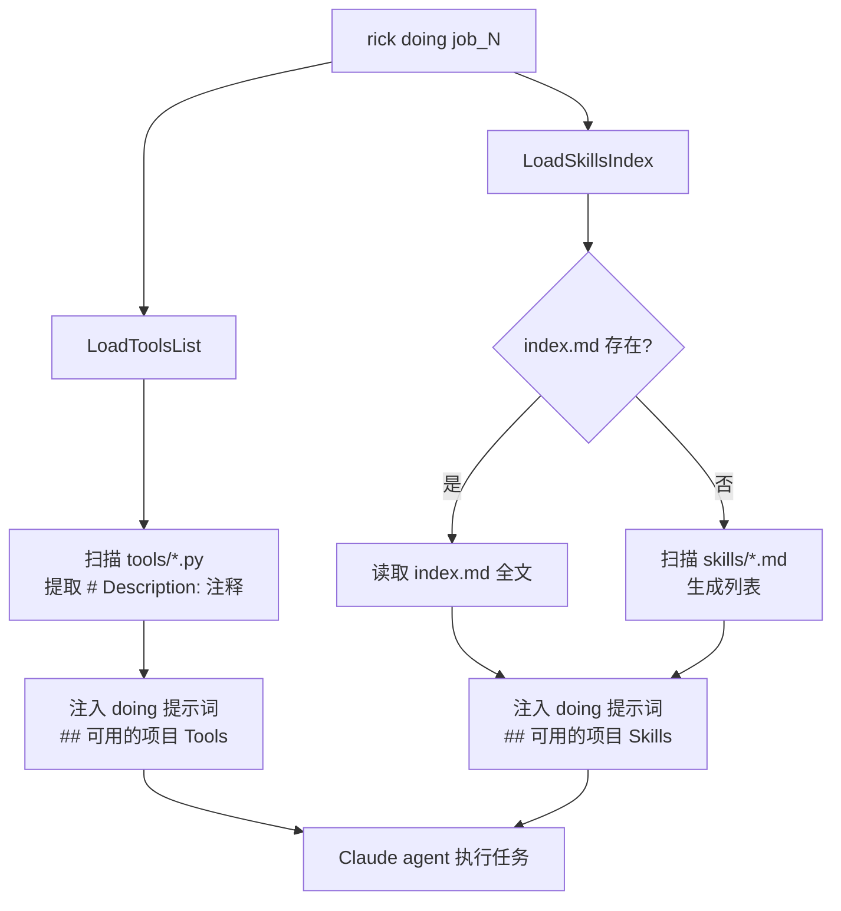

# Skills/Tools 分离机制

## 概述

Rick 将可复用知识分为两类：**Tools**（确定性工具脚本）和 **Skills**（组合技能说明书）。两者存放在不同目录，服务于不同目的，共同注入 doing 提示词，为 AI agent 提供完整的执行能力。

## 工作原理

### 目录结构

```
<projectRoot>/
  tools/          ← 确定性工具脚本（.py）
    build_and_get_rick_bin.py
    check_go_build.py
    ...

.rick/
  skills/         ← 组合技能说明书（.md）
    index.md      ← 技能主索引（触发场景 + 说明）
    verify_rick_check_commands.md
    test_go_project_changes.md
    ...
```

### 注入流程



### Tools 工作方式

- **扫描路径**: `{projectRoot}/tools/*.py`
- **提取信息**: 读取每个 `.py` 文件首行 `# Description:` 注释
- **注入格式**: 工具名称 + 描述，AI 可直接调用 `python3 tools/xxx.py`
- **实现文件**: `internal/workspace/tools.go` → `LoadToolsList()`

### Skills 工作方式

- **扫描路径**: `.rick/skills/`
- **优先读取**: `index.md`（如存在），包含触发场景描述
- **注入格式**: 完整 index.md 内容，AI 能理解"何时"使用哪个 skill
- **实现文件**: `internal/workspace/skills.go` → `LoadSkillsIndex()`

## 如何控制/使用

### 添加新工具（Tool）

1. 在 `tools/` 目录创建 `.py` 文件
2. 文件首行必须是 `# Description: 一句话描述`
3. 输出格式：`{"pass": bool, "errors": [...]}` 的 JSON
4. 无需修改任何配置，下次 doing 自动注入

### 添加新技能（Skill）

1. 在 `.rick/skills/` 创建 `.md` 文件
2. 包含三个必须 section：触发场景、使用的 Tools、执行步骤
3. 更新 `index.md`，格式：`| Skill | 描述 | 触发场景 |` 三列表格
4. 无需修改任何配置，下次 doing 自动注入

### 验证注入效果

```bash
rick doing job_N --dry-run | grep -A 30 "可用的项目 Tools\|可用的项目 Skills"
```

## 示例

### Tool 示例（`tools/check_go_build.py`）

```python
# Description: 验证 Go 项目是否能成功编译

import json, subprocess, sys

result = subprocess.run(["go", "build", "./..."], capture_output=True, text=True)
output = {"pass": result.returncode == 0, "errors": [result.stderr] if result.returncode != 0 else []}
print(json.dumps(output))
```

### Skill 示例（`.rick/skills/test_go_project_changes.md`）

```markdown
# test_go_project_changes

## 触发场景
当需要验证 Go 代码变更不引入编译错误或测试失败时

## 使用的 Tools
- `tools/check_go_build.py` — 验证编译
- `tools/check_prompt_variables.py` — 验证模板变量

## 执行步骤
1. 运行 `python3 tools/check_go_build.py`
2. 运行 `go test ./...`
3. 检查输出无 FAIL
```

## 常见误区

| 误区 | 正确做法 |
|------|---------|
| 在 `.rick/skills/` 放 `.py` 脚本 | `.py` 必须放 `tools/`，`.rick/skills/` 只放 `.md` |
| 在 `tools/` 放 `.md` 说明文档 | 说明文档放 `.rick/skills/`，`tools/` 只放 `.py` |
| 省略 `# Description:` 注释 | 必须有，否则 tools 注入时无描述 |
| index.md 触发场景列为空 | 触发场景是 AI 判断"何时"使用 skill 的依据，必须填写 |
