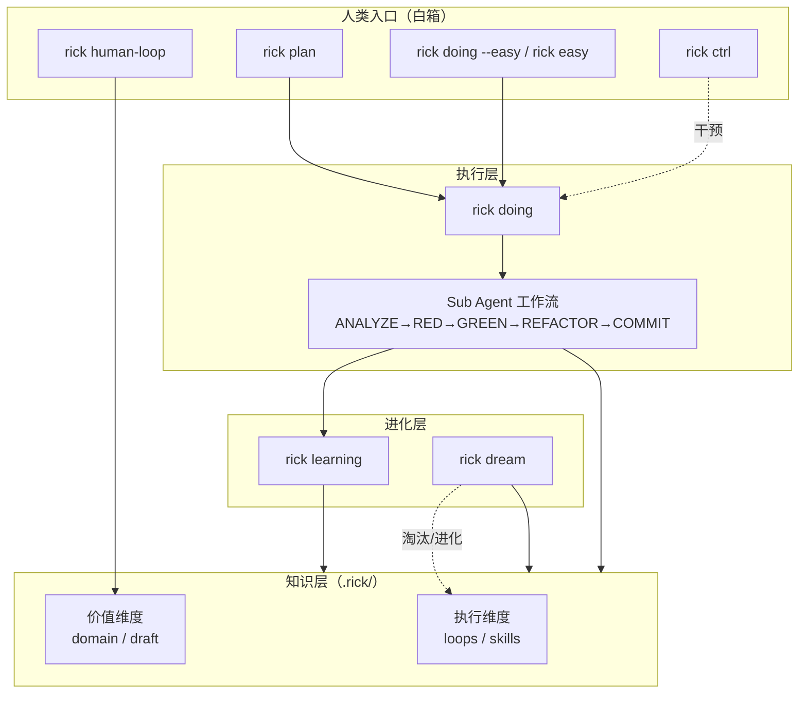
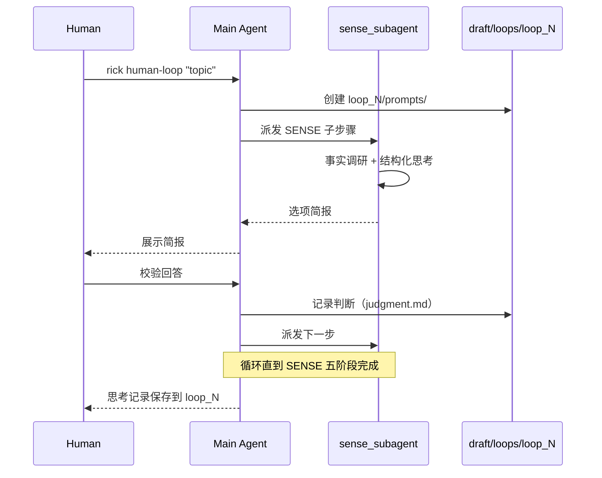

# Rick CLI

> 对抗上下文熵增的 AI Coding 控制框架



---

## 设计哲学

随着项目迭代，软件复杂性逐渐升高，这种复杂性表现为上下文的熵增——AI agent 在执行过程中积累的信息散落在对话历史、临时文件、个人记忆中，无法被结构化复用，导致后续的 AI coding 越跑越乱、越跑越不准。Rick 的核心公式是 `AICoding = Humans + Agents`，其中 `Agents = Models + Harness`，Harness 即上下文。一切设计都围绕上下文的生命周期展开：如何采集、如何压缩、如何复用、如何让它随项目演化保持整洁。

Rick 将上下文分为两个维度。**执行维度**承载"怎么做"的操作性知识：`loops` 是带验收标准的可复用工作流（如 TDD 的红绿重构循环），`skills` 是触发条件明确的原子能力（如"修改 Go 源文件后必须验证编译通过"）。**价值维度**承载"是什么"的描述性知识：`domain` 是代码事实的客观描述（命令规范、架构、编码约定），可被代码验证；`draft` 是个人判断信息的载体（human-loop 思考记录、RFC、未固化的概念探索），不可被代码直接验证。两者的边界清晰：当 `draft` 中的判断被代码事实验证并固化后，可迁移到 `domain`；`domain` 中过时部分由 `dream` 周期性清理。

在这个视角下，命令体系是作用于知识体系的控制手段。`doing` 与 `easy` 是熵增的源头（执行过程产生上下文），`learning` 是增强回路（把单次 job 的经验提取为 loops/skills，让下次更准），`dream` 是调节回路（跨 job 反思、淘汰失效 loops/skills、维持 `domain` 简洁），`human-loop` 是人类介入深度思考的入口（产出 `draft`），`ctrl` 是黑箱执行的可挂测性设计（人类对 doing 进行干预）。主要矛盾是"上下文熵增"与"AI coding 准确性"之间的势能差，Rick 通过 learning 的增强回路和 dream 的调节回路共同对抗这一熵增，让后续的 AI agent 越跑越准。

---

## 双维度知识体系

| 维度 | 载体 | 性质 | 来源 |
|------|------|------|------|
| 执行 | `loops/` | 可复用工作流（带验收标准的迭代控制流） | dream 提炼 |
| 执行 | `skills/` | 原子能力（触发条件 → 执行步骤） | dream / learning 提炼 |
| 价值 | `domain/` | 事实信息（代码/规范/架构的客观描述） | 人类维护 + learning 补充 |
| 价值 | `draft/` | 个人判断（human-loop 思考记录、RFC） | human-loop 产出 |

**domain 与 draft 的边界**：`domain` 可被代码验证；`draft` 是人类主观判断。判断一旦被代码事实固化，可迁移到 `domain`；`domain` 中过时部分由 `dream` 清理。

---

## 快速开始

### 安装

```bash
./scripts/install.sh
```

### Easy 模式（白箱，人类把控）

适合探索性任务、快速修复、对话式开发。人类全程参与，agent 透明执行。

```bash
# 新建 easy 会话（交互式）
rick doing --easy "帮我修复登录 bug"
rick doing --easy          # 不带需求，进入后输入

# 等价简写（doing 的子模块）
rick easy -r "帮我修复登录 bug"

# 恢复中断的 easy 会话
rick doing --easy --job job_5
rick easy --resume job_5
```

**工作流**：
1. 人类提出需求 → 进入交互式 pi 会话
2. Agent 执行，每个问题自动记录到 `doing/debug/`
3. 退出后人类显式触发 `rick learning job_N`（不自动触发）

### Doing 模式（黑箱，agent 自主）

适合有明确任务分解的需求。Plan 阶段分解为 task 列表，Doing 阶段 agent 逐任务自主执行。

```bash
# 1. 规划：AI 将需求分解为 task 列表
rick plan "为用户系统添加 JWT 认证"

# 2. 执行：自动逐任务执行，每个任务通过测试后自动 git commit
rick doing job_1

# 3. 积累：提取经验，更新 loops/skills/domain
rick learning job_1

# 4. 全局反思：跨 job 知识进化
rick dream
```

**工作流**：
1. `rick plan` 生成 `plan/task*.md` + `tasks.json`
2. `rick doing` 逐任务执行 Sub Agent 工作流（ANALYZE → RED → GREEN → REFACTOR → COMMIT），每轮 task 通过测试后自动 commit
3. `rick tools doing_check` 校验执行结果
4. `rick learning` 提取经验写入 loops/skills/domain
5. 定期 `rick dream` 跨 job 反思，进化知识体系

---

## 命令体系

### rick plan

**职责**：将需求分解为 task 列表，生成 plan 目录。

**用法**：
```bash
rick plan [requirement]
rick plan --job job_5 [requirement]   # 复用已有 job 的 plan 目录
```

**关键 flags**：

| flag | 默认 | 说明 |
|------|------|------|
| `--job <id>` | 空 | 复用已有 job 目录，跳过 NextJobID() |
| `--dry-run` | false | 输出完整 plan prompt 到 stdout，不调用 pi |

**示例**：
```bash
rick plan "添加用户注册功能"
rick plan --job job_3 "追加导出功能"
```

**产出**：
- `.rick/jobs/job_N/plan/task*.md`
- `.rick/jobs/job_N/plan/OKR.md`
- `.rick/jobs/job_N/doing/tasks.json`

---

### rick doing

**职责**：执行 job 中的 task，支持重试和自动 commit。

**用法**：
```bash
rick doing [job_id]
rick doing --easy [requirement]   # 进入 easy 模式
rick doing --job job_5            # 等价于 rick doing job_5
```

**关键 flags**：

| flag | 默认 | 说明 |
|------|------|------|
| `--job <id>` | 空 | 指定 job ID |
| `--easy` | false | 进入 easy 模式（见下方 rick easy） |
| `--ctx <path>` | 空 | 从指定 `.rick` 目录继承上下文（easy 模式专用） |
| `--dry-run` | false | 输出完整 doing prompt 到 stdout，不调用 pi |

**示例**：
```bash
rick doing job_1
rick doing --easy "修复 Redis 连接池泄漏"
```

**产出**：
- `.rick/jobs/job_N/doing/debug/bug*.md`（问题记录）
- `.rick/jobs/job_N/doing/act-path.md`（行为轨迹）
- `.rick/jobs/job_N/doing/tasks.json`（任务状态更新）
- 自动 git commit（每个 task 完成后）

---

### rick easy

**职责**：交互式 AI coding 会话，跳过 plan 阶段。

**与 doing 的关系**：`rick easy` 是 `rick doing --easy` 的子模块。两者共用同一套 easy 函数（`runEasyMode` / `resumeEasyMode`），`rick easy` 提供更直接的入口，`rick doing --easy` 保留向后兼容。

**用法**：
```bash
rick easy -r "需求"
rick easy                    # 进入后输入需求
rick easy --resume job_5     # 恢复会话
```

**关键 flags**：

| flag | 默认 | 说明 |
|------|------|------|
| `-r, --requirement <text>` | 空 | 会话需求 |
| `--ctx <path>` | 空 | 从指定 `.rick` 目录继承上下文 |
| `--resume <job_id>` | 空 | 恢复已存在的 easy 会话 |
| `--dry-run` | false | 输出完整 easy prompt 到 stdout，不调用 pi |

**示例**：
```bash
rick easy -r "修复线上 500 错误"
rick easy --resume job_3
```

**产出**：
- `.rick/jobs/job_N/doing/requirement.md`
- `.rick/jobs/job_N/doing/session_id`（pi 会话 UUID）
- `.rick/jobs/job_N/doing/prompts/`（持久化的 prompt 文件）
- `.rick/jobs/job_N/doing/tasks.json`（合成 `easy_session` 任务，供 dream 发现）

---

### rick learning

**职责**：分析执行结果，提取经验，更新 loops/skills/domain。

**用法**：
```bash
rick learning [job_id]
rick learning --job job_5
```

**关键 flags**：

| flag | 默认 | 说明 |
|------|------|------|
| `--job <id>` | 空 | 指定 job ID |
| `--dry-run` | false | 输出完整 learning prompt 到 stdout，不调用 pi |

**示例**：
```bash
rick learning job_1
```

**产出**：
- `.rick/jobs/job_N/doing/SUMMARY.md`
- `.rick/loops/` 新增或更新 loop
- `.rick/skills/` 新增或更新 skill
- `.rick/domain/` 补充事实信息

---

### rick dream

**职责**：跨 job 全局反思，进化知识体系。自我进化机制。

**用法**：
```bash
rick dream                # 交互式
rick dream -p             # 后台自动模式
rick dream --job_num 3    # 每次处理 3 个 job
```

**关键 flags**：

| flag | 默认 | 说明 |
|------|------|------|
| `--job_num <n>` | 5 | 每次处理的 job 数量 |
| `-p, --background` | false | 后台模式（非交互，skip-permissions） |
| `--dry-run` | false | 输出完整 dream prompt 到 stdout，不调用 pi |

**示例**：
```bash
rick dream -p
```

**产出**：
- `.rick/dream/dream_run_{job_id}_log.md`
- `.rick/loops/deprecated/`（淘汰连续 3 次未触发的 loop）
- `.rick/skills/deprecated/`（淘汰连续 3 次未引用的 skill）
- 精简 `domain/` 内容

**Dream 是 learning 的兜底**：即使 learning 写出了问题，dream 也会在后续修复，无需追求 learning 的完美一致性。

---

### rick ctrl

**职责**：黑箱执行的可挂测性设计。人类对正在执行的 doing 进行干预。

**用法**：
```bash
rick ctrl --job job_5
```

**关键 flags**：

| flag | 默认 | 说明 |
|------|------|------|
| `--job <id>` | （必传） | 指定 job ID |
| `--dry-run` | false | 输出完整 ctrl prompt 到 stdout，不调用 pi |

**四种干预场景**：

| 场景 | 操作 |
|------|------|
| A：追加指令 | 在 `plan/task<N>.md` 末尾追加 `## 干预指令 (Intervention)` 章节 |
| B：重置 task | 将 status 改为 `pending`，清空 error 字段 |
| C：查看轨迹 | 读取 `doing/act-path.md` |
| D：查看原始日志 | 读取 `doing/raw_session_coding.log` |

**变更约束**：只能修改 `doing/` 和 `plan/` 下的文件。若目标 task 正在运行（`running`），重置无效，需先 Ctrl+C 停止 doing。

---

### rick human-loop

**职责**：用 SENSE 方法论引导深度思考，产出存入 `.rick/draft/`。详见下方 [human-loop 设计](#human-loop-设计)。

**用法**：
```bash
rick human-loop "如何降低 doing 重试率"
```

**关键 flags**：

| flag | 默认 | 说明 |
|------|------|------|
| `<topic>` | （必传） | 思考主题 |
| `--dry-run` | false | 输出完整 human-loop prompt 到 stdout，不调用 pi |

### rick tools init-pi

**职责**：初始化 pi（rick 的 agent runtime）+ subagent 扩展。幂等——检查后跳过已就绪项，缺什么补什么。`install.sh` 安装完 rick 后会自动调一次；也可单独跑。

**用法**：
```bash
rick tools init-pi
```

**做了什么**：
1. 检查 `pi` 是否在 PATH；不在则跑官方安装器 `curl -fsSL https://pi.dev/install.sh | sh`
2. 检查 `pi-subagents` 扩展是否已注册（`pi list`）；未注册则 `pi install npm:pi-subagents`（提供 `subagent` 工具：单/并行/链式派发独立上下文子 agent）
3. 检查 `pi-web-access` 扩展是否已注册；未注册则 `pi install npm:pi-web-access`（提供 `web_search`/`web_fetch` 工具，外部搜索/抓取网页）
4. 检查 Tokyo Night 主题包是否已注册；未装则 `pi install npm:@wishx127/pi-tokyo-night`（包总会装上，便于 `/settings` 切换）。激活策略：**仅当本次 init-pi 新装了 pi 时**才写入 `theme: tokyo-night-dark`；若 pi 已存在（用户早就装好），默认用户有自己的主题偏好，**不动 settings.json**（Tokyo Night 配色 + Powerline 状态栏，TUI 更美观；纯美化，可选）
5. 最终验证：跑 `pi list` 确认所有必需扩展都真注册成功 + 主题字段已设置（捕获"装了但没生效"的假象）
6. 汇总就绪状态。pi 完全装不上才返回非零；扩展/主题缺失只 warn（rick 仍可用，仅对应功能不可用）

---

## human-loop 设计

### 定位

`rick human-loop` 是人类介入深度思考的入口，用 SENSE 方法论引导对复杂问题进行结构化分析，产出存入 `.rick/draft/`（价值维度的个人判断载体）。与 `rick doing` 互补：human-loop 是"想清楚"（白箱，人类主导），doing 是"做出来"（黑箱，agent 主导）。

### SENSE 方法论

五个阶段，每个阶段三个核心动作：

| 阶段 | 动作 | 焦点 |
|------|------|------|
| **S** — Subject（问题） | 还原 / 分解 / 追问 | 现状、期望、差距；事实追问与价值追问 |
| **E** — pErspective（视角） | 综合 / 解释 / 验证 | 概念地图、候选视角、融贯性检验 |
| **N** — judgmeNt（判断） | 循环 / 分析 / 选择 | 系统循环图、主要矛盾、排除-选择法 |
| **S** — reverSe（逆转） | 阻碍 / 逆转 / 路径 | 辩证逆转，跳出原系统层次 |
| **E** — critiquE（批判） | 论证 / 良质 / 跃迁 | 逻辑有效性、内在动力、系统层次跃迁 |

后两个阶段（reverSe / critiquE）仅在判断阶段找不到有效控制手段或卡壳时使用。

### 调用图



### 目录结构

```
.rick/draft/loops/loop_N/
├── prompts/
│   ├── human_loop.md          # 主 prompt
│   ├── sense_subagent.md      # sense 子 agent prompt
│   └── skill_sense.md         # SENSE skill 定义
└── briefs/                    # 每轮子 agent 产出简报
```

主 Agent 控制推进节奏：派发子任务 → 展示简报 → 校验人类回答 → 记录判断 → 派发下一步。

### 与 doing 对比

| 维度 | rick human-loop | rick doing |
|------|----------------|------------|
| 模式 | 白箱，人类主导 | 黑箱，agent 主导 |
| 目标 | 想清楚（产出判断） | 做出来（产出代码） |
| 产出位置 | `.rick/draft/` | `.rick/jobs/job_N/doing/` |
| 价值维度 | 个人判断 | 执行过程 |
| 介入方式 | 每步校验 | 完成后 check |

---

## .rick/ 目录结构

```
.rick/
├── loops/              # 执行维度：可复用工作流
│   ├── tdd-red-green-refactor-loop.md
│   ├── do-check-mark-success-loop.md
│   └── deprecated/     # 淘汰（连续 3 次 dream 未触发）
├── skills/             # 执行维度：原子能力
│   ├── {name}_skill/
│   │   └── skill.md
│   └── deprecated/     # 淘汰（连续 3 次 dream 未引用）
├── domain/             # 价值维度：事实信息
│   ├── architecture.md
│   ├── commands.md
│   ├── go-patterns.md
│   ├── testing-conventions.md
│   └── project-conventions.md
├── draft/              # 价值维度：个人判断
│   ├── rfc/            # human-loop 产出的 RFC
│   ├── concepts/       # 概念探索
│   ├── human-learning/ # 学习记录
│   └── loops/loop_N/   # 每次 human-loop 的工作目录
├── jobs/               # 工作区
│   └── job_N/
│       ├── plan/       # 标准模式：task*.md
│       └── doing/
│           ├── debug/      # bug*.md 问题记录
│           ├── tasks.json  # 任务状态
│           ├── act-path.md # 行为轨迹
│           ├── session_id  # easy 模式会话 ID
│           └── prompts/    # 持久化 prompt 文件
└── dream/              # 工作区：dream 运行日志
    └── dream_run_{job_id}_log.md
```

---

## 配置

**配置文件**：`~/.rick/config.json`

```json
{
  "max_retries": 5,
  "pi_path": "",
  "pi_extra_args": ["--provider", "deepseek", "--model", "deepseek-v4-flash", "--api-key", "sk-..."],
  "default_workspace": "",
  "git": {
    "user_name": "Your Name",
    "user_email": "your.email@example.com"
  }
}
```

| 配置项 | 说明 |
|--------|------|
| `max_retries` | 标准模式任务失败最大重试次数（默认 5） |
| `pi_path` | pi CLI 路径（空则使用 PATH 中的 `pi`） |
| `pi_extra_args` | 透传给 pi 的额外 flags（如 `["--provider","deepseek","--model","deepseek-v4-flash","--api-key","sk-..."]`）。pi 不从环境变量读 provider/model/api-key，必须通过此处或命令行配置 |
| `default_workspace` | 默认工作区路径 |
| `git.user_name` | 自动 commit 时使用的 Git 用户名 |
| `git.user_email` | 自动 commit 时使用的 Git 邮箱 |

---

## 版本演进

| 版本 | 日期 | 说明 |
|------|------|------|
| 2.10.9 | 2026-07 | 重构 human-loop：sense subagent + loop_N 会话目录 |
| 2.10.x | 2026-07 | draft 基础设施、learning 注入 draft_dir、human-loop 三阶段模板 |
| 2.9.10 | 2026-06 | 删除 easy auto-trigger learning，等人类显式触发 |
| 2.9.0 | 2026-06 | 架构迁移：删除 wiki/tools/SPEC.md/OKR.md，重构为 loops/skills/domain 三层知识体系 |
