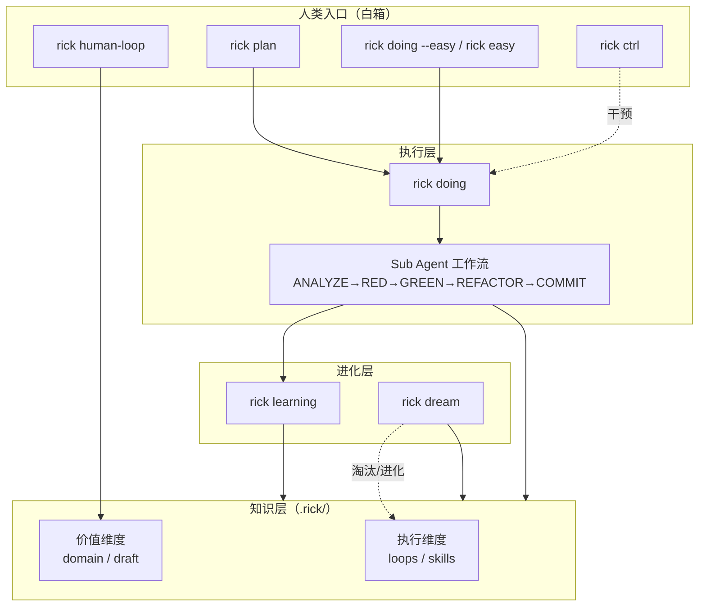
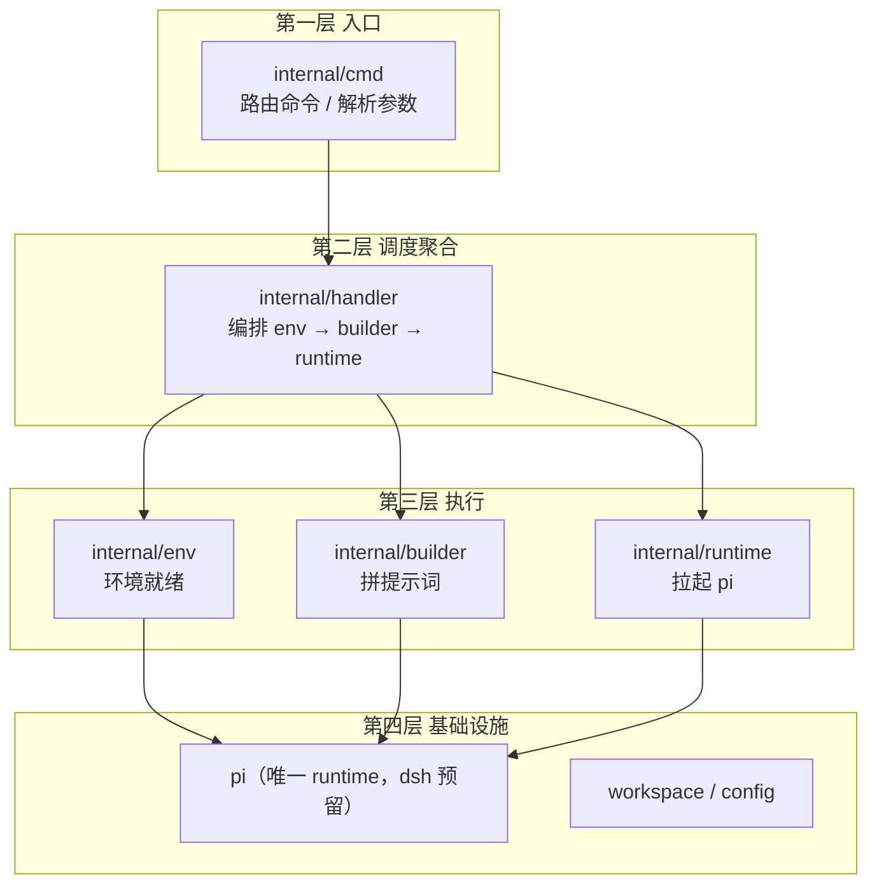
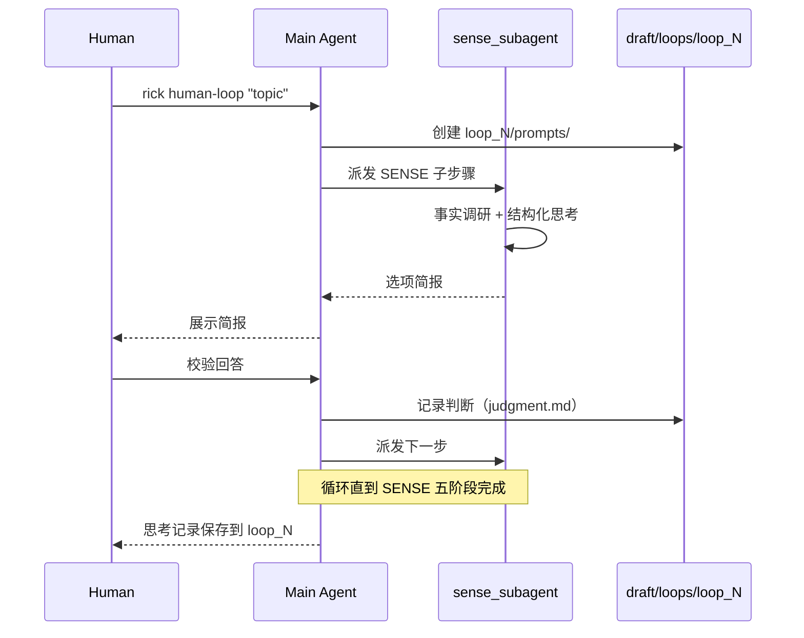

# Rick CLI

> 对抗上下文熵增的 AI Coding 控制框架



---

## 设计哲学

随着项目迭代，软件复杂性逐渐升高，这种复杂性表现为上下文的熵增——AI agent 在执行过程中积累的信息散落在对话历史、临时文件、个人记忆中，无法被结构化复用，导致后续的 AI coding 越跑越乱、越跑越不准。Rick 的核心公式是 `AICoding = Humans + Agents`，其中 `Agents = Models + Harness`，Harness 即上下文。一切设计都围绕上下文的生命周期展开：如何采集、如何压缩、如何复用、如何让它随项目演化保持整洁。

Rick 将上下文分为两个维度。**执行维度**承载"怎么做"的操作性知识：`loops` 是带验收标准的可复用工作流（如 TDD 的红绿重构循环），`skills` 是触发条件明确的原子能力（如"修改 Go 源文件后必须验证编译通过"）。**价值维度**承载"是什么"的描述性知识：`domain` 是代码事实的客观描述（命令规范、架构、编码约定），可被代码验证；`draft` 是个人判断信息的载体（human-loop 思考记录、RFC、未固化的概念探索），不可被代码直接验证。两者的边界清晰：当 `draft` 中的判断被代码事实验证并固化后，可迁移到 `domain`；`domain` 中过时部分由 `dream` 周期性清理。

**skill 单源复用（v4.4 架构原则）**：每个 cmd 的外层阶段模板 = loop（编排节奏 + skill 路径注入 + 变量替换）；内部可复用的实际操作步骤由 skill 承载（多消费者才抽，单消费者的 loop 本体留模板）。所有 section builder 收敛为 prompt 包唯一实现（builder 全委托），「改一个 skill 模块、全场景 cmd 等价一致生效」——探针法实证。确定性逻辑全部收口 rick-gates hook（门禁/提交/结构校验），Go 侧保持薄。

在这个视角下，命令体系是作用于知识体系的控制手段。`doing` 与 `easy` 是熵增的源头（执行过程产生上下文），`learning` 是增强回路（把单次 job 的经验提取为 loops/skills，让下次更准），`dream` 是调节回路（跨 job 反思、淘汰失效 loops/skills、维持 `domain` 简洁），`human-loop` 是人类介入深度思考的入口（产出 `draft`），`ctrl` 是黑箱执行的可挂测性设计（人类对 doing 进行干预）。主要矛盾是"上下文熵增"与"AI coding 准确性"之间的势能差，Rick 通过 learning 的增强回路和 dream 的调节回路共同对抗这一熵增，让后续的 AI agent 越跑越准。

### pi 作为受控的执行后端

Rick 不直接调用大模型，而是把 [pi](https://pi.dev)（`@earendil-works/pi-coding-agent`）作为执行后端——一个可被 shell 调用的 agent runtime。Rick 自身是**引导程序**：确定性拼装 prompt/文件、注入系统提示词、约束工作流，pi 负责实际的 agentic 执行。这条边界的设计原则是**关注点分离**：

- **用户不应感知 pi 的存在**。所有 pi 的配置（provider/model/api-key、subagent/web-access 扩展、主题）都通过 `rick tools init-pi` 引导完成，用户只需跑 rick，不需要直接操作 pi。
- **Rick 托管 pi 的配置以控制模型输入**。pi 的扩展、skill、system prompt 都是模型输入的一部分——这些若由用户随意配置，会污染 agent 的上下文（上下文熵增的又一来源）。Rick 主动安装并固化 pi 的扩展配置（而非让用户各自装），正是为了对"喂给模型的输入"拥有更强的控制力，保证 pi 作为 rick 执行后端的**可控性**与**一致性**。
- **Node 是用户管理的环境依赖**。pi 是 Node.js 程序，需要 node ≥22.19.0 + npm。Rick 不替用户装 node——它是环境依赖，用户负责（保持 rick 引导的简洁性）。`rick tools init-pi` 只在"需要安装 pi"时检查 node/npm 是否就绪，缺失则终止并提示用户自行安装；pi 已装时则假定环境就绪，不再检查。

**配置目录隔离（已实现）**：rick 对 pi 的托管通过**配置目录隔离**落地——rick 在 `~/.rick/pi/agent` 下维护专属于自己的 pi 配置（settings、扩展、主题），在**所有** pi 调用入口（交互式 plan/easy/ctrl/human-loop、doing 的 `--mode json`、`rick tools init-pi` 自身的 install/list）注入环境变量 `PI_CODING_AGENT_DIR` 指向它，与用户自有的 `~/.pi` 完全隔离。用户直接跑 pi 仍用自己的 `~/.pi`；rick 跑 pi 走 `~/.rick/pi`——两套配置互不污染。这样 rick 对"喂给 pi 的全部模型输入"（system prompt、扩展、skill）拥有完全控制力，用户此前自行装的扩展/skill 不会泄漏进 rick 的 agent 上下文。这是"控制上下文熵增"理念在执行后端层的延伸：不仅要治理 rick 自身产出的上下文，还要治理 pi 这个后端被喂入的上下文。

> 实现细节：`rick tools init-pi` 负责在 `~/.rick/pi/agent` 下引导 managed settings.json（首次运行会从旧的 `~/.pi/agent/settings.json` 一次性迁移主题与 rick 托管的扩展包），并固化 rick 的托管默认值：**`hideThinkingBlock: true`**（隐藏 pi 的思考过程块——它会在 rick easy/plan 会话中冲淡关键信息，思考仍生成但不展示）。`rick tools theme` 列出可选主题并按名切换（自动安装提供主题的 npm 包）。**默认主题 `rick`**（内置，基于 GitHub Dark Dimmed 定制）：工具标题/命令绿色、Markdown 标题金色、链接与路径蓝色、bashMode 金色——AI 的正式回复在视觉上最突出；新环境无主题时自动启用。其他可选：dark/light、nightowl、jellybeans-mono、gruber-darker、ameno-cyberdyne、poimandres、gh-dark、gh-light/gh-dark-dimmed，以及放入 `~/.rick/pi/agent/themes/` 的自定义主题。tokyo-night 包被刻意剔除：它捆绑的 Powerline 状态栏扩展硬编码 Tokyo Night 配色、不随主题变化且污染 rick 的 agent 上下文。

`rick tools init-pi` 就是这套托管能力的入口：安装 pi、注册 rick 依赖的扩展（pi-subagents、pi-web-access）、引导隔离配置目录（含 hideThinkingBlock 默认值）、激活主题，并在最后验证全部生效。`rick tools theme` 负责主题的查看与切换。

---

## 架构：三层金字塔（rick 做薄）

Rick 的源码按**三层金字塔**组织（`cmd` 入口 → `handler` 调度 → `env/builder/runtime` 执行，`pi/workspace/config` 为基础设施）。完整契约见 `.rick/domain/rick-spec.md`（模块边界 / 职责 / 接口契约 / 验收标准四要素），规范见 `.rick/domain/spec.md`。



**逐级往下**：上层调下层，下层不回调上层。重构后已删除 6 个冗余包（`internal/{executor,parser,actpath,logging,git,agent}`）——它们各自的职责下沉到了 pi。

### env 四职责

`internal/env` 保证 rick 在当前机器的运行环境就绪，四职责：

1. 安装/更新 pi agent
2. 安装/更新 pi 生态扩展/插件/skill
3. 安装/更新 rick 自有 hook/skill/agent 定制
4. 提供 pi 功能点就绪 check（不含 session，session 归 runtime）

### 下沉策略（rick 做薄）

rick 收敛为引导程序（env 保证 pi 就绪 → builder 拼提示词 → runtime 拉 pi），dag 调度与门禁不再由 rick 维护：

| 旧职责 | 下沉去向 |
|--------|----------|
| dag 调度（executor） | pi `workflowScript` 编排（分层 DAG：层内 `runs.all` 并行 + 层间 `await` 顺序） |
| 门禁（doing_check） | pi hook（rick-gates 扩展，确定性工具）：`grilling_gate`（追问产出物校验）/ `pipeline_gate`（流水线结构校验）/ `level_complete`（层门禁验收提交）+ rick 侧 helper.py（终态兜底） |
| think/research/exporter | pi 自定义 agent（经 env 职责 3 落盘 `agents/{name}.md`；工具全量开放 + 60min 超时） |
| commit 逻辑 | rick-gates hook 确定性提交（level_complete：测试全绿 → git add -A 单次 commit → tasks.json 批量写；worker 不碰 git） |
| 行为轨迹提取（actpath） | 废除——ctrl/dream/learning 直读 pi 原生产物（session jsonl + subagent artifacts），无提取层 |

### 单一 runtime + 扩展 seam

当前 pi 是唯一 runtime，为将来 dsh 预留三扩展 seam + 一个 config 字段：`Runtime` / `RuntimeEnv` / `RuntimeBuilder` 接口 + `config.runtime`（默认 `pi`）。新增 runtime 只实现并注册 `dshRuntime/dshEnv/dshBuilder`，cli/handler/方法层 templates 不改。

## spec 信息内核

`spec` 是 rick 的**信息内核**——结构化自然语言描述的工程实现契约（四要素：模块边界 / 职责 / 接口契约 / 验收标准）。只要 spec 无歧义地描述验收标准，丢弃一切源码即可 AI coding 出**功能等价**的 rick。

- 规范层：`.rick/domain/spec.md`（spec 是什么 + 四要素模板 + 验收标准）
- 实例层：`.rick/domain/rick-spec.md`（rick 的第一份 spec，四要素逐节填写）
- 功能等价 = 通过所有功能验收（`go test ./...` 全绿 + 集成测试全绿 + 构建成功 + dry-run 无未替换变量 + 各 check pass）

---

---

## 双维度知识体系

| 维度 | 载体 | 性质 | 来源 |
|------|------|------|------|
| 执行 | `loops/` | 可复用工作流（带验收标准的迭代控制流） | dream 提炼 |
| 执行 | `skills/` | 原子能力（触发条件 → 执行步骤） | dream / learning 提炼 |
| 价值 | `domain/` | 事实信息（代码/规范/架构的客观描述） | 人类维护 + learning 补充 |
| 价值 | `draft/` | 个人判断（human-loop 思考记录、RFC） | human-loop 产出 |

**domain 与 draft 的边界**：`domain` 可被代码验证；`draft` 是人类主观判断。判断一旦被代码事实固化，可迁移到 `domain`；`domain` 中过时部分由 `dream` 清理。

---

## 快速开始

### 安装

```bash
./scripts/install.sh
```

### Easy 模式（白箱，人类把控）

适合探索性任务、快速修复、对话式开发。人类全程参与，agent 透明执行。

```bash
# 新建 easy 会话（交互式）
rick doing --easy "帮我修复登录 bug"
rick doing --easy          # 不带需求，进入后输入

# 等价简写（doing 的子模块）
rick easy -r "帮我修复登录 bug"

# 恢复中断的 easy 会话
rick doing --easy --job job_5
rick easy --resume job_5
```

**工作流**：
1. 人类提出需求 → 进入交互式 pi 会话
2. Agent 执行，每个问题自动记录到 `doing/debug/`
3. 退出后人类显式触发 `rick learning job_N`（不自动触发）

### Doing 模式（黑箱，agent 自主）

适合有明确任务分解的需求。Plan 阶段分解为 task 列表，Doing 阶段 agent 逐任务自主执行。

```bash
# 1. 规划：设计树下钻追问 + 实现流水线设计（分层 DAG + 每层 human 确认门禁）
rick plan "为用户系统添加 JWT 认证"

# 2. 执行：分层 pipeline（层内并行 + 层门禁提交 + 实时进度反馈）
rick doing job_1

# 3. 积累：提取经验，更新 loops/skills/domain
rick learning job_1

# 4. 全局反思：跨 job 知识进化
rick dream
```

**工作流**：
1. `rick plan` 生成 `plan/task*.md`（含 # 写域）+ `plan/gates/gate{N}.md|py`（human 确认的层门禁）+ `plan/pipeline.md`
2. `rick doing` 按分层 DAG 执行：每层「门禁判别力验证（红）→ 并行 impl-worker（写域互斥、自测）→ level_complete（hook 跑门禁 → 绿 → 单次 commit → tasks.json 批量）→ debug 压缩传递」；实时进度（tasks.json watcher + pi 结构化事件打 stderr）
3. 门禁链：`pipeline_gate`（结构校验：分层/写域互斥/gate 存在）+ `level_complete`（层验收提交）+ rick 侧 helper.py（终态兜底）
4. `rick learning` 提取经验写入 loops/skills/domain（domain 沉淀是核心产出——不跑则同样的坑下次还踩）
5. 定期 `rick dream` 跨 job 反思（learning 完整性检查 + 演化 loops/domain）

**会话恢复**（长流程中断后续接，完整上下文）：
```bash
rick plan --resume job_2        # 恢复 plan 会话
rick doing --resume job_1       # 交互式恢复 doing 会话（人工接管/排查）
rick human-loop --resume loop_1 # 恢复 SENSE 思考会话
rick easy --resume job_5        # 恢复 easy 会话
```

---

## 命令体系

### rick plan

**职责**：将需求分解为 task 列表，生成 plan 目录。

**用法**：
```bash
rick plan [requirement]
rick plan --job job_5 [requirement]   # 复用已有 job 的 plan 目录
```

**关键 flags**：

| flag | 默认 | 说明 |
|------|------|------|
| `--job <id>` | 空 | 复用已有 job 目录，跳过 NextJobID() |
| `--dry-run` | false | 输出完整 plan prompt 到 stdout，不调用 pi |

**示例**：
```bash
rick plan "添加用户注册功能"
rick plan --job job_3 "追加导出功能"
```

**产出**：
- `.rick/jobs/job_N/plan/task*.md`（含 `# 写域` 声明）
- `.rick/jobs/job_N/plan/grilling/design-tree.md`（OKR 设计树：O + KR 递归，MECE + 充分性双约束）
- `.rick/jobs/job_N/plan/gates/gate{N}.md|py`（每层门禁：检查逻辑 + 确定性实现，human 确认定稿）
- `.rick/jobs/job_N/plan/pipeline.md`（分层 DAG 执行契约）
- `.rick/jobs/job_N/doing/tasks.json`

**plan 阶段协议**：
1. **设计树动态下钻**（skill:grilling 单源协议）：顶层 OKR（O=可验证全局目标，KR=演绎/归纳支撑）→ 每层 L1 调研消解（轻量自查 / 重量级派 research）→ L2 提炼判断节点 → L3 批量追问 human → L4 事实回流 → L5 终止判定（OKR 充分性自检，未达标禁止下钻）→ 全部叶子四维度落实 → **grilling_gate 确定性门禁**（校验 design-tree/research 简报/提问痕迹）
2. **实现流水线设计**（skill:pipeline）：并行优先分层（只有真实依赖才分层）+ 写域声明 + 每层 human 确认门禁（检查逻辑先行：gate{N}.md 供人审，gate{N}.py 实现）
3. **多维评审**（8 个 reviewer 并行 fanout）：一致性/loops 利用/依赖/风险/测试设计/端到端/写域与门禁/门禁自洽性（永远红检测）

**会话恢复**：`rick plan --resume job_N`（读 plan/session_id，pi --session-id 恢复完整上下文）

---

### rick doing

**职责**：执行 job 中的 task，支持重试和自动 commit。

**用法**：
```bash
rick doing [job_id]
rick doing --easy [requirement]   # 进入 easy 模式
rick doing --job job_5            # 等价于 rick doing job_5
```

**关键 flags**：

| flag | 默认 | 说明 |
|------|------|------|
| `--job <id>` | 空 | 指定 job ID |
| `--easy` | false | 进入 easy 模式（见下方 rick easy） |
| `--resume <job_id>` | 空 | 交互式恢复 doing parent 会话（人工接管/排查卡住的流水线） |
| `--ctx <path>` | 空 | 从指定 `.rick` 目录继承上下文（easy 模式专用） |
| `--dry-run` | false | 输出完整 doing prompt 到 stdout，不调用 pi |

**示例**：
```bash
rick doing job_1
rick doing --easy "修复 Redis 连接池泄漏"
rick doing --resume job_1   # 交互式接管排查
```

**doing pipeline（分层 DAG + 层门禁）**：
```
每层 4 步：
  ① 门禁判别力验证 —— 跑 gate{N}.py 应为红（模块集成测试此刻必失败）
  ② 并行 impl-worker —— runs.all 派发（写域互斥；按 # 测试方法 自测；不碰 git）
  ③ 层门禁提交 —— parent 调 level_complete（hook 跑 human 门禁 → 绿 →
     git add -A 单次 commit → tasks.json 批量 success）
  ④ debug 压缩传递 —— 前层教训注入下层 worker
```
- 执行前 `pipeline_gate` 确定性校验（分层 DAG / 写域互斥 / gate 存在），⛔ 才派发
- parent = 结对导航员：主动读 worker 行为轨迹（status/transcript），判断卡死即干预（steer → stop+重派 → 亲自接手）
- 实时进度反馈：tasks.json watcher（hook 写状态 → 变更打一行）+ pi 结构化事件（派发/工具/门禁/收敛打 stderr）
- 非 git 仓库自动 `git init`（ensureGitRepo 确定性前置）

**产出**：
- `.rick/jobs/job_N/doing/debug/bug*.md`（问题记录）+ `debug-summary.md`（全程摘要，learning 输入）
- `.rick/jobs/job_N/doing/tasks.json`（hook 独写：level_complete 批量更新）
- `.rick/jobs/job_N/doing/session_id`（pi 会话 UUID，--resume 用）
- 自动 git commit（层粒度：feat(layer): taskN+M，由 hook 确定性提交）

---

### rick easy

**职责**：交互式 AI coding 会话，跳过 plan 阶段。

**与 doing 的关系**：`rick easy` 是 `rick doing --easy` 的子模块。两者共用同一套 easy 函数（`runEasyMode` / `resumeEasyMode`），`rick easy` 提供更直接的入口，`rick doing --easy` 保留向后兼容。

**用法**：
```bash
rick easy -r "需求"
rick easy                    # 进入后输入需求
rick easy --resume job_5     # 恢复会话
```

**关键 flags**：

| flag | 默认 | 说明 |
|------|------|------|
| `-r, --requirement <text>` | 空 | 会话需求 |
| `--ctx <path>` | 空 | 从指定 `.rick` 目录继承上下文 |
| `--resume <job_id>` | 空 | 恢复已存在的 easy 会话 |
| `--dry-run` | false | 输出完整 easy prompt 到 stdout，不调用 pi |

**示例**：
```bash
rick easy -r "修复线上 500 错误"
rick easy --resume job_3
```

**产出**：
- `.rick/jobs/job_N/doing/requirement.md`
- `.rick/jobs/job_N/doing/session_id`（pi 会话 UUID）
- `.rick/jobs/job_N/doing/prompts/`（持久化的 prompt 文件）
- `.rick/jobs/job_N/doing/tasks.json`（合成 `easy_session` 任务，供 dream 发现）

---

### rick learning

**职责**：分析执行结果，提取经验，更新 loops/skills/domain。

**用法**：
```bash
rick learning [job_id]
rick learning --job job_5
```

**关键 flags**：

| flag | 默认 | 说明 |
|------|------|------|
| `--job <id>` | 空 | 指定 job ID |
| `--dry-run` | false | 输出完整 learning prompt 到 stdout，不调用 pi |

**示例**：
```bash
rick learning job_1
```

**产出**：
- `.rick/jobs/job_N/doing/SUMMARY.md`
- `.rick/loops/` 新增或更新 loop
- `.rick/skills/` 新增或更新 skill
- `.rick/domain/` 补充事实信息

---

### rick dream

**职责**：跨 job 全局反思，进化知识体系。自我进化机制。

**用法**：
```bash
rick dream                # 交互式
rick dream -p             # 后台自动模式
rick dream --job_num 3    # 每次处理 3 个 job
```

**关键 flags**：

| flag | 默认 | 说明 |
|------|------|------|
| `--job_num <n>` | 5 | 每次处理的 job 数量 |
| `-p, --background` | false | 后台模式（非交互，skip-permissions） |
| `--dry-run` | false | 输出完整 dream prompt 到 stdout，不调用 pi |

**示例**：
```bash
rick dream -p
```

**产出**：
- `.rick/dream/dream_run_{job_id}_log.md`
- `.rick/loops/deprecated/`（淘汰连续 3 次未触发的 loop）
- `.rick/skills/deprecated/`（淘汰连续 3 次未引用的 skill）
- 精简 `domain/` 内容

**Dream 是 learning 的兜底**：即使 learning 写出了问题，dream 也会在后续修复，无需追求 learning 的完美一致性。

---

### rick ctrl

**职责**：黑箱执行的可挂测性设计。人类对正在执行的 doing 进行干预。

**用法**：
```bash
rick ctrl --job job_5
```

**关键 flags**：

| flag | 默认 | 说明 |
|------|------|------|
| `--job <id>` | （必传） | 指定 job ID |
| `--dry-run` | false | 输出完整 ctrl prompt 到 stdout，不调用 pi |

**四种干预场景**：

| 场景 | 操作 |
|------|------|
| A：追加指令 | 在 `plan/task<N>.md` 末尾追加 `## 干预指令 (Intervention)` 章节 |
| B：重置 task | 将 status 改为 `pending`，清空 error 字段 |
| C：查看进度 | 读 `tasks.json` + `ls -t .pi/subagents/artifacts/*_meta.json`（哪个 worker 在跑/耗时/报错） |
| D：查看行为轨迹 | tail 运行中 worker 的 `*_transcript.jsonl`（pi 原生轨迹，无提取层）+ doing 会话 jsonl（session_id 定位） |

**变更约束**：只能修改 `doing/` 和 `plan/` 下的文件。若目标 task 正在运行（`running`），重置无效，需先 Ctrl+C 停止 doing。

---

### rick human-loop

**职责**：用 SENSE 方法论引导深度思考，产出存入 `.rick/draft/`。详见下方 [human-loop 设计](#human-loop-设计)。

**用法**：
```bash
rick human-loop "如何降低 doing 重试率"
```

**关键 flags**：

| flag | 默认 | 说明 |
|------|------|------|
| `<topic>` | （必传） | 思考主题 |
| `--dry-run` | false | 输出完整 human-loop prompt 到 stdout，不调用 pi |

### rick tools update-pi

**职责**：更新 pi runtime / 扩展 / 模型目录 + 更新后快速自检（v4.1 新增）。

```bash
rick tools update-pi                  # 全量：pi runtime → 全部扩展 → 模型目录
rick tools update-pi pi               # 仅 pi runtime（托管 runtime 走 rick 自己的 npm --prefix）
rick tools update-pi extensions       # 全部扩展（pi update --extensions，作用于托管 agent 目录）
rick tools update-pi pi-subagents     # 单个扩展（源名自动解析为 npm: 前缀注册形态）
rick tools update-pi models           # 刷新模型目录
```

更新后自动快速自检：pi 版本 / 必需扩展注册 / rick agents+hooks 落盘 / rick-gates helper 语法 / human-loop 提示词渲染冒烟。只更新托管环境（`~/.rick/pi`），永不碰用户自有的 `~/.pi`。

### rick tools init-pi

**职责**：初始化 pi（rick 的 agent runtime）+ subagent 扩展。幂等——检查后跳过已就绪项，缺什么补什么。`install.sh` 安装完 rick 后会自动调一次；也可单独跑。

**用法**：
```bash
rick tools init-pi
```

**做了什么**：
1. **前置检查**：若 pi 尚未安装，检查 node（≥22.19.0）+ npm 是否在 PATH。缺失则**终止**并提示用户自行安装 node（rick 不替用户装 node——它是用户管理的环境依赖）；pi 已装则跳过此检查，假定环境就绪
2. 检查 rick 的自闭环 pi 运行时（`~/.rick/pi/agent/runtime`）是否存在；缺失则 `npm install --prefix` 安装 **rick 自己的 pi 副本**（若全局有 pi 则匹配其版本，全局副本本身不被修改）——rick 的 pi 与用户的全局/独立 pi 完全隔离，可独立升级
3. 检查 `pi-subagents` 扩展是否已注册（`pi list`）；未注册则 `pi install npm:pi-subagents`（提供 `subagent` 工具：单/并行/链式派发独立上下文子 agent）
4. 检查 `pi-web-access` 扩展是否已注册；未注册则 `pi install npm:pi-web-access`（提供 `web_search`/`web_fetch` 工具，外部搜索/抓取网页）
5. **剔除 Tokyo Night 包**（`@wishx127/pi-tokyo-night`）：从其托管配置（packages + theme）中清除一切残留。该包捆绑的 Powerline 状态栏扩展硬编码 Tokyo Night 配色、不跟随当前主题（切到其他主题会出现"两个主题共存"）且会污染 rick 的 agent 上下文，rick 不再安装它。主题管理完全交给 `rick tools theme`（见上）
6. 最终验证：跑 `pi list` 确认所有必需扩展都真注册成功 + 主题字段已设置（捕获"装了但没生效"的假象）
7. 汇总就绪状态。node 缺失（需装 pi 时）或 pi 完全装不上才返回非零；扩展/主题缺失只 warn（rick 仍可用，仅对应功能不可用）

---

## human-loop 设计

### 定位

`rick human-loop` 是人类介入深度思考的入口，用 SENSE 方法论引导对复杂问题进行结构化分析，产出存入 `.rick/draft/`（价值维度的个人判断载体）。与 `rick doing` 互补：human-loop 是"想清楚"（白箱，人类主导），doing 是"做出来"（黑箱，agent 主导）。

### SENSE 方法论（v4.2 四段链协议）

每阶段推进链：**research（事实）→ think（隐含前提追问）→ {事实模糊性消解循环} → exporter（第一性原理教学简报）→ 展示 human → 批判门禁 → 记录判断**。human 读到的永远是 exporter 的教学简报（不是 research/think 原始简报）。

- **research agent**：尽调树调研（事实+前提+来源），重量级调研可拆叶子 worker 递归（pi 深度封底）
- **think agent**：对判断节点提炼隐含前提问题（「若 X 成立，则隐含假设 Y——这真的正确吗？」）
- **事实消解循环**（parent 判断）：think 的问题中事实性 Y → 追加 research → 回流 think 更新（≤2 轮），目标是 human 只被问必须由人回答的问题
- **exporter agent**（教师身份）：①发生了什么 ②这个领域的知识是什么样子（第一性原理详实讲解，引用链接/书籍章节/信源等级）③启发式追问（承接 think，建立在已讲清的知识上）④延伸学习指导（书籍+章节/链接+为什么读）
- **批判门禁**：human 实质性回答 → think-gate 审查推理漏洞（隐含前提问题式输出）
- 5 阶段：S 问题确认 → E 视角生成 → N 矛盾判断（N1+N2 双追问）→ S-R 辩证逆转 → EC 良知批判（跃迁方向 human 自判）
- 反向回流：后续阶段颠覆前序判断 → 回 S/E 重启（上限 N 次）

### 调用图



### 目录结构

```
.rick/draft/loops/loop_N/
├── prompts/
│   ├── human_loop.md          # 主 prompt
│   ├── sense_subagent.md      # sense 子 agent prompt
│   └── skill_sense.md         # SENSE skill 定义
└── briefs/                    # 每轮子 agent 产出简报
```

主 Agent 控制推进节奏：派发子任务 → 展示简报 → 校验人类回答 → 记录判断 → 派发下一步。

### 与 doing 对比

| 维度 | rick human-loop | rick doing |
|------|----------------|------------|
| 模式 | 白箱，人类主导 | 黑箱，agent 主导 |
| 目标 | 想清楚（产出判断） | 做出来（产出代码） |
| 产出位置 | `.rick/draft/` | `.rick/jobs/job_N/doing/` |
| 价值维度 | 个人判断 | 执行过程 |
| 介入方式 | 每步校验 | 完成后 check |

---

## .rick/ 目录结构

```
.rick/
├── loops/              # 执行维度：可复用工作流
│   ├── tdd-red-green-refactor-loop.md
│   ├── do-check-mark-success-loop.md
│   └── deprecated/     # 淘汰（连续 3 次 dream 未触发）
├── skills/             # 执行维度：原子能力
│   ├── {name}_skill/
│   │   └── skill.md
│   └── deprecated/     # 淘汰（连续 3 次 dream 未引用）
├── domain/             # 价值维度：事实信息（含 spec 信息内核）
│   ├── spec.md         # spec 规范：四要素模板 + 验收标准
│   ├── rick-spec.md    # rick 第一份 spec 实例（三层金字塔 + env 四职责契约）
│   ├── architecture.md
│   ├── commands.md
│   ├── go-patterns.md
│   ├── testing-conventions.md
│   └── project-conventions.md
├── draft/              # 价值维度：个人判断
│   ├── rfc/            # human-loop 产出的 RFC
│   ├── concepts/       # 概念探索
│   ├── human-learning/ # 学习记录
│   └── loops/loop_N/   # 每次 human-loop 的工作目录
├── jobs/               # 工作区
│   └── job_N/
│       ├── plan/       # 标准模式：task*.md
│       └── doing/
│           ├── debug/      # bug*.md 问题记录
│           ├── tasks.json  # 任务状态
│           ├── session_id  # easy 模式会话 ID
│           ├── prompts/    # 持久化 prompt 文件
│           └── tasks/      # 每 task 执行轨迹（pi 产生）
│               └── {task_id}/
│                   ├── raw_session_coding.log  # pi JSONL 事件流
│                   └── run_tests.py            # task 自测脚本（轻量）
└── dream/              # 工作区：dream 运行日志
    └── dream_run_{job_id}_log.md
```

---

## 配置

**配置文件**：`~/.rick/config.json`

```json
{
  "max_retries": 5,
  "runtime": "pi",
  "pi_path": "",
  "pi_extra_args": ["--provider", "deepseek", "--model", "deepseek-v4-pro", "--api-key", "sk-..."],
  "default_workspace": "",
  "git": {
    "user_name": "Your Name",
    "user_email": "your.email@example.com"
  }
}
```

| 配置项 | 说明 |
|--------|------|
| `max_retries` | 标准模式任务失败最大重试次数（默认 5） |
| `runtime` | 当前 agent runtime 标识（默认 `pi`，为将来 dsh 预留扩展 seam） |
| `pi_path` | pi CLI 路径（空则使用 PATH 中的 `pi`） |
| `pi_extra_args` | 透传给 pi 的额外 flags（如 `["--provider","deepseek","--model","deepseek-v4-pro","--api-key","sk-..."]`）。pi 不从环境变量读 provider/model/api-key，必须通过此处或命令行配置 |
| `default_workspace` | 默认工作区路径 |
| `git.user_name` | 自动 commit 时使用的 Git 用户名 |
| `git.user_email` | 自动 commit 时使用的 Git 邮箱 |

---

## 版本演进

| 版本 | 日期 | 说明 |
|------|------|------|
| 4.4.15 | 2026-08 | 确定性门禁体系（grilling_gate/pipeline_gate/level_complete）；grilling OKR 设计树 + 防漂移纪律；skill 编排协议单源（prompt 包唯一实现 + builder 全委托，探针法验证「改 skill 一处全 cmd 等价生效」） |
| 4.3.x | 2026-08 | doing pipeline 重构：分层 DAG + 层门禁（gate{N}.py human 确认）+ 写域确定性检查 + 双 agent TDD → 测试收敛到层门禁（task 自测）；doing 前置 git init；tasks.json watcher 确定性进度反馈；act-path 提取层废除（ctrl/dream/learning 直读 pi 原生行为轨迹） |
| 4.2.x | 2026-08 | human-loop 四段链协议：research→think→{事实消解循环}→exporter（教师身份·第一性原理详实教学简报 + 启发式追问 + 延伸学习指导）；plan grilling 子代理化（设计树 + research/think 消解）；plan/doing 全局派发规范收敛（timeoutMs 3600000） |
| 4.1.x | 2026-08 | 全量工具开放（think/research/exporter 统一 fullTools + 60min 超时；intercom 由 launcher 注入不写 allowlist）；`rick tools update-pi`（pi/扩展/模型目录更新 + 快速自检）；阶段提示词改走 --append-system-prompt（compaction 持久） |
| 4.0.x | 2026-08 | agent 契约 v4：递归外包（research 尽调树/think 思考拆解，pi maxSubagentDepth=2 封底）+ 自落盘 + 回执交付 + parent 门禁校验 + inline 降级安全网；简报有效性优化（research 事实+前提+来源 / think 隐含前提问题） |
| 3.1.5 | 2026-08 | rick 主题 → VSCode Dark+ 配色；默认模型 deepseek-v4-pro；命令绿/链接蓝主题体系；自闭环 pi 运行时（~/.rick/pi 隔离） |
| 3.2.0 | 2026-08 | 三层金字塔重构：做薄 rick，dag 调度/门禁/agent 下沉 pi；spec 信息内核（spec.md + rick-spec.md） |
| 2.10.9 | 2026-07 | 重构 human-loop：sense subagent + loop_N 会话目录 |
| 2.10.x | 2026-07 | draft 基础设施、learning 注入 draft_dir、human-loop 三阶段模板 |
| 2.9.10 | 2026-06 | 删除 easy auto-trigger learning，等人类显式触发 |
| 2.9.0 | 2026-06 | 架构迁移：删除 wiki/tools/SPEC.md/OKR.md，重构为 loops/skills/domain 三层知识体系 |
