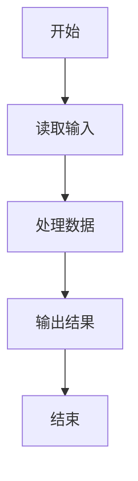
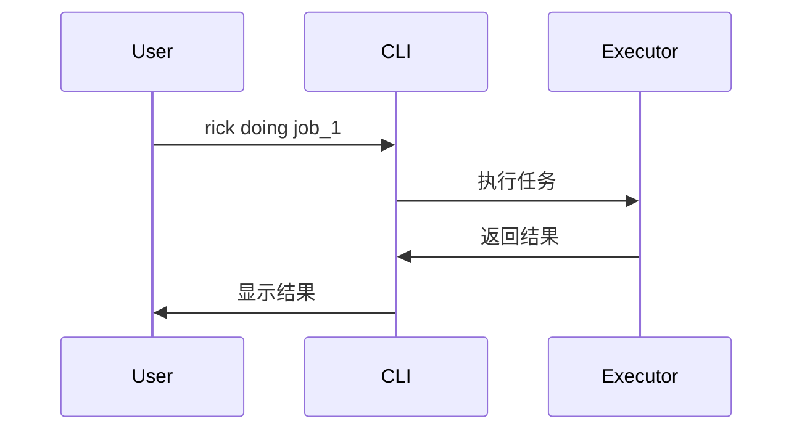
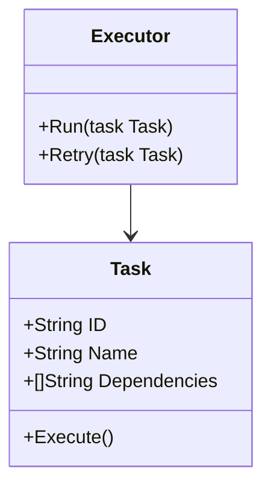

# Rick CLI Wiki 贡献指南

欢迎为 Rick CLI Wiki 做出贡献！本文档提供了参与 Wiki 文档编写和改进的指南。

## 目录

- [贡献方式](#贡献方式)
- [文档规范](#文档规范)
- [写作风格](#写作风格)
- [代码示例规范](#代码示例规范)
- [Mermaid 图表规范](#mermaid-图表规范)
- [提交流程](#提交流程)
- [审核标准](#审核标准)

## 贡献方式

你可以通过以下方式为 Wiki 做出贡献：

### 1. 报告问题

如果你发现文档中的错误、不清晰的描述或过时的内容：

1. 在项目仓库创建 Issue
2. 使用标签 `documentation`
3. 清楚描述问题所在的文档和位置
4. 如果可能，提供改进建议

### 2. 改进现有文档

- 修正拼写和语法错误
- 补充缺失的信息
- 更新过时的内容
- 添加更多示例
- 改进图表和可视化

### 3. 创建新文档

如果你想添加新的文档：

1. 先创建 Issue 讨论是否需要
2. 确定文档的位置和结构
3. 遵循本指南的规范编写
4. 提交 Pull Request

### 4. 翻译文档

目前文档主要是中文，欢迎贡献英文翻译或其他语言版本。

## 文档规范

### 文件命名

- 使用小写字母和连字符：`module-name.md`
- 避免使用空格和特殊字符
- 文件名应清晰表达内容：`getting-started.md` 而非 `gs.md`

### 目录结构

```
wiki/
├── README.md                    # Wiki 首页
├── *.md                         # 顶层文档（架构、概念等）
├── modules/                     # 模块文档
│   ├── README.md
│   └── *.md
└── tutorials/                   # 教程文档
    ├── README.md
    └── tutorial-*.md
```

### 文档结构

每个文档应包含：

1. **标题**（H1）：文档的主标题
2. **简介**：1-2 段文字说明文档内容
3. **目录**（可选）：长文档应包含目录
4. **主要内容**：按逻辑分段
5. **相关链接**：链接到相关文档
6. **更新日志**（可选）：重要更新记录

示例：

```markdown
# 模块名称

简要介绍模块的作用和核心功能。

## 目录

- [核心概念](#核心概念)
- [使用方法](#使用方法)
- [示例](#示例)

## 核心概念

...

## 使用方法

...

## 示例

...

## 相关文档

- [相关模块](link)
- [教程](link)
```

### 标题层级

- **H1 (`#`)**：仅用于文档标题，每个文档只有一个
- **H2 (`##`)**：主要章节
- **H3 (`###`)**：子章节
- **H4 (`####`)**：详细内容
- **H5-H6**：尽量避免使用，层级过深影响可读性

⚠️ **重要**：不要跳级使用标题（例如从 H2 直接到 H4）

## 写作风格

### 语言风格

1. **清晰简洁**：使用简单直接的语言
2. **技术准确**：确保技术描述准确无误
3. **面向用户**：从用户角度编写，考虑不同技术水平的读者
4. **一致性**：使用统一的术语和表达方式

### 术语使用

统一使用以下术语：

| 术语 | 说明 | 避免使用 |
|------|------|----------|
| Rick CLI | 项目全称 | rick, Rick |
| Context-First | 设计理念 | context first, context-first |
| DAG | 有向无环图 | dag, Dag |
| Job | 工作单元 | job, 任务集 |
| Task | 具体任务 | task, 子任务 |
| OKR | 目标与关键结果 | okr |
| SPEC | 技术规范 | spec, 规范 |

### 格式约定

- **命令**：使用内联代码格式：`rick plan`
- **文件路径**：使用内联代码格式：`.rick/jobs/job_1/plan/`
- **重要提示**：使用表情符号：
  - ⚠️ 警告或重要注意事项
  - ✅ 推荐做法或最佳实践
  - ❌ 不推荐的做法或反模式
  - 💡 提示或技巧
  - 📝 注意事项

### 列表使用

- **无序列表**：使用 `-` 而非 `*` 或 `+`
- **有序列表**：使用数字 `1.`, `2.`, `3.`
- **嵌套列表**：使用 2 个空格缩进

## 代码示例规范

### 代码块格式

使用三个反引号和语言标识符：

````markdown
```go
package main

func main() {
    fmt.Println("Hello, Rick!")
}
```
````

支持的语言标识符：

- `go` - Go 代码
- `bash` - Shell 脚本
- `json` - JSON 配置
- `markdown` - Markdown 示例
- `python` - Python 代码（测试脚本）

### 代码示例要求

1. **完整性**：代码应该是可运行的完整示例
2. **注释**：添加必要的注释说明关键部分
3. **真实性**：引用项目中真实存在的代码
4. **简洁性**：只展示相关部分，省略无关代码

示例：

```go
// 解析 task.md 文件
func ParseTaskFile(path string) (*Task, error) {
    // 读取文件内容
    content, err := os.ReadFile(path)
    if err != nil {
        return nil, fmt.Errorf("读取文件失败: %w", err)
    }

    // 解析 Markdown
    task := &Task{}
    // ... 解析逻辑
    return task, nil
}
```

### 命令行示例

命令行示例应包含：

1. **提示符**：使用 `$` 表示普通用户，`#` 表示 root
2. **输出**：展示预期的输出
3. **注释**：使用 `#` 添加说明

```bash
# 规划任务
$ rick plan "创建 Web API"

# 执行任务
$ rick doing job_1
Starting job_1...
Task 1/5: 创建项目结构
✓ Task completed

# 查看结果
$ ls .rick/jobs/job_1/
plan/  doing/  learning/
```

## Mermaid 图表规范

### 图表类型

推荐使用以下 Mermaid 图表类型：

1. **流程图** (`flowchart`)：展示流程和决策
2. **序列图** (`sequenceDiagram`)：展示交互流程
3. **类图** (`classDiagram`)：展示类结构和关系
4. **状态图** (`stateDiagram`)：展示状态转换

### 流程图示例



### 序列图示例



### 类图示例



### 图表规范

1. **清晰性**：图表应该清晰易懂
2. **简洁性**：只展示关键信息，避免过于复杂
3. **一致性**：使用统一的命名和样式
4. **中文标签**：节点和标签使用中文

## 提交流程

### 1. Fork 和 Clone

```bash
# Fork 项目到你的账号
# 然后 clone 到本地
git clone https://github.com/your-username/rick.git
cd rick
```

### 2. 创建分支

```bash
# 创建新分支
git checkout -b docs/improve-module-doc
```

分支命名约定：

- `docs/add-xxx` - 添加新文档
- `docs/improve-xxx` - 改进现有文档
- `docs/fix-xxx` - 修复文档错误

### 3. 编写和验证

```bash
# 编辑文档
vim wiki/modules/executor.md

# 运行验证脚本
chmod +x wiki/validate_wiki.sh
./wiki/validate_wiki.sh

# 预览文档（使用 Markdown 预览工具）
```

### 4. 提交更改

```bash
# 添加更改
git add wiki/modules/executor.md

# 提交（使用清晰的提交信息）
git commit -m "docs(executor): 添加重试机制详细说明"
```

提交信息格式：

```
docs(scope): 简短描述

详细说明（可选）
- 改进点1
- 改进点2

Closes #123  # 如果关闭了某个 Issue
```

### 5. 推送和创建 PR

```bash
# 推送到你的 fork
git push origin docs/improve-module-doc

# 在 GitHub 上创建 Pull Request
```

PR 描述应包含：

1. **改动说明**：清楚描述你做了什么改动
2. **改动原因**：为什么需要这个改动
3. **测试结果**：验证脚本的运行结果
4. **截图**（可选）：如果改动涉及可视化内容

## 审核标准

提交的文档将根据以下标准审核：

### 内容质量

- ✅ 技术描述准确无误
- ✅ 信息完整，没有遗漏重要内容
- ✅ 逻辑清晰，易于理解
- ✅ 示例代码可运行且有意义

### 格式规范

- ✅ 遵循文档结构规范
- ✅ 标题层级正确
- ✅ 代码块使用正确的语言标识符
- ✅ 链接正确且可访问

### 写作风格

- ✅ 语言清晰简洁
- ✅ 术语使用一致
- ✅ 格式约定统一
- ✅ 面向目标读者

### 技术验证

- ✅ 通过 `validate_wiki.sh` 验证
- ✅ 代码示例经过测试
- ✅ 链接检查无误
- ✅ Mermaid 图表可正常渲染

## 常见问题

### Q: 我不确定我的改动是否需要，应该怎么办？

A: 先创建一个 Issue 描述你的想法，与维护者讨论后再开始编写。

### Q: 我发现了一个小错误，需要创建 Issue 吗？

A: 对于明显的拼写或格式错误，可以直接提交 PR。对于内容性的改动，建议先创建 Issue。

### Q: 文档应该写多详细？

A: 根据目标读者确定详细程度。对于入门文档，应该更详细；对于高级主题，可以假设读者有一定基础。

### Q: 可以添加外部链接吗？

A: 可以，但应该：
- 链接到权威和稳定的资源
- 添加简短说明
- 定期检查链接有效性

### Q: 如何处理与现有文档的冲突？

A: 如果你的改动与现有内容冲突：
1. 先在 Issue 中讨论
2. 考虑是否需要重构文档结构
3. 确保改动后整体一致性

## 获取帮助

如果你在贡献过程中遇到问题：

1. 查看 [Wiki README](README.md)
2. 搜索现有的 Issues
3. 在 Discussions 中提问
4. 联系项目维护者

## 感谢

感谢你为 Rick CLI Wiki 做出贡献！每一个改进都让文档变得更好，帮助更多用户更好地使用 Rick CLI。

---

**最后更新**: 2026-03-16
**维护者**: Rick CLI Team
