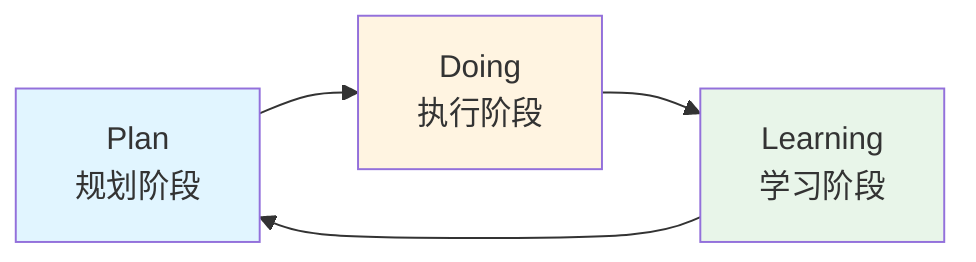
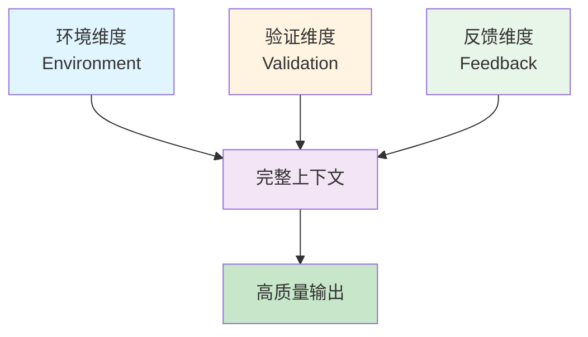
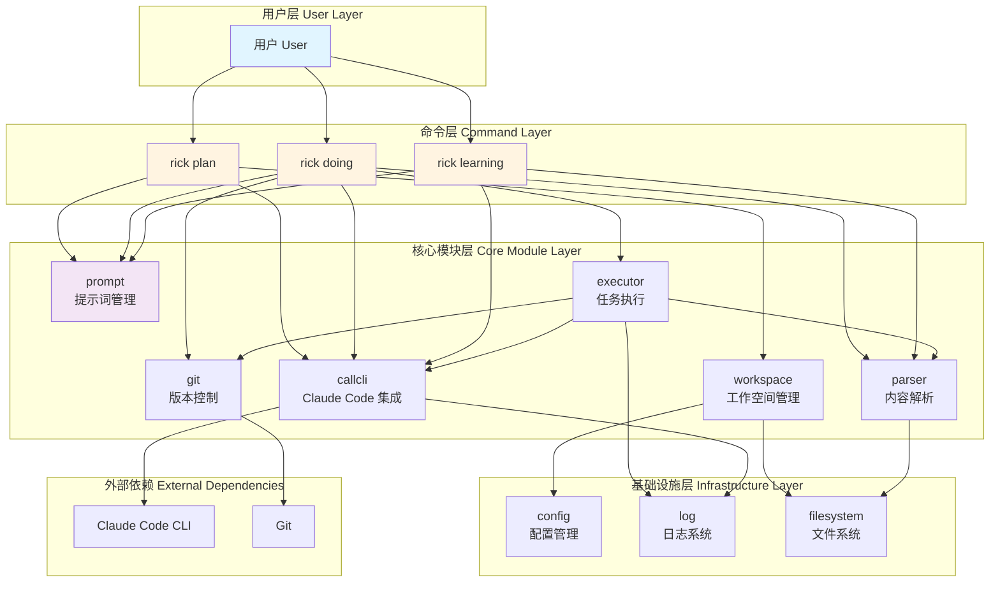
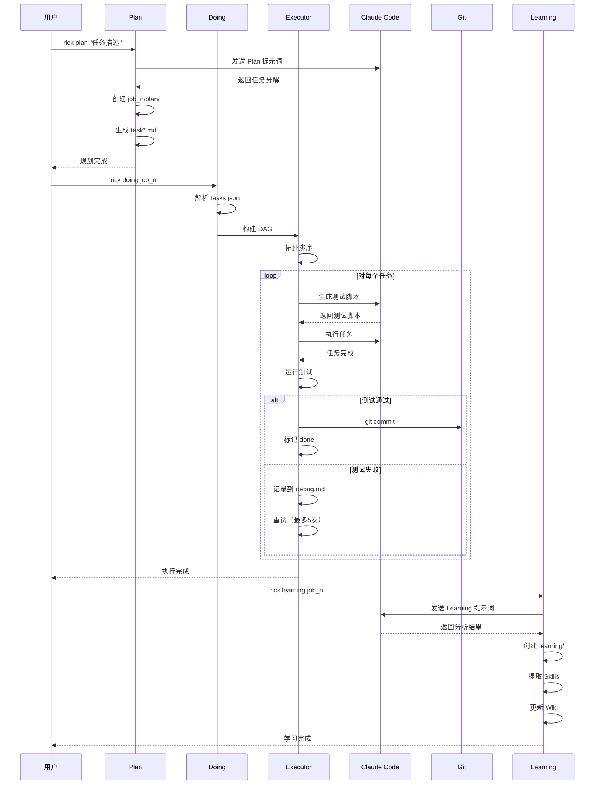
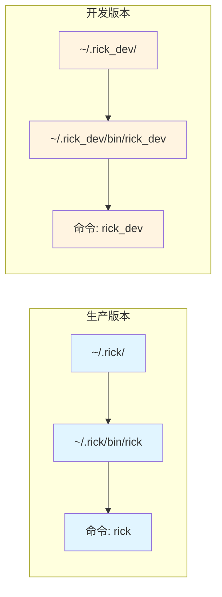

# Rick CLI 架构设计

## 概述

Rick CLI 是一个 Context-First AI Coding Framework，基于 Go 语言开发的命令行工具。它通过结构化的上下文管理和任务编排，帮助开发者高效地使用 AI 进行软件开发。

## 核心理论

### AICoding 公式

Rick 的核心理念可以用以下公式表达：

```
AICoding = Humans + Agents
其中：Agents = Models + Harness
```

**解释**：
- **Humans**：人类提供目标、决策和验证
- **Models**：AI 大模型（如 Claude）提供智能能力
- **Harness**：工具框架（Rick CLI）提供结构化的执行环境

这个公式强调了三者缺一不可：
- 没有人类的目标和决策，AI 无法产生有价值的输出
- 没有强大的 AI 模型，无法完成复杂的编码任务
- 没有结构化的 Harness，无法有效组织和传递上下文

### Context-First 理念

Rick 的设计哲学是 **Context-First**（上下文优先）：

1. **完整上下文 → 高质量输出**：AI 的输出质量直接取决于输入上下文的完整性和准确性
2. **结构化上下文**：通过标准化的文档结构（OKR、SPEC、Task、Debug）组织上下文
3. **上下文传递**：在任务执行的各个阶段自动传递和累积上下文
4. **上下文验证**：通过测试和验证确保上下文的正确性

### Context Loop vs Agent Loop

Rick 采用 **Context Loop**（上下文循环）而非传统的 Agent Loop（代理循环）：



**Context Loop 的特点**：
- **人类主导**：每个阶段都由人类决策何时进入下一阶段
- **上下文累积**：每个阶段的输出成为下一阶段的输入
- **显式验证**：通过测试脚本显式验证每个任务的完成情况
- **知识沉淀**：Learning 阶段将经验沉淀为可复用的知识

**与 Agent Loop 的对比**：

| 维度 | Context Loop (Rick) | Agent Loop (传统) |
|------|---------------------|-------------------|
| 控制方式 | 人类主导，显式控制 | Agent 自主决策 |
| 上下文管理 | 结构化存储和传递 | 隐式在对话中 |
| 验证机制 | 测试脚本显式验证 | Agent 自我评估 |
| 知识积累 | Learning 阶段沉淀 | 无系统化积累 |
| 适用场景 | 复杂工程项目 | 简单交互任务 |

## 三维信息组织

Rick 通过三个维度组织和管理项目信息：

### 1. 环境维度（Environment）

描述项目运行的环境和基础设施：

```
- 项目结构：目录组织、文件布局
- 技术栈：编程语言、框架、工具链
- 依赖关系：外部库、服务依赖
- 配置信息：环境变量、配置文件
```

**存储位置**：
- `SPEC.md`：技术规范
- `README.md`：项目说明
- `wiki/modules/`：模块文档

### 2. 验证维度（Validation）

定义如何验证任务是否正确完成：

```
- 测试方法：单元测试、集成测试
- 验证脚本：自动化测试脚本
- 验收标准：关键结果（Key Results）
- 质量指标：代码质量、性能指标
```

**存储位置**：
- `task.md`：测试方法章节
- `job_n/doing/test_taskX.sh`：测试脚本
- `OKR.md`：关键结果定义

### 3. 反馈维度（Feedback）

记录执行过程中的问题和解决方案：

```
- 错误记录：失败原因、错误信息
- 解决方案：修复方法、替代方案
- 经验总结：最佳实践、避坑指南
- 知识沉淀：Skills、Wiki 文档
```

**存储位置**：
- `job_n/doing/debug.md`：问题记录
- `job_n/learning/`：经验总结
- `.rick/skills/`：技能库
- `.rick/wiki/`：知识库

### 三维信息的协同



## 架构设计

### 整体架构



### 模块说明

#### 1. 命令层（Command Layer）

**职责**：处理用户命令，协调各模块完成任务

- **plan**：任务规划
  - 调用 Claude Code 生成任务分解
  - 创建工作空间和任务文件
  - 初始化 Git 仓库（首次）

- **doing**：任务执行
  - 加载和解析任务
  - 构建 DAG 并拓扑排序
  - 串行执行任务（生成测试 → 执行任务 → 验证 → 提交）
  - 失败重试机制

- **learning**：知识积累
  - 分析任务执行结果
  - 提取可复用技能
  - 更新知识库

#### 2. 核心模块层（Core Module Layer）

**workspace（工作空间管理）**：
- 创建和管理 `.rick/` 目录结构
- Job 目录管理（job_0, job_1, ...）
- 文件路径解析和验证

**parser（内容解析）**：
- Markdown 文档解析（使用 Goldmark）
- task.md 结构化解析（依赖、目标、测试方法）
- debug.md 问题记录解析
- OKR/SPEC 文档解析

**prompt（提示词管理）**⭐：
- 提示词模板管理（plan.md, doing.md, learning.md）
- 上下文构建和变量替换
- 多阶段提示词生成
- 项目信息聚合（OKR、SPEC、架构）

**executor（任务执行）**：
- DAG 构建和拓扑排序（Kahn 算法）
- 任务状态管理（pending/running/done/failed）
- 重试机制（默认最多 5 次）
- 测试脚本生成和执行

**git（版本控制）**：
- Git 仓库初始化和检测
- 自动提交（任务完成后）
- 分支管理

**callcli（Claude Code 集成）**：
- 调用 Claude Code CLI
- 提示词传递
- 输出解析

#### 3. 基础设施层（Infrastructure Layer）

**config（配置管理）**：
- 全局配置文件：`~/.rick/config.json`
- 配置加载和验证
- 默认值处理

**log（日志系统）**：
- 使用 Go 标准库 `log`
- 简单的文本日志格式
- 日志级别：INFO、ERROR

**filesystem（文件系统）**：
- 文件读写操作
- 目录创建和管理
- 路径解析

### 数据流



## 工作空间结构

### .rick/ 目录组织

```
.rick/
├── OKR.md                    # 项目目标和关键结果
├── SPEC.md                   # 技术规范
├── jobs/                     # 任务执行记录
│   ├── job_0/
│   │   ├── plan/            # 规划阶段
│   │   │   ├── tasks.json   # 任务定义（JSON 格式）
│   │   │   ├── task1.md     # 任务1详细说明
│   │   │   ├── task2.md     # 任务2详细说明
│   │   │   └── ...
│   │   ├── doing/           # 执行阶段
│   │   │   ├── test_task1.sh    # 任务1测试脚本
│   │   │   ├── test_task2.sh    # 任务2测试脚本
│   │   │   └── debug.md         # 问题记录
│   │   └── learning/        # 学习阶段
│   │       ├── analysis.md      # 执行分析
│   │       ├── summary.md       # 经验总结
│   │       └── validation_report.md  # 验证报告
│   ├── job_1/
│   └── ...
├── skills/                   # 技能库（可复用经验）
│   ├── index.md             # 技能索引
│   ├── skill1/
│   │   ├── description.md   # 技能描述
│   │   ├── implementation.md # 实现方法
│   │   └── examples/        # 使用示例
│   └── ...
└── wiki/                     # 知识库
    ├── index.md             # 知识库索引
    ├── architecture.md      # 架构文档
    ├── modules/             # 模块文档
    │   ├── workspace.md
    │   ├── parser.md
    │   └── ...
    └── tutorials/           # 教程文档
        ├── tutorial-1.md
        └── ...
```

### 文件格式规范

#### task.md 格式

```markdown
# 依赖关系
task1, task2

# 任务名称
任务标题

# 任务目标
具体目标描述

# 关键结果
1. 结果1
2. 结果2

# 测试方法
1. 测试步骤1
2. 测试步骤2
```

#### tasks.json 格式

```json
[
  {
    "task_id": "task1",
    "task_name": "任务名称",
    "dep": [],
    "state_info": {"status": "pending"}
  }
]
```

#### debug.md 格式

```markdown
# debug1: 问题描述

**问题描述**
详细的问题说明

**解决状态**
已解决/未解决

**解决方法**
具体的解决步骤
```

## 设计原则

### Rick vs Morty：简化设计

Rick CLI 在设计时，相比前身 Morty，遵循了极简主义原则：

| 维度 | Morty（复杂） | Rick（简化） |
|------|---------------|--------------|
| **日志系统** | 结构化 JSON 日志，多级别 | Go 标准库 `log`，文本格式 |
| **状态管理** | status/reset 命令 | 通过 Git 管理版本 |
| **配置系统** | 5 层配置级别 | 单一全局配置 `~/.rick/config.json` |
| **外部依赖** | 多个第三方库 | 优先使用 Go 标准库 |
| **初始化** | 显式 init 命令 | 自动初始化（首次 plan/doing） |
| **控制方式** | 部分自动化 | 完全人类控制 |

**简化原则**：

1. **最小化外部依赖**：
   - 仅使用必要的第三方库（如 Goldmark 用于 Markdown 解析）
   - 优先使用 Go 标准库实现功能

2. **移除冗余命令**：
   - 无需 `status` 命令：通过 `git status` 查看
   - 无需 `reset` 命令：通过 `git reset` 操作
   - 无需 `init` 命令：自动初始化

3. **简化日志系统**：
   - 使用标准库 `log` 包
   - 简单的文本格式，易于阅读
   - 仅记录关键操作和错误

4. **单一配置文件**：
   - 全局配置：`~/.rick/config.json`
   - 包含 Claude Code CLI 路径、最大重试次数等
   - 无项目级配置，避免配置冲突

5. **人类完全控制**：
   - 显式控制 plan → doing → learning 循环
   - 避免过度自动化
   - 保持人类决策权

### 核心设计原则

#### 1. Context-First（上下文优先）

**原则**：完整准确的上下文是高质量输出的前提

**实践**：
- 结构化存储项目信息（OKR、SPEC）
- 自动聚合上下文（项目背景、已完成任务、问题记录）
- 在提示词中传递完整上下文

#### 2. Explicit Validation（显式验证）

**原则**：通过测试脚本显式验证任务完成情况

**实践**：
- 每个任务包含测试方法章节
- 自动生成测试脚本
- 测试通过才标记任务完成

#### 3. Human-in-the-Loop（人类在环）

**原则**：人类主导决策，AI 辅助执行

**实践**：
- 人类决定何时进入下一阶段
- 超过重试限制后需人工干预
- Learning 阶段需人工审核

#### 4. Knowledge Accumulation（知识积累）

**原则**：将经验沉淀为可复用的知识

**实践**：
- Skills 库存储可复用技能
- Wiki 知识库记录模块文档
- Learning 阶段系统化总结经验

#### 5. Minimal Abstraction（最小抽象）

**原则**：避免过度抽象，保持简单

**实践**：
- 直接使用 Git 而非封装版本控制抽象
- 简单的文本日志而非结构化日志
- 串行执行而非复杂的并行调度

## 版本管理机制

### 双版本设计

Rick 支持生产版本和开发版本并行运行，用于自我重构：



### 版本特性

| 维度 | 生产版本 | 开发版本 |
|------|----------|----------|
| **安装路径** | `~/.rick/` | `~/.rick_dev/` |
| **二进制路径** | `~/.rick/bin/rick` | `~/.rick_dev/bin/rick_dev` |
| **命令名称** | `rick` | `rick_dev` |
| **配置文件** | `~/.rick/config.json` | `~/.rick_dev/config.json` |
| **用途** | 日常使用 | 开发和测试新功能 |

### 安装脚本

#### 安装生产版本

```bash
./install.sh                    # 源码安装
./install.sh --binary           # 二进制安装（Linux）
```

#### 安装开发版本

```bash
./install.sh --source --dev     # 源码安装到 ~/.rick_dev
```

#### 卸载

```bash
./uninstall.sh                  # 卸载生产版本
./uninstall.sh --dev            # 卸载开发版本
```

#### 更新

```bash
./update.sh                     # 更新生产版本
./update.sh --dev               # 更新开发版本
```

### 自我重构工作流

使用 Rick 重构 Rick 本身：

```bash
# 1. 安装开发版本
./install.sh --source --dev

# 2. 使用开发版本规划重构任务
rick_dev plan "重构 Rick 架构"

# 3. 使用开发版本执行重构
rick_dev doing job_1

# 4. 使用生产版本集成新功能
rick plan "集成新功能到生产版本"
rick doing job_2

# 5. 测试通过后卸载开发版本
./uninstall.sh --dev
```

## 关键技术

### 1. DAG 拓扑排序

**算法**：Kahn 算法

**实现**：
- 自实现，无外部依赖
- 构建邻接表和入度表
- BFS 遍历，按拓扑顺序输出

**用途**：
- 确定任务执行顺序
- 检测循环依赖
- 支持并行任务识别（入度为0的任务）

### 2. Markdown 解析

**库**：Goldmark（Go 标准 Markdown 解析器）

**用途**：
- 解析 task.md、debug.md、OKR.md、SPEC.md
- 提取章节标题和内容
- 解析列表和代码块

### 3. 提示词管理

**核心创新**：独立的提示词管理模块

**功能**：
- 模板管理（plan.md, doing.md, learning.md）
- 变量替换和上下文注入
- 多阶段提示词生成

**优势**：
- 提示词与代码分离，易于维护
- 支持模板复用和定制
- 便于 A/B 测试不同提示词策略

### 4. 失败重试机制

**策略**：
- 默认最多重试 5 次（可配置）
- 每次失败记录到 debug.md
- 下一轮执行时加载 debug.md 作为上下文
- 超过限制后退出，需人工干预

**优势**：
- 自动处理临时性错误
- 累积错误信息，帮助 AI 修正
- 避免无限循环，保持人类控制

### 5. Claude Code 集成

**方式**：调用 Claude Code CLI

**流程**：
1. 构建提示词文件
2. 调用 `claude-code` 命令
3. 传递提示词文件路径
4. 解析输出结果

**优势**：
- 复用 Claude Code 的强大能力
- 无需实现 AI 交互逻辑
- 支持多轮对话和工具调用

## 扩展性设计

### 1. 插件化提示词

未来可以支持自定义提示词模板：

```
~/.rick/templates/
├── plan.md          # 自定义 Plan 提示词
├── doing.md         # 自定义 Doing 提示词
└── learning.md      # 自定义 Learning 提示词
```

### 2. 多语言支持

当前支持 Go 项目，未来可扩展到其他语言：

```
~/.rick/templates/
├── go/
│   ├── plan.md
│   └── doing.md
├── python/
│   ├── plan.md
│   └── doing.md
└── javascript/
    ├── plan.md
    └── doing.md
```

### 3. 自定义测试框架

支持配置不同的测试框架：

```json
{
  "test_framework": "bash",  // bash, go-test, pytest, jest
  "test_timeout": 300
}
```

### 4. 并行执行

当前是串行执行，未来可支持并行执行独立任务：

```
- 识别无依赖的任务
- 并行执行多个任务
- 聚合执行结果
```

## 总结

Rick CLI 通过以下核心设计实现了高效的 AI Coding：

1. **Context-First 理念**：完整上下文 → 高质量输出
2. **Context Loop**：人类主导的 Plan → Doing → Learning 循环
3. **三维信息组织**：环境、验证、反馈三维度管理信息
4. **简化设计**：最小化依赖，避免过度抽象
5. **显式验证**：测试脚本显式验证任务完成
6. **知识积累**：Skills 和 Wiki 沉淀可复用知识
7. **双版本支持**：生产版和开发版并行，支持自我重构

Rick CLI 的架构设计体现了 **简单而强大** 的哲学：通过最小化的设计提供最大化的价值。
