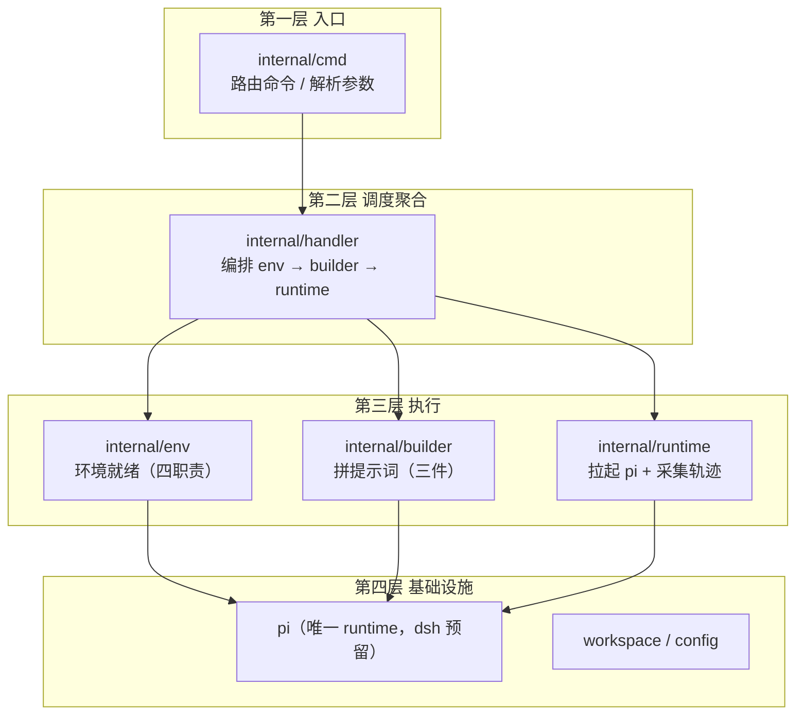

# Rick CLI 架构设计

## 概述

Rick CLI 是一个 Context-First AI Coding Framework。它把 AI coding 拆解为「方法 + 实现」：rick 用自然语言描述方法（loops/skills/domain/spec），pi（当前唯一的 agent runtime）负责实际的 agentic 执行。这条边界让 rick 收敛为一个**引导程序**（env 保证 pi 就绪 → builder 拼提示词 → runtime 拉 pi）。

## AICoding 公式

```
AICoding = Humans + Agents
其中：Agents = Models + Harness
```

- **Humans**：提供目标、决策和验证
- **Models**：AI 大模型（经 pi 调用）
- **Harness**：rick 提供结构化的执行环境（上下文管理、工作流、验证）

## 三层金字塔

Rick 的源码按**三层金字塔**组织（第四层是基础设施），完整契约见 `.rick/domain/rick-spec.md`（四要素：模块边界 / 职责 / 接口契约 / 验收标准）。


```mermaid
flowchart TD
    subgraph L1["第一层 入口"]
        CLI["internal/cmd<br/>路由命令 / 解析参数"]
    end
    subgraph L2["第二层 调度聚合"]
        HANDLER["internal/handler<br/>编排 env → builder → runtime"]
    end
    subgraph L3["第三层 执行"]
        ENV["internal/env<br/>环境就绪（四职责）"]
        BUILDER["internal/builder<br/>拼提示词（三件）"]
        RUNTIME["internal/runtime<br/>拉起 pi + 采集轨迹"]
    end
    subgraph L4["第四层 基础设施"]
        PI["pi（唯一 runtime，dsh 预留）"]
        WS["workspace / config"]
    end

    CLI --> HANDLER
    HANDLER --> ENV
    HANDLER --> BUILDER
    HANDLER --> RUNTIME
    ENV --> PI
    BUILDER --> PI
    RUNTIME --> PI
```

### 分层定义

| 层 | 包 | 职责 |
|----|----|------|
| 第一层 入口 | `internal/cmd` | 路由命令（plan/doing/easy/learning/dream/ctrl/human-loop/tools）、解析参数与 flag |
| 第二层 调度聚合 | `internal/handler` | 编排 env → builder → runtime，并把 sessionID 持久化到 job 目录 |
| 第三层 执行 | `internal/env` | 保证运行环境就绪（env 四职责） |
| 第三层 执行 | `internal/builder` | 拼接提示词产物（templates + pibuilder + xxxxbuilder） |
| 第三层 执行 | `internal/runtime` | 拉起 pi + 内部校验 session 就绪 + 采集行为轨迹 |
| 第四层 基础设施 | `pi` / `internal/workspace` / `internal/config` | 当前 runtime / 路径解析 / 配置加载 |

### 边界规则

- **逐级往下**：上层调下层，下层不回调上层。
- **例外（组合根 DIP）**：`cmd` 的 `RunE` 懒加载实例化 `piRuntime`/`piEnv`/`pibuilder` 注入 `handler`，是 DIP 组合根模式。
- **例外（叶子基础设施）**：`workspace`/`config` 可被任意层直接使用。

### 已删除的冗余包

三层金字塔重构（task8）后，6 个旧包已删除，职责下沉 pi：

| 旧包 | 去处 |
|------|------|
| `internal/executor` | dag 调度 → pi `workflowScript` 编排 |
| `internal/parser` | 读/校验 → pi（plan/task 解析收口到 builder） |
| `internal/actpath` | 行为轨迹 → 收口到 `runtime.Trace` |
| `internal/logging` | 死代码，删除 |
| `internal/git` | → 下沉 pi 脚本 |
| `internal/agent` | 失去消费者（单一 runtime pi 后不再需要抽象），删除 |

## env 四职责

`internal/env` 保证 rick 在当前机器的运行环境就绪：

1. 安装/更新 pi agent
2. 安装/更新 pi 生态扩展/插件/skill
3. 安装/更新 rick 自有 hook/skill/agent 定制
4. 提供 pi 功能点就绪 check 函数（不含 session，session 归 runtime）

## 下沉策略（rick 做薄）

rick 收敛为引导程序，dag 调度与门禁不再由 rick 维护：

| 旧职责 | 下沉去向 |
|--------|----------|
| dag 调度 | pi `workflowScript` 编排（`runs.run` + `await` 按依赖拓扑顺序执行） |
| 门禁（doing_check/plan_check） | pi hook（rick-gates 扩展）+ 确定性脚本 `.rick/skills/rick-gates/helper.py` |
| think/research/exporter | pi 自定义 agent（经 env 职责 3 落盘 `agents/{name}.md`） |

`rick doing` 的实际流程：builder 生成含 `workflowScript` 的 doing prompt → runtime 拉起 pi（`--mode json`）→ pi parent 用 `subagent` 工具触发 workflowScript，按依赖拓扑顺序执行各 task → 每个 worker 完成后 commit 并回传 commit_hash → pi 会话 `agent_settled` 后，rick 侧跑确定性门禁脚本校验 tasks.json。

## spec 信息内核

`spec` 是 rick 的**信息内核**——结构化自然语言描述的工程实现契约。只要 spec 无歧义地描述验收标准，丢弃一切源码即可 AI coding 出**功能等价**的 rick。

- **规范层**：`.rick/domain/spec.md`（spec 是什么 + 四要素模板 + 验收标准）
- **实例层**：`.rick/domain/rick-spec.md`（rick 的第一份 spec，四要素逐节填写）

### 四要素

每份 spec 必须依次包含以下四节：

1. **模块边界**：有哪些模块、边界在哪、谁调用谁
2. **职责**：每个模块做什么、不做什么
3. **接口契约**：模块之间如何通信、进出参是什么
4. **验收标准**：怎样算做对（可运行、可判定的命令/断言清单）

### 功能等价判据

| 判据 | 命令 | 通过标准 |
|------|------|----------|
| 单元测试 | `go test ./...` | 全部 `ok`，exit 0 |
| 集成测试 | `bash tests/tools_integration_test.sh` | 全绿 |
| 构建 | `./scripts/build.sh` | 成功产出 `./bin/rick` |
| dry-run | `./bin/rick <cmd> --dry-run` | 输出完整 prompt，无未替换模板变量 |
| check | `./bin/rick tools learning_check/dream_check <job_id>` | `✅ PASS` |

## 单一 runtime + 扩展 seam

当前 pi 是唯一 runtime，为将来 deepseek harness(dsh) 预留三扩展 seam + 一个 config 字段：

- **`Runtime`**（`internal/runtime`）：接口方法 `Name` / `Run`
- **`RuntimeEnv`**（`internal/env`）：接口方法 `Ensure` / `DeployCustomizations` / `CheckReady`
- **`RuntimeBuilder`**（`internal/builder`）：builder/xxxxbuilder 转义层
- **config `runtime` 字段**：默认 `pi`

切换规则：新增 dsh 只实现并注册 `dshRuntime/dshEnv/dshBuilder`，cli/handler/方法层 templates 不改。

## 双维度知识体系

| 维度 | 载体 | 性质 | 来源 |
|------|------|------|------|
| 执行 | `loops/` | 可复用工作流（带验收标准的迭代控制流） | dream 提炼 |
| 执行 | `skills/` | 原子能力（触发条件 → 执行步骤） | dream / learning 提炼 |
| 价值 | `domain/` | 事实信息（spec 契约 / 命令规范 / 架构） | 人类维护 + learning 补充 |
| 价值 | `draft/` | 个人判断（human-loop 思考记录、RFC） | human-loop 产出 |

`domain` 可被代码验证；`draft` 是人类主观判断。判断一旦被代码事实固化，可迁移到 `domain`；`domain` 过时部分由 `dream` 清理。

---

## v4.4 架构升级：确定性门禁体系 + skill 单源复用

### 确定性门禁三件套（rick-gates hook）

所有确定性逻辑收口到 pi extension（`~/.rick/pi/agent/extensions/rick-gates/index.ts`），Go 侧保持薄：

| 工具 | 职责 | 触发点 |
|------|------|--------|
| `grilling_gate` | 追问产出物校验（design-tree OKR/分层/research 简报/提问痕迹） | grilling 声明完成后 |
| `pipeline_gate` | 流水线结构校验（分层 DAG/写域互斥/gate 存在） | doing 派发前 |
| `level_complete` | 层门禁验收提交（跑 human 门禁 → 绿 → 单次 commit → tasks.json 批量写） | 每层 impl 完成后 |

**原则**：worker 不碰 git；tasks.json 只由 hook 写；门禁（gate{N}.py 及其集成测试）是 human 确认的层验收唯一标准，agent 不得修改。

### skill 单源复用

- 每个 cmd 模板 = loop 外壳（编排节奏 + skill 路径注入）；可复用操作步骤由 skill 承载
- section builder 收敛：prompt 包唯一实现（BuildGrillingSection/BuildRequirementSection/BuildSessionWrapSection/BuildCtxSection/LoadDoingLoopContent），builder 全委托——dry-run 与真实路径跑同一函数
- 探针法验证：改 skill 一处（插入/删除注释标记），全部 cmd 的渲染同步变化

### 阶段提示词 = 系统提示词（compaction 持久）

`--append-system-prompt <promptFile>` 注入协议全文（pi 自动检测文件路径读取内容），初始 user 消息只是启动触发——长会话 compaction 不丢协议。

### 会话恢复（--resume）

`pi --session-id <uuid>` 幂等原语（不存在则创建，存在则恢复）：各阶段启动时落盘 session_id（plan→plan/、human-loop→loop_N/、doing→doing/），`--resume` 读同一 id 恢复完整上下文。
