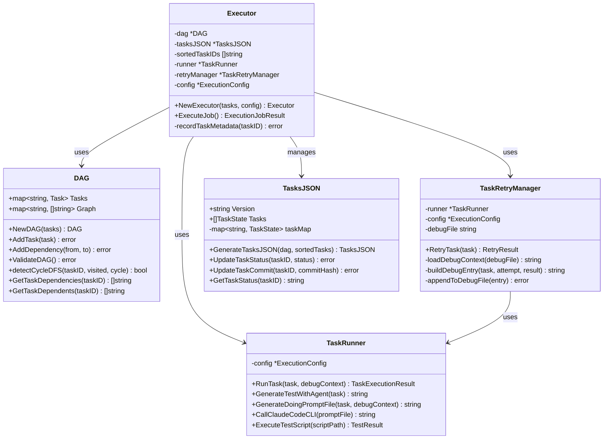

# DAG 执行引擎详解

## 概述

Rick CLI 的任务执行引擎基于 **DAG (Directed Acyclic Graph，有向无环图)** 数据结构，实现了可靠的任务依赖管理和串行执行。本文档深入讲解 DAG 执行引擎的核心组件、算法实现和最佳实践。

### 核心特性

- **依赖管理**: 自动处理任务间的依赖关系
- **拓扑排序**: 使用 Kahn 算法确定任务执行顺序
- **环检测**: 使用 DFS 算法检测并防止循环依赖
- **重试机制**: 智能重试失败任务，支持上下文传递
- **状态追踪**: 通过 tasks.json 实时记录任务状态

## 架构概览



## DAG 数据结构

### 核心类型定义

```go
// DAG represents a directed acyclic graph of tasks
type DAG struct {
    Tasks map[string]*parser.Task  // task_id -> Task
    Graph map[string][]string      // task_id -> dependent task_ids
}
```

### 关键设计

1. **Tasks 映射**: 存储所有任务对象，键为 task_id
2. **Graph 映射**: 存储依赖关系，格式为 `from -> [to1, to2, ...]`
   - `from`: 被依赖的任务
   - `to`: 依赖 from 的任务（必须在 from 完成后执行）

### 示例

假设有以下任务依赖关系：
- task1: 无依赖
- task2: 无依赖
- task3: 依赖 task1, task2
- task4: 依赖 task3

DAG 结构：
```go
Tasks = {
    "task1": &Task{ID: "task1", Dependencies: []},
    "task2": &Task{ID: "task2", Dependencies: []},
    "task3": &Task{ID: "task3", Dependencies: ["task1", "task2"]},
    "task4": &Task{ID: "task4", Dependencies: ["task3"]},
}

Graph = {
    "task1": ["task3"],        // task3 depends on task1
    "task2": ["task3"],        // task3 depends on task2
    "task3": ["task4"],        // task4 depends on task3
    "task4": [],               // task4 has no dependents
}
```

## 拓扑排序算法

### Kahn 算法实现

Rick CLI 使用 **Kahn 算法** 进行拓扑排序，该算法基于入度（in-degree）的概念。

#### 算法步骤

1. **计算入度**: 统计每个任务的依赖数量（入度）
2. **初始化队列**: 将所有入度为 0 的任务加入队列
3. **处理队列**:
   - 从队列取出一个任务（入度为 0）
   - 将该任务加入结果列表
   - 对该任务的所有依赖者，减少其入度
   - 如果某个依赖者的入度变为 0，加入队列
4. **验证结果**: 如果处理的任务数不等于总任务数，说明存在环

#### 伪代码

```
function TopologicalSort(dag):
    inDegrees = calculateInDegrees(dag)
    queue = []

    // 初始化队列
    for each task in dag.Tasks:
        if inDegrees[task] == 0:
            queue.append(task)

    result = []

    // 处理队列
    while queue is not empty:
        current = queue.dequeue()
        result.append(current)

        // 处理依赖者
        for each dependent in dag.GetTaskDependents(current):
            inDegrees[dependent]--
            if inDegrees[dependent] == 0:
                queue.append(dependent)

    // 验证是否存在环
    if len(result) != len(dag.Tasks):
        return error "cycle detected"

    return result
```

#### Go 实现

```go
func TopologicalSort(dag *DAG) ([]string, error) {
    // Calculate in-degrees for all tasks
    inDegrees := calculateInDegrees(dag)

    // Initialize queue with all tasks that have in-degree 0
    queue := make([]string, 0)
    for taskID, degree := range inDegrees {
        if degree == 0 {
            queue = append(queue, taskID)
        }
    }

    // Process tasks from queue
    result := make([]string, 0, len(dag.Tasks))
    for len(queue) > 0 {
        current := queue[0]
        queue = queue[1:]
        result = append(result, current)

        // For each dependent of the current task
        dependents, _ := dag.GetTaskDependents(current)
        for _, dependent := range dependents {
            inDegrees[dependent]--
            if inDegrees[dependent] == 0 {
                queue = append(queue, dependent)
            }
        }
    }

    // Check if all tasks were processed
    if len(result) != len(dag.Tasks) {
        return nil, fmt.Errorf("cycle detected in DAG")
    }

    return result, nil
}
```

#### 时间复杂度

- **时间复杂度**: O(V + E)，其中 V 是任务数，E 是依赖关系数
- **空间复杂度**: O(V)

### 入度计算

```go
func calculateInDegrees(dag *DAG) map[string]int {
    inDegrees := make(map[string]int)

    // Initialize all tasks with in-degree 0
    for taskID := range dag.Tasks {
        inDegrees[taskID] = 0
    }

    // Count dependencies for each task
    for taskID, task := range dag.Tasks {
        for range task.Dependencies {
            inDegrees[taskID]++
        }
    }

    return inDegrees
}
```

## 环检测机制

### DFS 算法实现

Rick CLI 使用 **DFS (Depth-First Search，深度优先搜索)** 算法检测 DAG 中的环。

#### 算法原理

使用三色标记法：
- **白色 (0)**: 未访问
- **灰色 (1)**: 正在访问（在当前 DFS 路径中）
- **黑色 (2)**: 已访问完成

如果在 DFS 过程中遇到灰色节点，说明存在回边（back edge），即检测到环。

#### 伪代码

```
function detectCycleDFS(taskID, visited, cycle):
    visited[taskID] = GRAY  // 标记为正在访问

    for each dependent in graph[taskID]:
        if visited[dependent] == GRAY:
            // 发现回边，检测到环
            cycle.append(taskID -> dependent)
            return true

        if visited[dependent] == WHITE:
            if detectCycleDFS(dependent, visited, cycle):
                cycle.prepend(taskID)
                return true

    visited[taskID] = BLACK  // 标记为已访问
    return false
```

#### Go 实现

```go
func (d *DAG) detectCycleDFS(taskID string, visited map[string]int, cycle *[]string) bool {
    visited[taskID] = 1  // Mark as visiting (GRAY)

    // Check all tasks that depend on this task
    for _, dependent := range d.Graph[taskID] {
        if visited[dependent] == 1 {
            // Found a back edge, cycle detected
            *cycle = append(*cycle, taskID, "->", dependent)
            return true
        }
        if visited[dependent] == 0 {
            if d.detectCycleDFS(dependent, visited, cycle) {
                *cycle = append([]string{taskID, "->"}, *cycle...)
                return true
            }
        }
    }

    visited[taskID] = 2  // Mark as visited (BLACK)
    return false
}

func (d *DAG) ValidateDAG() error {
    visited := make(map[string]int)
    var cycle []string

    for taskID := range d.Tasks {
        if visited[taskID] == 0 {
            if d.detectCycleDFS(taskID, visited, &cycle) {
                return fmt.Errorf("cycle detected in DAG: %v", cycle)
            }
        }
    }

    return nil
}
```

#### 时间复杂度

- **时间复杂度**: O(V + E)
- **空间复杂度**: O(V)

## 任务执行流程

### 完整执行序列

```mermaid
sequenceDiagram
    participant User
    participant Executor
    participant DAG
    participant TopologicalSort
    participant TaskRetryManager
    participant TaskRunner
    participant ClaudeCLI
    participant TestScript
    participant Git

    User->>Executor: ExecuteJob()
    Executor->>DAG: NewDAG(tasks)
    DAG->>DAG: ValidateDAG() (DFS cycle detection)
    DAG-->>Executor: DAG instance

    Executor->>TopologicalSort: TopologicalSort(dag)
    TopologicalSort->>TopologicalSort: Kahn algorithm
    TopologicalSort-->>Executor: sortedTaskIDs

    Executor->>Executor: Generate tasks.json
    Executor->>Executor: Save tasks.json

    loop For each task in sortedTaskIDs
        Executor->>TaskRetryManager: RetryTask(task)

        loop Retry loop (max 5 attempts)
            TaskRetryManager->>TaskRetryManager: Load debug.md context
            TaskRetryManager->>TaskRunner: RunTask(task, debugContext)

            TaskRunner->>TaskRunner: GenerateTestWithAgent(task)
            TaskRunner->>ClaudeCLI: Generate test script
            ClaudeCLI-->>TaskRunner: test_script.py

            TaskRunner->>TaskRunner: GenerateDoingPromptFile(task, debugContext)
            TaskRunner->>ClaudeCLI: Execute task (--dangerously-skip-permissions)
            ClaudeCLI-->>TaskRunner: Task output

            TaskRunner->>TestScript: Execute test_script.py
            TestScript-->>TaskRunner: TestResult (pass/fail)

            alt Test passed
                TaskRunner-->>TaskRetryManager: Success
                TaskRetryManager-->>Executor: Success
                Executor->>Git: git commit
                Executor->>Executor: Update tasks.json (status=success)
                break
            else Test failed
                TaskRunner-->>TaskRetryManager: Failed
                TaskRetryManager->>TaskRetryManager: Append to debug.md
                TaskRetryManager->>TaskRetryManager: Retry (if attempts < max)
            end
        end

        alt Max retries exceeded
            TaskRetryManager-->>Executor: max_retries_exceeded
            Executor->>Executor: Update tasks.json (status=failed)
            Executor->>User: Exit with error (manual intervention required)
        end
    end

    Executor-->>User: ExecutionJobResult
```

### 执行阶段详解

#### 1. DAG 构建与验证

```go
// Build DAG from tasks
dag, err := NewDAG(tasks)
if err != nil {
    return nil, fmt.Errorf("failed to build DAG: %w", err)
}
```

**步骤**:
1. 创建 Tasks 和 Graph 映射
2. 添加所有任务到 DAG
3. 添加所有依赖关系
4. 使用 DFS 验证无环

#### 2. 拓扑排序

```go
// Perform topological sort
sortedTaskIDs, err := TopologicalSort(dag)
if err != nil {
    return nil, fmt.Errorf("failed to perform topological sort: %w", err)
}
```

**输出**: 任务 ID 列表，按执行顺序排列

#### 3. 生成 tasks.json

```go
// Generate tasks.json
tasksJSON, err := GenerateTasksJSON(dag, sortedTaskIDs)
```

**tasks.json 结构**:
```json
{
  "version": "1.0",
  "created_at": "2026-03-16T10:00:00Z",
  "updated_at": "2026-03-16T10:30:00Z",
  "tasks": [
    {
      "task_id": "task1",
      "task_name": "任务名称",
      "task_file": "task1.md",
      "status": "success",
      "dependencies": [],
      "attempts": 1,
      "commit_hash": "abc123...",
      "created_at": "2026-03-16T10:00:00Z",
      "updated_at": "2026-03-16T10:15:00Z"
    }
  ]
}
```

#### 4. 串行执行任务

```go
for i, taskID := range sortedTaskIDs {
    // Update task status to running
    tasksJSON.UpdateTaskStatus(taskID, "running")

    // Execute task with retry logic
    retryResult, err := retryManager.RetryTask(task)

    // Update task status based on result
    if retryResult.Status == "success" {
        tasksJSON.UpdateTaskStatus(taskID, "success")
        recordTaskMetadata(taskID)  // Record commit hash
    } else {
        tasksJSON.UpdateTaskStatusWithError(taskID, "failed", retryResult.LastError)
    }

    // Save updated tasks.json
    SaveTasksJSON(tasksJSONPath, tasksJSON)
}
```

#### 5. 测试生成与执行

**测试生成**:
```go
func (tr *TaskRunner) GenerateTestWithAgent(task *parser.Task) (string, error) {
    // Build test generation prompt
    testPromptFile := buildTestGenerationPromptFile(task, testScriptPath)

    // Call Claude to generate test script
    cmd := exec.Command("claude", "--dangerously-skip-permissions", testPromptFile)
    cmd.Run()

    // Verify test script was created
    if _, err := os.Stat(testScriptPath); os.IsNotExist(err) {
        return "", fmt.Errorf("test script was not created")
    }

    return testScriptPath, nil
}
```

**测试执行**:
```go
func (tr *TaskRunner) ExecuteTestScript(scriptPath string) (*TestResult, string, error) {
    cmd := exec.Command("python3", scriptPath)

    // Execute with timeout
    output, err := cmd.Output()

    // Parse JSON result
    testResult := parseTestResult(output)
    return testResult, output, nil
}
```

**测试脚本格式**:
```python
#!/usr/bin/env python3
import json
import sys
import os

def main():
    errors = []

    # Test step 1
    if not os.path.exists('file.txt'):
        errors.append('file.txt does not exist')

    # Test step 2
    # ...

    result = {
        'pass': len(errors) == 0,
        'errors': errors
    }
    print(json.dumps(result))
    sys.exit(0 if result['pass'] else 1)

if __name__ == '__main__':
    main()
```

#### 6. Git 提交

任务成功后自动提交：
```go
func (e *Executor) recordTaskMetadata(taskID string) error {
    // Record task file name
    taskFileName := fmt.Sprintf("%s.md", taskID)
    tasksJSON.UpdateTaskFile(taskID, taskFileName)

    // Get current git commit hash
    commitHash := getCurrentCommitHash()

    // Record commit hash
    tasksJSON.UpdateTaskCommit(taskID, commitHash)

    return nil
}
```

## 重试机制详解

### RetryManager 设计

```go
type TaskRetryManager struct {
    runner    *TaskRunner
    config    *ExecutionConfig
    debugFile string  // debug.md path
}
```

### 重试循环

```go
func (trm *TaskRetryManager) RetryTask(task *parser.Task) (*RetryResult, error) {
    maxRetries := trm.config.MaxRetries  // Default: 5

    for attempt := 1; attempt <= maxRetries; attempt++ {
        // 1. Load debug context from debug.md
        debugContext := trm.loadDebugContext(trm.debugFile)

        // 2. Execute the task with debug context
        execResult, err := trm.runner.RunTask(task, debugContext)

        // 3. Check if task succeeded
        if execResult.Status == "success" {
            return &RetryResult{Status: "success"}, nil
        }

        // 4. Task failed, update debug.md
        debugEntry := trm.buildDebugEntry(task, attempt, maxRetries, execResult, debugContext)
        trm.appendToDebugFile(debugEntry)

        // 5. Continue to next retry
        if attempt < maxRetries {
            time.Sleep(time.Duration(attempt) * time.Second)
            continue
        }
    }

    // Max retries exceeded
    return &RetryResult{Status: "max_retries_exceeded"}, nil
}
```

### debug.md 上下文传递

#### debug.md 格式

```markdown
# Debug Log

This file contains debugging information for failed task executions.

## debug1: Task task3 - Attempt 1/5

**现象 (Phenomenon)**:
- test did not pass: file.txt does not exist

**复现 (Reproduction)**:
- Task: 创建配置文件
- Goal: 创建 config.json 文件
- Attempt: 1 of 5

**猜想 (Hypothesis)**:
- 文件或资源不存在 - 可能是路径错误或文件未创建

**验证 (Verification)**:
- Review the output below
- Check if files were created/modified as expected
- Verify test script logic is correct

**修复 (Fix)**:
- Will retry with updated context
- Agent should learn from this failure

**进展 (Progress)**:
- Status: 🔄 重试中 - Attempt 1/5

**输出 (Output)**:
```
Claude output:
I've created the config.json file...
(truncated)
```
```

#### 上下文加载

```go
func (trm *TaskRetryManager) loadDebugContext(debugFile string) string {
    content, err := os.ReadFile(debugFile)
    if err != nil {
        return ""  // File might not exist yet
    }
    return string(content)
}
```

#### 上下文注入

在生成 doing prompt 时，将 debug.md 内容附加到提示词末尾：

```go
func (tr *TaskRunner) GenerateDoingPromptFile(task *parser.Task, debugContext string) (string, error) {
    // Generate base doing prompt
    doingPromptFile := prompt.GenerateDoingPromptFile(task, 0, contextMgr, promptMgr)

    // Append debug context if available
    if debugContext != "" {
        content, _ := os.ReadFile(doingPromptFile)
        debugSection := "\n\n## Previous Debugging Context\n\n" + debugContext +
            "\n\nPlease review the debugging context above and avoid the same mistakes.\n"
        os.WriteFile(doingPromptFile, append(content, []byte(debugSection)...), 0644)
    }

    return doingPromptFile, nil
}
```

### 错误分析

```go
func (trm *TaskRetryManager) analyzeError(errMsg string, output string) string {
    hypotheses := []string{}

    if strings.Contains(errMsg, "timeout") {
        hypotheses = append(hypotheses, "执行超时 - 可能是任务太复杂或资源不足")
    } else if strings.Contains(errMsg, "not found") {
        hypotheses = append(hypotheses, "文件或资源不存在 - 可能是路径错误或文件未创建")
    } else if strings.Contains(errMsg, "test did not pass") {
        hypotheses = append(hypotheses, "测试未通过 - 任务执行结果不符合预期")
    }

    return strings.Join(hypotheses, "; ")
}
```

### 超过重试限制

当任务超过最大重试次数后：

1. **返回状态**: `max_retries_exceeded`
2. **更新 tasks.json**: 状态设为 `failed`
3. **退出进程**: Executor 返回错误，任务执行终止
4. **人工干预**: 用户需要：
   - 检查 debug.md 了解失败原因
   - 修改 task.md 或代码
   - 重新运行 `rick doing job_n`

## 代码示例

### 完整执行流程

```go
package main

import (
    "github.com/sunquan/rick/internal/executor"
    "github.com/sunquan/rick/internal/parser"
)

func main() {
    // 1. Parse tasks from task.md files
    tasks, _ := parser.ParseTasksFromDirectory("plan/tasks")

    // 2. Create execution config
    config := &executor.ExecutionConfig{
        MaxRetries:     5,
        TimeoutSeconds: 600,
        ClaudeCodePath: "claude",
        WorkspaceDir:   ".rick/jobs/job_1/doing",
    }

    // 3. Create executor
    executor, err := executor.NewExecutor(tasks, config, ".rick/jobs/job_1/doing", "job_1")
    if err != nil {
        panic(err)
    }

    // 4. Execute job
    result, err := executor.ExecuteJob()
    if err != nil {
        panic(err)
    }

    // 5. Check result
    if result.Status == "completed" {
        fmt.Printf("✓ Job completed: %d/%d tasks succeeded\n",
            result.SuccessfulTasks, result.TotalTasks)
    } else {
        fmt.Printf("✗ Job failed: %d/%d tasks succeeded\n",
            result.SuccessfulTasks, result.TotalTasks)
        fmt.Println(result.ErrorSummary)
    }
}
```

### 自定义 DAG 构建

```go
// Create DAG manually
dag := &executor.DAG{
    Tasks: make(map[string]*parser.Task),
    Graph: make(map[string][]string),
}

// Add tasks
task1 := &parser.Task{ID: "task1", Name: "Task 1", Dependencies: []}
task2 := &parser.Task{ID: "task2", Name: "Task 2", Dependencies: []}
task3 := &parser.Task{ID: "task3", Name: "Task 3", Dependencies: ["task1", "task2"]}

dag.AddTask(task1)
dag.AddTask(task2)
dag.AddTask(task3)

// Add dependencies
dag.AddDependency("task1", "task3")
dag.AddDependency("task2", "task3")

// Validate DAG
if err := dag.ValidateDAG(); err != nil {
    panic(err)
}

// Perform topological sort
sortedTasks, err := executor.TopologicalSort(dag)
fmt.Println("Execution order:", sortedTasks)
// Output: Execution order: [task1 task2 task3]
```

## 最佳实践

### 1. 任务设计原则

**✓ 推荐**:
```markdown
# 依赖关系
task1, task2

# 任务名称
集成模块 A 和模块 B

# 任务目标
创建集成层，连接模块 A 和模块 B 的接口

# 关键结果
1. 创建 integration.go 文件
2. 实现 ConnectModules() 函数
3. 添加单元测试

# 测试方法
验证文件已创建：`test -f integration.go && echo "PASS" || echo "FAIL"`
运行测试：`go test ./internal/integration && echo "PASS" || echo "FAIL"`
```

**✗ 避免**:
```markdown
# 任务名称
完成所有集成工作并修复所有 bug

# 任务目标
把系统集成起来
```

### 2. 依赖关系设计

**并行基础任务**:
```
task1 (无依赖)
task2 (无依赖)
task3 (无依赖)
```

**串行依赖任务**:
```
task4 (依赖 task1, task2)
task5 (依赖 task3)
task6 (依赖 task4, task5)
```

**避免循环依赖**:
```
✗ task1 -> task2 -> task3 -> task1  (会被 DFS 检测到)
```

### 3. 测试脚本编写

**原则**:
- 每个测试步骤独立验证
- 使用绝对路径检查文件
- 返回清晰的错误信息
- 设置合理的超时时间

**示例**:
```python
#!/usr/bin/env python3
import json
import sys
import os
import subprocess

def main():
    errors = []
    project_root = os.getcwd()

    # Test 1: File exists
    target_file = os.path.join(project_root, "internal/integration/integration.go")
    if not os.path.exists(target_file):
        errors.append(f"File does not exist: {target_file}")

    # Test 2: Contains expected function
    if os.path.exists(target_file):
        with open(target_file, 'r') as f:
            content = f.read()
            if 'func ConnectModules()' not in content:
                errors.append("Function ConnectModules() not found in integration.go")

    # Test 3: Unit tests pass
    result = subprocess.run(
        ['go', 'test', './internal/integration'],
        capture_output=True,
        text=True,
        timeout=30
    )
    if result.returncode != 0:
        errors.append(f"Unit tests failed: {result.stderr}")

    # Return result
    test_result = {
        'pass': len(errors) == 0,
        'errors': errors
    }
    print(json.dumps(test_result))
    sys.exit(0 if test_result['pass'] else 1)

if __name__ == '__main__':
    main()
```

### 4. 重试策略

**配置建议**:
```go
config := &executor.ExecutionConfig{
    MaxRetries:     5,   // 简单任务: 3, 复杂任务: 5-7
    TimeoutSeconds: 600, // 10 分钟（Claude 执行）
}
```

**重试场景**:
- ✓ 测试脚本失败（可能是临时问题）
- ✓ 文件路径错误（debug.md 会提供上下文）
- ✓ 部分功能缺失（可以增量修复）
- ✗ 任务定义不清（应修改 task.md）
- ✗ 依赖关系错误（应重新规划）

### 5. debug.md 使用

**查看失败原因**:
```bash
cat .rick/jobs/job_1/doing/debug.md
```

**常见失败模式**:
1. **文件路径错误**: 检查是否使用了正确的相对/绝对路径
2. **测试脚本错误**: 测试脚本本身可能有 bug
3. **任务粒度过大**: 将任务拆分为更小的子任务
4. **依赖未满足**: 确认前置任务已成功完成

### 6. 性能优化

**DAG 构建优化**:
- 使用 map 存储任务，O(1) 查找
- 预分配切片容量，减少内存分配

**拓扑排序优化**:
- 使用队列而非递归，避免栈溢出
- 入度计算一次完成，避免重复计算

**任务执行优化**:
- 测试脚本生成只执行一次
- debug.md 增量追加，不重复读取
- tasks.json 每次任务更新后立即保存

## 故障排查

### 问题 1: 循环依赖错误

**错误信息**:
```
cycle detected in DAG: [task1 -> task2 -> task3 -> task1]
```

**解决方法**:
1. 检查 task.md 的依赖关系声明
2. 绘制依赖关系图，找出环路
3. 调整任务依赖，打破环路

### 问题 2: 任务执行超时

**错误信息**:
```
Claude Code CLI timeout after 600 seconds
```

**解决方法**:
1. 增加 TimeoutSeconds 配置
2. 检查任务是否过于复杂
3. 拆分大任务为多个小任务

### 问题 3: 测试脚本失败

**错误信息**:
```
test did not pass: file.txt does not exist
```

**解决方法**:
1. 查看 debug.md 的详细输出
2. 检查文件路径是否正确
3. 验证测试脚本逻辑
4. 手动运行测试脚本调试

### 问题 4: 超过重试限制

**错误信息**:
```
task failed after 5 attempts: test did not pass
```

**解决方法**:
1. 阅读 debug.md 的所有重试记录
2. 识别重复出现的错误模式
3. 修改 task.md 的任务定义或测试方法
4. 重新运行 `rick doing job_n`

## 总结

Rick CLI 的 DAG 执行引擎提供了：

1. **可靠的依赖管理**: 通过 DAG 数据结构和拓扑排序
2. **智能的环检测**: 使用 DFS 算法防止循环依赖
3. **强大的重试机制**: 支持上下文传递和错误分析
4. **完整的状态追踪**: 通过 tasks.json 实时记录

核心算法：
- **Kahn 算法**: 拓扑排序，时间复杂度 O(V + E)
- **DFS 算法**: 环检测，时间复杂度 O(V + E)

最佳实践：
- 任务粒度控制在 5-10 分钟
- 清晰定义依赖关系
- 编写可靠的测试脚本
- 合理配置重试策略
- 充分利用 debug.md 上下文

通过遵循这些原则和实践，您可以充分发挥 Rick CLI 的 DAG 执行引擎的能力，实现高效、可靠的 AI 辅助编程工作流。
