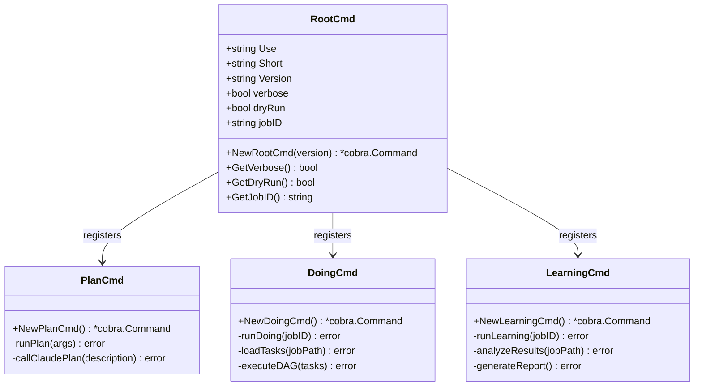

# cmd - 命令处理器模块

## 模块职责

`cmd` 模块是 Rick CLI 的命令行接口层，负责处理用户输入的命令、解析参数、执行相应的业务逻辑。该模块基于 [Cobra](https://github.com/spf13/cobra) 框架构建，提供了清晰的命令层次结构和统一的参数处理机制。

**核心职责**：
- 定义和注册 CLI 命令（plan、doing、learning）
- 解析和验证命令行参数和标志
- 协调各模块完成业务逻辑
- 提供统一的错误处理和用户反馈

## 核心类型

### RootCmd
根命令，提供全局配置和子命令注册。

```go
type RootCmd struct {
    Use:     "rick"
    Short:   "Rick CLI - A powerful command-line tool"
    Version: string
}
```

**全局标志**：
- `--verbose, -v`: 启用详细输出
- `--dry-run`: 试运行模式（不实际执行操作）
- `--job`: 指定 Job ID

## 关键函数

### NewRootCmd(version string) *cobra.Command
创建根命令实例，注册所有子命令。

**参数**：
- `version`: CLI 版本号

**返回**：
- `*cobra.Command`: Cobra 根命令对象

**示例**：
```go
rootCmd := cmd.NewRootCmd("1.0.0")
rootCmd.Execute()
```

### NewPlanCmd() *cobra.Command
创建 `plan` 子命令，用于任务规划。

**功能**：
- 接收用户输入的任务描述
- 调用 Claude Code 生成任务分解
- 创建 `.rick/jobs/job_N/plan/` 目录结构
- 生成 task1.md, task2.md 等任务文件

**使用**：
```bash
rick plan "重构 Rick 架构"
rick plan --job job_1 "继续规划任务"
```

### NewDoingCmd() *cobra.Command
创建 `doing` 子命令，用于任务执行。

**功能**：
- 读取 plan 阶段生成的任务文件
- 构建 DAG 并进行拓扑排序
- 串行执行任务，支持失败重试
- 自动 Git 提交成功的任务

**使用**：
```bash
rick doing job_1
rick doing --job job_2 --verbose
```

### NewLearningCmd() *cobra.Command
创建 `learning` 子命令，用于知识积累。

**功能**：
- 分析 doing 阶段的执行结果
- 提取成功经验和失败教训
- 生成学习报告和最佳实践
- 更新 `.rick/wiki/` 和 `.rick/skills/`

**使用**：
```bash
rick learning job_1
rick learning --job job_2 --verbose
```

### NewToolsCmd() *cobra.Command
创建 `tools` 父命令，提供元技能工具集，主要供 AI agent 在 learning 阶段调用。

**子命令**：

| 子命令 | 功能 |
|--------|------|
| `plan_check <job_id>` | 验证 plan 目录结构：必需章节、依赖存在性、循环依赖检测 |
| `doing_check <job_id>` | 验证 doing 目录：tasks.json 有效性、debug.md 存在、zombie 任务检测、commit_hash 完整性 |
| `learning_check <job_id>` | 验证 learning 目录：SUMMARY.md、Python 语法、OKR/SPEC 章节 |
| `merge <job_id>` | 将 learning 输出合并到 `.rick/` 主上下文，创建 `learning/job_N` 分支 |

**使用**：
```bash
rick tools plan_check job_1
rick tools doing_check job_1
rick tools learning_check job_1
rick tools merge job_1
rick tools --help
```

**AI agent 工作流**：
```
rick tools learning_check job_1   # 验证 learning 输出
rick tools merge job_1            # 合并到主上下文
git merge --no-ff learning/job_1  # 人工审核后合并
```

### validateJobID(id string) error
验证 Job ID 格式的合法性。

**规则**：
- 不能为空
- 只允许字母、数字、下划线、连字符
- 推荐格式：`job_N`（如 job_1, job_2）

**示例**：
```go
err := validateJobID("job_1")  // nil
err := validateJobID("job-2")  // nil
err := validateJobID("job 3")  // error: 包含空格
```

## 类图



## 使用示例

### 示例 1: 完整工作流
```bash
# 1. 规划任务
rick plan "实现用户认证功能"

# 2. 执行任务
rick doing job_1

# 3. 知识积累
rick learning job_1
```

### 示例 2: 带参数的执行
```bash
# 详细模式执行
rick doing job_1 --verbose

# 试运行模式（不实际执行）
rick doing job_1 --dry-run

# 指定 Job ID
rick --job job_2 doing
```

### 示例 3: 版本和帮助
```bash
# 查看版本
rick --version

# 查看帮助
rick --help
rick plan --help
rick doing --help
```

## 模块依赖

```
cmd
├── workspace    # 工作空间管理
├── parser       # 任务解析
├── executor     # 任务执行
├── prompt       # 提示词生成
├── git          # Git 操作
└── config       # 配置加载
```

## 错误处理

### 常见错误及解决方案

1. **Job ID 格式错误**
   ```
   Error: job ID contains invalid characters
   Solution: 使用 job_1, job_2 等格式
   ```

2. **Job 不存在**
   ```
   Error: job directory not found
   Solution: 先运行 rick plan 创建 job
   ```

3. **Git 未初始化**
   ```
   Error: not a git repository
   Solution: doing 命令会自动初始化 Git
   ```

## 设计原则

1. **单一职责**：每个命令处理一个特定阶段（plan/doing/learning）
2. **统一接口**：所有命令使用相同的参数模式和错误处理
3. **可组合性**：命令之间通过文件系统（.rick 目录）松耦合
4. **用户友好**：提供清晰的错误信息和使用提示
5. **最小依赖**：仅依赖 Cobra 框架，其他功能通过内部模块实现

## 测试覆盖

- `root_test.go`: 根命令和参数解析测试
- `plan_test.go`: plan 命令逻辑测试
- `doing_test.go`: doing 命令执行测试
- `learning_test.go`: learning 命令分析测试
- `cli_integration_test.go`: 端到端集成测试

## 扩展点

### 添加新命令
```go
func NewStatusCmd() *cobra.Command {
    return &cobra.Command{
        Use:   "status",
        Short: "Show job status",
        RunE: func(cmd *cobra.Command, args []string) error {
            // 实现状态查询逻辑
            return nil
        },
    }
}

// 在 NewRootCmd 中注册
rootCmd.AddCommand(NewStatusCmd())
```

### 自定义标志
```go
var outputFormat string
cmd.Flags().StringVarP(&outputFormat, "format", "f", "text", "Output format (text/json)")
```
