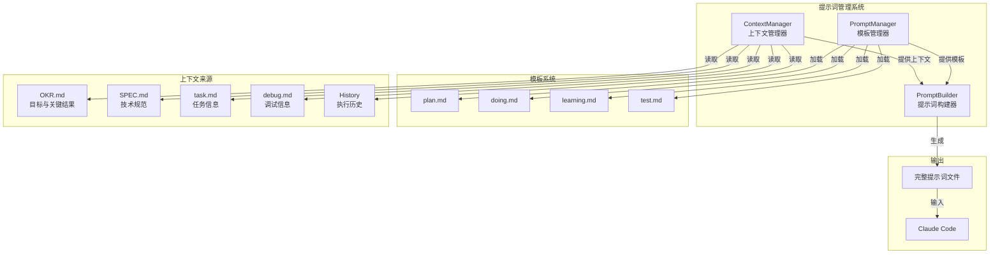
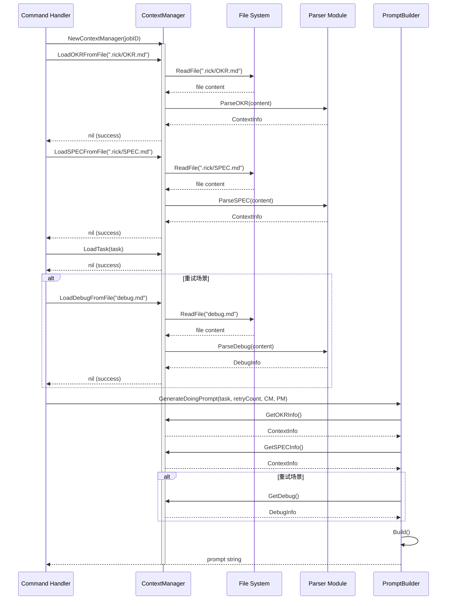
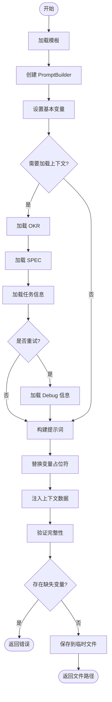

# Rick 提示词管理系统

## 概述

提示词管理系统是 Rick CLI 的核心创新之一，它负责为每个执行阶段（Plan、Doing、Learning）生成结构化、上下文丰富的 AI 提示词。该系统通过模板化管理、变量替换和上下文注入机制，确保 Claude Code 能够接收到清晰、完整、可执行的任务指令。

### 设计理念

**Context-First**：提示词管理系统的核心理念是"上下文优先"。通过将项目的 OKR（目标与关键结果）、SPEC（技术规范）、Wiki（知识库）、Skills（技能库）等全局上下文注入到每个提示词中，使 AI 能够在充分理解项目背景的基础上进行规划、执行和学习。

**核心公式**：
```
高质量输出 = 完整上下文 × 清晰指令 × 结构化模板
```

## 提示词管理架构

### 系统组件

提示词管理系统由三个核心组件构成：

1. **PromptManager**：模板管理器，负责加载和缓存提示词模板
2. **PromptBuilder**：提示词构建器，负责变量替换和上下文注入
3. **ContextManager**：上下文管理器，负责加载和管理各类上下文数据

### 架构图



### 类图

```mermaid
classDiagram
    class PromptManager {
        -string templateDir
        -map~string,*PromptTemplate~ cache
        -sync.RWMutex mu
        +NewPromptManager(templateDir) *PromptManager
        +LoadTemplate(name) (*PromptTemplate, error)
        +getEmbeddedTemplate(name) string
        +ClearCache()
        +GetCacheSize() int
    }

    class PromptTemplate {
        +string Name
        +string Content
        +[]string Variables
    }

    class PromptBuilder {
        -PromptTemplate Template
        -map~string,string~ Variables
        -map~string,interface{}~ Context
        +NewPromptBuilder(template) *PromptBuilder
        +SetVariable(key, value) *PromptBuilder
        +SetContext(key, value) *PromptBuilder
        +Build() (string, error)
        +BuildAndSave(prefix) (string, error)
        +SaveToFile(filePath) error
        +GetVariables() []string
        +GetMissingVariables() []string
        -replaceVariables(content) string
        -injectContext(content) string
    }

    class ContextManager {
        -string jobID
        -Task Task
        -DebugInfo Debug
        -ContextInfo OKRInfo
        -ContextInfo SPECInfo
        -[]string History
        -sync.RWMutex mu
        +NewContextManager(jobID) *ContextManager
        +LoadTask(task) error
        +LoadDebugFromFile(filePath) error
        +LoadOKRFromFile(filePath) error
        +LoadSPECFromFile(filePath) error
        +LoadHistory(items) error
        +GetTask() *Task
        +GetDebug() *DebugInfo
        +GetOKRInfo() *ContextInfo
        +GetSPECInfo() *ContextInfo
        +GetHistory() []string
        +IsTaskLoaded() bool
        +HasDebugEntries() bool
    }

    PromptManager --> PromptTemplate : manages
    PromptBuilder --> PromptTemplate : uses
    PromptBuilder ..> ContextManager : uses context from
```

### 组件职责

#### PromptManager

**职责**：
- 管理所有提示词模板的生命周期
- 支持从文件系统或嵌入资源加载模板
- 提供模板缓存机制，提升性能
- 自动提取模板中的变量列表

**特性**：
- **嵌入式模板**：使用 Go 的 `embed` 特性，将模板编译到二进制中
- **Fallback 机制**：优先从文件加载，失败时使用嵌入模板
- **线程安全**：使用 `sync.RWMutex` 保护缓存访问
- **变量提取**：自动识别模板中的 `{{variable}}` 占位符

#### PromptBuilder

**职责**：
- 接收模板和上下文数据，构建完整提示词
- 执行变量替换（`{{variable}}` → 实际值）
- 注入上下文数据（OKR、SPEC、历史等）
- 支持链式调用，提升代码可读性
- 提供多种输出方式（字符串、临时文件、指定文件）

**特性**：
- **链式 API**：`SetVariable().SetContext().Build()`
- **类型安全**：使用 `map[string]interface{}` 支持任意类型上下文
- **验证机制**：`GetMissingVariables()` 检查未设置的变量
- **临时文件管理**：自动创建临时文件，返回路径供 Claude Code 使用

#### ContextManager

**职责**：
- 集中管理所有上下文数据源
- 从文件系统加载 OKR、SPEC、Debug 等信息
- 解析和结构化上下文数据
- 提供线程安全的上下文访问接口

**特性**：
- **统一接口**：所有上下文通过统一的 `Load*` 方法加载
- **解析集成**：内部调用 `parser` 模块解析 Markdown 文件
- **状态检查**：提供 `Has*` 方法检查上下文是否已加载
- **并发安全**：使用 `sync.RWMutex` 保护数据访问

## 模板系统设计

### 模板类型

Rick 提供四种核心模板，对应不同的执行阶段：

| 模板名称 | 文件路径 | 用途 | 主要变量 |
|---------|---------|------|---------|
| **plan.md** | `internal/prompt/templates/plan.md` | 任务规划阶段 | `project_name`, `okr_content`, `spec_content`, `user_requirement` |
| **doing.md** | `internal/prompt/templates/doing.md` | 任务执行阶段 | `task_id`, `task_name`, `task_objective`, `test_methods`, `debug_context` |
| **learning.md** | `internal/prompt/templates/learning.md` | 知识积累阶段 | `job_id`, `execution_results`, `task_files`, `git_history` |
| **test.md** | `internal/prompt/templates/test.md` | 测试脚本生成 | `task_id`, `test_method`, `expected_results` |

### 模板结构

每个模板都遵循统一的结构设计：

```markdown
# [阶段名称] 提示词

## 一、任务目标
[明确说明该阶段的目标和预期输出]

## 二、项目背景
{{project_name}}
{{project_description}}

### 项目 OKR
{{okr_content}}

### 项目 SPEC
{{spec_content}}

## 三、执行上下文
[提供该阶段需要的上下文信息]
{{context_variables}}

## 四、执行要求
[详细的执行指南和约束条件]

## 五、输出格式
[期望的输出格式和质量标准]

## 六、质量检查清单
[验证输出质量的检查项]
```

### 变量占位符语法

模板使用 `{{variable}}` 语法定义变量占位符：

```markdown
**任务 ID**: {{task_id}}
**任务名称**: {{task_name}}
**重试次数**: {{retry_count}}
```

**规则**：
- 变量名使用 `snake_case` 命名
- 占位符必须完整（`{{` 和 `}}` 成对出现）
- 支持嵌套在任何 Markdown 结构中
- 变量名不能包含空格或特殊字符

### 模板示例：doing.md

```markdown
# Rick 项目执行阶段提示词

你是一个资深的软件工程师。你的任务是执行规划好的任务，完成具体的编码工作。

## 任务信息

**任务 ID**: {{task_id}}
**任务名称**: {{task_name}}
**重试次数**: {{retry_count}}

### 任务目标
{{task_objective}}

### 关键结果
{{key_results}}

### 测试方法
{{test_methods}}

## 项目背景

**项目名称**: {{project_name}}
**项目描述**: {{project_description}}

### 项目 SPEC
{{spec_content}}

### 项目架构
{{project_architecture}}

## 执行上下文

### 已完成的任务
{{completed_tasks}}

### 任务依赖
{{task_dependencies}}

{{#if retry_count > 0}}
### 前次执行的问题记录

根据前次执行遇到的问题，请重点关注以下内容：

{{debug_context}}

请确保这次执行能够解决之前遇到的问题。
{{/if}}

## 执行要求

1. **理解需求**: 仔细阅读任务目标和关键结果
2. **设计方案**: 根据项目架构和现有代码，设计实现方案
3. **编写代码**: 实现所有必要的功能
4. **测试验证**: 按照测试方法验证功能的正确性
5. **提交代码**: 使用 git 提交代码，提交信息应该清晰明确

## 代码质量要求

- 遵循项目的代码风格规范
- 添加必要的注释和文档
- 确保代码可读性和可维护性
- 避免代码重复（DRY 原则）
- 处理错误情况

## 重要提示

1. 如果遇到问题，请详细记录问题现象、复现步骤、可能原因和解决方案
2. 确保所有测试都通过
3. 代码应该能够在生产环境中正确运行
4. 如果无法完成任务，请明确说明阻碍因素
```

## 上下文加载机制

### 上下文类型

Rick 支持多种类型的上下文数据：

| 上下文类型 | 来源文件 | 加载时机 | 用途 |
|-----------|---------|---------|------|
| **OKR** | `.rick/OKR.md` | Plan、Doing | 提供项目目标和验收标准 |
| **SPEC** | `.rick/SPEC.md` | Plan、Doing | 提供技术规范和约束条件 |
| **Task** | `.rick/jobs/job_n/plan/taskX.md` | Doing | 提供任务详细信息 |
| **Debug** | `.rick/jobs/job_n/doing/debug.md` | Doing（重试时） | 提供错误诊断和修复建议 |
| **History** | Git commits | Doing、Learning | 提供已完成任务的历史 |
| **Wiki** | `.rick/wiki/**/*.md` | 所有阶段 | 提供项目知识库 |
| **Skills** | `.rick/skills/**/*.md` | 所有阶段 | 提供可复用技能 |

### 上下文加载流程



### 上下文格式化

不同类型的上下文需要经过格式化才能注入到提示词中：

#### OKR 格式化

```go
func formatOKRContent(okrInfo *parser.ContextInfo) string {
    if okrInfo == nil || len(okrInfo.Objectives) == 0 {
        return "暂无项目 OKR 信息"
    }

    // 返回完整的 OKR.md 内容
    return okrInfo.Objectives[0]
}
```

#### SPEC 格式化

```go
func formatSPECContent(specInfo *parser.ContextInfo) string {
    if specInfo == nil || len(specInfo.Specifications) == 0 {
        return "暂无项目 SPEC 信息"
    }

    // 返回完整的 SPEC.md 内容
    return specInfo.Specifications[0]
}
```

#### 关键结果格式化

```go
func formatKeyResults(keyResults []string) string {
    if len(keyResults) == 0 {
        return "暂无关键结果"
    }

    var content strings.Builder
    for i, kr := range keyResults {
        content.WriteString(fmt.Sprintf("%d. %s\n", i+1, kr))
    }

    return content.String()
}
```

#### Debug 信息格式化

```go
func formatDebugContext(debugInfo *parser.DebugInfo) string {
    if debugInfo == nil || len(debugInfo.Entries) == 0 {
        return "暂无问题记录"
    }

    var content strings.Builder
    for _, entry := range debugInfo.Entries {
        content.WriteString(fmt.Sprintf("**debug%d: %s**\n", entry.ID, entry.Phenomenon))

        if entry.Reproduce != "" {
            content.WriteString(fmt.Sprintf("- 复现: %s\n", entry.Reproduce))
        }

        if entry.Hypothesis != "" {
            content.WriteString(fmt.Sprintf("- 猜想: %s\n", entry.Hypothesis))
        }

        if entry.Fix != "" {
            content.WriteString(fmt.Sprintf("- 修复: %s\n", entry.Fix))
        }

        content.WriteString("\n")
    }

    return content.String()
}
```

## 提示词生成流程

### 完整流程图



### 阶段 1: 模板加载

```go
// 创建 PromptManager
manager := prompt.NewPromptManager("")

// 加载 doing 模板（优先从嵌入资源加载）
template, err := manager.LoadTemplate("doing")
if err != nil {
    return "", fmt.Errorf("failed to load template: %w", err)
}
```

**流程**：
1. 检查缓存中是否存在该模板
2. 如果缓存命中，直接返回
3. 如果缓存未命中：
   - 尝试从文件系统加载（如果指定了 templateDir）
   - 如果文件加载失败，使用嵌入式模板
   - 提取模板中的变量列表
   - 将模板存入缓存

### 阶段 2: 变量设置

```go
// 创建 PromptBuilder
builder := prompt.NewPromptBuilder(template)

// 设置基本变量（链式调用）
builder.SetVariable("task_id", task.ID).
        SetVariable("task_name", task.Name).
        SetVariable("retry_count", fmt.Sprintf("%d", retryCount))
```

**变量类型**：
- **任务信息**：`task_id`, `task_name`, `task_objective`
- **项目信息**：`project_name`, `project_description`
- **执行信息**：`retry_count`, `completed_tasks`

### 阶段 3: 上下文注入

```go
// 加载 OKR 上下文
okrContent := formatOKRContent(contextMgr.GetOKRInfo())
builder.SetVariable("okr_content", okrContent)

// 加载 SPEC 上下文
specContent := formatSPECContent(contextMgr.GetSPECInfo())
builder.SetVariable("spec_content", specContent)

// 如果是重试，加载 Debug 上下文
if retryCount > 0 {
    debugContext := formatDebugContext(contextMgr.GetDebug())
    builder.SetVariable("debug_context", debugContext)
}
```

**上下文注入策略**：
- **全量注入**：OKR 和 SPEC 注入完整内容（非摘要）
- **条件注入**：Debug 信息仅在重试时注入
- **格式化注入**：上下文数据经过格式化处理

### 阶段 4: 提示词构建

```go
// 构建提示词
prompt, err := builder.Build()
if err != nil {
    return "", fmt.Errorf("failed to build prompt: %w", err)
}
```

**构建步骤**：
1. **变量替换**：将所有 `{{variable}}` 替换为实际值
2. **上下文注入**：将上下文数据注入到指定位置
3. **完整性检查**：验证是否还有未替换的占位符

**变量替换算法**：
```go
func (pb *PromptBuilder) replaceVariables(content string) string {
    result := content

    // 遍历所有变量
    for key, value := range pb.Variables {
        placeholder := "{{" + key + "}}"
        result = strings.ReplaceAll(result, placeholder, value)
    }

    return result
}
```

### 阶段 5: 文件保存

```go
// 保存到临时文件
promptFile, err := builder.BuildAndSave(fmt.Sprintf("doing-%s", task.ID))
if err != nil {
    return "", fmt.Errorf("failed to save prompt: %w", err)
}

// 返回文件路径供 Claude Code 使用
return promptFile, nil
```

**文件命名规则**：
- **Plan 阶段**：`rick-plan-*.md`
- **Doing 阶段**：`rick-doing-task1-*.md`
- **Learning 阶段**：`rick-learning-job_1-*.md`

## 扩展新模板

### 添加新模板的步骤

#### 步骤 1: 创建模板文件

在 `internal/prompt/templates/` 目录下创建新模板：

```markdown
# internal/prompt/templates/review.md

# Rick 代码审查阶段提示词

你是一个资深的代码审查专家。你的任务是审查代码质量，提供改进建议。

## 审查信息

**文件路径**: {{file_path}}
**代码作者**: {{author}}
**提交时间**: {{commit_time}}

## 代码内容

{{code_content}}

## 审查要求

1. **代码质量**: 检查代码风格、命名规范、注释完整性
2. **性能优化**: 识别性能瓶颈和优化机会
3. **安全性**: 检查潜在的安全漏洞
4. **可维护性**: 评估代码的可读性和可维护性

## 输出格式

请按照以下格式输出审查结果：

### 优点
- [列出代码的优点]

### 问题
1. **[问题类型]**: [问题描述]
   - 位置: [文件:行号]
   - 建议: [改进建议]

### 总体评分
- 代码质量: [1-10]
- 性能: [1-10]
- 安全性: [1-10]
- 可维护性: [1-10]
```

#### 步骤 2: 注册嵌入式模板

在 `internal/prompt/manager.go` 中添加嵌入指令：

```go
var (
    //go:embed templates/plan.md
    planTemplate string

    //go:embed templates/doing.md
    doingTemplate string

    //go:embed templates/learning.md
    learningTemplate string

    //go:embed templates/test.md
    testTemplate string

    // 新增：review 模板
    //go:embed templates/review.md
    reviewTemplate string
)
```

#### 步骤 3: 更新模板获取逻辑

在 `getEmbeddedTemplate` 方法中添加新模板：

```go
func (pm *PromptManager) getEmbeddedTemplate(name string) string {
    switch name {
    case "plan":
        return planTemplate
    case "doing":
        return doingTemplate
    case "learning":
        return learningTemplate
    case "test":
        return testTemplate
    case "review":
        return reviewTemplate
    default:
        return ""
    }
}
```

#### 步骤 4: 创建专用生成函数

在 `internal/prompt/` 目录下创建 `review_prompt.go`：

```go
package prompt

import (
    "fmt"
    "time"
)

// GenerateReviewPrompt generates the code review prompt
func GenerateReviewPrompt(filePath, author, codeContent string, manager *PromptManager) (string, error) {
    // 加载 review 模板
    template, err := manager.LoadTemplate("review")
    if err != nil {
        return "", fmt.Errorf("failed to load review template: %w", err)
    }

    // 创建 PromptBuilder
    builder := NewPromptBuilder(template)

    // 设置变量
    builder.SetVariable("file_path", filePath).
            SetVariable("author", author).
            SetVariable("commit_time", time.Now().Format("2006-01-02 15:04:05")).
            SetVariable("code_content", codeContent)

    // 构建提示词
    prompt, err := builder.Build()
    if err != nil {
        return "", fmt.Errorf("failed to build review prompt: %w", err)
    }

    return prompt, nil
}

// GenerateReviewPromptFile generates and saves the review prompt to a file
func GenerateReviewPromptFile(filePath, author, codeContent string, manager *PromptManager) (string, error) {
    // 加载模板
    template, err := manager.LoadTemplate("review")
    if err != nil {
        return "", fmt.Errorf("failed to load review template: %w", err)
    }

    // 创建构建器
    builder := NewPromptBuilder(template)

    // 设置变量
    builder.SetVariable("file_path", filePath).
            SetVariable("author", author).
            SetVariable("commit_time", time.Now().Format("2006-01-02 15:04:05")).
            SetVariable("code_content", codeContent)

    // 构建并保存
    promptFile, err := builder.BuildAndSave("review")
    if err != nil {
        return "", fmt.Errorf("failed to build and save review prompt: %w", err)
    }

    return promptFile, nil
}
```

#### 步骤 5: 添加单元测试

创建 `internal/prompt/review_prompt_test.go`：

```go
package prompt

import (
    "os"
    "strings"
    "testing"
)

func TestGenerateReviewPrompt(t *testing.T) {
    manager := NewPromptManager("")

    prompt, err := GenerateReviewPrompt(
        "internal/cmd/plan.go",
        "sunquan",
        "package cmd\n\nfunc Plan() {}",
        manager,
    )

    if err != nil {
        t.Fatalf("GenerateReviewPrompt failed: %v", err)
    }

    // 验证包含必要信息
    if !strings.Contains(prompt, "internal/cmd/plan.go") {
        t.Error("Prompt should contain file path")
    }

    if !strings.Contains(prompt, "sunquan") {
        t.Error("Prompt should contain author")
    }

    if !strings.Contains(prompt, "package cmd") {
        t.Error("Prompt should contain code content")
    }
}

func TestGenerateReviewPromptFile(t *testing.T) {
    manager := NewPromptManager("")

    promptFile, err := GenerateReviewPromptFile(
        "internal/cmd/plan.go",
        "sunquan",
        "package cmd\n\nfunc Plan() {}",
        manager,
    )

    if err != nil {
        t.Fatalf("GenerateReviewPromptFile failed: %v", err)
    }
    defer os.Remove(promptFile)

    // 验证文件存在
    if _, err := os.Stat(promptFile); os.IsNotExist(err) {
        t.Errorf("Prompt file should exist: %s", promptFile)
    }

    // 读取文件内容
    content, err := os.ReadFile(promptFile)
    if err != nil {
        t.Fatalf("Failed to read prompt file: %v", err)
    }

    // 验证内容
    contentStr := string(content)
    if !strings.Contains(contentStr, "代码审查") {
        t.Error("Prompt should contain review instructions")
    }
}
```

#### 步骤 6: 集成到命令

在 `internal/cmd/` 中添加新命令（如 `review.go`）：

```go
package cmd

import (
    "fmt"
    "os"

    "github.com/sunquan/rick/internal/prompt"
    "github.com/sunquan/rick/internal/callcli"
)

// Review executes code review using Claude Code
func Review(filePath string) error {
    // 读取代码内容
    codeContent, err := os.ReadFile(filePath)
    if err != nil {
        return fmt.Errorf("failed to read file: %w", err)
    }

    // 创建 PromptManager
    manager := prompt.NewPromptManager("")

    // 生成 review 提示词
    promptFile, err := prompt.GenerateReviewPromptFile(
        filePath,
        "current_user",
        string(codeContent),
        manager,
    )
    if err != nil {
        return fmt.Errorf("failed to generate review prompt: %w", err)
    }
    defer os.Remove(promptFile)

    // 调用 Claude Code
    fmt.Printf("Reviewing %s...\n", filePath)
    if err := callcli.CallClaudeCode(promptFile); err != nil {
        return fmt.Errorf("failed to call Claude Code: %w", err)
    }

    return nil
}
```

## 最佳实践

### 1. 模板设计原则

#### 原则 1: 结构清晰

```markdown
✅ 好的模板结构：
# 标题
## 一、目标
## 二、背景
## 三、上下文
## 四、要求
## 五、输出格式

❌ 不好的模板结构：
# 标题
一些说明...
{{variable1}}
更多说明...
{{variable2}}
```

#### 原则 2: 变量命名规范

```markdown
✅ 好的变量命名：
{{task_id}}           # 清晰、具体
{{project_name}}      # 语义明确
{{okr_content}}       # 内容类型清楚

❌ 不好的变量命名：
{{id}}                # 太泛化
{{name}}              # 不明确是什么的 name
{{content}}           # 不知道是什么内容
```

#### 原则 3: 上下文完整

```markdown
✅ 提供完整上下文：
## 项目背景
**项目名称**: {{project_name}}
**项目描述**: {{project_description}}

### 项目 OKR
{{okr_content}}

### 项目 SPEC
{{spec_content}}

❌ 上下文不足：
## 任务
{{task_name}}
```

### 2. 变量管理最佳实践

#### 实践 1: 验证变量完整性

```go
func buildPrompt(builder *prompt.PromptBuilder) (string, error) {
    // 在构建前检查缺失变量
    missing := builder.GetMissingVariables()
    if len(missing) > 0 {
        return "", fmt.Errorf("missing required variables: %v", missing)
    }

    // 构建提示词
    content, err := builder.Build()
    if err != nil {
        return "", err
    }

    // 二次检查：确保没有未替换的占位符
    if strings.Contains(content, "{{") {
        return "", fmt.Errorf("prompt contains unreplaced variables")
    }

    return content, nil
}
```

#### 实践 2: 使用链式调用

```go
// ✅ 好的实践：链式调用，清晰易读
builder.SetVariable("task_id", task.ID).
        SetVariable("task_name", task.Name).
        SetVariable("task_goal", task.Goal).
        SetContext("okr_content", okrText).
        SetContext("spec_content", specText)

// ❌ 不好的实践：分散的调用
builder.SetVariable("task_id", task.ID)
builder.SetVariable("task_name", task.Name)
builder.SetVariable("task_goal", task.Goal)
builder.SetContext("okr_content", okrText)
builder.SetContext("spec_content", specText)
```

#### 实践 3: 条件性上下文注入

```go
// 根据场景决定是否注入某些上下文
if retryCount > 0 {
    // 仅在重试时注入 debug 信息
    debugContext := formatDebugContext(contextMgr.GetDebug())
    builder.SetVariable("debug_context", debugContext)
} else {
    // 非重试时设置空值，避免模板中出现未替换占位符
    builder.SetVariable("debug_context", "")
}
```

### 3. 上下文加载最佳实践

#### 实践 1: 统一的上下文管理器

```go
// ✅ 好的实践：使用 ContextManager 统一管理
contextMgr := prompt.NewContextManager(jobID)
contextMgr.LoadOKRFromFile(".rick/OKR.md")
contextMgr.LoadSPECFromFile(".rick/SPEC.md")
contextMgr.LoadTask(task)

// 在需要时获取
okrInfo := contextMgr.GetOKRInfo()
specInfo := contextMgr.GetSPECInfo()

// ❌ 不好的实践：分散的文件读取
okrContent, _ := os.ReadFile(".rick/OKR.md")
specContent, _ := os.ReadFile(".rick/SPEC.md")
```

#### 实践 2: 错误处理

```go
func loadContextSafely(contextMgr *prompt.ContextManager) error {
    // 加载 OKR（可选）
    if err := contextMgr.LoadOKRFromFile(".rick/OKR.md"); err != nil {
        // OKR 不存在时使用默认值，不返回错误
        log.Printf("Warning: OKR file not found, using default")
    }

    // 加载 SPEC（可选）
    if err := contextMgr.LoadSPECFromFile(".rick/SPEC.md"); err != nil {
        log.Printf("Warning: SPEC file not found, using default")
    }

    // 加载 Task（必需）
    if err := contextMgr.LoadTask(task); err != nil {
        return fmt.Errorf("failed to load task: %w", err)
    }

    return nil
}
```

#### 实践 3: 上下文缓存

```go
// ContextManager 内部已实现缓存
// 多次调用 Get* 方法不会重复加载文件

contextMgr := prompt.NewContextManager(jobID)
contextMgr.LoadOKRFromFile(".rick/OKR.md")

// 以下调用直接从内存返回，无 I/O 开销
okr1 := contextMgr.GetOKRInfo()
okr2 := contextMgr.GetOKRInfo()  // 相同的引用
```

### 4. 性能优化最佳实践

#### 实践 1: 模板缓存

```go
// PromptManager 自动缓存已加载的模板
manager := prompt.NewPromptManager("")

// 第一次加载：从嵌入资源读取
template1, _ := manager.LoadTemplate("doing")

// 后续加载：从缓存返回（极快）
template2, _ := manager.LoadTemplate("doing")

// 检查缓存大小
fmt.Printf("Cached templates: %d\n", manager.GetCacheSize())
```

#### 实践 2: 并发安全

```go
// PromptManager 和 ContextManager 都是并发安全的
manager := prompt.NewPromptManager("")

// 可以在多个 goroutine 中并发使用
var wg sync.WaitGroup
for i := 0; i < 10; i++ {
    wg.Add(1)
    go func() {
        defer wg.Done()
        template, _ := manager.LoadTemplate("doing")
        // 使用 template...
    }()
}
wg.Wait()
```

#### 实践 3: 临时文件清理

```go
// 使用 defer 确保临时文件被清理
promptFile, err := builder.BuildAndSave("doing-task1")
if err != nil {
    return err
}
defer os.Remove(promptFile)  // 确保清理

// 使用 promptFile...
err = callcli.CallClaudeCode(promptFile)
return err
```

## 使用示例

### 示例 1: Plan 阶段提示词生成

```go
package main

import (
    "fmt"
    "log"
    "os"

    "github.com/sunquan/rick/internal/prompt"
)

func generatePlanPrompt(requirement string) (string, error) {
    // 1. 创建 PromptManager
    manager := prompt.NewPromptManager("")

    // 2. 创建 ContextManager
    contextMgr := prompt.NewContextManager("")

    // 3. 加载全局上下文
    if err := contextMgr.LoadOKRFromFile(".rick/OKR.md"); err != nil {
        log.Printf("Warning: failed to load OKR: %v", err)
    }

    if err := contextMgr.LoadSPECFromFile(".rick/SPEC.md"); err != nil {
        log.Printf("Warning: failed to load SPEC: %v", err)
    }

    // 4. 生成 Plan 提示词
    promptFile, err := prompt.GeneratePlanPromptFile(
        requirement,
        contextMgr,
        manager,
    )
    if err != nil {
        return "", fmt.Errorf("failed to generate plan prompt: %w", err)
    }

    return promptFile, nil
}

func main() {
    // 用户需求
    requirement := "实现用户认证和权限管理功能"

    // 生成提示词
    promptFile, err := generatePlanPrompt(requirement)
    if err != nil {
        log.Fatal(err)
    }
    defer os.Remove(promptFile)

    fmt.Printf("Plan prompt generated: %s\n", promptFile)

    // 调用 Claude Code
    // callcli.CallClaudeCode(promptFile)
}
```

### 示例 2: Doing 阶段提示词生成（首次执行）

```go
package main

import (
    "fmt"
    "log"
    "os"

    "github.com/sunquan/rick/internal/prompt"
    "github.com/sunquan/rick/internal/parser"
)

func generateDoingPrompt(task *parser.Task, jobID string) (string, error) {
    // 1. 创建 PromptManager
    manager := prompt.NewPromptManager("")

    // 2. 创建 ContextManager
    contextMgr := prompt.NewContextManager(jobID)

    // 3. 加载上下文
    if err := contextMgr.LoadOKRFromFile(".rick/OKR.md"); err != nil {
        log.Printf("Warning: failed to load OKR: %v", err)
    }

    if err := contextMgr.LoadSPECFromFile(".rick/SPEC.md"); err != nil {
        log.Printf("Warning: failed to load SPEC: %v", err)
    }

    // 加载任务
    if err := contextMgr.LoadTask(task); err != nil {
        return "", fmt.Errorf("failed to load task: %w", err)
    }

    // 4. 生成 Doing 提示词（retryCount = 0，首次执行）
    promptFile, err := prompt.GenerateDoingPromptFile(
        task,
        0,  // 首次执行
        contextMgr,
        manager,
    )
    if err != nil {
        return "", fmt.Errorf("failed to generate doing prompt: %w", err)
    }

    return promptFile, nil
}

func main() {
    // 解析任务
    task := &parser.Task{
        ID:   "task1",
        Name: "实现用户登录功能",
        Goal: "完成用户登录接口和前端页面",
        KeyResults: []string{
            "实现 /api/login 接口",
            "实现登录表单组件",
            "添加登录状态管理",
        },
        TestMethod: "curl -X POST /api/login -d '{\"username\":\"test\",\"password\":\"123456\"}'",
    }

    // 生成提示词
    promptFile, err := generateDoingPrompt(task, "job_1")
    if err != nil {
        log.Fatal(err)
    }
    defer os.Remove(promptFile)

    fmt.Printf("Doing prompt generated: %s\n", promptFile)
}
```

### 示例 3: Doing 阶段提示词生成（重试场景）

```go
package main

import (
    "fmt"
    "log"
    "os"

    "github.com/sunquan/rick/internal/prompt"
    "github.com/sunquan/rick/internal/parser"
)

func generateDoingPromptWithRetry(task *parser.Task, jobID string, retryCount int) (string, error) {
    // 1. 创建管理器
    manager := prompt.NewPromptManager("")
    contextMgr := prompt.NewContextManager(jobID)

    // 2. 加载全局上下文
    contextMgr.LoadOKRFromFile(".rick/OKR.md")
    contextMgr.LoadSPECFromFile(".rick/SPEC.md")
    contextMgr.LoadTask(task)

    // 3. 加载 Debug 信息（重试场景的关键）
    debugFile := fmt.Sprintf(".rick/jobs/%s/doing/debug.md", jobID)
    if err := contextMgr.LoadDebugFromFile(debugFile); err != nil {
        return "", fmt.Errorf("failed to load debug info: %w", err)
    }

    // 4. 生成包含 Debug 信息的提示词
    promptFile, err := prompt.GenerateDoingPromptFile(
        task,
        retryCount,  // 重试次数 > 0
        contextMgr,
        manager,
    )
    if err != nil {
        return "", fmt.Errorf("failed to generate doing prompt: %w", err)
    }

    return promptFile, nil
}

func main() {
    task := &parser.Task{
        ID:   "task1",
        Name: "实现用户登录功能",
        Goal: "完成用户登录接口和前端页面",
    }

    // 第 2 次尝试（retryCount = 1）
    promptFile, err := generateDoingPromptWithRetry(task, "job_1", 1)
    if err != nil {
        log.Fatal(err)
    }
    defer os.Remove(promptFile)

    fmt.Printf("Retry prompt generated: %s\n", promptFile)
    fmt.Println("Prompt includes debug context from previous failure")
}
```

### 示例 4: 自定义变量格式化

```go
package main

import (
    "fmt"
    "strings"
    "time"

    "github.com/sunquan/rick/internal/prompt"
)

// 自定义格式化函数
func formatTimestamp(t time.Time) string {
    return t.Format("2006-01-02 15:04:05")
}

func formatList(items []string) string {
    var builder strings.Builder
    for i, item := range items {
        builder.WriteString(fmt.Sprintf("%d. %s\n", i+1, item))
    }
    return builder.String()
}

func formatCodeBlock(code string) string {
    return fmt.Sprintf("```go\n%s\n```", code)
}

func main() {
    manager := prompt.NewPromptManager("")
    template, _ := manager.LoadTemplate("doing")
    builder := prompt.NewPromptBuilder(template)

    // 使用自定义格式化
    builder.SetVariable("created_at", formatTimestamp(time.Now())).
            SetVariable("key_results", formatList([]string{
                "实现登录接口",
                "添加单元测试",
                "更新文档",
            })).
            SetVariable("example_code", formatCodeBlock("func Login() {}"))

    prompt, _ := builder.Build()
    fmt.Println(prompt)
}
```

## 总结

Rick 的提示词管理系统通过以下创新设计实现了高质量的 AI 编码：

1. **模板化管理**：统一的模板系统，易于维护和扩展
2. **上下文丰富**：完整的项目上下文注入，确保 AI 理解任务
3. **灵活构建**：链式 API 设计，代码清晰易读
4. **性能优化**：模板缓存、并发安全、资源嵌入
5. **可扩展性**：简单的扩展机制，支持添加新模板

通过这套系统，Rick 实现了"Context-First"的核心理念，让 AI 在充分理解项目背景的基础上进行高质量的代码生成和任务执行。
