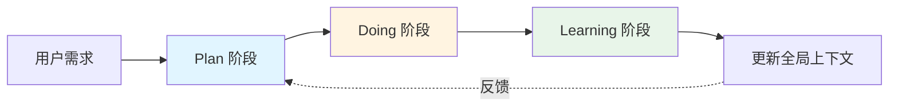
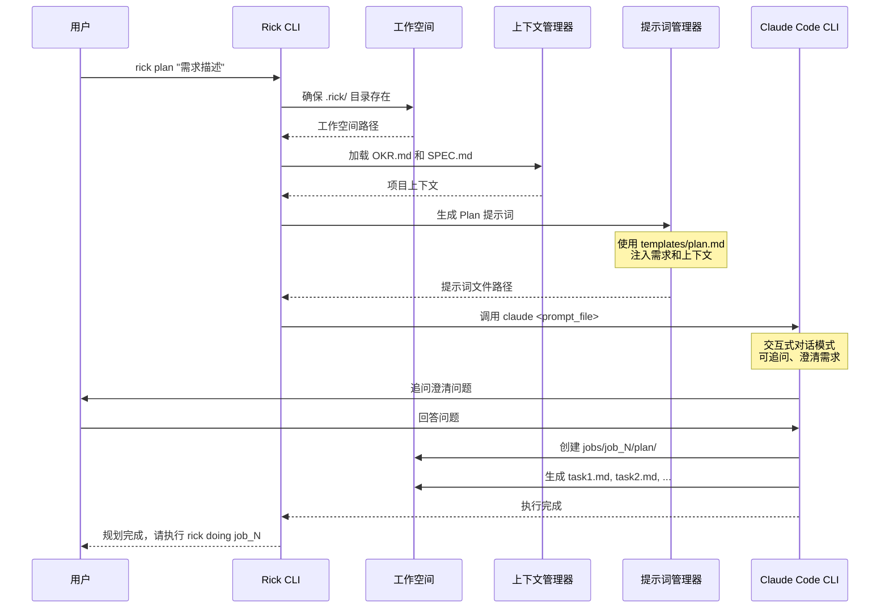
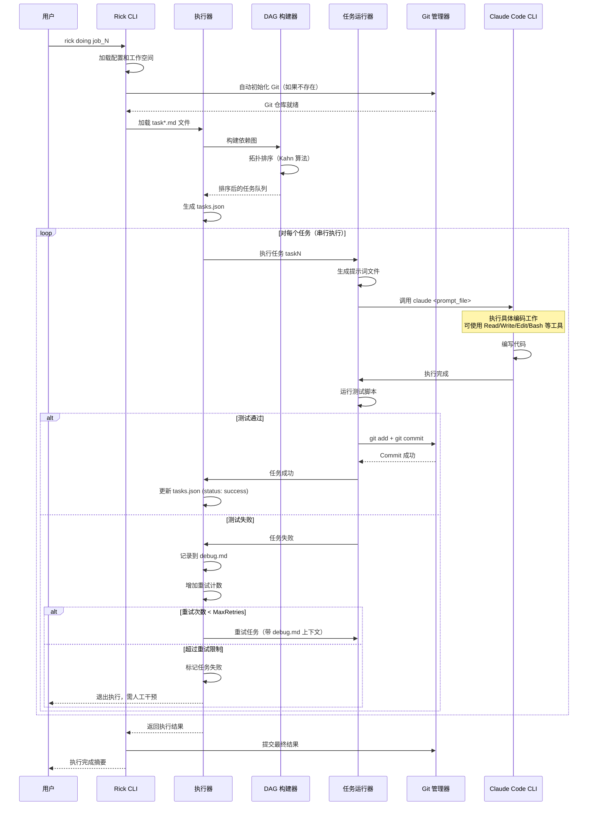
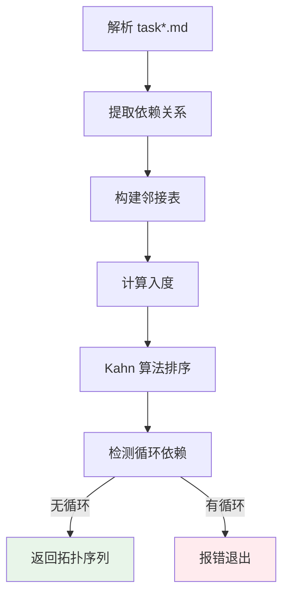
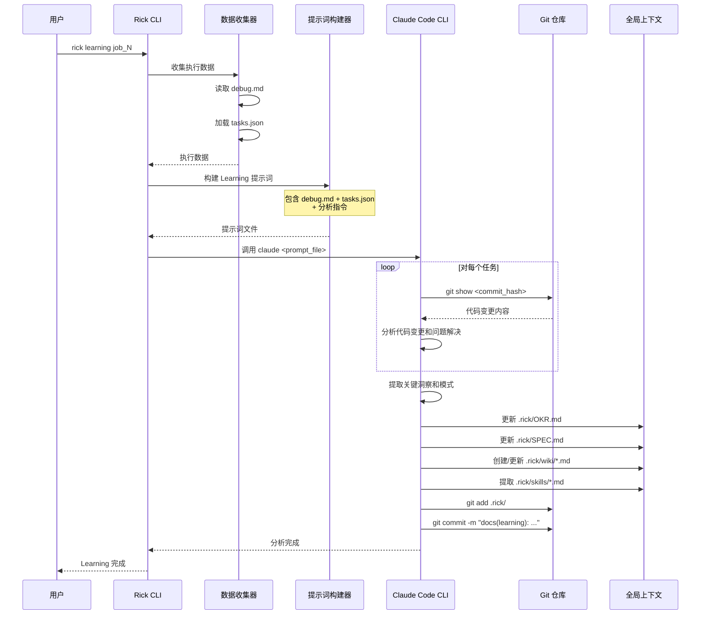
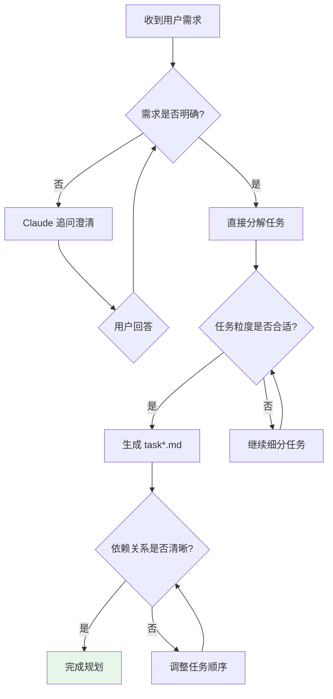
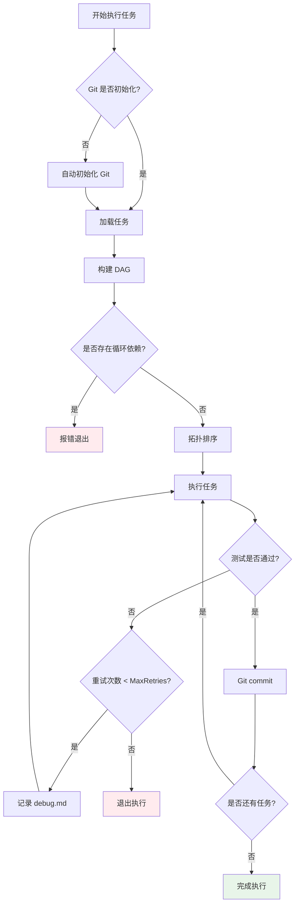
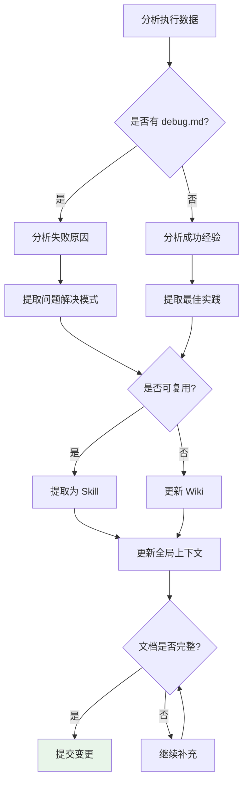

# Rick CLI 运行时流程

本文档详细描述 Rick CLI 的完整运行时流程，包括 Plan、Doing、Learning 三个核心阶段的执行逻辑、关键决策点和错误处理机制。

---

## 目录

1. [总体流程概览](#总体流程概览)
2. [Plan 阶段：任务规划](#plan-阶段任务规划)
3. [Doing 阶段：任务执行](#doing-阶段任务执行)
4. [Learning 阶段：知识提取](#learning-阶段知识提取)
5. [关键决策点](#关键决策点)
6. [错误处理机制](#错误处理机制)

---

## 总体流程概览

Rick CLI 的核心工作流程遵循 **Context-First** 理念，通过三个阶段形成完整的 AI Coding 闭环：



### 核心公式

```
AICoding = Humans + Agents
Agents = Models + Harness
```

- **Humans**: 提供需求、审核结果、做关键决策
- **Models**: Claude AI 模型（Plan/Doing 用 Opus，Learning 可用 Haiku）
- **Harness**: Rick CLI 框架（提示词管理、任务编排、重试机制、Git 自动化）

### 三阶段职责

| 阶段 | 主要职责 | 输入 | 输出 | 执行者 |
|------|---------|------|------|--------|
| **Plan** | 任务分解与规划 | 用户需求 + OKR/SPEC | task*.md 文件 | Claude + Human |
| **Doing** | 串行执行任务 | task*.md 文件 | 代码变更 + Git commits | Claude (自动) |
| **Learning** | 知识提取与积累 | Git commits + debug.md | OKR/SPEC/Wiki/Skills 更新 | Claude + Human |

---

## Plan 阶段：任务规划

Plan 阶段的核心目标是将用户的高层需求分解为可执行的任务序列。

### 执行流程



### 关键步骤详解

#### 1. 工作空间初始化

```go
// internal/cmd/plan.go:executePlanWorkflow
ws, err := workspace.New()  // 自动创建 .rick/ 目录
rickDir, _ := workspace.GetRickDir()
```

**自动创建的目录结构**：
```
.rick/
├── OKR.md              # 项目目标（如果不存在则为空）
├── SPEC.md             # 技术规范（如果不存在则为空）
├── wiki/               # Wiki 知识库
├── skills/             # 可复用技能库
└── jobs/               # 任务执行目录
```

#### 2. 上下文加载

```go
contextMgr := prompt.NewContextManager("plan")

// 加载 OKR 和 SPEC（如果存在）
contextMgr.LoadOKRFromFile(okriPath)
contextMgr.LoadSPECFromFile(specPath)
```

**上下文优先级**：
1. OKR.md - 项目目标和关键结果
2. SPEC.md - 技术规范和架构设计
3. 用户需求 - 当前任务的具体要求

#### 3. 提示词生成

```go
promptMgr := prompt.NewPromptManager(templateDir)
planPromptFile, _ := prompt.GeneratePlanPromptFile(requirement, contextMgr, promptMgr)
```

**提示词模板结构** (`templates/plan.md`)：
- 角色定义：你是一个资深的项目经理和架构师
- 任务目标：将需求分解为可执行的任务
- 上下文注入：OKR、SPEC、项目架构
- 输出格式：task*.md 文件格式规范
- 任务分解原则：SMART 原则、依赖关系、测试方法

#### 4. Claude 交互式规划

```go
cmd := exec.Command(claudePath, planPromptFile)
cmd.Stdin = os.Stdin   // 允许用户交互
cmd.Stdout = os.Stdout
cmd.Stderr = os.Stderr
cmd.Run()
```

**交互模式优势**：
- Claude 可以追问不明确的需求
- 用户可以实时调整任务分解
- 支持多轮对话直到达成共识

### Plan 阶段输出

每个任务生成一个 `task*.md` 文件，包含以下结构：

```markdown
# 依赖关系
task1, task2

# 任务名称
实现用户认证模块

# 任务目标
创建完整的用户认证系统，包括登录、注册和 JWT token 管理。

# 关键结果
1. 实现 `/api/login` 和 `/api/register` 接口
2. 集成 JWT token 生成和验证
3. 添加密码加密存储
4. 编写单元测试覆盖率 > 80%

# 测试方法
1. 运行 `go test ./internal/auth/...` 确保测试通过
2. 使用 `curl` 测试 API 接口
3. 验证 JWT token 的生成和验证逻辑
```

---

## Doing 阶段：任务执行

Doing 阶段是 Rick CLI 的核心执行引擎，负责按照拓扑排序顺序串行执行任务。

### 执行流程



### 关键步骤详解

#### 1. Git 自动初始化

```go
// internal/cmd/doing.go:ensureGitInitialized
if _, err := os.Stat(gitDir); err == nil {
    // Git 已存在
    return nil
}

// 初始化 Git 仓库
cmd := exec.Command("git", "init")
cmd.Dir = projectRoot
cmd.Run()

// 配置 Git 用户（从 config.json 读取）
ensureGitUserConfigured(projectRoot)

// 创建 .gitignore
os.WriteFile(gitignorePath, []byte("*.log\n.DS_Store\n"), 0644)
```

#### 2. DAG 构建与拓扑排序

```go
// internal/executor/executor.go:NewExecutor

// 构建 DAG
dag, err := NewDAG(tasks)

// 拓扑排序（Kahn 算法）
sortedTaskIDs, err := TopologicalSort(dag)
// 结果：[task1, task2, task3, task4, ...]
```

**DAG 构建流程**：



**拓扑排序算法** (Kahn's Algorithm)：
1. 找出所有入度为 0 的节点，加入队列
2. 从队列取出节点，输出到结果序列
3. 移除该节点的所有出边，更新邻接节点入度
4. 重复步骤 1-3，直到队列为空
5. 如果输出序列长度 < 节点数，则存在循环依赖

#### 3. tasks.json 生成

```go
// internal/executor/tasks_json.go:GenerateTasksJSON
tasksJSON := &TasksJSON{
    JobID:     jobID,
    Tasks:     []TaskInfo{},
    CreatedAt: time.Now(),
}

for _, taskID := range sortedTaskIDs {
    task := dag.Tasks[taskID]
    tasksJSON.Tasks = append(tasksJSON.Tasks, TaskInfo{
        TaskID:     taskID,
        TaskName:   task.Name,
        Dep:        task.Dependencies,
        Status:     "pending",
        Attempts:   0,
    })
}
```

**tasks.json 结构**：
```json
{
  "job_id": "job_1",
  "tasks": [
    {
      "task_id": "task1",
      "task_name": "实现用户认证模块",
      "dep": [],
      "status": "success",
      "attempts": 1,
      "task_file": "task1.md",
      "commit_hash": "a1b2c3d4"
    }
  ],
  "created_at": "2026-03-15T10:30:00Z",
  "updated_at": "2026-03-15T11:15:00Z"
}
```

#### 4. 串行任务执行

```go
// internal/executor/executor.go:ExecuteJob

for i, taskID := range e.sortedTaskIDs {
    // 更新状态为 running
    e.tasksJSON.UpdateTaskStatus(taskID, "running")

    // 获取任务
    task := e.dag.Tasks[taskID]

    // 执行任务（带重试机制）
    retryResult, err := e.retryManager.RetryTask(task)

    if retryResult.Status == "success" {
        // 记录元数据（task_file, commit_hash）
        e.recordTaskMetadata(taskID)
        e.tasksJSON.UpdateTaskStatus(taskID, "success")
        result.SuccessfulTasks++
    } else {
        e.tasksJSON.UpdateTaskStatusWithError(taskID, "failed", retryResult.LastError)
        result.FailedTasks++
    }

    // 保存 tasks.json
    SaveTasksJSON(e.tasksJSONPath, e.tasksJSON)
}
```

#### 5. 任务重试机制

```go
// internal/executor/retry.go:RetryTask

func (trm *TaskRetryManager) RetryTask(task *parser.Task) (*RetryResult, error) {
    result := &RetryResult{
        TaskID:   task.ID,
        TaskName: task.Name,
    }

    for attempt := 1; attempt <= trm.config.MaxRetries; attempt++ {
        result.TotalAttempts = attempt

        // 生成提示词（包含 debug.md 上下文）
        promptFile := trm.generateTaskPrompt(task, attempt)

        // 运行任务
        err := trm.runner.RunTask(task, promptFile)

        if err == nil {
            // 运行测试
            testErr := trm.runTests(task)

            if testErr == nil {
                // 测试通过，提交代码
                trm.commitTask(task)
                result.Status = "success"
                return result, nil
            }

            // 测试失败，记录到 debug.md
            trm.recordDebug(task, attempt, testErr)
        } else {
            // 执行失败，记录到 debug.md
            trm.recordDebug(task, attempt, err)
        }
    }

    // 超过重试限制
    result.Status = "max_retries_exceeded"
    return result, fmt.Errorf("task failed after %d attempts", trm.config.MaxRetries)
}
```

#### 6. 测试验证与 Git 提交

```go
// internal/executor/runner.go:RunTask

// 1. 生成测试脚本（从 task.md 的"测试方法"部分提取）
testScript := generateTestScript(task)

// 2. 调用 Claude Code CLI 执行任务
cmd := exec.Command(claudePath, promptFile)
cmd.Stdin = os.Stdin
cmd.Stdout = os.Stdout
cmd.Stderr = os.Stderr
cmd.Run()

// 3. 运行测试脚本
testCmd := exec.Command("bash", testScript)
output, err := testCmd.CombinedOutput()

if err != nil {
    return fmt.Errorf("test failed: %s", string(output))
}

// 4. 测试通过，提交代码
gitCmd := exec.Command("git", "add", ".")
gitCmd.Run()

commitMsg := fmt.Sprintf("feat(task%s): %s\n\nCo-Authored-By: Claude Opus 4.6 <noreply@anthropic.com>",
    task.ID, task.Name)
gitCmd = exec.Command("git", "commit", "-m", commitMsg)
gitCmd.Run()
```

### Doing 阶段输出

**文件输出**：
- `jobs/job_N/doing/tasks.json` - 任务执行状态
- `jobs/job_N/doing/debug.md` - 调试信息（如果有失败）
- `jobs/job_N/doing/execution.log` - 执行日志
- Git commits - 每个任务一个 commit

**执行摘要**：
```
============================================================
Execution Summary
============================================================
Job ID:           job_1
Status:           completed
Duration:         15m23s
Total Tasks:      7
Successful Tasks: 7
Failed Tasks:     0

Task Details:
  [1] ✓ task1 (success, 1 attempts)
  [2] ✓ task2 (success, 1 attempts)
  [3] ✓ task3 (success, 2 attempts)
  [4] ✓ task4 (success, 1 attempts)
  [5] ✓ task5 (success, 1 attempts)
  [6] ✓ task6 (success, 1 attempts)
  [7] ✓ task7 (success, 1 attempts)

============================================================
```

---

## Learning 阶段：知识提取

Learning 阶段的目标是从执行过程中提取经验教训，并更新全局上下文（OKR/SPEC/Wiki/Skills）。

### 执行流程



### 关键步骤详解

#### 1. 执行数据收集

```go
// internal/cmd/learning.go:collectExecutionData

type ExecutionData struct {
    JobID        string
    DebugContent string      // debug.md 内容
    TasksJSON    *executor.TasksJSON  // 任务元数据
}

func collectExecutionData(jobID string) (*ExecutionData, error) {
    doingDir := filepath.Join(rickDir, "jobs", jobID, "doing")

    data := &ExecutionData{JobID: jobID}

    // 读取 debug.md（如果存在）
    debugPath := filepath.Join(doingDir, "debug.md")
    if content, err := os.ReadFile(debugPath); err == nil {
        data.DebugContent = string(content)
    } else {
        data.DebugContent = "No debugging information available."
    }

    // 加载 tasks.json
    tasksJSONPath := filepath.Join(doingDir, "tasks.json")
    data.TasksJSON, _ = executor.LoadTasksJSON(tasksJSONPath)

    return data, nil
}
```

#### 2. Learning 提示词构建

```go
// internal/cmd/learning.go:buildLearningPrompt

func buildLearningPrompt(data *ExecutionData) string {
    prompt := `# Learning 分析任务

分析 Job ` + data.JobID + ` 的执行结果并提取经验教训。

## 调试信息

` + data.DebugContent + `

## 任务元信息

| Task ID | 任务名称 | 状态 | 任务文件 | Commit Hash | 重试次数 |
|---------|---------|------|----------|-------------|----------|
`

    for _, task := range data.TasksJSON.Tasks {
        prompt += fmt.Sprintf("| %s | %s | %s | %s | %s | %d |\n",
            task.TaskID, task.TaskName, task.Status,
            task.TaskFile, task.CommitHash[:8], task.Attempts)
    }

    prompt += `

## 执行指令

基于上述调试信息和任务元信息，请执行以下操作：

1. **分析执行过程**
   - 使用 ` + "`git show <commit_hash>`" + ` 查看每个任务的代码变更
   - 分析遇到的问题和解决方法（如果有）
   - 识别关键洞察、模式和改进点

2. **更新项目文档**（在 .rick/ 目录下）
   - OKR.md - 根据学到的经验更新项目目标
   - SPEC.md - 如需要，更新开发规范
   - wiki/<主题>.md - 为新概念创建或更新 wiki 页面
   - skills/<技能>.md - 提取可复用的技能供未来任务使用

3. **提交变更**
   - 使用清晰的 commit message 提交你的文档更新
   - Commit message 格式: ` + "`docs(learning): <简短描述>`" + `
`

    return prompt
}
```

#### 3. Claude 自动分析与更新

Claude 在交互式模式下拥有完整的工具访问权限：

**分析阶段**：
1. 使用 `Read` 工具读取 `.rick/OKR.md` 和 `SPEC.md`
2. 使用 `Bash` 工具执行 `git show <commit_hash>` 查看每个任务的代码变更
3. 分析代码变更、调试信息、重试记录

**更新阶段**：
1. 使用 `Edit` 工具更新现有文档（OKR.md, SPEC.md）
2. 使用 `Write` 工具创建新的 wiki 页面或 skills 文档
3. 使用 `Bash` 工具执行 `git add` 和 `git commit`

**示例：提取技能**

如果在执行过程中发现了可复用的模式（如"DAG 拓扑排序"），Claude 会：

1. 创建 `.rick/skills/dag-topological-sort/description.md`
2. 创建 `.rick/skills/dag-topological-sort/implementation.md`
3. 创建 `.rick/skills/dag-topological-sort/examples/rick-task-scheduling.md`
4. 更新 `.rick/skills/index.md` 添加索引

### Learning 阶段输出

**文档更新**：
- `.rick/OKR.md` - 更新项目目标和关键结果
- `.rick/SPEC.md` - 更新技术规范和最佳实践
- `.rick/wiki/*.md` - 新增或更新知识库文档
- `.rick/skills/*.md` - 提取可复用技能

**Git 提交**：
```
commit a1b2c3d4e5f6...
Author: Claude Haiku 4.5 <noreply@anthropic.com>
Date:   Sat Mar 15 12:00:00 2026

    docs(learning): extract Job 1 insights and update best practices

    - Updated OKR with new performance targets
    - Added retry mechanism best practices to SPEC
    - Created wiki page for DAG execution
    - Extracted 3 reusable skills
```

---

## 关键决策点

### 1. Plan 阶段决策点



**决策标准**：
- **任务粒度**：单个任务 5-10 分钟完成
- **依赖关系**：明确的前置条件，无循环依赖
- **测试方法**：可自动化验证的测试脚本

### 2. Doing 阶段决策点



**决策标准**：
- **重试策略**：MaxRetries = 5（可配置）
- **失败处理**：超过重试限制则退出，需人工干预
- **提交策略**：每个任务成功后立即 commit

### 3. Learning 阶段决策点



**决策标准**：
- **技能提取**：在 2+ 任务中使用的模式
- **Wiki 创建**：新概念或复杂流程
- **OKR 更新**：目标达成或调整
- **SPEC 更新**：新的最佳实践或规范

---

## 错误处理机制

### 1. Plan 阶段错误处理

| 错误类型 | 检测点 | 处理方式 |
|---------|--------|---------|
| 工作空间不存在 | workspace.New() | 自动创建 .rick/ 目录 |
| OKR/SPEC 不存在 | LoadOKRFromFile() | 跳过加载，使用空上下文 |
| Claude CLI 失败 | cmd.Run() | 返回错误，提示用户检查 Claude 安装 |
| 用户中断 | 交互式会话 | 保存已生成的任务，可继续编辑 |

### 2. Doing 阶段错误处理

| 错误类型 | 检测点 | 处理方式 |
|---------|--------|---------|
| Git 未初始化 | ensureGitInitialized() | 自动运行 `git init` |
| 循环依赖 | TopologicalSort() | 报错退出，提示修改 task.md |
| 任务执行失败 | RunTask() | 记录到 debug.md，重试 |
| 测试失败 | runTests() | 记录到 debug.md，重试 |
| 超过重试限制 | RetryTask() | 退出执行，保存 tasks.json 状态 |
| Git commit 失败 | commitTask() | 记录警告，继续执行 |

**重试机制详解**：

```go
// 每次重试时，提示词会包含之前的失败信息
promptContent := `
# 任务执行 (重试 ` + attempt + `/` + MaxRetries + `)

## 前次执行的问题

` + debugContent + `

## 任务目标

` + task.Objective + `

请根据前次失败的经验，调整实现方案。
`
```

### 3. Learning 阶段错误处理

| 错误类型 | 检测点 | 处理方式 |
|---------|--------|---------|
| doing 目录不存在 | collectExecutionData() | 报错退出，提示先执行 doing |
| tasks.json 不存在 | LoadTasksJSON() | 报错退出，提示 doing 未完成 |
| debug.md 不存在 | ReadFile(debugPath) | 使用默认消息"无调试信息" |
| Git 历史不可用 | git show | Claude 会提示用户，跳过该任务分析 |
| Claude 分析超时 | cmd.Run() | 无超时限制，允许长时间运行 |

### 4. 全局错误处理策略

**错误分类**：

1. **可恢复错误**（自动重试）：
   - 网络超时
   - 临时文件创建失败
   - Git 操作冲突

2. **需人工干预错误**（退出执行）：
   - 循环依赖
   - 超过重试限制
   - 配置文件缺失

3. **警告级错误**（记录但继续）：
   - OKR/SPEC 加载失败
   - Git commit 失败
   - 日志写入失败

**错误日志格式**：

```
[2026-03-15 10:30:00] [ERROR] Task execution failed: task3
  Attempt: 2/5
  Error: test script failed
  Output:
    === Test Results ===
    FAIL: TestUserAuth (0.00s)
        Expected status 200, got 500

  Debug Info:
    - 检查 API 端点路径是否正确
    - 验证数据库连接配置
    - 查看服务器日志获取详细错误
```

---

## 性能优化与最佳实践

### 任务分解最佳实践

1. **粒度控制**：单个任务 5-10 分钟
2. **依赖最小化**：并行基础任务 + 串行依赖任务
3. **测试可自动化**：避免需要手动验证的测试

### 执行效率优化

1. **DAG 并行度**：虽然当前是串行执行，但 DAG 为未来并行执行预留了空间
2. **增量提交**：每个任务一个 commit，方便回滚
3. **上下文复用**：OKR/SPEC 在整个 Job 中保持一致

### 知识积累策略

1. **及时 Learning**：每个 Job 完成后立即执行 Learning
2. **技能提取**：2+ 次使用的模式提取为 Skill
3. **文档更新**：保持 OKR/SPEC/Wiki 的时效性

---

## 总结

Rick CLI 的运行时流程体现了 **Context-First** 的核心理念：

1. **Plan 阶段**：充分利用全局上下文（OKR/SPEC）进行任务分解
2. **Doing 阶段**：通过 DAG + 重试机制确保任务可靠执行
3. **Learning 阶段**：将执行经验反馈到全局上下文，形成闭环

这种设计使得 Rick CLI 不仅是一个任务执行工具，更是一个 **持续学习和进化的 AI Coding 系统**。
