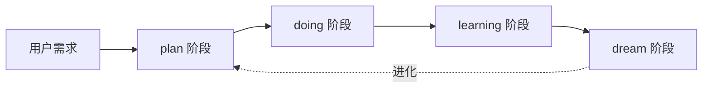
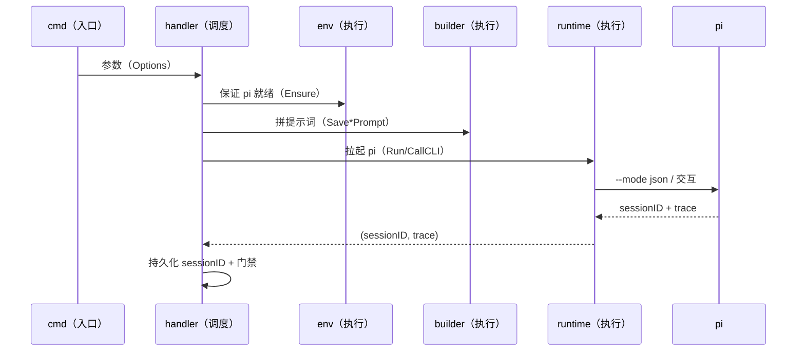

# Rick CLI 运行时流程

本文档描述 Rick CLI 的核心运行时流程：rick 收敛为引导程序，env 保证 pi 就绪 → builder 拼提示词 → runtime 拉 pi；dag 调度与门禁下沉 pi。

## 总体流程

```mermaid
flowchart LR
    A[用户需求] --> B[plan 阶段]
    B --> C[doing 阶段]
    C --> D[learning 阶段]
    D --> E[dream 阶段]
    E -.进化.-> B
```

## 命令级流程（env → builder → runtime）

每个命令（plan/doing/easy/learning/dream/ctrl/human-loop）都遵循统一编排：

```mermaid
sequenceDiagram
    participant CLI as cmd（入口）
    participant H as handler（调度）
    participant E as env（执行）
    participant B as builder（执行）
    participant R as runtime（执行）
    participant PI as pi

    CLI->>H: 参数（Options）
    H->>E: 保证 pi 就绪（Ensure）
    H->>B: 拼提示词（Save*Prompt）
    H->>R: 拉起 pi（Run/CallCLI）
    R->>PI: --mode json / 交互
    PI-->>R: sessionID + trace
    R-->>H: (sessionID, trace)
    H->>H: 持久化 sessionID + 门禁
```

## Plan 阶段（v4.4 协议）

1. 加载 config，确保 workspace 存在
2. `NextJobID()` 分配 job_N，创建 plan 目录
3. builder 生成 plan prompt（含 loops_context、内联 grilling/pipeline/tdd 等 skill——单源协议）
4. runtime 拉起 pi 交互会话（`--append-system-prompt` 注入协议全文 + `--session-id` 会话持久化，compaction 不丢协议）
5. pi 会话内执行：
   - **设计树动态下钻**（skill:grilling）：顶层 OKR（O + KR 递归，MECE + 充分性）→ 每层 L1 调研消解（轻量自查 / 重量级派 `agent:'research'`）→ L2 提炼判断节点 → L3 批量追问 human → L4 事实回流 → L5 终止判定 → **grilling_gate**（确定性门禁：校验 design-tree/research 简报/提问痕迹）
   - **实现流水线设计**（skill:pipeline）：并行优先分层 DAG + `# 写域` 声明 + 每层门禁双产物（gate{N}.md 检查逻辑 human 确认 + gate{N}.py 实现）
   - **多维评审**（8 reviewer 并行 fanout，含写域与门禁检查、门禁自洽性——永远红检测）
6. 产出：`plan/task*.md`（含写域）+ `plan/grilling/`（design-tree + research 简报）+ `plan/gates/`（层门禁）+ `plan/pipeline.md` + `doing/tasks.json`

## Doing 阶段（v4.4：分层 pipeline + 层门禁）

1. `ensureGitRepo` 确定性前置（非 git 仓库自动 init + 初始 commit）
2. builder 扫描 pending task，Kahn 分层渲染编排（**分层 DAG**：层内 `runs.all` 并行 + 层间 `await` 顺序；每 task timeoutMs 按工作量动态估算 20-90min）
3. runtime 拉起 pi（`--mode json`），**tasks.json watcher** goroutine 每 2s 轮询 diff（hook 写状态 → 变更打一行进度）；pi 结构化事件（派发/工具/门禁/收敛）实时打 stderr
4. pi parent（结对导航员）执行每层 4 步：
   - **pipeline_gate**（确定性结构校验：分层/写域互斥/gate 存在，⛔ 才派发）
   - ① 门禁判别力验证（跑 gate{N}.py 应为红——集成测试此刻必失败）
   - ② 并行 impl-worker（写域互斥；按 # 测试方法 自测；不碰 git；主动监督：parent 读轨迹判断卡死即干预 steer→stop→重派）
   - ③ level_complete（hook 跑 human 门禁 → 绿 → git add -A 单次 commit → tasks.json 批量 success）
   - ④ debug 压缩传递（前层教训注入下层 worker；末层归档 debug-summary.md）
5. pi 会话 `agent_settled` 后，rick 侧 helper.py 终态兜底（tasks.json 可解析 / 无 zombie / success 有 commit_hash）
6. 门禁失败重试（最多 `max_retries` 次），失败则报错退出；完成时提示下一步（learning/dream 引导）

**会话恢复**：`rick doing --resume job_N` → 读 doing/session_id → pi `--session-id` 交互式恢复（人工接管/排查）

## Learning 阶段

1. 读取 job 执行轨迹（tasks.json、debug 记录、**pi 原生行为轨迹**：`.pi/subagents/artifacts/` 的 meta/transcript + doing session_id——v4.3 废除提取层）
2. builder 生成 learning prompt（含 gen-skill/gen-loop/gen-domain skill；**domain 沉淀是核心产出**——bugs.md 的「已知问题+精确解决命令」是下次 job Step 0 的直接输入）
3. runtime 拉起 pi，沉淀可复用 loops/skills + domain 事实，写 `learning/SUMMARY.md`
4. `rick tools learning_check job_N` 校验

## Dream 阶段

1. 扫描 `.rick/jobs/*/doing/tasks.json` 发现所有 task 均 success 的 jobs
2. 对比 `.rick/dream/dream_run_*_log.md` 排除已处理 jobs；**learning 完整性检查**（缺 learning/SUMMARY.md 的 job 报告 human 决定补跑或跳过）
3. builder 生成 dream prompt（含历史 run logs + loops_context + 原生行为轨迹数据源）
4. runtime 拉起 pi，跨 job 反思，淘汰失效 loops/skills，进化 domain

## 关键决策点

| 决策点 | 处理 |
|--------|------|
| 依赖存在环 | builder 在 prompt 内联提示「依赖存在环」，不阻断 prompt 生成 |
| pi 会话未 settle | runtime 返回错误，handler 应用重试安全网 |
| 门禁失败 | 重试（最多 max_retries），超过则报错退出 |
| easy 会话 | 跳过 plan，生成合成 `easy_session` task 供 dream 发现 |
