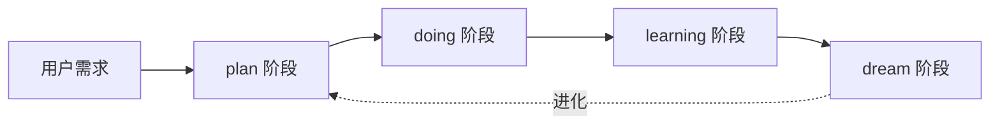
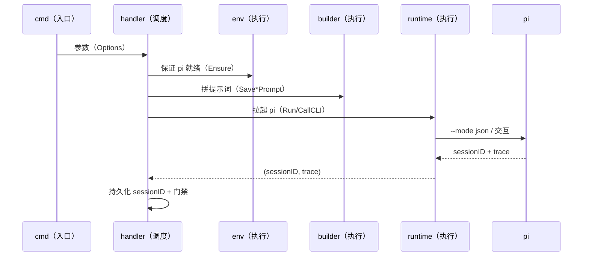

# Rick CLI 运行时流程

本文档描述 Rick CLI 的核心运行时流程：rick 收敛为引导程序，env 保证 pi 就绪 → builder 拼提示词 → runtime 拉 pi；dag 调度与门禁下沉 pi。

## 总体流程

```mermaid
flowchart LR
    A[用户需求] --> B[plan 阶段]
    B --> C[doing 阶段]
    C --> D[learning 阶段]
    D --> E[dream 阶段]
    E -.进化.-> B
```

## 命令级流程（env → builder → runtime）

每个命令（plan/doing/easy/learning/dream/ctrl/human-loop）都遵循统一编排：

```mermaid
sequenceDiagram
    participant CLI as cmd（入口）
    participant H as handler（调度）
    participant E as env（执行）
    participant B as builder（执行）
    participant R as runtime（执行）
    participant PI as pi

    CLI->>H: 参数（Options）
    H->>E: 保证 pi 就绪（Ensure）
    H->>B: 拼提示词（Save*Prompt）
    H->>R: 拉起 pi（Run/CallCLI）
    R->>PI: --mode json / 交互
    PI-->>R: sessionID + trace
    R-->>H: (sessionID, trace)
    H->>H: 持久化 sessionID + 门禁
```

## Plan 阶段

1. 加载 config，确保 workspace 存在
2. `NextJobID()` 分配 job_N，创建 plan 目录
3. builder 生成 plan prompt（含 loops_context、内联 grilling/tdd 等 skill）
4. runtime 拉起 pi 交互会话
5. pi 生成 `plan/task*.md` + `plan/OKR.md` + `doing/tasks.json`

## Doing 阶段（dag 调度下沉 pi）

1. builder 扫描 `plan/task*.md`，生成初始 `doing/tasks.json`（全 pending）
2. builder 把 pending task 按依赖拓扑排序，渲染成 `workflowScript`（`runs.run` + `await`）
3. runtime 拉起 pi（`--mode json`），pi parent 用 `subagent` 工具触发 workflowScript
4. 每个 worker 按依赖顺序执行 task，完成后 commit 并回传 commit_hash 写入 tasks.json
5. pi 会话 `agent_settled` 后，rick 侧跑确定性门禁脚本 `helper.py`（tasks.json 可解析 / 无 zombie / success 有 commit_hash）
6. 门禁失败重试（最多 `max_retries` 次），失败则报错退出

## Learning 阶段

1. 读取 job 执行轨迹（tasks.json、debug 记录、runtime trace）
2. builder 生成 learning prompt（含 gen-skill/gen-loop/gen-domain skill）
3. runtime 拉起 pi，沉淀可复用 loops/skills + domain 事实，写 `learning/SUMMARY.md`
4. `rick tools learning_check job_N` 校验

## Dream 阶段

1. 扫描 `.rick/jobs/*/doing/tasks.json` 发现所有 task 均 success 的 jobs
2. 对比 `.rick/dream/dream_run_*_log.md` 排除已处理 jobs
3. builder 生成 dream prompt（含历史 run logs + loops_context）
4. runtime 拉起 pi，跨 job 反思，淘汰失效 loops/skills

## 关键决策点

| 决策点 | 处理 |
|--------|------|
| 依赖存在环 | builder 在 prompt 内联提示「依赖存在环」，不阻断 prompt 生成 |
| pi 会话未 settle | runtime 返回错误，handler 应用重试安全网 |
| 门禁失败 | 重试（最多 max_retries），超过则报错退出 |
| easy 会话 | 跳过 plan，生成合成 `easy_session` task 供 dream 发现 |
